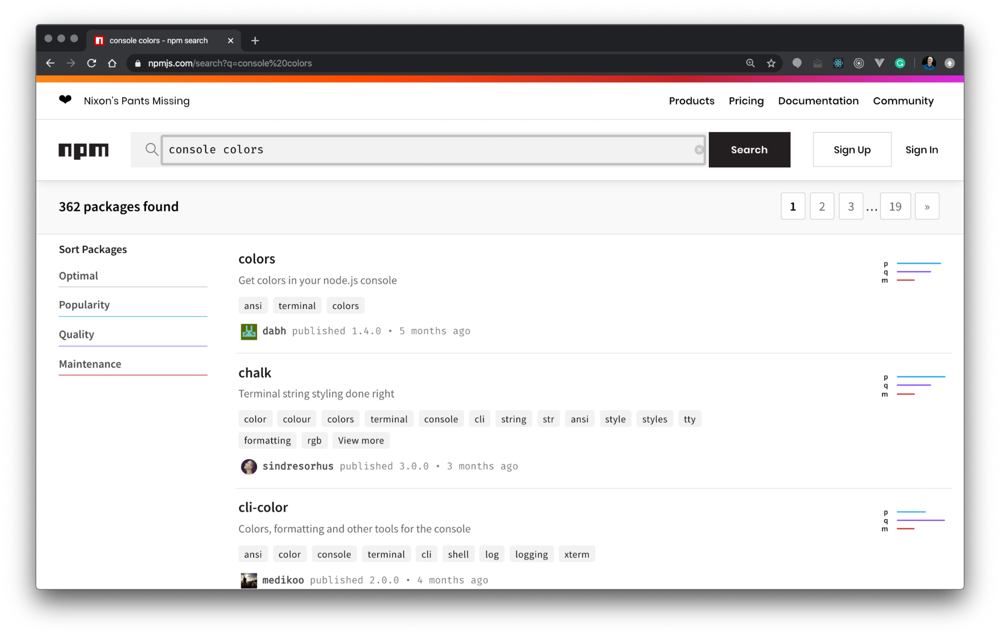
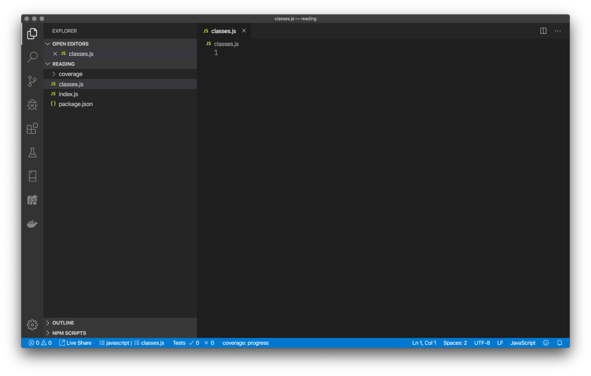

# Helpful Notes From App Academy

## Terminology for general programming concepts and tools

- Module - a module is the basic unit of work that you will design, develop, test, and then submit for a grade or as your contribution to a larger project. Mostly we will use the terms module and [computer program] file synonymously - but in the examples you are working on in App Academy Open, the web page that you are editing your code in is a kind of module - the whole thing is treated as a single collection of instructions, and run together as a set.
- Compiler / Interpreter - both of these terms relate to a computer program that is itself trying to make sense of your program. The difference between the two is somewhat arbitrary IMO - a compiler scans your completed module and builds from it something that the machine understands more directly; an interpreter looks at each line of code separately and uses that information to build up the program piece by piece. For our purposes, there is no significant difference between these two; you can run JavaScript or Python in a REPL loop, the same way you can the shell in your command prompt, whether you use bash (Linux) or zsh (Mac) or cmd (Windows).

NOTE: You may see or hear the term JIT, which means "Just In Time" [Compiler]; this muddies the waters even further. For our purposes this is a distinction without a difference - an employer may ask you if Python is compiled or interpreted, but even this simple question doesn't have a simple answer - for now, don't worry about it.

tl;dr: these both refer to a program that reads and executes your program. (A linker is another tool related to compiling; some programs are compiled to object modules that need to be linked before they can be executed)

- Parser - a parser is a tool that accepts a module as input and produces one or more machine-readable data structures to represent the module in a way that the computer can work with. You will generally not have to worry about a parser on its own (unless you have to write one), but you will use them all the time, as the are the first component of an interpreter or compiler or other tools like linters (see below).
- Editor - the editor is the program you use to compose and update the document that is your module. In your App Academy Open work so far, the editor you have used is implemented as a part of your web browser. For much of this course you will be using the editor in the VS Code environment; you will also use text-mode editors like vi/vim and/or nano, and you may also learn others. Modern code editors that are aware of the language you are writing in will give you syntax highlighting - color and formatting clues that will make your life much, much easier - learn to pay attention to them!
- Linter - a linter is a tool that looks at your code "statically", while it is still in the proverbial parking lot. (The term comes from the idea of removing lint from your clothing before you wear it) At present you don't have to do anything to access the features of your linter, besides paying attention to the color and indentation cues that your editor gives you. A good linter will make your life much, much easier - I cannot tell you how many hours I have wasted that would have been saved by having some curiosity about why my editor was putting a red checkmark or an orange underline on my code! (Your editor will often use a linter to generate syntax highlighting - later, you will encounter stand-alone linters that are used to check your code before submitting it for deployment)
- Debugger - in contrast to the linter, which looks at your code before it is running, a debugger looks at your code as it executes. We haven't done anything with a debugger yet, although what we`re doing with console.log() is a form of debugging - you will get lots more experience with debugging and the tools to do it as the program advances. (Profilers and code coverage tools are related tools to evaluate aspects of your code - don't worry about these for now!)
- IDE (Integrated Development Environment) - an IDE is a combination of one or more editors, linters, and shortcuts to compilers, linkers and various debugging tools. VS Code and Eclipse are examples of GUI (Graphical User Interface) IDEs; the EMACS editor is an example of a character-based IDE.

#### Generic Terms Specific to Programming

- Atom - the first thing that happens when a linter or execution environment (compiler/interpreter) examines your code it that it is parsed (by a parser!) into atoms. These are the words that your instructions to the machine are formed from - if the machine can't parse your intentions, it can't execute them.
- Namespace - every atom takes its meaning in the context of its namespace; when an atom occurs the second (or third) time, the system will assume that it refers to the same atom that was encountered previously. (Keywords and symbols are added to the namespace before your code is examined; literals and identifiers are added when you introduce them - see below) (Scope is a concept related to namespaces - you will be meeting up with scope in JavaScript in the very near future!)
- Keyword / Reserved Word - a reserved word is an atom (word or phrase) that the language will not let you repurpose - either it has a specific meaning, and is a keyword that is part of the formal language - or it is being held aside for future use (typically) or because of past use (this kind of dead space for old words and functionality is generically termed deprecation, and old words and features are said to be deprecated)
- Symbol (not to be confused with the JavaScript type Symbol!) - a generic symbol is an atom that the system interprets in a defined way, similar to a reserved word. Generally, these are all the punctuation marks and mathematical operators that you will love and hate in every language you will learn. Symbols are often one-character long, but need not be - === is a three-character long symbol in JavaScript.
- Literal - a literal is a string or number or date/time or boolean or other special value (languages typically have one or more flavors of nothing, in particular!) that can be expressed. Like keywords and symbols, literals have a single specific meaning that you cannot change. Unlike keywords and symbols, you add specific literals to your code in order to load, test for, or display these values.
- Identifier - an identifier is anything that isn't a reserved word or a symbol or a literal; identifiers are often just called names. Identifiers denote the variables (and parameters and constants) that you will build your code out of. Every language has rules for naming variables, and they aren't all the same. Generally also, there will be coding conventions observed in your language and in your school or workplace that will dictate how you should name your variables. (Also files, classes, functions and programs, etc - it's a big world of names!)
- Expression - an expression is an ordered sequence of atoms that can be evaluated - that is to say, resolved to a specific value.
- Conditional - a conditional is just an expression that is interpreted as true or false; the actual form of the expression might in other contexts print as a string or a numerical value, but when it is interpreted as a conditional that is condensed to a simple yes-or-no value. Conditionals appear in flow control statements like if and while statements, as well as other contexts; they control the flow of execution and select between alternate assignments (see below).
- Assignment - an assignment is an operation that evaluates an expression, which is generally on the right side of the operator (in JavaScript and Python, a single equals sign (=)), and assigns the results of the evaluation to the identifiers listed on the left side of the operator.
- Assignment Expression - an assignment expression is an assignment that itself can be evaluated to the values on the left side of the assignment operator. In the C and C++ programming languages, this is how simple assignment works; in Python as of version 3.8 the assignment expression operator is :=.
- Declaration - a declaration is an expression that adds a name (of your creation) to the program. Declarations can be explicit (via the let, const and var keywords in JavaScript) or implicit, as in the case of parameters to a function.
- Statement - a statement is the programming equivalent of a sentence. That is, it is a complete thought that must be considered as a whole to make sense. (The English sentences at the beginning of this essay are actually examples of a single run-on statement and two statements separated by a semicolon) If an atom is the smallest part of your program that the parser will deal with, a statement is the smallest part that has a stand-alone meaning. Statements are composed of expressions, conditionals, declarations, assignments.
- Block - a block is a (possibly empty) ordered list of statements. From the perspective of the program outside of a block, the entire block is a single (compound) statement. In many languages (including JavaScript) blocks are delimited with curly-braces ({}). (But not all of them - Python delimits blocks via indentation!)
- Function - a function is a block - usually but not always named - that is associated with a (possibly empty) list of names - the parameters - that will be assigned values when the function is called, or invoked.
- Array (also List, Tuple) - an array is an ordered collection of elements which can be referenced via an integer. Arrays have a length property, and their contents are accessed by a process known as indexing, often denoted by placing a special value - the index - in square brackets - ([]). JavaScript like most programming languages starts the counting (bases arrays) at zero - that is, the index is the number of steps you have to take from the first element to get to the indexed element.
- Object (also Class, Struct, Union, Record) - most modern programming languages have some mechanism to support associating related collections of data and code into a container that acts as a namespace, and provides a context for code to run in. (JavaScript has objects, much more about these soon!)
- Method - a method is a function with an object for context. Much more on this in the near future. In Object Oriented (OO) languages, methods are explicitly defined as functions associated with classes. (Note: JavaScript is very different from many other languages in this regard; If you know inheritance because you know Java or Python or C++, you`d probably best set your prior understanding aside while you learn JavaScript!)

#### Why all of these definitions? / What About this applies to Learning JavaScript?

All of this has general implications for how to approach coding, and some very specific ones that will make your life with JavaScript much easier.

(0) Recognize that your code is composed of Statements

Assuming you are not getting a parse or other compile-time error, your code will be entirely composed of well-formed statements. Conversely, if you are getting such errors, you have an error in a statement somewhere. Statements must be clearly delimited - that is, separated in a way that lets the system tell where one ends and the next one begins. In JavaScript, the statement delimiter is the semicolon - ; - get used to typing it a lot; a missing semicolon can cause you confusion and pain, and extra ones are generally harmless.

(1) Blocks are delimited by curly braces (as are objects!)

Blocks in JavaScript contain statements that are internally delimited by semicolons. For this reason, you do not have to follow the last statement in a block with a semicolon, as the closing curly brace will end the block. The entire block itself is also a statement, and for that reason it may need a semicolon to follow it; in general a trailing semicolon won't hurt anything.

(2) Objects in JavaScript are also defined using curly braces.

JavaScript objects contain key:value pairs rather than statements - the tl:dr; is:

- if the elements inside the curly braces are separated by semicolons, you are looking at a block (and possibly the body of a function or loop, or a branch of a conditional)
- if the elements are separated by alternating colons and commas, you are looking at an object.

(3) Flow control statements always have one or more conditionals, and exactly one controlled statement for each branch.

This is a subtle feature that is important to understand and then mostly avoid - I will explain…

You have been taught to write a for loop like this:

```
for (let index = 0; index < array.length; index++){
  if (array[index] === target){
    return true;
  }
}


```

It is important to understand that this also would work exactly the same way:

```
for (let index = 0; index < array.length; index++) if (array[index] === target) return true;


```

There is something subtle going on here, as I said before, and though the lower example looks cool, if you code in this way you are quite possibly going to confuse yourself hard. The reason the second example works the same as the first one - the reason the curly braces aren't required (by JavaScript) - is that the loop body is logically a single statement (in both cases), it's just that the 'statement` in the top case is a compound statement - a block.

Consider what would happen if you wanted to use console.log to see what this function is doing:

```
for (let index = 0; index < array.length; index++){
  console.log("testing ", array[index], " to see if it is ", target); 
  if (array[index] === target){
    return true;
  }
}


```

This code will log out what is happening with each element of the array. But now think about this:

```
for (let index = 0; index < array.length; index++) console.log("testing ", array[index], " to see if it is ", target); 
if (array[index] === target) // the indentation here is misleading - return true;  // because the `if` is at the same level as the `for`!


```

This code will throw a reference error, because the console.log() statement becomes the entire body of the for loop - so that when we get to the conditional of the if statement, index isn't defined anymore!

So the take home is - this is heart advice - always-always-always type the three characters {}; immediately after you type the closing parenthesis for either a parameter list in a function definition or a conditional. (VS Code and other editors will often help you with this - don't fight with them!)

The only reason to dismiss this advice is if you are really sure you know what you are doing, and/or are willing to hear, "didn't I mention that you probably shouldn't … ?" when you ask why you code doesn't work. (I speak from experience; I've confused myself!)

Full Disclosure - this one-liner statement thing works in C/C++ where I learned it, and in Python, where a variant of it - single statement on the same line as the conditional - is considered by the original author of the language to be an extremely bad pattern. (He lists it among his 'regrets'!) So I use it fairly freely, mainly because I'm used to it - but like smoking, that doesn't mean that you should do it! Sometimes it makes your code cleaner and easier to read - but this comes at the expense of making your code more susceptible to a kind of error that is hard to spot - especially if you are not in the habit of paying attention to what your linter is trying to tell you about indentation!)

## A brief history of JavaScript

The language we know today as JavaScript was originally written in 1995 (in only ten days) by an engineer named Brendon Eich. At that time, Java (which is a completely different programming language from JavaScript) was very popular for creating web pages, but Eich was trying to create a simpler-to-use language that could be used to write scripts that increased interactivity.

The first, relatively small version of this new language was called Mocha, and then was re-named JavaScript and standardized so it would work across different browsers in 1996. Several updated versions were released in the late 1990s, and in the early 2000s, many frameworks were starting to be built around JavaScript as well.

In 2009, Node.js was released, which allowed programmers to write complete web applications in JavaScript, including both the frontend and backend code. Around this same time, the Node Package Manager (npm) was released, which made it easier for programmers to share and install pre-written packages of JavaScript code for accomplishing specific tasks.

In 2015, the ES6 version of JavaScript was released, which is the foundation of the modern JavaScript that you will be learning in this course. Since then, more and more frontend web development frameworks have been built upon JavaScript, including React.js, Angular, Vue, and many others. These frameworks have allowed developers to get new web applications up and running more quickly.

## Why JavaScript is so useful today

There are two main reasons why JavaScript became so popular in web development; its ability to render dynamic content, and its ability to perform asynchronous tasks.

### Static vs dynamic web content

One of the early benefits of JavaScript was its ability to handle dynamic content. In the early days of the web, all web pages were static, which means that the data displayed on the page was loaded by the browser ahead of time, and the page would need to be re-loaded for any updates to show up. Websites are dynamic when they are able to render new data without reloading the page, and this is the type of behavior that JavaScript was designed to do. For example, because of JavaScript, we are able to see new messages show up in a social media feed without having to refresh the page.

### Performing asynchronous tasks

In order for the user to have a smooth experience working with a dynamic website, it needs to be able to accomplish tasks asynchronously. Many programming languages operate synchronously, which means that one operation needs to be completed before the next operation will begin.

## Same specification, different implementation

Since JavaScript is a single programming language, you may be wondering why there are any differences between Node.js and browsers in the first place. If they are in fact different, why wouldn't you classify them as different programming languages? The answer is complicated, but the key idea is this: even if you just consider browser environments, different browsers themselves can differ wildly because JavaScript is a specification.

During the rise of the World Wide Web in the 90s, companies competed for dominance. As Netscape's "original" JavaScript language rose to prominence along with their browser, other browser companies needed to also support JavaScript to keep their users happy. Imagine if you could only visit pages as they were intended if you used a certain browser. That would be a terribly inefficient way to use the Internet. As companies "copied" Netscape's original implementation of JavaScript, they sometimes took creative liberties in adding their own features.

In order to ensure a certain level of compatibility across browsers, the European Computer Manufacturers Association (ECMA) defined specifications to standardize the JavaScript language. This specification is known as ECMAScript or ES for short. This allows competing browsers like Google Chrome, Mozilla Firefox, and Apple Safari to have a healthy level of competition that doesn't compromise the customer experience. So now you know that when people use the term "JavaScript" they are really referring to the core standards set by ECMAScript, although exact implementation details may differ from browser to browser.

The Node.js runtime was released in 2009 when there was a growing need to execute JavaScript in a portable environment, without any browser.

Did you know? Node.js is built on top of the same JavaScript engine as Google Chrome (V8). Neat.

There are many differences between Node.js and browser environments, but for now you don't have to worry about them.

# Running JavaScript Code

Up until now, you've been running your JavaScript in the browser's console. This can get tedious and sometimes being in the browser environment just isn't necessary. An alternative to run and test code locally is using Node.js.

Now that you have Node installed on your local computer it's time to run some JavaScript! Running your own code on your own computer is a rite of passage for all developers.

By the end of this reading, you should be able to:

- Use the Node REPL to test out simple expressions and functions
- Create .js files and use Node to run a .js file

## Node REPL vs. JavaScript File

Before you begin running code note that in using Node there are two ways that you can run JavaScript code:

1. using the Node REPL
2. using Node to run a .js file

Both the Node REPL and using a JavaScript file are common ways to execute JavaScript code, but they are useful in different scenarios:

Node REPL (Read, Evaluate, Print, Loop) is used for testing quick ideas. The Node REPL is useful when playing around with any curiosities you have because you can see how an expression is evaluated quickly. Any code that you type into the Node REPL will be lost when you exit the REPL. Your browser's console is a REPL as it executes expressions the same way.

JS Files are used for saving code for the long term. If you create a .js file and save it, then all the code within the file can be referenced and used later. When you work on problem sets, projects, and anything else you want to save, you should always save your code to a .js file!

## Using the Node REPL

To use the Node REPL, simply open up your command line (Terminal) and enter the command node. In the examples below the $ denotes being in the command line (in our case Terminal).

```
~ $ node
Welcome to Node.js
Type ".help" for more information.
>


```

Notice that as soon as you enter the node command, you get a welcome message and you see our Terminal icon change to look like this: >. This > icon means that you are inside the Node REPL, so you can type any valid JavaScript lines and see what they evaluate to:

```
~ $ node
Welcome to Node.js
Type ".help" for more information.
> 1 + 1
2
> let message = "Hello" + "world"
undefined
> message
'Helloworld'


```

We can also define functions in the Node REPL though you'll find writing them in that environment is not super fun due to the Node REPL not being optimized for that kind of coding.

Here is an example of defining and invoking a function using node:

```
~ $ node
Welcome to Node.js
Type ".help" for more information.

> function sayHello () {
... console.log("hello!");
... }
undefined
> sayHello();
hello!


```

If you want to exit the Node REPL, and head back to our plain old command line enter the command .exit in the REPL. Doing this will get rid of the > icon, which means you are no longer in the REPL. When you are back inside our command line you can enter the normal terminal commands.

```
$ node
> 1 + 1
2
> .exit
~ $


```

### Using JavaScript Files

The first thing you'll need in order to run a JavaScript file is to create a file that will contain the code you will be running. A new file is like a blank canvas - just awaiting the chance to be made into art.

If you don't currently have a dedicated coding folder, start off by creating a new folder somewhere accessible, like your Desktop folder. Then you can open that folder using VSCode. From there you can simply create a "New File". In order to create a JavaScript file, make sure that you change the file name to one that ends in .js, for example myFile.js.

Now take a moment to enter some code into your new .js file like the following:

```
// AppAcademyWork/myFile.js
console.log("hello world!");


```

Don't forget to save the file with your new code!

Now to run a JS file you need to first go into the folder that contains that file by using cd in your command line. Feel free to use ls to list your folders and see where you have to go. Once you are inside of the correct folder, run node <fileName>, for example node myFile.js. When you enter these commands, be aware of the capitalization. File names are case sensitive!

```
~ $ ls
Downloads
Desktop
Music
Videos

~ $ cd Desktop
~ Desktop $ ls
AppAcademyWork

~ Desktop $ cd AppAcademyWork

~ AppAcademyWork $ ls
myFile.js

~ AppAcademyWork $ node myFile.js
Hello world


```

That is how you run JavaScript on your local computer! You create and save a file, navigate to that file in your terminal, then run the file using the node command followed by the filename (node <fileName>).

## What you learned

In this reading you learned how to use the Node REPL to test out simple expressions and functions, as well as how to create .js files and run them using Node.

# Using npm to Perform Common Tasks - Part One

Now that you know what npm is and why it's useful, let's dig further into the details of how to use npm to perform common tasks.

We'll cover:

- verifying what version of npm is installed and how to use npm to update itself to the latest version;
- using npm to initialize a new package or project;
- using the npm registry to find a package;
- using npm to install a package;
- using an npm package in code;
- and understanding the difference between a dependency and a development dependency.

## Using npm to manage npm

To confirm if you have the npm CLI installed, you can run the command npm --version or npm -v. If you have the npm CLI installed, you'll see its version number displayed in the console. If you don't have the npm CLI installed, you receive an error.

The npm CLI is available as an npm package, which allows you to use the npm CLI to update itself. If you're using macOS or Linux, you can update the npm CLI to the latest version by running the following command:

```
npm install -g npm@latest


```

If you installed Node.js using the default installer, you might need to prefix the above command with sudo like this:

```
sudo npm install -g npm@latest


```

The sudo command allows you to run a command with the security privileges of another user, typically your computer's administrator or superuser account. When using the sudo command, you'll be prompted for your account's password.

If you're using Windows, upgrading npm is a little trickier. See this page in the official npm docs for detailed information. Note: If you are using WSL (Windows Services for Linux) on Windows, then you will really be using Linux, and therefore the Windows specific instructions won't apply. Just use the normal methods.

## Using npm to manage a project's dependencies

Now let's walk through the steps to initialize a project to use npm. Then you'll use npm to install and use a dependency in code.

### Initializing a project to use npm

Any Node.js project that contains a package.json file is technically an npm package, though most of these projects will never be published to the npm registry for consumption by the general development community. Given that, it's common to refer to these unpublished npm packages as just "projects".

There's no better way to learn npm than to work through some examples, so open

a terminal window and follow along!

If you haven't already, create a folder for your project, then use the cd command to browse to that folder. From within your project folder, run the following command:

```
npm init


```

npm will prompt you to supply the following field values, one at a time:

package name (or simply name) - If you're going to publish your package, setting your package name to something useful is very important. For typical development projects, it's okay to just accept the default value, which will be the name of the current folder.

version - Node uses the semver (semantic versioning) package to manage your package/project's versioning. The default is 1.0.0, but the recommended standard is 0.1.0, indicating the first minor version. See here for an introduction to SemVer.

description - A description is really only necessary if you're going to publish your package, as it's displayed to users when they're searching the npm registry.

entry point (or main) - The file to use as the entry point to your application (typically index.js or app.js).

test command - If you're going to write tests for your package, you can provide the command to run those tests. For now, just press enter without providing a value to accept the default value.

git repository - If you want other developers to be able to find the Git repository for your package, you can provide the URL to the repo here. For now, it's okay to skip it by pressing enter.

keywords - Keywords are used to help people find your package in the npm registry. For now, just leave this field blank.

author - If you're the author of the package and you want your name (and contact information) associated with the package, you can provide that information here. For now, let's just leave this field blank.

license - This is the license for your package. It's only important to provide if you're going to publish your package. This defaults to the ISC License, which for our purposes, will work just fine (since we're not going to publish our package).

At this point in the process, npm will display a preview of the package.json file and confirm if you want to continue:

```
{
  "name": "introduction-to-npm",
  "version": "1.0.0",
  "description": "A simple project to explore using npm",
  "main": "index.js",
  "scripts": {
    "test": "echo \"Error: no test specified\" && exit 1"
  },
  "author": "",
  "license": "ISC"
}


```

Go ahead and answer with "y" or "yes". You'll now have a package.json file in the root of your project. If you want, you can open the package.json file in a code editor and make additional edits to it.

Pro tip: If you're like the majority of developers, you'll get tired of stepping through the above prompts time and time again when initializing a project to use npm. To save valuable time, you can pass the --y flag to the npm init command to generate a package.json file with all of the default values like this: npm init --y.

### Finding packages in the npm registry

With more than a million packages in the npm registry, there's literally a whole world's worth of code for you to explore and to incorporate into your projects and applications.

When selecting a package, it's helpful to ask yourself the following questions:

- Does the package do what I need? Most packages in the npm registry will include some documentation on how to use the package. Usually you can review that documentation to determine if the package will suit your needs. Sometimes, you might need to review any additional documentation that's available in the package's code repository (i.e. GitHub, GitLab, or wherever the package's source code lives). Alternatively, you can install the package into a throwaway project to safely test it in a sandbox environment.
- How popular is the package? Popularity isn't always everything, but it can be an effective way to determine if a package is useful and reliable. It also increases the likelihood that other developers on your team might have experience with using a particular package.
- Is the package being maintained? If you're going to take a dependency on a package, you need to have confidence that the package is actively being maintained by its developer(s). To do that, review the package's associated code repository (i.e. GitHub, GitLab, etc.) Have there been recent commits and recent releases? Review the repository's issues to see if consumers of the package are getting their questions answered and bugs are being fixed.

Let's use the npm registry to search for a package that'll allow you to add color to the messages logged to the console. Open the npm website into a browser tab. At the top of the page, use the "search packages" field to search for the keywords "console colors".



Package search results, by default, will be ordered by what npm refers to as "Optimal" sorting, which combines popularity, quality, and maintenance into a single score "in a meaningful way" (see the [npm documentation][npm package search] for more information). You can manually change the sorting by clicking on the "Popularity", "Quality", or "Maintenance" links on the left side of the page.

Go ahead and take a moment to review the pages for the colors and chalk packages, which at the time of this writing, the top two results.

Both the colors and chalk packages are quite popular and both look like they're being maintained. When you have more than one valid option, it really comes down to a matter of preference on how the package approaches the problem that it solves. In this particular situation, let's select the colors package as it uses an interesting approach to how colors are applied to console messages.

It's also possible to search the npm registry from the terminal using the search command. For more information about that command, see this page in the npm documentation.

### Installing a dependency

Now that you've initialized your project using npm init (which generated a package.json file), you can use npm install to install an npm package locally into your project.

To install the colors npm package, run the following command:

```
npm install colors


```

The installation process generates the following output:

```
npm WARN introduction-to-npm@1.0.0 No repository field.

+ colors@1.4.0
added 1 package from 2 contributors and audited 1 package in 0.346s
found 0 vulnerabilities


```

When installing a package, npm will validate your project's package.json file and report back to you about any issues that it found. In the above output, you can see that the repository field is currently blank. That's okay though; as mentioned earlier, if you're not going to publish your package, it's okay to leave the repository field blank.

In the output, you can see the version of the colors package, 1.4.0, that npm downloaded and installed into the node_modules folder. npm also informs you that it didn't find any vulnerabilities in the colors package.

Later in this lesson, you'll learn more about security vulnerabilities in npm packages and how you can discover and resolve them.

Here's what the dependencies field in the package.json file looks like after installing the colors package:

```
{
  "dependencies": {
    "colors": "^1.4.0"
  }
}


```

### Git and the node_modules folder

When using npm install to install an npm package locally into your project, npm downloads and installs the specified package to the node_modules folder. If the installed package has its own dependencies (npm packages often depend upon other npm packages), npm will automatically download those dependencies into the node_modules folder. This process recursively continues until all of the required dependencies are accounted for. Because of this, the node_modules folder tends to be very large, containing many folders and files.

If you're using Git for source control, you'll need to add a .gitignore file to the root of your project and add the entry node_modules/ so that the node_modules folder won't be tracked by Git. Later in this lesson you'll see that you only need to commit the package.json and package-lock.json files to your repository as that's all that npm needs to download and install your project's dependencies.

Pro Tip: While configuring Git to not track the node_modules folder is important to do, it's not necessarily the only thing you want to configure Git not to track. For a more comprehensive .gitignore file for Node.js projects, you can use GitHub's .gitignore file for Node.js projects.

### Using a dependency in code

After installing an npm package, you can import it into a Node.js module using the require function.

Go ahead and add a file named index.js to your project. Then use the require function to import the colors module:

```
const colors = require('colors');


```

After importing the module, you can use it to add color to your console.log() method calls like this:

```
console.log('hello'.green); // outputs green text
console.log('i like cake and pies'.underline.red) // outputs red underlined text
console.log('inverse the color'.inverse); // inverses the color
console.log('OMG Rainbows!'.rainbow); // rainbow
console.log('Run the trap'.trap); // Drops the bass


```

Now you can use Node.js to run and test your code:

```
node index.js


```

You should see five lines of text displayed in the console formatted in various ways using the colors package.

The above code snippet was taken directly from the documentation for the colors npm package, which can be found here on the npm registry.

## Dependency types

npm tracks two types of dependencies in the package.json file:

- Dependencies (dependencies) - These are the packages that your project needs in order to successfully run when in production (i.e. your application has been deployed or published to a server that can be accessed by your users).
- Development dependencies (devDependencies) - These are the packages that are needed locally when doing development work on the project. Development dependencies often include one or more tools that are used to build and test your application.

There are actually three additional types dependencies that npm can track including peer dependencies (peerDependencies), bundled dependencies (bundledDependencies), and optional dependencies (optionalDependencies). These dependency types are less often used, so we won't be covering them here. For more information about these dependency types, see the npm documentation.

### Installing a development dependency

To install a development dependency, you simply add the --save-dev flag:

```
npm install mocha --save-dev


```

The --save-dev flag causes npm will add the package to the devDependencies field in the package.json file:

```
{
  "dependencies": {
    "colors": "^1.4.0"
  },
  "devDependencies": {
    "mocha": "^7.0.1"
  }
}


```

Separating the development dependencies from the application's "regular" dependencies keeps the package installation process as lean as possible, by allowing npm to install just the packages that are actually needed for the package or application to successfully run.

## What we've learned

After reading this lesson, you should be comfortable with:

- verifying what version of npm is installed and how to use npm to update itself to the latest version;
- using npm to initialize a new package or project;
- using the npm registry to find a package;
- using npm to install a package;
- using an npm package in code;
- and understanding the difference between a dependency and a development dependency.

# Using npm to Perform Common Tasks - Part Two

Ready to dig further into the details of how to use npm to perform common tasks? Let's get started!

We'll cover:

- installing an existing project's dependencies;
- using npm to uninstall a package;
- using npm to update a package;
- finding and fixing npm package security vulnerabilities;
- and writing and running npm scripts.

## Installing an existing project's dependencies

When getting started with an existing project that already contains package.json and package-lock.json files, you'll need to use npm to install its dependencies. If you don't install a project's dependencies, you'll almost always receive errors when attempting to run the application.

To install an existing project's dependencies, simply run the npm install command without providing any package names. This causes npm to install the dependencies listed in the package-lock.json file.

During the package installation process, npm will display the overall status as it downloads and installs each package. When the installation process is completed, npm will display information in the terminal that summarizes what was done:

```
added 108 packages from 555 contributors and audited 206 packages in 1.834s

14 packages are looking for funding
  run `npm fund` for details

found 0 vulnerabilities


```

In the output, you can see that 108 packages were added to the project. npm also gives you a friendly heads up that 14 of those packages are looking for funding! You can also see that npm didn't find any vulnerabilities in any of the packages.

Older versions of npm didn't utilize package-lock.json files, so sometimes you'll work with existing projects that'll only have a package.json file. If there's just a package.json file, then running the npm install command will install the dependencies listed in that file.

## Uninstalling a dependency

Sometimes you'll install a dependency only to later on realize you actually don't need it. When this happens, you can use npm to remove the dependency from your project.

Imagine that you install the lodash package by running the following command:

```
npm install lodash


```

Here's the output displayed by npm after the package is installed:

```
+ lodash@4.17.15
added 1 package from 2 contributors and audited 1 package in 0.609s
found 0 vulnerabilities


```

At this point, your node_modules folder will contain a folder named lodash that contains the code for the lodash package. Your package.json file will also list lodash as a dependency:

```
{
  "dependencies": {
    "lodash": "^4.17.15"
  }
}


```

lodash is an amazing library, but sometimes application requirements change and you no longer need the libraries that you thought you needed. After reviewing your application, you realize that lodash isn't being used, so you decide to remove the package from your project.

To remove or uninstall the lodash package, you can run the following command:

```
npm uninstall lodash


```

Here's the output displayed by npm after the package is uninstalled:

```
removed 1 package in 0.439s
found 0 vulnerabilities


```

When npm uninstalls a package, it'll remove the package and all of its dependencies from the node_modules folder. npm will also update the package.json file (and the package-lock.json file) so the package is no longer listed as a dependency:

```
{
  "dependencies": {}
}


```

## Updating a dependency

Being able to leverage code that you didn't write yourself can be a huge timesaver. And while you don't have to directly maintain code contained within a package that you've taken as a dependency, you might find yourself needing to maintain the dependency itself.

For example, a package might contain a bug or the developer of the package might add a new feature that you now want to use in your application. When this happens, you can use npm to update the package.

Imagine that you added the lodash package as a dependency to a project awhile ago; back when the latest version of lodash was 3.0.0. You can simulate this situation by installing a specific version of lodash:

```
npm install lodash@3.0.0


```

Which results in the following output:

```
+ lodash@3.0.0
added 1 package from 5 contributors and audited 1 package in 0.606s
found 3 vulnerabilities (1 low, 2 high)
  run `npm audit fix` to fix them, or `npm audit` for details


```

For now, ignore the security vulnerabilities that npm found. You'll learn in a bit how to use npm audit to resolve those issues.

Here's what the dependency in the package.json file looks like at this point:

```
{
  "dependencies": {
    "lodash": "^3.0.0"
  }
}


```

Remember, that the ^3.0.0 means that you'll accept any minor and patch versions for lodash major version 3.

Now imagine that you want to update lodash, so you can use some cool features that were added in version 3.1.0. You can update the lodash package by running the following command:

```
npm update lodash


```

Which results in the following output:

```
+ lodash@3.10.1
updated 1 package and audited 1 package in 0.404s
found 3 vulnerabilities (1 low, 2 high)
  run `npm audit fix` to fix them, or `npm audit` for details


```

And here's what your dependencies look like in the package.json file:

```
{
  "dependencies": {
    "lodash": "^3.10.1"
  }
}


```

### Updating all project dependencies

Instead of updating your project's dependencies one by one, you can update all of your dependencies with a single command:

```
npm update


```

This updates all your project's dependencies while respecting each dependency's semver (as stated in the package.json file).

### Re-installing a dependency with updated semver information

If you want or need to update a dependency to a version that's greater than what's allowed by that dependency's semver, you can use the npm install command to re-install the dependency with updated semver information.

If you currently have lodash installed as a dependency with the semver ^3.10.1, you can re-install lodash to update the dependency to 4.0.0:

```
npm install lodash@4.0.0


```

Here's the resulting output:

```
+ lodash@4.0.0
updated 1 package and audited 1 package in 0.605s
found 3 vulnerabilities (1 low, 2 high)
  run `npm audit fix` to fix them, or `npm audit` for details


```

And the updated package.json file:

```
{
  "dependencies": {
    "lodash": "^4.0.0"
  }
}


```

Pro tip: You can easily update a package to the latest version by specifying latest for the version. For example, to update the lodash package to the latest version, run the command npm install lodash@latest. At the time of this writing, this results in the lodash package being added as a dependency with a semver of ^4.17.15.

## Finding and fixing package security vulnerabilities

Bugs are an unavoidable part of writing code and sometimes those bugs result in security vulnerabilities. npm packages aren't immune to either of these realities.

Luckily, npm recognizes this and gives us a way to find and fix package security vulnerabilities. npm maintains a list of reported package security vulnerabilities that's primarily supported by developers in the JavaScript community.

Through the npm registry, you can report any security vulnerabilities that you've discovered. See this page in the npm documentation for more information.

When you install a package, npm checks their list of reported security vulnerabilities to see if the package(s) being installed have any known issues. If any issues are found, npm will display a warning.

We can see this in action by installing an older version of the lodash package:

```
npm install lodash@3.0.0


```

Which results in the following output:

```
+ lodash@3.0.0
added 1 package from 5 contributors and audited 1 package in 0.314s
found 3 vulnerabilities (1 low, 2 high)
  run `npm audit fix` to fix them, or `npm audit` for details


```

In the above output, you can see that three vulnerabilities were found. To see additional details about the vulnerabilities, you can run the following command:

```
npm audit


```

Which displays the following information:

```
                      === npm audit security report ===

# Run  npm install lodash@4.17.15  to resolve 3 vulnerabilities
SEMVER WARNING: Recommended action is a potentially breaking change
┌───────────────┬──────────────────────────────────────────────────────────────┐
│ Low           │ Prototype Pollution                                          │
├───────────────┼──────────────────────────────────────────────────────────────┤
│ Package       │ lodash                                                       │
├───────────────┼──────────────────────────────────────────────────────────────┤
│ Dependency of │ lodash                                                       │
├───────────────┼──────────────────────────────────────────────────────────────┤
│ Path          │ lodash                                                       │
├───────────────┼──────────────────────────────────────────────────────────────┤
│ More info     │ https://npmjs.com/advisories/577                             │
└───────────────┴──────────────────────────────────────────────────────────────┘


┌───────────────┬──────────────────────────────────────────────────────────────┐
│ High          │ Prototype Pollution                                          │
├───────────────┼──────────────────────────────────────────────────────────────┤
│ Package       │ lodash                                                       │
├───────────────┼──────────────────────────────────────────────────────────────┤
│ Dependency of │ lodash                                                       │
├───────────────┼──────────────────────────────────────────────────────────────┤
│ Path          │ lodash                                                       │
├───────────────┼──────────────────────────────────────────────────────────────┤
│ More info     │ https://npmjs.com/advisories/782                             │
└───────────────┴──────────────────────────────────────────────────────────────┘


┌───────────────┬──────────────────────────────────────────────────────────────┐
│ High          │ Prototype Pollution                                          │
├───────────────┼──────────────────────────────────────────────────────────────┤
│ Package       │ lodash                                                       │
├───────────────┼──────────────────────────────────────────────────────────────┤
│ Dependency of │ lodash                                                       │
├───────────────┼──────────────────────────────────────────────────────────────┤
│ Path          │ lodash                                                       │
├───────────────┼──────────────────────────────────────────────────────────────┤
│ More info     │ https://npmjs.com/advisories/1065                            │
└───────────────┴──────────────────────────────────────────────────────────────┘


found 3 vulnerabilities (1 low, 2 high) in 1 scanned package
  3 vulnerabilities require semver-major dependency updates.


```

Pro Tip: When working with existing projects, you can use the npm audit command to audit the project's dependencies for any reported security vulnerabilities.

In the audit report, you can use the severity field to determine how important it is to address the issue. npm defines four security levels:

- Critical - Address immediately
- High - Address as quickly as possible
- Moderate - Address as time allows
- Low - Address at your discretion

The lodash@3.0.0 package contains one "low" vulnerability and two "high" vulnerabilities. You can use the following command to attempt to fix any security vulnerabilities:

```
npm audit fix


```

Which displays the following output:

```
fixed 0 of 3 vulnerabilities in 1 scanned package
  1 package update for 3 vulnerabilities involved breaking changes
  (use `npm audit fix --force` to install breaking changes; or refer to `npm audit` for steps to fix these manually)


```

Unfortunately, as you can see in the above output, the npm audit fix command will only work if a fix is available in a minor or patch version of the package. When a fix requires updating to a new major version of a package, that's considered by npm to be a "breaking change".

If you need to move to a newer major version of a package to resolve a security vulnerability, you can pass the --force flag:

```
npm audit fix --force


```

And here's the resulting output:

```
npm WARN using --force I sure hope you know what you are doing.

+ lodash@4.17.15
updated 1 package in 0.463s
fixed 3 of 3 vulnerabilities in 1 scanned package
  1 package update for 3 vulnerabilities involved breaking changes
  (installed due to `--force` option)


```

Upgrading to a newer major version might break the code in your application! If you need to do this to resolve a security vulnerability, you'll need to test your application to ensure it still works correctly after updating the dependency.

If a fix isn't available for a security vulnerability, you'll need to do additional research on the reported issue to determine the best course of action for your project.

GitHub also keeps track of known security vulnerabilities in npm packages and will alert you when one of your repositories contains a dependency with a known security vulnerability. See this page in GitHub's documentation for more information.

## Writing and running npm scripts

In addition to helping you manage your project dependencies, npm also gives you a convenient way to define and run scripts that execute one or more commands that you'd normally run from the terminal.

npm scripts are defined using the scripts field in the package.json file:

```
{
  "scripts": {
    "start": "node index.js"
  }
}


```

Once you've defined the start script, you can run it from a terminal like this:

```
npm start


```

As the name suggests, the start script is used to define the command (or commands) to start your application. The start script is just one of the available predefined script names.

For a list of the available script types, see this page in the npm documentation.

It's also common to use a script to run tools that are installed using npm. For example, if you were writing unit tests for your project, you might install the mocha npm package and write a test script to execute mocha like this:

```
{
  "scripts": {
    "start": "node index.js",
    "test": "mocha --watch"
  }
}


```

And to run the test script, you run the following command:

```
npm test


```

### Defining custom scripts

You can also define custom scripts. Imagine that you installed the nodemon package, a file watcher that will restart your application when changes are made to project files.

Defining a custom script for starting your application using nodemon allows you leave the start just as it is. That way you've got the flexibility to start your application with or without file watching.

To define a custom script, simply define a script with a name that's not in the list of predefined npm scripts:

```
{
  "scripts": {
    "start": "node index.js",
    "test": "mocha --watch",
    "watch": "nodemon index.js"
  }
}


```

To run the watch script, you'd run it like this from the terminal:

```
npm run watch


```

nodemon will start your application and begin watching your project files for changes. If you make a change to the index.js file, nodemon will stop and restart the application so that you can see the result of your code change.

## What we've learned

After reading this lesson, you should be comfortable with:

- installing an existing project's dependencies;
- using npm to uninstall a package;
- using npm to update a package;
- finding and fixing npm package security vulnerabilities;
- and writing and running npm scripts.

# Using Modules in Node.js

Up until now, you've used Node to run a single JavaScript file that contains all of your code. For tiny applications, this approach works fine, but for most applications, a different approach is required. Instead of a single, monolithic JavaScript file that contains all of your application code, you'll probably want to use multiple files, with each file containing a logical unit of code that works together.

When you finish this article, you should be able to:

- Add a local module to a Node.js application
- Use the module.exports property to export from a module
- Use the require() function to import from a module

This article only covers using modules in Node.js. Later on, you'll learn how to use modules with JavaScript that runs in the browser.

## Introducing Node.js modules

In Node.js, each JavaScript file in a project defines a module.

Modules defined within your project are known as local modules. Ideally, each local module has a single purpose that's focused on implementing a single bit of functionality.

Core modules are the native modules contained within Node.js that you can use to perform tasks or to add functionality to your application. Node contains a variety of core modules, including modules for working with file paths (path), reading data from a stream one line at a time (readline), reading and writing files to the local file system (fs), and creating HTTP servers (http).

Developers, companies, and organizations that use Node.js also create and publish modules that you can use in your applications. These third-party modules are distributed and managed using npm, a popular package manager for Node.js.

Local modules, along with core and third-party modules, are combined to create your application.

### The CommonJS module system

Recent versions of Node.js actually contain two different module systems. The original module system known as CommonJS, and a newer module system known as ECMAScript Modules or simply ES Modules. Conceptually, CommonJS and ES Modules are similar, but their syntax and implementation details differ a bit.

ES Modules will eventually replace CommonJS, but the transition won't happen overnight. Due to the amount of legacy Node.js code that exists, you will see CommmonJS modules quite often in Node.

You'll start with learning about and using CommonJS modules. In a future lesson, you'll be introduced to ES Modules.

## Adding a local module to a Node.js application

To add a local module to a Node application, simply add a new JavaScript file (.js) to your project! You can locate the file in the root of the project or within a folder or a nested folder.

Here's a screenshot of adding a classes module (classes.js) to the root folder of a Node application in Visual Studio Code:



The classes module will define the classes for a simple library catalog application, which will be used to track a library's catalog of books and movies.

Here's the code for the CatalogItem, Book, and Movie classes:

classes.js

```
class CatalogItem {
  constructor(title, series) {
    this.title = title;
    this.series = series;
  }

  getInformation() {
    if (this.series) {
      return `${this.title} (${this.series})`;
    } else {
      return this.title;
    }
  }
}

class Book extends CatalogItem {
  constructor(title, series, author) {
    super(title, series);
    this.author = author;
  }
}

class Movie extends CatalogItem {
  constructor(title, series, director) {
    super(title, series);
    this.director = director;
  }

  getInformation() {
    let result = super.getInformation();

    if (this.director) {
      result += ` [directed by ${this.director}]`;
    }

    return result;
  }
}


```

The CatalogItem class represents an item in the library's catalog. The CatalogItem class serves as the parent class to the Book and Movie classes, which respectively represent books and movies in the library's catalog.

## Exporting from a module

Code contained within a module (JavaScript file) is private by default, meaning it's only accessible to other code contained with that module (file). If you attempted to reference the Book or Movie classes in another file, like index.js, you'd get a runtime error.

The index.js file is typically the entry point for an application. A Node application's entry point is the file that's passed to the node command (i.e. node index.js) when starting an application from the terminal.

To make the Book and Movie classes accessible to other modules in your application, you need to export them.

Each module in Node has access to a module object that represents the current module. The module object contains a number of properties that provide information about the current module. One of those properties, the module.exports property, is used to export items from the module.

### Option A: Set properties on the module.exports object

One way to export an item is to define a property for that item on the module.exports object:

```
// classes.js

class CatalogItem {
  // Contents removed for brevity.
}

class Book extends CatalogItem {
  // Contents removed for brevity.
}

class Movie extends CatalogItem {
  // Contents removed for brevity.
}

// Export the Book and Movie classes
module.exports.Book = Book;
module.exports.Movie = Movie;


```

Node initializes the module.exports property to an empty object. If you don't declare and initialize any properties on the module.exports object, then nothing will be exported from the module.

The module.exports property names don't need to match the class names. However, it makes sense to keep the property names consistent with the class names so they are easier to remember and find later if you need to update them.

### Option B: Assigning an object to the module.exports property

Instead of defining properties on the module.exports property, you can assign a new object that contains a property for each item that you want to export:

```
// classes.js

class CatalogItem {
  // Contents removed for brevity.
}

class Book extends CatalogItem {
  // Contents removed for brevity.
}

class Movie extends CatalogItem {
  // Contents removed for brevity.
}

// Export the Book and Movie classes
module.exports = {
  Book,
  Movie
};


```

Both approaches will look the same to the consumers of the module, so choosing which approach to use is a stylistic choice.

### Option C: The exports shortcut

Occasionally, you will see exports without the module. in front of it. That's because Node provides an exports variable that's initialized to the module.exports property value. You can use the exports variable as a shortcut:

```
// classes.js

class CatalogItem {
  // Contents removed for brevity.
}

class Book extends CatalogItem {
  // Contents removed for brevity.
}

class Movie extends CatalogItem {
  // Contents removed for brevity.
}

// Export the Book and Movie classes
exports.Book = Book;
exports.Movie = Movie;


```

While this is handy, it's important to note that you can't use the exports variable if you want to assign a new object. That's because it will break the linkage to module.exports.

Because of this issue, some developers and teams prefer to use the module.exports property exclusively and ignore that the exports shortcut exists.

### Abstraction

Notice that the CatalogItem class is NOT exported. That is intentional. The CatalogItem class is the parent class for the Book and Movie classes. It can and should stay private to this module. In case you are curious, keeping functions and classes "hidden" (a.k.a. private) within modules is an example of the abstraction pillar of OOP.

## Importing from a module

Now that you have two classes exported in your module, you probably want to use them in your application. For example, the code for the application's entry point, index.js, could look like this:

```
// index.js

const theGrapesOfWrath = new Book(
  "The Grapes of Wrath",
  null,
  "John Steinbeck"
);
const aNewHope = new Movie(
  "Episode 4: A New Hope",
  "Star Wars",
  "George Lucas"
);

console.log(theGrapesOfWrath.getInformation()); // The Grapes of Wrath
console.log(aNewHope.getInformation()); // Episode 4: A New Hope (Star Wars) [directed by George Lucas]


```

If you attempted to run your application using the command node index.js, you'd receive the following error:

```
ReferenceError: Book is not defined


```

You're attempting to instantiate an instance of the Book class, but that class is defined in the classes module (defined by classes.js), not the index module (the module defined by the index.js file).

Each module needs to explicitly state what it needs from other modules. When a module needs something from another module, it is said to be dependent on that module. A module's dependencies are the other modules that are required for it to run properly.

Another way to think of a dependency is as a "requirement".

### The require() function

The index module is dependent upon the Book and Movie classes, so you need to import them from the classes module.

To do that, use the require() function.

```
const classes = require("./classes");


```

When importing a local module, you pass to the require() function a path to the module: ./classes. The dot in the path means to start in the current folder and look for a module named classes. The module name is the name of the file without the .js file extension.

You can optionally include the .js file extension after the module name, but most of the time it's omitted.

Then to make your code easier to read, declare constants for the two properties that you are using from the classes module.

```
const Book = classes.Book;
const Movie = classes.Movie;


```

Remember that the classes module exported an object (module.exports) with two properties, Book and Movie, which reference the Book and Movie classes defined within the classes module. The object that the classes module exports is what's returned from the require() function call and captured by the classes variable

Putting it all together in the index module (index.js file) looks like this.

```
// index.js

// Use the `require()` function to import the `classes` module.
const classes = require("./classes");

// Declare variables for each of the properties
// defined on the `classes` object.
const Book = classes.Book;
const Movie = classes.Movie;

const theGrapesOfWrath = new Book(
  "The Grapes of Wrath",
  null,
  "John Steinbeck"
);
const aNewHope = new Movie(
  "Episode 4: A New Hope",
  "Star Wars",
  "George Lucas"
);

console.log(theGrapesOfWrath.getInformation()); // The Grapes of Wrath
console.log(aNewHope.getInformation()); // Episode 4: A New Hope (Star Wars) [directed by George Lucas]


```

Now, if you run your application using the command node index.js, you'll see the following output:

```
The Grapes of Wrath
Episode 4: A New Hope (Star Wars) [directed by George Lucas]


```

To review, when a module requires code from another module it becomes dependent on that module. So, in this example, the index module has a dependency on the classes module. Without the Book and Movie classes, the index module wouldn't be able to successfully run.

### Simplifying imports using destructuring

Instead of declaring a variable for the module that you're importing and then declaring a variable for each individual item that the module exports, you can use destructuring to condense that code to a single statement:

```
const { Book, Movie } = require("./classes");


```

Which would replace all of this:

```
// Use the `require()` function to import the `classes` module.
const classes = require("./classes");

// Declare variables for each of the properties
// defined on the `classes` object.
const Book = classes.Book;
const Movie = classes.Movie;


```

Either approach works fine, so this is one of the many stylistic choices you'll make as a developer.

## What you learned

In this article, you learned

- How to add a local module to a Node.js application
- How to use the module.exports property to export from a module
- How to use the require() function to import from a module

# Mocha Setup

As a developer, testing your code before it reaches any sort of live environment is critical to ensuring that problems don't occur for end users.

Unit tests are tests designed to test the smallest piece of code that can be logically isolated. This usually includes any functions, methods, and properties that you write to ensure that they behave in the way you intended.

For now, you will not have to write your own tests, but you will have to run the tests written for you.

In this reading, you will learn to:

- Install Mocha
- Run Mocha/Chai tests
- Read tests to understand requirements for tasks and assignments

## Testing Frameworks - Mocha and Chai

In JavaScript, one of the most popular unit testing libraries is Mocha. It provides a plethora of tools to test your code. Writing tests is straightforward as the syntax reads as plain English. Tests are written by asserting that a certain condition is met. For example, a simple test describing the .indexOf() method of Arrays could look like this:

```
// Example from Mocha's documentation:
const assert = require('assert');
describe('Array', function() {
  describe('#indexOf()', function() {
    it('should return -1 when the value is not present', function() {
      assert.equal([1, 2, 3].indexOf(4), -1);
    });
  });
});


```

Note the it() function, which describes what the test should test for (in this case that .indexOf() should return -1 when the specified value isn't in the input Array). Also note the assert statement underneath that is checking to see if the return of the first argument of the .equals() method is equal to the second argument.

[Chai] is an assertion library that can be used in conjunction with Mocha to write more detailed, fully-fledged tests that make use of other assertion statements (e.g. should and expect instead of assert). These statements do more or less the same things, but support other chained methods like assert's .equal().

## Installing Mocha

To install Mocha, you will use the npm command.

NOTE: DO NOT confuse npm with nvm. They are different tools. nvm controls the version of Node.JS you have installed, while npm is responsible for installing Node Packages which are third party pieces of software written in JavaScript.

To install mocha, enter the following command into your Mac or Windows terminal:

```
npm install -g mocha


```

The -g is called a flag. This changes the behavior of the install command.

In this case it means global. By default, npm will install files into your project directory. We want mocha to be installed for all projects, so we specify -g.

You can verify mocha works by typing

mocha --version

If it prints out a version number, pay yourself on the back, you have successfully installed Node.JS and Mocha!

## Running Tests

Running a Mocha test is very straightforward. In problem sets provided to you, the test files will likely be located in one place with the starter files.

First, navigate to the directory where the starter exists. This is typically where the package.json file exists which contains metadata for the repository and includes the packages/libraries that need to be installed to run the code properly, including Mocha and Chai. For example, the file structure for the repository structure may look like this:

```
testing-demo
  └──  package.json
  └──  problems
        └── problem-one.js
        └── problem-two.js
  └──  test
        └── problem-one-spec.js
        └── problem-two-spec.js


```

Simply run the following line in the terminal after navigating to the testing-demo directory:

```
npm install


```

This should install all the dependencies for the code to run, including Mocha and Chai. Afterwards, run the following command to execute the tests:

```
mocha


```

The results of the tests should be printed below, detailing which tests ran, which tests passed (denoted by checkmarks), how many tests passed, and how long the tests took to run.

```
 Problem One
    ✔ should <some assertion>
    ✔ should <some other assertion>

  2 passing (5ms)


```

# CommonJS Modules

Up until now, you've used Node to run a single JavaScript file that contains all of your code. For tiny applications, this approach works fine, but for most applications, a different approach is required.

Instead of a single, monolithic JavaScript file that contains all of your application code, you should organize your code into multiple files, with each file containing a logical unit of code that works together.

When you finish this article, you should be able to:

- Add a local module to a Node.js application
- Use the module.exports property to export from a module
- Export multiple items or a single item from a module
- Use the require() function to import from a module

This article only covers using modules in Node.js. Later on, you'll learn how to use modules with JavaScript that runs in the browser.

## Node.js modules

In Node.js, each JavaScript file defines a module.

Modules defined within your project are known as local modules. Ideally, each local module has a single purpose that's focused on implementing a single bit of functionality.

## Exporting multiple items from a module

To make variables and functions defined in a module (file) accessible to other modules (files) in your application, you need to export them.

Each module in Node has access to a module object that represents the current module. The module object contains a number of properties that provide information about the current module. One of those properties, the module.exports property, is used to export items from the module.

### Option A: Assigning an object to the module.exports property

Assign a new object to the module.exports property. The new object should have a property for each item that you want to export.

For example, the following calculator.js file has functions defined inside the file like add, subtract, multiply, etc. It also has an operations variable assigned to an array. Only the add and subtract functions and operations array are to be exported from the calculator.js file to be used by other files.

To do this, set the module.exports property to a new object with the add, subtract, and operations properties referencing the add and subtract functions, and the operations array:

```
// calculator.js

const operations = ['+', '-', '*'];

function add(num1, num2) {
  // ...
}

function subtract(num1, num2) {
  // ...
}

function multiply(num1, num2) {
  // ...
}

module.exports = { // only add, subtract, and operations gets exported from this file
  add,
  subtract,
  operations
};

// The above is shorthand for below
// module.exports = {
//   add: add,
//   subtract: subtract,
//   operations: operations
// };


```

multiply is not included in the exports and will not be accessible.

### Option B: Set properties on the module.exports object

This option has the same outcome of Option A. The decision to use Option A or Option B is a stylistic choice. Choose one to use, but make sure you can recognize and use both.

To export an item as a property on module.exports, you can assign a property directly on the module.exports property.

Exporting an item is to define a property for that item on the module.exports object.

Using the calculator.js example from before, add, subtract, and operations are added as properties onto the existing module.exports object instead of setting module.exports to a new object:

```
// calculator.js

const operations = ['+', '-', '*'];

function add(num1, num2) {
  // ...
}

function subtract(num1, num2) {
  // ...
}

function multiply(num1, num2) {
  // ...
}

// set the add, subtract, and operations properties on the module.exports object
module.exports.add = add;
module.exports.subtract = subtract;
module.exports.operations = operations;


```

Node initializes the module.exports property to an empty object. If you don't declare and initialize any properties on the module.exports object, then nothing will be exported from the module.

The module.exports property names don't need to match the item names. However, it makes sense to keep the property names consistent with the item names so they are easier to remember and find later if you need to update them.

### Option C: The exports shortcut

Occasionally, you will see exports without the module. in front of it. That's because Node provides an exports variable that's initialized to the module.exports property value. You can use the exports variable as a shortcut.

Using the calculator.js example from before, add, subtract, operations are added as properties onto the given exports object:

```
// calculator.js

const operations = ['+', '-', '*'];

function add(num1, num2) {
  // ...
}

function subtract(num1, num2) {
  // ...
}

function multiply(num1, num2) {
  // ...
}

// set the add, subtract, and operations properties on the exports object
exports.add = add;
exports.subtract = subtract;
exports.operations = operations;


```

## Exporting a single item from a module

To export a single item from a module, there is only one way to do that, which is to assign module.exports to the single item you want to export.

Using the calculator.js example, to export the operations array as the ONLY item to export from the file:

```
// calculator.js

const operations = ['+', '-', '*'];

function add(num1, num2) {
  // ...
}

function subtract(num1, num2) {
  // ...
}

function multiply(num1, num2) {
  // ...
}

// set module.exports to the operations function instead of an object
module.exports = operations;


```

No other items can be exported from this file if you export operations this way.

## Importing using require

When a module needs something from another module, it is said to be dependent on that module. A module's dependencies are the other modules that are required for it to run properly.

Another way to think of a dependency is as a requirement.

The built-in require function allows you to import item(s) from a module. The require function takes in a relative path from the module in which require is being called, to the module you wish to import.

As an example, take a look at the following file structure:

```
./school
├── courses
|   ├── physics.js
|   └── music.js
└── people
    ├── students.js
    └── teachers.js


```

If you are trying to import the students.js module into the physics.js module, then inside of physics.js, the require functions will be invoked like so:

```
// physics.js
const students = require('../people/students');

// ...


```

The require function takes in the relative path from the module that is importing to the module that is exporting.

Notice how the file extension, .js, is dropped in the file path. It's not necessary to add the file extension if the extension is .js.

### Importing multiple items from a module

To use the multiple items exported from a module in other modules, you must know how the items are being exported from the desired module.

Multiple items are exported from a module as properties of the exported object. You can import the object and access the properties of the object to get the desired items.

In the calculator.js example, add, subtract, and operations were properties of a single object that is exported from the module. To import the object into another module in the same folder, you can extract the properties from the object exported like so:

```
const calculator = require('./calculator');
const add = calculator.add;
const subtract = calculator.subtract;
const operations = calculator.operations;


```

You can also use object destructuring to extract the properties of the object.

```
const { add, subtract, operations } = require('./calculator');


```

Now you can use the add, subtract, and operations properties exported from the calculator.js module in this module!

### Importing an item from a module with a single export

To import a single item from a module that only has one item exported, you can simply use the require function without any object destructuring. The return of the require function will be the single item that was exported.

For example, in the calculator.js example when operations is exported as the only item from the module, you can import and use operations like so:

```
// calculator.js
// ...
module.exports = operations;


// module that is importing
const operations = require('./calculator');


```

For both importing multiple items or importing a single item export, you need to know what is exported from the required module. Once you know that and the relative path from the importing module to the exporting module, then you can break down your code into multiple files instead of being contained to one file.

## Folder module

A folder, not just a file, can also be loaded as a module in Node.js. The folder MUST have a file called index.js. Importing a folder as a module will prompt Node.js to look for a file called index.js in that folder to import. It will only look for and load the index.js file in that folder.

As an example, take a look at the following file structure:

```
./school
├── courses
|   ├── physics.js
|   └── music.js
└── people
    ├── index.js
    ├── students.js
    └── teachers.js


```

To load the index.js file in the people folder as a module inside of the physics.js file, you can do the following:

```
// physics.js

const people = require('../people');
// const people = require('../people/index.js'); // equivalent import


```

When the people folder is imported as a module, it prompts Node.js to look for a file called index.js inside of that file to load. It does not load all the files in that folder, only the index.js file.

## What you've learned

In this article, you learned how to add a local module to a Node.js application. You also learned how to use the module.exports property to export multiple items or a single item from a module. You learned how to use the require() function to import from a module. Finally, you learned that folders can act as modules too, not just files.
