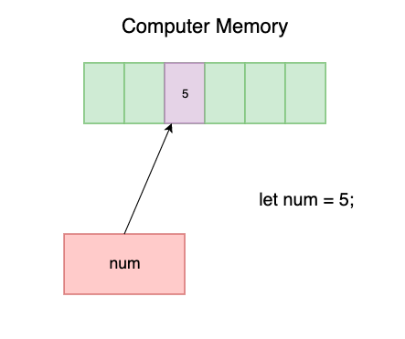
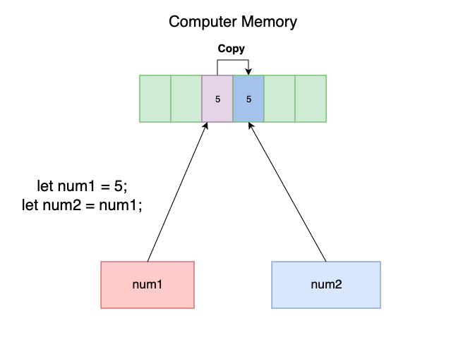
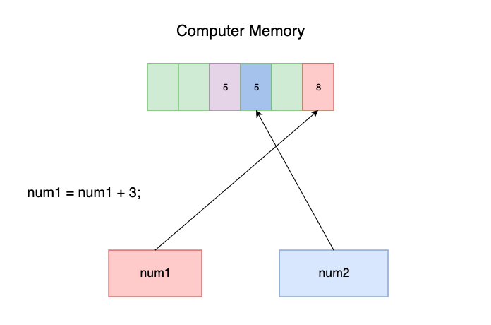
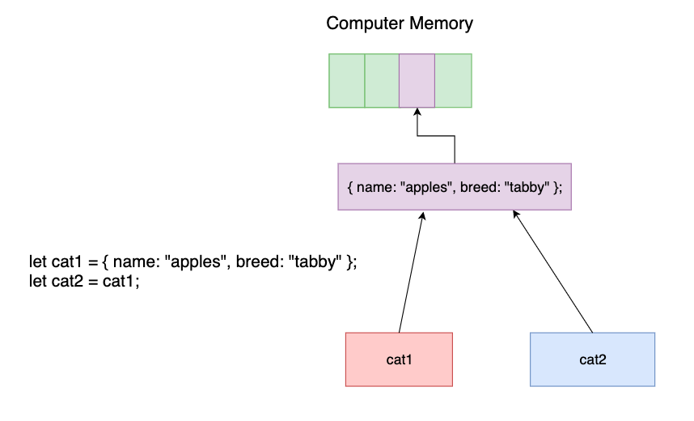
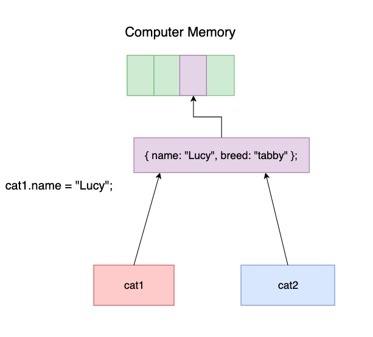

# Introduction to Functions

A function is a procedure of code that will run when called. When we write a function, we can use it as many times as we please. We only write a function once. Writing a function is known as a function declaration or function definition.

## The difference between Parameters and Arguments

1. Parameters are comma separated variables specified as part of a function's declaration.
2. Arguments are values passed to the function when it is invoked.

### Extra arguments

In JavaScript a function will not throw an error if the number of arguments passed during a function invocation is different than the number of parameters listed during function declaration.

Too many arguments

An argument passed for which there is not a parameter will be ignored by JS and will not cause an error.

### Not enough arguments

Not passed arguments will have their parameter variables assigned to undefined.  This can cause NaN returns when doing arithmetic.

# Arrow Functions

Arrow functions, a.k.a. Fat Arrows (=>), are a more concise way of declaring functions. Arrow functions were introduced in ES2015 as a way of solving many of the inconveniences of the normal callback function syntax.

Two major factors influenced the reason behind the desire for arrow functions: the desire for (1) shorter functions and (2) an easy way to bind the context at the place of the function definition to the function. Only the first factor will be discussed in this reading. You will explore the second factor at a later lesson when you learn about context.

When you finish this reading you should be able to:

- Define an arrow function
- Use implicit return with an arrow function

## Arrow functions solving problems

Let's start by looking at the arrow function in action!

```
// function declaration
let average = function(num1, num2) {
  let avg = (num1 + num2) / 2;
  return avg;
};

// fat arrow function style!
let averageArrow = (num1, num2) => {
  let avg = (num1 + num2) / 2;
  return avg;
};


```

Both functions in the example above accomplish the same thing. However, the arrow syntax is a little shorter and easier to follow.

### Anatomy of an arrow function

The syntax for a multiple statement arrow function is as follows:

```
(parameters, go, here) => {
  statement1;
  statement2;
  return <a value>;
}


```

So let's look at a quick translation between a function declared with function expression syntax and a fat arrow function. Take notice of the removal of the function keyword, and the addition of the fat arrow (=>).

```
function fullName(fname, lname) {
  let str = "Hello " + fname + " " + lname;
  return str;
}

// vs.

let fullNameArrow = (fname, lname) => {
  let str = "Hello " + fname + " " + lname;
  return str;
};


```

If there is only a single parameter you may omit the ( ) around the parameter declaration:

```
param1 => {
  statement1;
  return value;
};


```

If you have no parameters with an arrow function you must still use the ( ):

```
// no parameters will use parenthesis
() => {
  statements;
  return value;
};


```

Let's see an example of an arrow function with a single parameter with no parenthesis:

```
const sayName = name => {
  return "Hello " + name;
};

sayName("Jared"); // => "Hello Jared"


```

#### Single expression arrow functions

Reminder: In JavaScript, an expression is a line of code that returns a value. Statements are, more generally, any line of code.

One of the most fun things about single expression arrow functions is they allow for something previously unavailable in JavaScript: implicit returns. Meaning, in an arrow function with a single-expression block, the curly braces ({ }) and the return are keyword are implied.

```
argument => expression; // equal to (argument) => { return expression };


```

Look at the below example you can see how we use this snazzy implicit returns syntax:

```
const multiply = function(num1, num2) {
  return num1 * num2;
};

// do not need to explicitly state return!
const arrowMultiply = (num1, num2) => num1 * num2;


```

However this doesn't work if the fat arrow uses multiple statements:

```
const halfMyAge = myAge => {
  const age = myAge;
  age / 2;
};

console.log(halfMyAge(30)); // "undefined"


```

To return a value from a fat arrow with multiple statements, you must explicitly return:

```
const halfMyAge = myAge => {
  const age = myAge;
  return age / 2;
};

console.log(halfMyAge(30)); // 15


```

#### Syntactic ambiguity with arrow functions

In JavaScript, {} can signify either an empty object or an empty block.

```
const ambiguousFunction = () => {};


```

Is ambiguousFunction supposed to return an empty object or an empty code block? Confusing right? JavaScript standards state that the curly braces after a fat arrow evaluate to an empty block (which has the default value of undefined):

```
ambiguousFunction(); // undefined


```

To make a single-expression fat arrow return an empty object, wrap that object within parentheses:

```
// this will implicitly return an empty object
const clearFunction = () => ({});
clearFunction(); // returns an object: {}


```

#### Arrow functions are anonymous

Fat arrows are anonymous, like their lambda counterparts in other languages.

```
sayHello(name) => console.log("Hi, " + name); // SyntaxError
(name) => console.log("Hi, " + name); // this works!


```

If you want to name your function you must assign it to a variable:

```
const sayHello = name => console.log("Hi, " + name);

sayHello("Curtis"); // => Hi, Curtis


```

That's about all you need to know for arrow functions syntax-wise. Arrow functions aren't just a different way of writing functions, though. They behave differently too - especially when it comes to context!

## What you learned

- How to define an arrow function
- How to implicitly return in a single-expression arrow function

# The Object Type

Up to this point you've interacted with a lot of different data types in JavaScript. Now it's time to introduce one of the most diverse and widely used data types of all: Objects.

An object is a data structure that stores other data, similar to how an array stores elements. An object differs in that each value stored in an object is associated with a key. Keys are almost always strings while values can be any data type: numbers, strings, functions, arrays, other objects, anything at all!

When you finish this reading, you should be able to:

1. Create objects using correct syntax with a variety of values.
2. Identify that an object is an unordered collection of values.
3. Key into an object to receive a single value using both Bracket and Dot notation.
4. Use Bracket notation to set a variable as a key in an Object.
5. Implement a check to see if a key already exists within an Object.
6. Understand how object precedence fits in with dot notation for objects.

## The object of my affections

To reiterate, an object is a data structure that stores other data. In other programming languages similar data structures to the Object type are referred to as 'dictionaries', 'maps', or 'associative arrays'. Objects are different from the previous data structures we've talked about (i.e. arrays) in two important ways:

1. Instead of accessing values within an object through an index with numbers, objects are indexed using keys.

- This allows us to access values quickly and efficiently. We'll be talking a bit more about this point later on in the course.

1. Order is not guaranteed within an Object. When you iterate through the values in an object, they may not be in the same order as when they were entered.

Objects are defined by using curly braces: {}. See below for an example:

```
> let car = {};
undefined

// here is our new empty object!
> car
{}


```

Fun Fact: Objects are known by the affectionate industry jargon: Plain Old JavaScript Objects (or POJO for short). Expect to see that short-hand often!

## Setting keys and values

When learning about objects it can be helpful to think about real life objects. For instance think about a car. A real life car can have a color, a number of wheels, a number of seats, a weight, etc. So a real life car has a number of different properties that you wouldn't list in any particular order, though all those properties define the characteristics of that car.

Thinking of a car, let's create a car object to represent that collection of properties. We can create new key-value pairs using bracket notation [] and assignment =. Notice that the key inside the brackets is represented with a string:

```
// here "color" is the key!
> car["color"] = "Blue";
"Blue"

> car["seats"] = 2;
2

// accessing our object at the key of color
> car["color"]
"Blue"

> car["seats"]
2

> car
{color: "Blue", seats: 2}


```

When we enter car["color"], we are using "color" as our key. You can think of keys and values in an object just like a lock and key in real life. The "color" key "unlocks" the corresponding value to give us our car's color, "Blue"!

### Keys without values

What happens if we try to access a key that we have not yet assigned within an object?

```
> car
{color: "Blue", seats: 2}

> car["weight"]
undefined


```

If we try to access a key that is not inside an object we get undefined. This falls right into place with our understanding of where undefined shows up in JavaScript. It's the common default value for a lot of things. The undefined type is the default for unassigned variables, functions without a return, out-of-array elements, and non-existent object values.

Using this knowledge, we can check if a key exists in an object:

```
> car
{color: "Blue", seats: 2}

> car["color"]
"Blue"

> car["color"] === undefined;
false

> car["weight"] === undefined;
true


```

While this is a common pattern, in modern JS the preferred method to check if an object exists in a key is to use the in operator:

```
> car
{color: "Blue", seats: 2}

> "color" in car;
true

> "model" in car;
false


```

### Using variables as keys

So we've talked about assigning string keys within Objects. Additionally, we know how to create variables that have strings as values. So... you might be thinking: what happens if we assign a variable with a string value as a key within an Object? We're glad you asked! Let's look at an example below for setting keys within Objects using variables.

Let's keep playing with the car object we made previously:

```
> car
{color: "Blue", seats: 2}

> let newVariable = "color";
undefined

> newVariable
"color"

> car[newVariable]
"Blue"

> car["color"]
"Blue"


```

Aha! Of course we can use a variable as our key! A variable always evaluates to the value we assigned it. So car[newVariable] and car["color"] are equivalent! Why is this useful? We know that variables can change; so now the keys we use for objects can change!

Let's take a look at what happens when we change the variable above:

```
> car
{color: "Blue", seats: 2}

> newVariable
"color"

> newVariable = "weight";
undefined

> car[newVariable]
undefined

// car doesn't change because we didn't *assign* the new variable key in our object
> car
{color: "Blue", seats: 2}


```

We can now use our newly assigned variable to set a new key in our object:

```

> car
{color: "Blue", seats: 2}

> newVariable
"weight"

// assigning a key value pair using a variable!
> car[newVariable] = 1000;
1000

> car
{color: "Blue", seats: 2, weight: 1000}


```

## Using different notations

So far we've shown how to access and set values in objects using object[key] - also known as Bracket Notation. However, this is only one of two ways to access values within an object. The second way we can access values within an object is called Dot Notation. We can use . to assign and access our key-value pairs. The easiest difference to notice is when we use dot notation, we don't need to use string quotation marks for the key:

```
> let dog = {};
undefined

> dog.bark = "Bowowowo";
"Bowowowowo"

> dog.bark
"Bowowowo"

> dog
{ bark: "Bowowowowo" }


```

### Bracket notation vs Dot notation

Now that we know two ways to access values of an object, you are probably asking yourself: which one should you use? Here is a quick list of pros for each.

Dot notation:

- easier to read
- easier to write because we don't have to deal with using quotation marks
- cannot use variables as keys
- keys can't contain numbers as their first character (object.1key doesn't work!)

Bracket notation:

- you can use variables (assigned to string values) as keys!
- It is okay to use variables and Strings that start with numbers as keys (use object['1key'] does work, while object.1key does not)

There are tradeoffs and advantages for either notation, so practice using both! You will learn quickly that there are a ton of different ways to write the same thing in JavaScript. Having both of these options available to you will allow you to use different tools to solve different problems.

One of the most fun parts of being a programmer is the ability to come up with different solutions to the same problem. So you should have both types of notation in your tool-belt to be a versatile programmer!

Let's look at the difference:

```
let myDog = {};
myDog.name = "Fido";

// let's use a variable as our key and some bracket notation:
let myKey = "name";
console.log(myDog); // prints `{name: "Fido"}`
console.log(myDog[myKey]); // prints `Fido`

// what if we try to use the variable in dot notation:
// the below is interpreted as myDog['myKey']
console.log(myDog.myKey); // prints: undefined


```

When we use dot notation to write myDog.myKey, myKey will not be interpreted by JavaScript as a variable. The text we write after the . will be used as the literal key. Remember that if we try to use a key that does not exist in an object, we get back the default value of undefined.

```
// continued from above

console.log(myDog.myKey); // prints `undefined`
myDog.myKey = "???";
console.log(myDog); // prints `{name: "Fido", myKey: "???"}`
console.log(myDog.myKey); // prints `???`
// mind === "blown"


```

### Putting it all together

We can also create an entire object in a single statement:

```
let myDog = {
  name: "Fido",
  type: "Doge",
  age: 2,
  favoriteToys: ["bone", "ball"]
};

console.log(myDog.age); // prints 2
console.log(myDog["favoriteToys"]); // prints ["bone", "ball"]


```

### Operator precedence revisited

Just like with math and logical operators, the concepts of operator precedence also pertain to objects. Associativity determines the order of operation, along with precedence. There are two types of associativity: right-associativity and left-associativity.

Right-associativity is when code is evaluated right-to-left. Let's take a closer look at what is happening in the line of code below:

```
a = b = 1;


```

1. Variable b is assigned as 1.
2. Variable a is assigned as b = 1.
3. b = 1 returns the value 1, so variable a is now assigned as 1.

The assignment of variables takes lowest precedence, which is why we evaluate the return value of b = 1 before completing the assignment of variable a.

The example below is left-associativity is when code is evaluated left-to-right. It evaluates the document.getElementById method before accessing value.

```
let id = "header";
let element = document.getElementById(id).value;


```

1. We resolve the document variable to be the document object.
2. We use dot notation to retrieve the getElementById function. (The function is a property of the document object).
3. We attempt to call it, but before the call can proceed we must first evaluate the function's arguments.
4. We resolve the id variable to be the string "header".
5. The getELementById function returns an HTMLElement object and then uses dot notation to access value.
6. Finally we do assignment which is the LOWEST precedence (that's why assignment happens last). Its associativity is right to left, so we take the value on the right and assign it to the left.

Now let's dive into the example below. Resolving the variables to their values happens before the operators.

```
add(number1, number2) + number3;


```

1. number3 is resolved to its value.
2. The function is invoked, but its variables need to be resolved.
3. number1 and number2 are resolved to their values.
4. The function is invoked so number1, number2, and number3 are finally added together!

## What you learned

In this reading we covered:

- Objects are unordered data structures consisting of key and value pairs
- Object keys are strings, but their values can be anything (arrays, numbers, strings, functions, etc.)
- Setting key and value pairs using both Bracket and Dot notation

- Using Bracket notation to set variables as keys in Objects

- The default value when accessing a key that is not in an object is undefined

- How to check if a key is already within an object using the object[key] === undefined pattern

# Iterating Through Objects

In the previous reading we mentioned that Objects store unordered key-value pairs. With Objects we cannot rely on indices to access values. This means we'll have to iterate through objects in new ways to access the keys and values within.

When you finish this reading, you should be able to:

1. Iterate through Object keys and values using a for...in loop
2. Use the Object.keys and the Object.values methods to iterate through an Object

## A new Kind of for Loop

We can use special syntax to iterate through each key of an object (in arbitrary order). This is super useful for looping through both the keys and values of an object.

The general syntax looks like this:

```
// The current key is assigned to *variable* on each iteration.
for (let variable in object) {
  statement;
}


```

This syntax is best shown by example:

```
let obj = { name: "Rose", cats: 2 };

// The key we are accessing is assigned to the `currentKey`
// *variable* on each iteration.
for (let currentKey in obj) {
  console.log(currentKey);
}

// prints out:
// name
// cats


```

The example above prints all the keys found in obj to the screen. On each iteration of the loop, the key we are currently accessing is assigned to the currentKey variable. Now, keys are nice but what about values?

If we want to access values in an object, we can use bracket notation like so:

```
let obj = { name: "Rose", cats: 2 };

for (let key in obj) {
  let value = obj[key];
  console.log(value);
}

// prints out:
// Rose
// 2


```

Here's some food for thought: Why can't we use dot notation to iterate through an object's values? For example, what if we replaced obj[key] with obj.key in the above code snippet? Try it for yourself. As we previously covered, you can only use variables as keys when using bracket notation (obj[key])!

Like all variables, you can name the current key variable whatever you like - just be descriptive! Here is an example of using a descriptive name for a key variable:

```
let employees = {
  manager: "Angela",
  sales: "Gracie",
  service: "Paul"
};

for (let title in employees) {
  let person = employees[title];
  console.log(person);
}

// prints out:
// Angela
// Gracie
// Paul


```

## Methods vs Functions

Before we dive further into iterating with Objects, we'll take a moment to talk about methods. A method is essentially a function that belongs to an object. That means that every method is a function, but not every function is a method.

- myFunc is a function
- myObject.myFunc is a method of the object myObject
- myObject["myFunc"] is a method of the object myObject

A method is just a key-value pair where the key is the function name and the value is the function definition! Let's use what we learned earlier to teach our dog some new tricks:

```
let dog = {
  name: "Fido"
};

// defining a new key-value pair where the *function name* is the key
// the function itself is the value!
dog.bark = function() {
  console.log("bark bark!");
};

// this is the same thing as above just using Bracket Notation
dog["speak"] = function(string) {
  console.log("WOOF " + string + " WOOF!!!");
};

dog.bark(); // prints `bark bark!`
dog.speak("pizza"); // prints `WOOF pizza WOOF!!!`


```

Additionally, we can give objects methods when we initialize them:

```
let dog2 = {
  name: "Rover",

  bark: function() {
    console.log("bork bork!");
  },

  speak: function(string) {
    console.log("BORK " + string + " BORK!!!");
  }
};
// Notice that in the object above, we still separate the key-value pairs with commas.
// `bark` and `speak` are just keys with functions as values.

dog2.bark(); // prints `bork bork!`
dog2.speak("burrito"); // prints `BORK burrito BORK!!!`


```

Methods are just plain old functions at heart. They act like the functions we know and love - they can have defined parameters, accept arguments, return data, etc. A method is just a function that belongs to an object. To invoke, or call, a method we need to specify which object is calling that method. In the code snippet above, the dog2 object had the bark method, and to invoke bark, we had to specify it was dog2's method: dog2.bark(). More generally the pattern goes like this: myObject.methodName().

## Useful Object Methods

### Iterating through keys using Object.keys

The Object.keys method accepts an object as the argument and returns an array of the keys within that Object.

```
> let dog = {name: "Fido", age: "2"}
undefined

> Object.keys(dog)
['name', 'age']

> let cup = {color: "Red", contents: "coffee", weight: 5}
undefined

> Object.keys(cup)
['color', 'contents', 'weight']


```

The return value of Object.keys method is an array of keys - which is useful for iterating!

### Iterating through keys using Object.values

The Object.values method accepts an object as the argument and returns an array of the values within that Object.

```
> let dog = {name: "Fido", age: "2"}
undefined

> Object.values(dog)
['Fido', '2']

> let cup = {color: "Red", contents: "coffee", weight: 5}
undefined

> Object.values(cup)
['Red', 'coffee', 5]


```

The return value of Object.values method is an array of values - which is useful for iterating!

#### Iterating through an Object's keys & values

So we have gone over how Object.keys gives you the keys on an object and Object.values gives you the values, but what if you want both the keys and the values corresponding to each other in an array?

The Object.entries method accepts an object as the argument and returns an array of the [key, value] pairs within that Object.

Let's look at a quick demo:

```
> let cat = {name: "Freyja", color: "orange"}
undefined

> Object.entries(cat)
[ [ 'name', 'Freyja' ], [ 'color', 'orange' ] ]


```

## What you learned

Objects may be an unordered collection of key-value pairs but that doesn't mean you can't iterate through them!

In this reading we covered:

- How to iterate through an Object using a for...in loop
- How to define and invoke methods on Objects
- The Object.keys and Object.values functions

# Reference vs. Primitive Types

At this point you've worked with many different data types - booleans, numbers, strings, arrays, objects, etc. It's now time to go a little more in depth into the differences between these data types.

When you finish this reading, you should be able to:

- Identify whether a data type is a Primitive type or a Reference type.

## Primitives vs. Objects

JavaScript has many data types, six of which you've encountered so far:

Five Primitive Types:

1. Boolean - true and false
2. Null - represents the intentional absence of value.
3. Undefined - default return value for many things in JavaScript.
4. Number - like the numbers we usually use (15, 4, 42)
5. String - ordered collection of characters ('apple')

One Reference Type:

1. Object - (an array is also a kind of object)!

You might be wondering about why we separated these data types into two categories - Reference & Primitive. Let's talk about the one of the main ways Reference Types and Primitive Types differ:

- Primitive types are immutable. Meaning they cannot change.

## Immutability

When we talk about primitive types the first thing we mentioned was mutability. Primitives are immutable meaning they can not be directly changed. Let's look at an example:

```
let num1 = 5;
// here we assign num2 to point at the value of the number variable
let num2 = num1;

// here we *reassign* the num1 variable
num1 = num1 + 3;

console.log(num1); // 8
console.log(num2); // 5


```

Whoa, what just happened? Let's break this down with some visuals. We start by assigning num1. JavaScript already knows that the number 5 is a primitive number value. So when we are assigning num1 to the value of 5, we are actually telling the num1 variable to point to the place that the number 5 takes up in our computer's memory:



Next we assign num2 to the value of num1. What effectively happens when we do this is we are copying the value of num1 and then pointing num2 at that copy:



Now here is where it gets really interesting. We cannot change the 5 our computer has in memory - because it is a primitive data type. Meaning if we want num1 to equal 8 we need to reassign the value of the num1 variable. When we are talking about primitives reassignment breaks down into simply having your variable point somewhere else in memory:



All this comes together in num1 now pointing at a new value in our computer's memory. Where does this leave num2? Well because we never reassigned num2 it is still pointing at the value it originally copied from num1 and pointing to 5 in memory.

So that in essence is immutability - we can not change values stored in memory; we can only reassign where our variables are pointing.

Let's do another quick example using booleans:

```
let first = true;
let second = first;

first = false;

// first and second point to different places in memory
console.log(first); // false
console.log(second); // true


```

### Mutability

Let's now talk about the inverse of immutability: mutability.

Let's take a look at what we call reference values which are mutable. When you assign a reference value from one variable to a second variable, the value stored in the first variable is also copied into the location of the second variable.

Let's look at an example using objects:

```
let cat1 = { name: "apples", breed: "tabby" };
let cat2 = cat1;

cat1.name = "Lucy";

console.log(cat1); // => {name: "Lucy", breed: "tabby"}
console.log(cat2); // => {name: "Lucy", breed: "tabby"}


```

Here is a visualization of what happened above. First we create cat1 then assign cat2 to the value of cat1. This means that both cat1 and cat2 are pointing to the same object in our computer's memory:



Now looking at the code above we can see what when we change either cat1 or cat2, since they are both pointing to the same place in memory, both will change:



This holds true of arrays as well. Arrays are a kind of object - though obviously different. We'll go a lot deeper into this when we start talking about classes - but for now concentrate on the fact that arrays are also a Reference Type.

See below for an example:

```
let array1 = [14, "potato"];
let array2 = array1;

array1[0] = "banana";

console.log(array1); // => ["banana", "potato"]
console.log(array2); // => ["banana", "potato"]


```

If we change array1 we also change array2 because both are pointing to the same reference in the computer's memory.

## What you learned

- How to work with variables that are both Primitive types and Reference types.

# Array Looping Methods

Looping through all the elements in an array is a very common pattern you will encounter while programming. Because it happens so often, the JavaScript language has a number a built-in methods to help developers write this code more quickly. Which one of the built-in methods you choose depends on the reason you want to loop through an array.

Some examples include:

- forEach - Touch every element to access or modify it in some way
- map - Convert each element to something else and store it in a new array
- filter - Create a new array which is a subset of the original including only those items that meet a certain condition

Don't worry if all those descriptions don't make sense yet. You'll be digging into each one momentarily!

When you complete this lesson, you will be able to

- Use JavaScript looping methods: forEach, map, and filter
- Convert a for loop to a looping method

## Review

Think about how you use a for loop to step through every element in an array.

```
// Assume you've populated a variable named 'myArray'
const myArray = [1, 2, 3, 4, 5];

// Now loop through the entire array
for (let i=0; i<myArray.length; i++) {
    const element = myArray[i];
    // Do stuff with each element
}


```

First, you declared a counter variable starting at zero (let i = 0), then provided a condition up to but not including the length of the array (i < myArray.length), and finally incremented the counter variable (i++). Often, as shown above, you also want to use a variable (or constant) to make it easier to reference the current element within the code block.

Next, consider how you can use a function to enclose a calculation or other functionality.

```
const myFunction = function(value) {
   // Do something with 'value'
}


```

In fact, you can call a function from your for loop. Many developers like this pattern because it makes it easier to read and understand your code when you look at it sometime in the future. To have the most flexibility, developers will pass the index counter along with the current element from the for loop to the function.

```
// Function to do stuff with an array element
const myFunction = function(item, index) {
   // Do something with 'item'
   // Use the 'index' as needed - e.g. special thing for first and/or last item
}

// Assume you've populated a variable named 'myArray' with a bunch of stuff
const myArray = [1, 2, 3, 4, 5];

// Now loop through the entire array
for (let i=0; i<myArray.length; i++) {
    myFunction(myArray[i], i);
}


```

## Introducing forEach

One of the best ways to learn how to use looping functions is to consider how you would translate a for loop to a looping function. Consider this example.

```
// The initial value for total sales is zero
let totalSales = 0;

// Function to add a value to the total sales
const addToTotalSales = function (value) {
   totalSales += value;
}

// Some sales numbers to experiment with
const monthlySales = [1234, 2345, 3456, 4567, 5678];

// Loop through all sales numbers to add them to the total
for (let i=0; i<monthlySales.length; i++) {
    addToTotalSales(monthlySales[i]);
}

// Output the total to the console
console.log('Total Sales are', totalSales);
// Expected result: Total Sales are 17280


```

Next, consider replacing the for loop with the forEach method.

```
// Loop through all sales numbers to add them to the total
monthlySales.forEach(addToTotalSales);


```

Looking carefully at the forEach method, you will notice that it starts with the array you want to work on, then uses .forEach to call the method. The forEach method takes a function as its parameter. JavaScript calls the provided function for every element in the array. When calling the parameter function, JavaScript sends the element of the array as the first parameter, and the index of the array as the second parameter to the forEach method. This example only uses the first parameter, so the second one has been omitted.

Often, developers using forEach will NOT declare the function separately; rather, they will put it right inside the call to forEach, as follows.

```
// Loop through all sales numbers to add them to the total
monthlySales.forEach(function (value) {
    totalSales += value;
});


```

Aside: While forEach will work, there may be a better function for calculating the sum of the elements in an array. The specifics are beyond the scope of this lesson; however you can keep an eye out for the Array reduce() method in your future studies.

# Introducing map

Like forEach, the map method will do something with every element in an array. A key difference is that map expects a returned value for every element to put into a new array.

To understand what this means, consider another example implemented with a standard for loop.

```
// Function to convert an age to a phase of life
const getLifePhase = function(age) {
    if (age < 4)
        return 'Toddler';
    if (age < 13)
        return 'Kid';
    if (age < 18)
        return 'Teenager';
    if (age < 65)
        return 'Adult';
    // if no other condition is met
    return 'Elder';
}

// Array of ages, for example
const ages = [2, 7, 15, 29, 45, 44, 59, 65, 88];

// Loop to convert each age to its life phase
const phases = [];
for (let i=0; i<ages.length; i++) {
    const age = ages[i];
    phases[i] = getLifePhase(age);
}

// Output to console
console.log(phases);
// Expected result:
// [
//   'Toddler',  'Kid',
//   'Teenager', 'Adult',
//   'Adult',    'Adult',
//   'Adult',    'Elder',
//   'Elder'
// ]


```

Modifying the for loop to use the Array map method would look like this.

```
// Loop to convert each age to its life phase
const phases = ages.map(getLifePhase);


```

The map method, like forEach, takes as its parameter another function which has two parameters: the element from the array and the index of the element.

### Bonus example

Most of the time, you'll find you don't use the index. Here's a use case where index is helpful. Specifically, it allows you to debug both phases and ages in parallel.

```
// Output to conole
console.log(phases.map(function (value, index) {
    // use the index from the phases array to access
    // the corresponding value in the ages array
    return value + ' (' + ages[index] + ')';
}));

// Expected result
// [
//   'Toddler (2)',
//   'Kid (7)',
//   'Teenager (15)',
//   'Adult (29)',
//   'Adult (45)',
//   'Adult (44)',
//   'Adult (59)',
//   'Elder (65)',
//   'Elder (88)'
// ]


```

# Introducing filter

The other most common use case for a for loop takes one array and pulls out only certain elements. This is called filtering and can be done easily with the Array filter method.

Consider this filter implemented with a classic for loop.

```
// Array of toys, for example
const toys = [
    'Red Ball',
    'Pink Elephant',
    'Clown with Red Nose',
    'Teddy Bear (Brown)',
    'Firefighter Hat (Red)'
];

// Loop to get only the red toys
const redToys = [];
for (let i=0; i<toys.length; i++) {
    const toy = toys[i];
    if (toy.toLowerCase().indexOf('red') > -1)
        redToys.push(toy);
}

// Output to console
console.log(redToys);
// Expected output:
//     [ 'Red Ball', 'Clown with Red Nose', 'Firefighter Hat (Red)' ]


```

The for loop takes a new, empty array (redToys) and adds certain elements to the end (that's what push does). Specifically, it includes those elements that have 'red' somewhere in them, either uppercase or lowercase or any combination (this case-insensitivity is why toLowercase() is used).

The first step to consider when switching to the filter looping method, is the function that holds the conditional. In this case, it would look like the following.

```
const isRedToy = function(toy) {
    return toy.toLowerCase().indexOf('red') > -1;
}


```

An easy way to remember this is to use the conditional which follows the if.

After that, you just need to know the new, smaller array is the returned value from filter. So, the above example rewritten with the Array filter method can look like this.

```
// Array of toys, for example
const toys = [
    'Red Ball',
    'Pink Elephant',
    'Clown with Red Nose',
    'Teddy Bear (Brown)',
    'Firefighter Hat (Red)'
];

// Loop to get only the red toys
const redToys = toys.filter(function (toy) {
    return toy.toLowerCase().indexOf('red') > -1;
});

// Output to console
console.log(redToys);
// Expected output:
//     [ 'Red Ball', 'Clown with Red Nose', 'Firefighter Hat (Red)' ]


```

# Putting it all together

Now, it's time to check your understanding. Review the following JavaScript code. Challenge yourself to see if you can figure out what loops 1 through 3 do before you read the details that follow.

```
// A list of friends stored as an array of objects
const myFriends = [
    { firstname: 'Isma', lastname: 'Kirby', age: 27 },
    { firstname: 'Aaliya', lastname: 'Becker', age: 35 },
    { firstname: 'Adnaan', lastname: 'Tang', age: 22 },
    { firstname: 'Rafi', lastname: 'Pearson', age: 29 },
    { firstname: 'Eshaal', lastname: 'Gould', age: 29 },
    { firstname: 'Scarlett', lastname: 'Whitehead', age: 45 },
    { firstname: 'Arslan', lastname: 'Esparza', age: 38 },
    { firstname: 'Isla-Mae', lastname: 'Hastings', age: 46 },
    { firstname: 'Eamonn', lastname: 'Vang', age: 21 },
    { firstname: 'Haya', lastname: 'Mcdougall', age: 31 },
];

// Loop 1
let total = 0
myFriends.forEach(function (person) {
    const firstInitial = person.firstname.substring(0,1);
    const lastInitial = person.lastname.substring(0,1);
    person.initials = firstInitial + lastInitial;
    total += person.age;
});

// Loop 2
const average = total / myFriends.length;
const myOlderFriends = myFriends.filter(function(person) {
    return person.age > average;
});

// Loop 3
const report = myOlderFriends.map(function(person) {
    return person.initials + ': ' + person.age;
});

// Output to log
console.log(report);


```

When you are ready to check your understanding, read on.

- Loop 1: Adds a property to each friend storing their initials and calculates the sum of all ages to use in calculation of average age
- Loop 2: Gets an array of all friends older than the average age
- Loop 3: Gets an array of strings listing the initials and age
- Expected output: [ 'AB: 35', 'SW: 45', 'AE: 38', 'IH: 46' ]

## What you've learned

Congratulations! You now have a new set of tools to use in your development work - array methods for looping through all elements in place of a for loop. Each of these methods uses a function which takes an element of the array as the first parameter, and - optionally - the index of that element as the second parameter.

The forEach method allows you to modify each element of an array or use it in a calculation. The map method creates a new array with one element for every element in the original array. The filter method creates a new array with a subset set of elements from the original array for the condition you return from the function.

# Control Flow - Conditional Statements

In simple terms - control flow is the order in which instructions are executed within a program. One modifies control flow using control structures, expressions that alter the control flow based on given parameters. The control structures within JavaScript allow the program flow to change within a unit of code or a function.

Two main control structures you will use time and time again - conditional statements and loops. Conditional statements are used to perform different actions based on different conditions. This second of the main control structures you will use time and time again - loops.

## Configuring GitHub Authentication

Because GitHub allows you to share code with other developers, there needs to be a way to authenticate to make sure that you are authorized to access or contribute new code.

Thankfully, git handles this authentication flow automatically. But for GitHub, there are several options for handling this authentication. These instructions will walk you through setting up authentication through Git Credential Manager, which is App Academy's preferred method.

If you have never configured GitHub authentication before, follow the instructions below to set up Git Credential Manager. If you already have authentication set up using a PAT or SSH key, you may continue using that approach. You can reference this SSH article or PAT article for troubleshooting your existing setup if needed.

### Git Credential Manager

Git Credential Manager is the recommended secrets manager for GitHub authentication for Windows, Mac, and Linux.

## Translating Wireframes and Specifications into Code

To get from the specifications to a fully implemented web page, there is a large amount of work that must be done, and this is typically done without any kind of roadmap. Here are just a few of the things that you, as the developer, often have to figure out. You may have to figure these things out on your own, or in collaboration with other teammates.

- How should I organize the code? What files will I need to create or use to implement this project? You will need to figure out the architecture, styles, and conventions that the team uses, and make sure you are following them as you contribute to the codebase.
- What's the best way to organize the elements on the page? You will need to map out which elements will be used for each piece of content on the page, and you will have to make decisions on how elements are grouped together. These decisions will be important when you start styling the page.
- How should I deal with the details that are not specified in the wireframe? Many important details, such as the amount of whitespace between elements, will not be specified for you. You will need to do your best to make decisions that look similar to the wireframe, and are visually appealing.
- How will I make sure the page is responsive on multiple screen sizes? This is an important detail on any project, as many wireframes include designs for a web and a mobile version. There might be content and organization differences between the two. It will be up to you to thoroughly test your page on multiple screen sizes to make sure everything looks and works as it should regardless of the screen size of the user.

## Understanding Error Messages

Error messages are bound to pop up in your code. It is important to understand what they are saying to help you fix the bug. These are messages in your console that notify you what kind of error you received. Some of the most common error types are:

1. SyntaxError
2. TypeError
3. ReferenceError
4. RangeError

Although, there are several error types and even custom error messages that you can create. It is good practice to familiarize yourself as much as possible to help you debug your code.

## Debugging HTML

Errors can vary drastically depending on what language you are using. Whenever you run into an error that you are unfamiliar with, you should do your research to try to understand what kind of error it is and how to solve it. HTML won't always give you a straightforward error message so it is worth noting the most common HTML errors:

1. Unclosed elements
2. Badly nested elements
3. Unclosed Attributes

The Debugging HTML Docs has more information for you on the several different HTML errors that you may run into. Syntax errors and logic errors are also common to run into when coding HTML.

## How to tell if a value is an array

Unfortunately, due to a really old bug in the way that JavaScript works, a bug that no one can fix because people wrote code that relies on the bug for decades, you cannot use the typeof operator to figure out if something is an array.

```
let a = [1, 2, 3];
console.log(typeof a);  // 'object'
```

Gee, JavaScript. That's not helpful. Thanks.

Luckily, it only took 12 years for JavaScript to include a way to test if a value is an array. To do so, you use the Array.isArray method like this.

# Using the Spread Operator and Rest Parameter Syntax

When writing functions in JavaScript you gain a certain flexibility that other programming languages don't allow. As we have previously covered, JavaScript functions will happily take fewer arguments than specified, or more arguments than specified. This flexibility can be taken advantage of by using the spread operator and rest parameter syntax.

When you finish this reading, you should be able to:

1. Use rest parameter syntax to accept an arbitrary number of arguments inside a function.
2. Use spread operator syntax with both Objects and Arrays.

## Accepting arguments

Before we jump into talking about using new syntax let's quickly recap on what we already know about functions.

### Functions with fewer arguments than specified

As we've previously covered, JavaScript functions can take fewer arguments than expected. If a parameter has been declared when the function itself was defined, then the default value of that parameter is undefined.

Below is an example of a function with a defined parameter both with and without an argument being passed in:

```
function tester(arg) {
  return arg;
}

console.log(tester(5)); // => prints: 5
console.log(tester()); // => prints: undefined


```

Always keep in mind that a function will still run even if it has been passed no arguments at all.

### More arguments than specified

JavaScript functions will also accept more arguments than were previously defined by parameters.

Below is an example of a function with extra arguments being passed in:

```
function adder(num1, num2) {
  let sum = num1 + num2;
  return sum;
}

// adder will assign the first two parameters to the passed in arguments
// and ignore the rest
console.log(adder(2, 3, 4)); // => 5
console.log(adder(1, 5, 19, 100, 13)); // => 6


```

## Utilizing Rest Parameters

We know that JavaScript functions can take in extra arguments - but how do we access those extra arguments? For the above example of the adder function: how could we add all incoming arguments - even the ones we didn't define as parameters?

Rest parameter syntax allows us to capture all of a function's incoming arguments into an array. Let's take a look at the syntax:

```
// to use the rest parameter you use ... then the name of the array
// the arguments will be contained within
function tester(...restOfArgs) {
  // ...
}


```

In order to use rest parameter syntax a function's last parameter can be prefixed with ... which will then cause all remaining arguments to be placed within an array. Only the last parameter can be a rest parameter.

Here is a simple example using rest parameter syntax to capture all incoming arguments into an array:

```
function logArguments(...allArguments) {
  console.log(allArguments);
}

logArguments("apple", 15, 3); // prints: ["apple", 15, 3]


```

For a more practical example let's expand on our adder function from before using rest parameter syntax:

```
function adder(num1, ...otherNums) {
  console.log("The first number is: " + num1);
  let sum = num1;

  // captures all other arguments into an array and adds them to our sum
  otherNums.forEach(function(num) {
    sum += num;
  });

  console.log("The sum is: " + sum);
}

adder(2, 3, 4);
// prints out:
// The first number is: 2
// The sum is: 9


```

To recap - we can use the rest parameter to capture a function's incoming arguments into an array.

## Utilizing Spread Syntax

Let's now talk about a very interesting and useful operator in JavaScript. In essence, the spread operator allows you to break down a data type into the elements that make it up.

The spread operator has two basic behaviors:

1. Take a data type (i.e. an array, an object) and spread the values of that type where elements are expected
2. Take an iterable data type (an array or a string) and spread the elements of that type where arguments are expected.

### Spreading elements

The spread operator is very useful for spreading the values of an array or object where comma-separated elements are expected.

Spread operator syntax is very similar to rest parameter syntax but they do very different things:

```
let numArray = [1, 2, 3];

// here we are taking `numArray` and *spreading* it into a new array where
// comma separated elements are expected to be
let moreNums = [...numArray, 4, 5, 6];

> moreNums
// => [1, 2, 3, 4, 5, 6]


```

In the above example you can see we used the spread operator to spread the values of numArray into a new array. Previously we used the concat method for this purpose, but we can now accomplish the same behavior using the spread operator.

We can also spread Objects! Using the spread operator you can spread the key-value pairs from one object and into another new object.

Here is an example:

```
let colors = { red: "scarlet", blue: "aquamarine" };
let newColors = { ...colors };

> newColors
// { red: "scarlet", blue: "aquamarine" };


```

Just like we previously showed with arrays, we can use this spread behavior to merge objects together:

```
let colors = { red: "scarlet", blue: "aquamarine" };
let colors2 = { green: "forest", yellow: "sunflower" };

let moreColors = { ...colors, ...colors2 };

> moreColors
// {red: "scarlet", blue: "aquamarine", green: "forest", yellow: "sunflower"}


```

### Spreading arguments

The other scenario in which spread proves useful is spreading an iterable data type into the passed in arguments of a function. To clarify, when we say iterable data types we mean arrays and string, not Objects.

Here is a common example of spreading an array into a function's arguments:


```


```

Using spread allowed us to pass in the words array, which was then broken down into the separate parameters of the speak function. The spread operator allows you to pass an array as an argument to a function and the values of that array be will be spread to fill in the separate parameters.

## What you learned

Rest parameter syntax may look like spread operator syntax but they are pretty much opposites1:

1. Spread 'expands' a data type into its elements
2. Rest collects multiple elements and 'condenses' them into a single data type.

What this reading covered:

- JavaScript functions can accept any number of arguments
- Using rest parameter syntax we can capture the arguments of a JavaScript function in an array
- Using spread operator syntax to spread iterable data types where arguments or values are expected

- Using the spread operator to spread an array or an object into their separate elements

# Destructuring

Up to this point we've learned how to collect related values and elements and store them in lovely data structures. Now it's time to tear those data structures down to the ground! Just kidding. In this reading we will be talking about the concept of destructuring an array or object in order to more easily access their individual elements.

When you finish this reading, you should be able to:

1. Destructure an array to reference specific elements
2. Destructure an object to reference specific values
3. Destructure incoming parameters into a function

## Destructuring data into variables

The destructuring assignment syntax allows you to extract parts of an array or object into distinct variables.

Let's see an example:


```


```

As with normal variable assignment you put the name of the variable you are assigning on the left, and the values you are assigning on the right. The above code assigns firstEl to the value in the first position in numArray, and secondEl to the second position in numArray.

We can alternatively declare our variables before destructuring as well:


```


```

### Swapping variables using destructuring

One of the really cool things you can do with destructuring is swapping the values of two variables:

```
let num1 = 17;
let num2 = 3;

// this syntax will swap the values of the two variables
[num1, num2] = [num2, num1];

console.log(num1); // 3
console.log(num2); // 17


```

Neat, right? This little syntactic trick can save you a few lines of code.

### Destructuring objects into variables

As you've previously read - objects can contain a lot of varied information including arrays, functions, and other objects. One of the most useful applications for destructuring is the ability to take apart and assign little slices of large objects to variables.

Let's take a look at the basic syntax for destructuring objects when the extracted variables have the same name as their associated keys:

```
let obj = { name: "Apples", breed: ["tabby", "short hair"] };
let { name, breed } = obj;

console.log(name); // "Apples"
console.log(breed); // ["tabby", "short hair"]


```

Now this syntax works by matching object properties, so we can choose exactly which keys we want. If we only wanted to save certain properties, we could do something like this:

```
let { a, c } = { a: 1, b: 2, c: 3 };
a; //=> 1
c; //=> 3


```

Now in all the previous examples we examined our variable names shared the same name as our object's keys. Let's take a quick look at the syntax we would need to use if the variable we are creating does not have the same name as our object's keys. This is referred to as aliased object destructuring:

```
let obj = { apple: "red", banana: "yellow" };
let { apple: newApple, banana: newBanana } = obj;

console.log(newApple); // "red"
console.log(newBanana); // "yellow"


```

Object deconstructing really becomes useful as you start working with larger and nested objects. Let's take a look at destructuring with nested objects. In the below example our goal is to capture the value of the species key into a variable named species:

```
let object = { animal: { name: "Fiona", species: "Hippo" } };

// here we are specifying that within the animal object we want to assign the
// *species* variable to the value held by the *species* key
let {
  animal: { species }
} = object;

console.log(species); // => 'Hippo'


```

Take a look at the example below to see how object destructuring can make your code more readable in more complex situations. For this example we are trying to get the fname value into a variable:

```
let user = {
  userId: 1,
  favoriteAnimal: "hippo",
  fullName: {
    fname: "Rose",
    lname: "K"
  }
};

// accessing values *with* destructuring
let {
  userId,
  fullName: { fname, lname }
} = user;

console.log(userId, fname, lname); // prints out:
// 1 "Rose" "K"


```

Destructuring allowed us to assign multiple variables to multiple values in our user object all in one line of code!

The whole point of destructuring is to make code easier to write and read. However, destructuring can become harder to read with super nested objects. A good rule of thumb to keep clarity in your code is to only destructure values from objects that are two levels deep.

Let's look at a quick example:

```
// the fname key is nested more than two levels deep
// (within bootcamp.instructor.fullName)
let bootcamp = {
  name: "App Academy",
  color: "red",
  instructor: {
    fullName: {
      fname: "Rose",
      lname: "K"
    }
  }
};

// this is hard to follow:
let {
  instructor: {
    fullName: { fname, lname }
  }
} = bootcamp;
console.log(fname, lname);

// this is much easier to read:
let { fname, lname } = bootcamp.instructor.fullName;
console.log(fname, lname);


```

### Destructuring and the rest pattern

Earlier you saw how the rest parameter syntax allows us to prefix a function's last parameter with ... to capture all remaining arguments into an array:

```
function logArguments(firstArgument, ...restOfArguments) {
  console.log(firstArgument);
  console.log(restOfArguments);
}

logArguments("apple", 15, 3);
// prints out:
// "apple"
// [15, 3]


```

This coding pattern of saying "give me the rest of" can also be used when destructuring an array by prefixing the last variable with .... In this example, the otherFoods variable is prefixed with ... to initialize the variable to an array containing the remaining array elements that weren't explicitly destructured:

```
let foods = ["pizza", "ramen", "sushi", "kale", "tacos"];

let [firstFood, secondFood, ...otherFoods] = foods;
console.log(firstFood); // => "pizza"
console.log(secondFood); // => "ramen"
console.log(otherFoods); // => ["sushi", "kale", "tacos"]


```

At the time of this writing, the rest pattern is only officially supported by JavaScript when destructuring arrays, though an ECMAScript proposal adds support when destructuring objects. Recent versions of Chrome and Firefox support this proposed addition to the JavaScript language.

Similar to when using the rest pattern with array destructuring, the last variable obj is prefixed with ... to initialize it to an object containing the remaining enumerable property keys (and their values) that weren't explicitly destructured:

```
let { a, c, ...obj } = { a: 1, b: 2, c: 3, d: 4 };
console.log(a); // => 1
console.log(c); // => 3
console.log(obj); // => { b: 2, d: 4 }


```

## Destructuring parameters

So far we've talked about destructuring things into variables - but the other main use for destructuring is destructuring incoming parameters into a function. This gets to be really useful when we're passing objects around to different functions. Each function can the be responsible for pulling the parameters it needs from an incoming object - making it that much easier to work with.

Let's look at a simple example of destructuring an object in a function's parameters:

```
let cat = { name: "Rupert", owner: "Curtis", weight: 10 };

// This unpacks the *owner* key out of any incoming object argument and
// assigns it to a owner parameter(variable)
function ownerName({ owner }) {
  console.log("This cat is owned by " + owner);
}

ownerName(cat);


```

In the above example we destructured any incoming arguments to the ownerName function to assign the value at the key owner to the parameter name of owner. This syntax might seem a little much just for getting one parameter but this syntax can become invaluable with nested objects.

Let's look at one more slightly more complex example to see the power of destructuring parameters. In the below example we want to find and return an array of the toys that belong to all cats:

```
let bigCat = {
  name: "Jet",
  owner: { name: "Rose" },
  toys: ["ribbon"],
  siblings: { name: "Freyja", color: "orange", toys: ["mouse", "string"] }
};

// here we use *aliased* object destructuring to create a siblingToys variable
function toyFinder({ toys, siblings: { toys: siblingToys } }) {
  let allToys = toys.concat(siblingToys);
  return allToys;
}

console.log(toyFinder(bigCat)); // => ["ribbon", "mouse", "string"]


```

One thing we'd like to draw your attention to is the parameters of the toyFinder function. As you are all aware, we can't declare the same variable twice - so in the above toyFinder we ran into a situation where two objects had the same key name: toy. We solved this using aliased object destructuring - we alias the toys key within the siblings object as siblingToys.

Thanks to object destructuring in parameters, all we had to do when we invoked toyFinder was pass in the whole object! Making our code easier to write and our object easier to work with.

## What you learned

What this reading covered:

- How to destructure an array to reference specific elements
- How to destructure an object to reference specific elements
- How to destructure incoming parameters into a function
