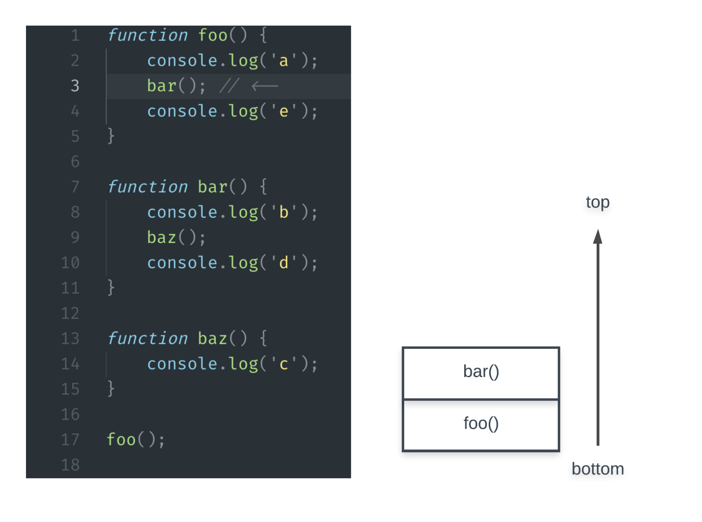
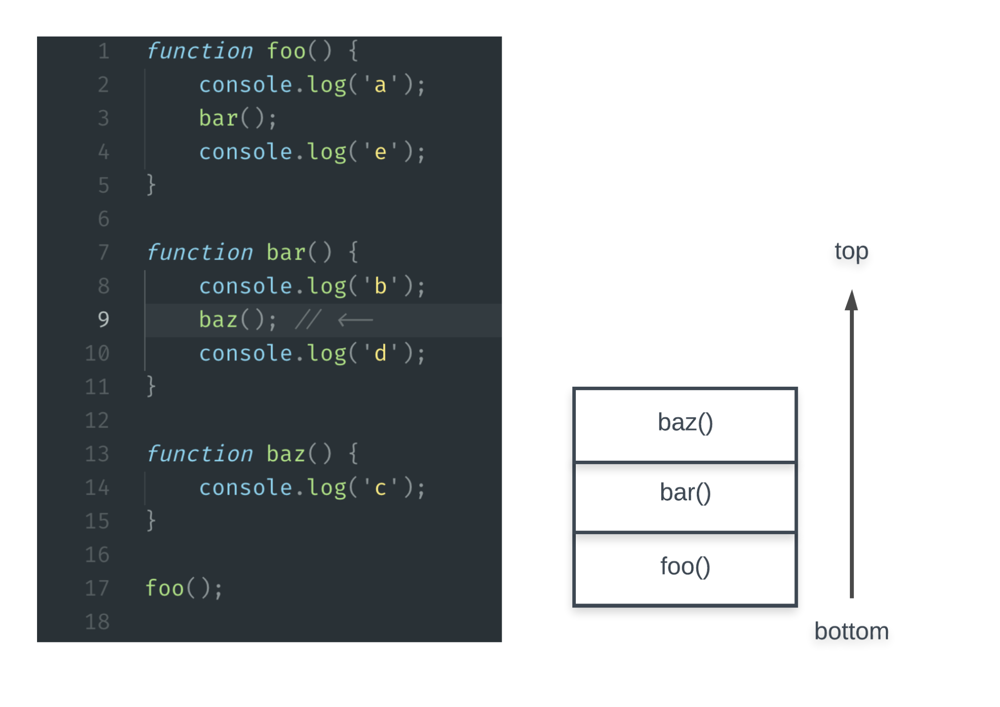
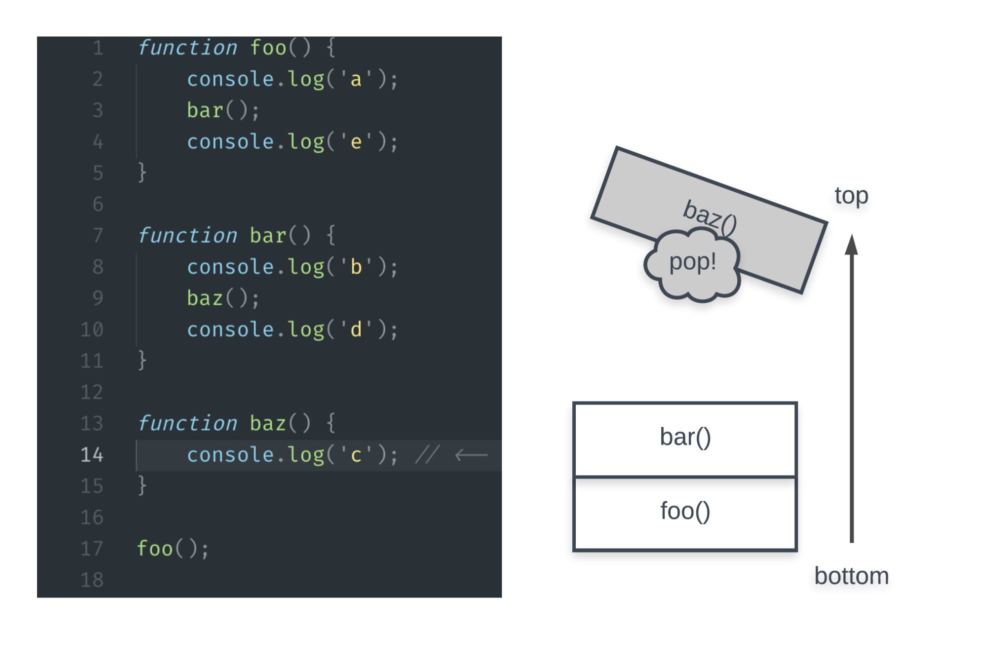
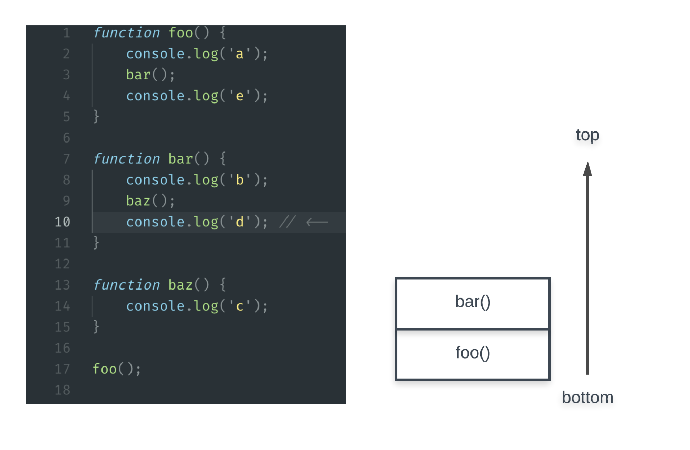
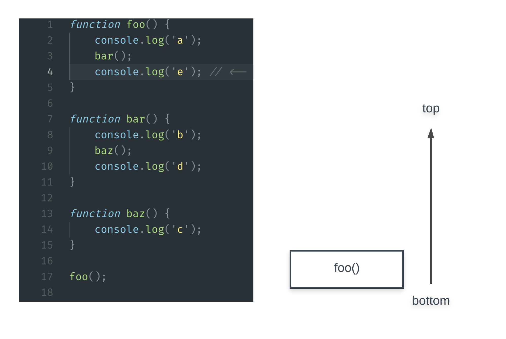
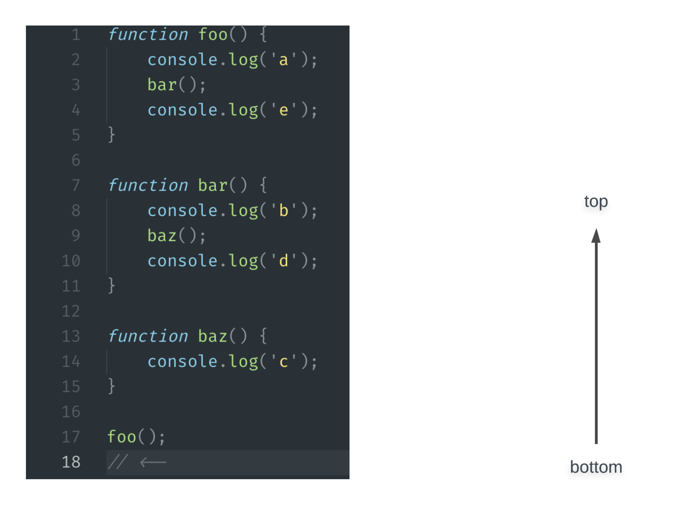
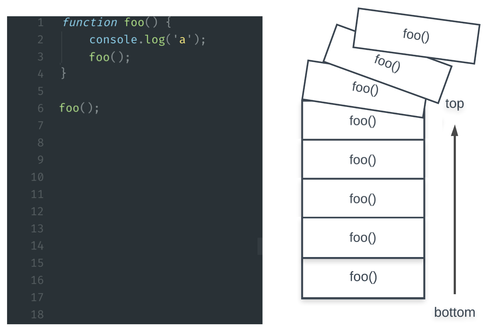

# All About Scope

The scope of a program in JavaScript is the set of variables that are available for use within the program. If a variable or other expression is not in the current scope, then it is unavailable for use. If we declare a variable, this variable will only be valid in the scope where we declared it. We can have nested scopes, but we'll see that in a little bit.

When we declare a variable in a certain scope, it will evaluate to a specific value in that scope. We have been using the concept of scope in our code all along! Now we are just giving this concept a name.

By the end of this reading you should be able to predict the evaluation of code that utilizes local scope, block scope, lexical scope, and scope chaining.

## Advantages of utilizing scope

Before we start talking about different types of scope we'll be talking about the two main advantages that scope gives us:

1. Security - Scope adds security to our code by ensuring that variables can only be accessed by pre-defined parts of our programs.
2. Reduced Variable Name Collisions - Scope reduces variable name collisions, also known as namespace collisions, by ensuring you can use the same variable name multiple times in different scopes without accidentally overwriting those variable's values.

## Different kinds of scope

There are three types of scope in JavaScript: global scope, local scope, and block scope.

### Global scope

Let's start by talking about the widest scope there is: global scope. The global scope is represented by the window object in the browser and the global object in Node.js. Adding attributes to these objects makes them available throughout the entire program. We can show this with a quick example:

```
let myName = "Apples";

console.log(myName);
// this myName references the myName variable from this scope,
// so myName will evaluate to "Apples"


```

The variable myName above is not inside a function, it is just lying out in the open in our code. The myName variable is part of global scope. The Global scope is the largest scope that exists, it is the outermost scope that exists.

While useful on occasion, global variables are best avoided. Every time a variable is declared in the global scope, the chance of a name collision increases. If we are unaware of the global variables in our code, we may accidentally overwrite variables.

### Local scope

The scope of a function is the set of variables that are available for use within that function. We call the scope within a function: local scope. The local scope of a function includes:

1. the function's arguments
2. any local variables declared inside the function
3. any variables that were already declared when the function was defined

In JavaScript when we enter a new function we enter a new scope:

```
// global scope
let myName = "global";

function function1() {
  // function1's scope
  let myName = "func1";
  console.log("function1 myName: " + myName);
}

function function2() {
  // function2's scope
  let myName = "func2";
  console.log("function2 myName: " + myName);
}

function1(); // function1 myName: func1
function2(); // function2 myName: func2
console.log("global myName: " + myName); // global myName: global


```

In the code above we are dealing with three different scopes: the global scope, function1, and function2. Since each of the myName variables were declared in separate scopes, we are allowed to reuse variable names without any issues. This is because each of the myName variables is bound to their respective functions.

### Block scope

A block in JavaScript is denoted by a pair of curly braces ({}). Examples of block statements in JavaScript are if conditionals or for and while loops.

When using the keywords let or const the variables defined within the curly braces will be block scoped. Let's look at an example:

```
// global scope
let dog = "woof";

// block scope
if (true) {
  let dog = "bowwow";
  console.log(dog); // will print "bowwow"
}

console.log(dog); // will print "woof"


```

### Scope chaining: variables and scope

A key scoping rule in JavaScript is the fact that an inner scope does have access to variables in the outer scope.

Let's look at a simple example:

```
let name = "Fiona";

// we aren't passing in or defining and variables
function hungryHippo() {
  console.log(name + " is hungry!");
}

hungryHippo(); // => "Fiona is hungry"


```

So when the hungryHippo function is declared a new local scope will be created for that function. Continuing on that line of thought what happens when we refer to name inside of hungryHippo? If the name variable is not found in the immediate scope, JavaScript will search all of the accessible outer scopes until it finds a variable name that matches the one we are referencing. Once it finds the first matching variable, it will stop searching. In JavaScript this is called scope chaining.

Now let's look at an example of scope chaining with nested scope. Just like functions in JavaScript, a scope can be nested within another scope. Take a look at the example below:

```
// global scope
let person = "Rae";

// sayHello function's local scope
function sayHello() {
  let person = "Jeff";

  // greet function's local scope
  function greet() {
    console.log("Hi, " + person + "!");
  }
  greet();
}

sayHello(); // logs 'Hi, Jeff!'


```

In the example above, the variable person is referenced by greet, even though it was never declared within greet! When this code is executed JavaScript will attempt to run the greet function - notice there is no person variable within the scope of the greet function and move on to seeing if that variable is defined in an outer scope.

Notice that the greet function prints out Hi, Jeff! instead of Hi, Rae!. This is because JavaScript will start at the inner most scope looking for a variable named person. Then JavaScript will work its way outward looking for a variable with a matching name of person. Since the person variable within sayHello is in the next level of scope above greet JavaScript then stops its scope chaining search and assigns the value of the person variable.

Functions such as greet that use (ie. capture) variables like the person variable are called closures. We'll be talking a lot more about closures very soon!

Important An inner scope can reference outer variables, but an outer scope cannot reference inner variables:

```
function potatoMaker() {
  let name = "potato";
  console.log(name);
}

potatoMaker(); // => "potato"

console.log(name); // => ReferenceError: name is not defined


```

### Lexical scope

There is one last important concept to talk about when we refer to scope - and that is lexical scope. Whenever you run a piece of JavaScript that code is first parsed before it is actually run. This is known as the lexing time. In the lexing time your parser resolves variable names to their values when functions are nested.

The main take away is that lexical scope is determined at lexing time so we can determine the values of variables without having to run any code. JavaScript is a language without dynamic scoping. This means that by looking at a piece of code we can determine the values of variables just by looking at the different scopes involved.

Let's look at a quick example:

```
function outer() {
  let x = 5;

  function inner() {
    // here we know the value of x because scope chaining will
    // go into the scope above this one looking for variable named x.
    // We do not need to run this code in order to determine the value of x!
    console.log(x);
  }
  inner();
}


```

In the inner function above we don't need to run the outer function to know what the value of x will be because of lexical scoping.

## What you learned

The scope of a program in JavaScript is the set of variables that are available for use within the program. Due to lexical scoping we can determine the value of a variable by looking at various scopes without having to run our code. Scope Chaining allows code within an inner scope to access variables declared in an outer scope.

There are three different scopes:

- global scope - the global space is JavaScript
- local scope - created when a function is defined
- block scope - created by entering a pair of curly braces

# Different Kinds of Variables

Variables are used to store information to be referenced and manipulated in a computer program. A variable's sole purpose is to label and store data in computer memory. Up to this point we've been using the let keyword as our only way of declaring a JavaScript variable. It's now time to expand your tool set to learn about the different kinds of JavaScript variables you can use!

When you finish this reading, you should be able to:

- Identify the three keywords used to declare a variable in JavaScript
- Explain the differences between const, let and var
- Identify the difference between function and block-scoped variables
- Paraphrase the concept of hoisting in regards to function and block-scoped variables

## Declaring variables

All the code you write in JavaScript is evaluated. A variable always evaluates to the value it contains no matter how you declare it.

### The different ways to declare variables

In the beginning there was var. The var keyword used to be the only way to declare a JavaScript variable. However, in ECMAScript 2015 JavaScript introduced two new ways of declaring JavaScript variables: let and const. Meaning, in JavaScript there are three different ways to declare a variable. Each of these keywords has advantages and disadvantages and we will now talk about each keyword at length.

1. let: any variables declared with the keyword let allows you to reassign that variable. Variable declared using let is scoped within a block.
2. const: any variables declared with the keyword const will not allow you to reassign that variable. Variable declared using const is scoped within a block.
3. var: A var declared variable may or may not be reassigned, and the variable is scoped to a function.

For this course and for your programming career moving forward we recommend you always use let & const. These two words allow us to be the most clear with our intentions for the variable we are creating.

## Hoisting and scoping with variables

A wonderful definition of hoisting by Mabishi Wakio, "Hoisting is a JavaScript mechanism where variables and function declarations are moved to the top of their scope before code execution."

What this means is that when you run JavaScript code the variables and function declarations will be hoisted to the top of their particular scope. This is important because const and let are block-scoped while var is function-scoped.

Let's start by talking more about const, let, and var before we dive into why the difference of scopes and hoisting is important.

### Function-scoped variables

When JavaScript was young the only available variable was var. The var keyword creates function-scoped variables. That means when you use the var keyword to declare a variable that variable will be confined to the scope of the current function.

Here is a simple example of declaring a var variable within a function:

```
function test() {
  var a = 10;

  console.log(a); // => 10
}


```

One of the drawbacks of using var is that it is a less indicative way of defining a variable.

#### Hoisting with function-scoped variables

Let's take a look at what hoisting does to a function-scoped variable:

```
function test() {
  console.log(hoistedVar); // => undefined

  var hoistedVar = 10;
}

test();


```

Huh - that's weird. You'd expect an error from referring to a variable like hoistedVar before it's defined, something like: ReferenceError: hoistedVar is not defined. However this is not the case because of hoisting in JavaScript!

So essentially hoisting will isolate and, in the computer's memory, will declare a variable as the top of its scope. With a function-scoped variable, var, the name of the variable will be hoisted to the top of the function. In the above snippet, since hoistedVar is declared using the var keyword the hoistedVar's scope is the test function. To be clear what is being hoisted is the declaration, not the assignment itself.

In JavaScript, all variables defined with the var keyword have an initial value of undefined. Here is a translation of how JavaScript would deal with hoisting in the above test function:

```
function test() {
  // JavaScript will declare the variable *in computer memory* at the top of it's scope
  var hoistedVar;

  // since hoisting declared the variable above we now get
  // the value of 'undefined'
  console.log(hoistedVar); // =>  undefined

  var hoistedVar = 10;
}


```

### Block-scoped variables

When you are declaring a variable with the keyword let or const you are declaring a variable that exists within block scope. Blocks in JavaScript are denoted by curly braces({}). The following examples create a block scope: if statements, while loops, switch statements, and for loops.

#### Using the keyword let

We can use let to declare re-assignable block-scoped variables. You are, of course, very familiar with let so let's take a look at how let works within a block scope:

```
function blockScope() {
  let test = "upper scope";
  if (true) {
    let test = "lower scope";
    console.log(test); // "lower scope"
  }
  console.log(test); // "upper scope"
}


```

In the example above we can see that the test variable was declared twice using the keyword let but since they were declared within different scopes they have different values.

JavaScript will raise a SyntaxError if you try to declare the same let variable twice in one block.

```
if (true) {
  let test = "this works!";
  let test = "nope!"; // Identifier 'test' has already been declared
}


```

Whereas if you try the same example with var:

```
var test = "this works!";
var test = "nope!";
console.log(test); // prints "nope!"


```

We can see above that var will allow you to redeclare a variable twice which can lead to some very confusing and frustrating debugging.

Feel free to peruse the documentation for the keyword let for more examples.

#### Using the keyword const

We use const to declare block-scoped variables that can not be reassigned. In JavaScript variables that cannot be reassigned are called constants. Constants should be used for values that will not be re-declared or re-assigned.

Properties of constants:

- They are block-scoped like let.
- JavaScript enforces constants by raising an error if you try to reassign them.
- Trying to redeclare a constant with a var or let by the same name will also raise an error.

Let's look at a quick example of what happens when trying to reassign a constant:

```
> const favFood = "cheeseboard pizza"; // Initializes a constant
undefined

> const favFood = "inferior food"; // Re-initialization raises an error
TypeError: Identifier 'favFood' has already been declared

> let favFood = "other inferior food"; // Re-initialization raises an error
TypeError: Identifier 'favFood' has already been declared

> favFood = "deep-dish pizza"; // Re-assignment raises an error
TypeError: Assignment to constant variable.


```

We cannot reassign a constant, but constants that are assigned to Reference types are mutable. The name binding of a constant is immutable. For example, if we set a constant equal to an Reference type like an object, we can still modify that object:

```
const animals = {};
animals.big = "beluga whale"; // This works!
animals.small = "capybara"; // This works!

animals = { big: "beluga whale" }; // Will error because of the reassignment


```

Constants cannot be reassigned but, just like with let, new constants of the same names can be declared within nested scopes.

Take a look at the following for an example:

```
const favFood = "cheeseboard pizza";
console.log(favFood);

if (true) {
  // This works! Declaration is scoped to the `if` block
  const favFood = "noodles";
  console.log(favFood); // Prints "noodles"
}

console.log(favFood); // Prints 'cheeseboard pizza'


```

Just like with let when you use const twice in the same block JavaScript will raise a SyntaxError.

```
if (true) {
  const test = "this works!";
  const test = "nope!"; // SyntaxError: Identifier 'test' has already been declared
}


```

#### Hoisting with block-scoped variables

When JavaScript ES6 introduced new ways of declaring a variable using let and const the idea of block-level hoisting was also introduced. Block scope hoisting allows developers to avoid previous debugging debacles that naturally happened from using var.

Let's take a look at what hoisting does to a block-scoped variable:

```
if (true) {
  console.log(str); // => Uncaught ReferenceError: Cannot access 'str' before initialization
  const str = "apple";
}


```

Looking at the above we can see that an explicit error is thrown if you attempt to use a block-scoped variable before it was declared. This is the typical behavior in a lot of programming languages - that a variable cannot be referred to until initialized to a value.

However, JavaScript is still performing hoisting with block-scoped declared variables. The difference lies in how it initializes them. Meaning that let and const variables are not initialized to the value of undefined.

The time before a let or const variable is declared, but not used is called the Temporal Dead Zone. A very cool name for a simple idea. Variables declared using let and const are not initialized until their definitions are evaluated. Meaning, you will get an error if you try to reference a let or const declared variable before it is evaluated.

Let's look at one more example that should illuminate the presence of the Temporal Dead Zone:

```
var str = "not apple";

if (true) {
  console.log(str); //Uncaught ReferenceError: Cannot access 'str' before initialization
  let str = "apple";
}


```

In the above example we can see that inside the if block the let declared variable, str, throws an error. Showing that the error thrown by a let variable in the temporal dead zone takes precedence over any scope chaining that would attempt to go to the outer scope to find a value for the str variable.

### Function scope vs. block scope

Let's now take a deeper look at the comparison of using function vs. block scoped variables.

Let's start with a simple example:

```
function partyMachine() {
  var string = "party";
  console.log("this is a " + string);
}


```

Looks good so far but let's take that example a step farther and see some of the less fun parts of the var keyword in terms of scope:

```
function partyMachine() {
  var string = "party";

  if (true) {
    // since var is not block-scoped and not constant
    // this assignment sticks!
    var string = "bummer";
  }

  console.log("this is a " + string);
}

partyMachine(); // => "this is a bummer"


```

We can see in the above example how the flexibility of var can ultimately be a bad thing. Since var is function-scoped and can be reassigned and re-declared without error it is very easy to overwrite variable values by accident.

This is the problem that ES6 introduced let and const to solve. Since let and const are block-scoped it's a lot easier to avoid accidentally overwriting variable values.

Let's take a look at the example function above rewritten using let and const:

```
function partyMachine() {
  const string = "party";

  if (true) {
    // this variable is restricted to the scope of this block
    const string = "bummer";
  }

  console.log("this is a " + string);
}
partyMachine(); // => "this is a party"


```

## Global variables

If you leave off a declaration when initializing a variable, it will become a global. Do not do this. We declare variables using the keywords var, let, and const to ensure that our variables are declared within a proper scope. Any variables declared without these keywords will be declared on the global scope.

JavaScript has a single global scope, which means all of the files from your projects and any libraries you use will all be sharing the same scope. Every time a variable is declared in the global scope, the chance of a name collision increases. If we are unaware of the global variables in our code, we may accidentally overwrite variables.

Let's look at a quick example showing why this is a bad idea:

```
function good() {
  let x = 5;
  let y = "yay";
}

function bad() {
  y = "Expect the unexpected (eg. globals)";
}

function why() {
  console.log(y); // "Expect the unexpected (eg. globals)""
  console.log(x); // Raises an error
}

why();


```

Limiting global variables will help you create code that is much more easily maintainable. Strive to write your functions so that they are self-contained and not reliant on outside variables. This will also be a huge help in allowing us test each function by itself.

One of our jobs as programmers is to write code that can be integrated easily within a team. In order to do that, we need to limit the number of globally declared variables in our code as much as possible, to avoid accidental name collisions.

Sloppy programmers use global variables, and you are not working so hard in order to be a sloppy programmer!

### What you learned

- Identify the different ways to declare a variable in JavaScript
- Explain the differences between const, let and var
- Identify the difference between function and block-scoped variables
- Paraphrase the concept of hoisting in regards to variables

# Stacking the Odds in our Favor: the Call Stack

We've written a lot of programs so far in this course and sometimes they are quite complex. They may be complex in their execution since function calls and returns cause control flow to jump around to different lines, instead of just sequentially by increasing line number. Ever wonder how the JavaScript runtime is able to track all of those function calls? You're in luck! It's time to explore an important component of the JavaScript runtime: the call stack.

When you finish reading this article, you should be able to:

- identify the two operations that characterize a stack data structure
- sketch how the call stack is manipulated during the runtime of a simple program like the one provided in this reading

## The call stack

The call stack is a structure that JavaScript uses to keep track of the evaluation of function calls. It uses the stack data structure. In Computer Science, a "stack" is a general pattern of organizing a collection of items. For our current use of a stack, the items being organized are the function calls that occur during the execution of our program. We'll be exploring stacks in great detail further in the course. For now, we can imagine a stack as a vertical pile that obeys the following pattern:

- new items must be placed on top of the pile - we refer to this as pushing a new item to the stack
- at any point, the only item that can be removed is the top of the pile - we refer to this as popping the top item from the stack

In JavaScript's call stack, we use the term "stack frames" to describe the items that are being pushed and popped. With this new understanding, we can now identify two ways that JavaScript leverages these stack mechanics during runtime:

- when a function is called, a new frame is pushed onto the stack.
- when a function returns, the frame on the top of the stack is popped off the stack.

To illustrate how frames are pushed to and popped from the call stack, we'll explore the following program:

```
function foo() {
  console.log("a");
  bar();
  console.log("e");
}

function bar() {
  console.log("b");
  baz();
  console.log("d");
}

function baz() {
  console.log("c");
}

foo();


```

Create a file for yourself and execute this code. It will print out the letters in order. This code is a great example of how a program's execution may not simply be top down. Instead of executing sequentially, line by line, we know that function calls and returns will cause execution to hop back and forth to different line numbers. Let's trace through this program, visualizing the stack. We'll use a commented arrow to denote where we pause execution to visualize the stack at that moment.

We begin by executing a function call, foo(). This will add a frame to the stack:


Now that foo() is the topmost (and only) frame on the stack, we must execute the code inside of that function definition. This means that we print 'a' and call bar(). This causes a new frame to be pushed to the stack:



Note that the stack frame for foo() is still on the stack, but not on top anymore. The only time a frame may entirely leave that stack is when it is popped due to a function return. Bear in mind that a function can return due to an explicit return with a literal line like return someValue; or it can implicitly return after the last line of the function's definition is executed. Since bar() is now on top of the stack, execution jumps into the definition of bar. You may notice the trick now: the frame that is at the top of the stack represents the function being executed currently. Back to the execution, we print 'b' and call baz():



Again, notice that bar() remains on the stack because that function has not yet returned. Executing baz, we print out 'c' and return because there is no other code in the definition of baz. This return means that baz() is popped from the stack:



Now bar() is back on top of the stack; this makes sense because we must continue to execute the remaining code within bar on line 10:



'd' is printed out and bar returns because there is no further code within its definition. The top of the stack is popped. foo() is now on top, which means execution resumes inside of foo, line 4:



Finally, 'e' is printed and foo returns. This means the top frame is popped, leaving the stack empty. Once the stack is empty, our program can exit:



That completes our stack trace! Here are three key points to take away from these illustrations:

1. the frame on the top of the stack corresponds to the function currently being executed
2. calling a function will push a new frame to the top of the stack
3. returning from a function will pop the top frame from the stack

This was a high level overview of the call stack. There is some detail that we've omitted to bring attention to the most important mechanics. In particular, we've glazed over what information is actually stored inside of a single stack frame. For example, a stack frame will contain data about a specific function call such as local variables, arguments, and which line to return to after the frame is popped!

## The practical consequences of the call stack

Now that we have an understanding of the call stack, let's discuss its practical implications. We've previously identified JavaScript as a single-threaded language and now you know why that's the case. The use of a single call stack leads to a single thread of execution! The JavaScript runtime can only perform one "command" at a time and the one "command" currently being executed is whatever is at the top of the stack.

In the example program we just traced through, we mentioned that the program will exit once the call stack is empty. This is not true of all programs. If a program is asynchronously listening for an event to occur, such as waiting for a setTimeout to expire, then the program will not exit. In this scenario, once the setTimeout timer expires, a stack frame corresponding to the setTimeout callback will be added to the stack. From here, the call stack would be processed in the way we previously explored. Imagine that we had the same functions as before, but we called foo asynchronously:

```
function foo() {
  console.log("a");
  bar();
  console.log("e");
}

function bar() {
  console.log("b");
  baz();
  console.log("d");
}

function baz() {
  console.log("c");
}

setTimeout(foo, 2500);


```

The critical behavior to be aware of in the JavaScript runtime is this: an event can only be handled once the call stack is empty. Recall that events can be things other than timeouts, such as the user clicking a button or hitting a key. Because we don't want to delay the handling of such important events, we want minimize the amount of time that the call stack is non-empty. Take this extreme scenario:

```
function somethingTerrible() {
  let i = 0;
  while (true) {
    i++;
  }
}

setTimeout(function() {
  console.log("time to do something really important!");
}, 1000);

somethingTerrible();


```

somethingTerrible() will be pushed to the call stack and loop infinitely, causing the function to never return. We expect the setTimeout timer to expire while somethingTerrible() is still on the stack. Since somethingTerrible() never returns, it will never be popped from the stack, so our setTimeout callback will never have its own turn to be executed on the stack.

## What you've learned

In this reading, we have:

- explored how the call stack is manipulated over the runtime of a program
- identified that events can only be handled once the call stack is empty

# Re-learning Functions With Recursion

Imagine it's your first day at a new job and your boss has asked you to unpack some fruit crates. Not too bad, right? Now imagine each crate has smaller crates inside. Still easy? Consider even smaller crates, nested within one another, each needing to be unpacked. How long before you throw your hands up in frustration and walk away?

Sometimes simple tasks get complicated and we need new tools to help us solve them. Working with digital data is a little like working with those crates: they may be simple to unpack, or they may be incredibly dense! Let's explore a new way of approaching problems: recursion.

We'll cover:

- what recursion is and how to identify it,
- implementing recursive functions,
- and breaking complex problems down into simpler tasks.

## Re-what now?

So far, we've solved complex problems with iteration: the process of counting through each item in a collection. Like most things in programming, though, there's another way! Let's check out recursion: the process of calling a function within itself.

To wrap your mind around this new concept, think back to that example of crates within crates. If we have to gently unpack each crate but we don't know the contents, we'll have to go one-by-one through each crate, pulling items out individually. Let's think about a better way! What if we open each crate and look inside. If it's more crates, we dump them out. If it's fruit, we gently remove the fruit and set it aside.

What might this process look like in code? Here's some pseudocode to help us think through it:

```
function gentlyUnpackFruit(contents) {
  console.log("Your " + contents + " have been unpacked!");
}

function dump(crate) {
    if (crate.content_type === "crate") {
        dump(crate.contents);
    } else if (crate.content_type === "fruit") {
        gentlyUnpackFruit(crate.contents);
    }
}


```

Notice how we call the dump function from within the dump function. That's recursion in action! The dump function may recurse if we have crates nested within each other.

### A note on language

You'll notice we've used the term recurse here, which you may not have heard before. Technically, the root word in "recursion" is "recur", but this is ambiguous. Consider these two examples:

```
console.log("Hello"); console.log("Hello");

// versus...

console.log(console.log("Hello"));


```

Both of these functions recur (as in, call the console.log function more than once), but only one of these functions is recursive (as in, calling console.log from within another console.log). To reduce confusion, researchers began using the term "recurse" to refer specifically to functions that are being called from within themselves. Creating a new word by removing a suffix in this way is known as back-formation.

We'll prefer "recurse" when discussing this topic, but you may see "recur" in other places! Carefully read the context and make sure you understand how these words might differ. Interviewers may use the terms interchangeably to trip you up, but we know you'll be ready for the challenge!

## Two cases

Understanding recursion means understanding the two cases, or expected output for a particular input, in a recursive function. These are known as the base case and recursive case.

- The base case describes the situation where data passed into our function is processed without any additional recursion. When the base case is executed, the function runs once and ends. Since this results in the function stopping, we may also refer to this as the terminating case.
- The recursive case, as the name suggests, is the situation where the function recurses. This represents the data state that causes a function to call itself. Without a recursive case, a function's just another function!

In our fruit crate example, the base case is "when the crate contains fruit" and the recursive case is "when the crate contains other crates". When we encounter fruit, we remove the fruit and the action is complete. However, when we encounter more crates, we go back to the start and repeat the whole process again.

Identifying these cases for a process won't always be that simple, but it's critical to figure out each one before writing any code. Without a recursive case, we don't need recursion at all and we should consider an alternative approach. Without a base case, we might be creating an infinite loop - yikes! We need to know when to stop the process before we start it.

## A recursive example

Let's look at a more practical problem you might encounter in the wild. We're going to use the "Movie Theater Problem" to demonstrate how recursion can help us with a real world issue.

Imagine you're meeting a friend in a movie theater. The lights have gone down, it's totally dark, and your friend just sent you a message asking which row you're seated in. Without being able to see the rows or your ticket, how might you figure out the row number?

Let's assume a few things:

- The theater is mostly occupied, so you can rely on people being in front of & behind you.
- You don't want to knock over anyone's drinks & snacks, so you must remain in your seat.
- Your phone is almost dead, so you can't use the flashlight or screen to illuminate the seats - no cheating!

What if we tap the person in front of us on the shoulder? If there's someone in front of us, we know that we're at least one row back from the front of the theater. If someone is in front of them, we're at least two rows back! This pattern continues until we reach the screen.

If each person performs this action and they all report back, we can count how many rows back we are! We've missed a key part in this analysis, though - when do we stop tapping each other? If someone reaches forward and there's no one else in front of them, we can assume we've reached the front of the theater. That person becomes "Row #1", and our test stops.

In this example, our base case is "No one in front of me = Row #1" and our recursive case is "Someone in front of me = Row #(1 + person in front of me's row #)". Now that we know both cases, we can build a recursive function out of them! Here's what this might look like in JavaScript:

```
determineRow = function(moviegoer) {
  if (moviegoer.personInFront) {
      return 1 + determineRow(moviegoer.personInFront);
  } else {
      return 1;
  }
}


```

Now it doesn't matter if our movie theater has 5 rows or 5,000 rows - we have a tool to figure out where we are at any time. We've also gone through an important exercise in understanding our space to get here! By working to our sides instead of in front of us, we could use the same process to figure out exactly which seat we're in on the row.

## What we've learned

Whew! If your head is spinning, don't worry - it's totally natural. Recursion can get a lot more complex than what we've covered here, but it comes down to working smarter, not harder. We'll dig a little deeper into advanced recursion and how to know when to build a recursive function in our next lesson.

Check out Computerphile's What on Earth is Recursion? to learn more about recursion and the stack.

After completing the reading and video, you should be able to:

- define recursion,
- explain its use,
- and identify a simple base & recursive case in a problem.

# When To Hold & When To Fold(Fold(Fold())): Recursion vs. Iteration

You know what recursion is, but to truly understand what's happening, you need to go deeper! Let's investigate the process of recursion and build a better understanding of the risks involved.

When you finish this article, you should:

- describe how recursive function calls are added and removed from the call stack
- differentiate between recursive and iterative functions
- start to learn how to select a recursive or iterative approach for a given problem appropriately
- debug a broken recursive algorithm by identifying and adding a base case

## A deeper dive into recursion

Learning about recursion requires that you review the call stack. Remember that each function call in JavaScript pushes a new stack frame onto the top of the call stack, and the last pushed frame gets popped off as it gets executed. This is sometimes referred to as a Last In, First Out, or LIFO, stack.

Here's an example to jog your memory:


Recursive functions risk placing extra load on the call stack. Each recursive function call depends on the call before it, meaning you can't start executing a recursive function's stack frames until you reach the base case. So what happens if you never do? Look out!

### London Stack is falling down!

The JavaScript call stack has a size limit which varies between different browsers and even different systems! Whenever a recursive call is done, it creates another call in the call stack. The call stack doesn't have unlimited amount of space. The limit to the amount of calls in the call stack depends on how much memory is allocated to the JavaScript program on your sytem. Once the stack reaches this limit, you get what's called a stack overflow. The program halts, the stack gets wiped out entirely, and you're left with no results wondering what you did wrong.



Let's look at an example of an obvious stack overflow issue:

```
function pythagoreanCup() {
    pythagoreanCup();
};

pythagoreanCup();


```

Output:

```
Uncaught RangeError: Maximum call stack size exceeded
    at pythagoreanCup (<anonymous>)
    at pythagoreanCup (<anonymous>)
    at pythagoreanCup (<anonymous>)
    at pythagoreanCup (<anonymous>)
    at pythagoreanCup (<anonymous>)
    ...


```

The function pythagoreanCup is clearly recursive, since it calls itself, but you're missing a base case to work towards! This means the function will recurse until the call stack overflows, resulting in a RangeError. Whoops! Notice that in the stack trace (the output below the error name & message), you can see that pythagoreanCup is the only function currently in the call stack.

Fixing the overflow issue in this case is straightforward: determine a base case and implement it in your function. Here's a fixed version of the example above with some extra comments:

```
let justEnoughWine = false;

function pythagoreanCup() {
    // Base case:
    // - Is `justEnoughWine` true? Return & exit.
    if (justEnoughWine === true) {
        console.log("That's plenty, thanks!");
        return true;
    }

    // Recursive case:
    // - justEnoughWine must not have been true,
    //   so let's set it and check again.
    justEnoughWine = true;
    pythagoreanCup();
};

pythagoreanCup();


```

Output:

```
"That's plenty, thanks!"


```

The stack size limit varies due to different implementations: some JavaScript environments might have a fixed limit, while others will rely on available memory on your computer. Regardless of your environment, if you're receiving RangeErrors, you should refactor your function! It's bad practice to build software that only runs in one particular browser or using a specific runtime.

### Step by step

Notice that the change to pythagoreanCup did two things:

- Provided a base case that lets us end the recursion,
- and added an action that moves us towards the base case.

Without changing the value of justEnoughWine, you would never enter the base case and the stack would still be at risk of growing out of control.

The action that gets us closer to the base case is the recursive step. Don't forget to build this step into your function! Your base case doesn't mean anything if you're not moving towards it with each recurrence.

### Types of recursion

The recursion examples so far have involved a single function calling itself. This situation as direct recursion: functions directly calling themselves. There's a trickier type of recursion to debug, though. Take a look at the following example:

```
function didYouDoTheThing() {
    ofCourseIDidTheThing();
}

function ofCourseIDidTheThing() {
    didYouDoTheThing();
}

didYouDoTheThing();


```

Uh oh! Neither of these functions appears to be recursive by itself, but calling either of them will put us into a recursive loop with no base case in sight. Recursive loops across multiple functions are known as indirect recursion. There's nothing wrong with using this technique, but be careful! Because the call stack will have multiple function names in it, debugging problems with indirectly recursive functions can be a headache.

## When to iterate, when to recur

Alright, slow down, programmers. Before you rewrite all your recent projects to use recursive functions, let's investigate why you might choose iteration instead.

Remember that iteration is when you call a function for each member of a collection, instead of letting the function call itself. So far, the code you've written using for loops and iterator functions like .forEach has been iterative. Iterative code tends to be less resource-intensive than recursive code, and it requires less planning to get working. It's also usually easier to read & understand - an important thing to consider when writing software!

Recursive solutions are sometimes better when the problem can clearly be subdivided into smaller problems with the same shape. Recursion allows you to handle these problems by solving the smallest or simplest case, then building towards a full solution. If it's a problem that you feel like you can do easily on paper for 1-5 things but can't even begin to think about doing it for 1000, then consider recursion. If it's a problem that is no harder to do for 1000 things, just longer, then consider iteration. This usually leads to more readable code than a recursive solution - for some kinds of problems.

There are no hard and fast rules as to when recursive solutions are appropriate compared to an iterative solution. Your comfort with each type of programming will inform which paradigm you prefer.

List comprehension functions, like reduce, map and filter are implemented very cleanly with recursion, and indeed were introduced by functional languages before being adopted by a whole host of predominantly iterative languages including JavaScript.

Through problems, such as the naive recursive solution to Fibonacci, you will learn there are definitely times when a problem can be expressed cleanly as a recursive algorithm, but will have very poor performance. You clearly need to consider more than just total lines of code and clarity of expression when deciding whether or not to use a recursive solution.

There are certain classes of problems: i.e. problems that traverse nested arrays, objects, graphs or trees (that is, data with recursive structure) which lend themselves especially well to recursive solutions.

As you continue to gain experience with algorithms in this course, you will learn about the complex topic of runtime complexity - the analysis of the performance of your code. At that time, you will have an understanding of the principals of code performance, which will enable us to discuss the merits of various algorithms, both iterative and recursive, in a more concrete fashion.

## Compare these approaches

Before moving on, let's compare an iterative & recursive approach with each other. Let's create a countdown function that takes a number and counts down from that number to zero.

Here's an iterative approach:

```
countdown(startingNumber) {
    for(let i = startingNumber; i > 0; i--) {
        console.log(i);
    }

    console.log("Time's up!");
}


```

For comparison, a recursive approach:

```
 countdown(startingNumber) {

      if (startingNumber === 0) {
          console.log("Time's up!");
          return;
      }

      console.log(startingNumber);
      countdown(startingNumber - 1);
  }


```

Can you identify the base case, recursive case, and recursive step?

## What you've learned

You're now equipped to solve problems of varying complexity with two different approaches! Don't forget to be considerate of which approach might be best for new challenges you encounter. In this article you learned what a "stack overflow" is and how to debug functions causing one. You also learned how to differentiate between iterative and recursive functions. And finally, you learned how to start identifying good candidates for each type of approach.

# Recursion Tips

Recursion is a tricky topic! Here are a few tips to help you wrap your heads around this advanced technique.

## Move towards the base case

There are three steps that define a recursive function.

1. The function calls itself (recursive step)
2. The function has an end state (base case)
3. The function moves closer to the base case with each call

Most people understand that a recursive function calls itself and remember that it needs a base case. The key here is that each recursive call MUST move the function's current state one step closer to the end state.

Remember, a recursive function that doesn't move toward the base case isn't recursion: it's an infinite loop that leads to stack overflow. None of these are recursion!

Let's write a recursive function to print the contents of an array. First step is to understand the problem: the problem is simple but since you have to use recursion, you need to identify the three steps.

Next, you come up with a plan. Each call, you should print one value and end when you have reached the end of the array (base case). You can use a default parameter to track the index and increment it by one each call, moving you one step closer to the base case.

Now, execute the plan:

```
function printArray(arr, i = 0) {

    // Base Case: index has reached the end of the array
    if (i >= arr.length) return;

    // Print the value
    console.log(arr[i]);

    // Call the function recursively,
    // moving the index one step closer to the base case.
    printArray(arr, i+1);
}


```

Finally, test and review the implementation.

```
printArray([1,2,3,4,5])
1
2
3
4
5


```

## Think of the function iteratively

Any function that can be solved recursively can also be solved iteratively. The printArray() function can be solved iteratively:

```
function printArrayIterative(arr) {

    for (let i = 0 ; i < arr.length ; i++) {
        console.log(arr[i]);
    }

}


```

Notice the similarities. You take a starting state and repeat the console.log call, moving closer to the end state each time. If you didn't have an end state (i < arr.length) or move toward the end state each iteration (i++) our loop would run forever. It's the same with recursion just with a slightly different arrangement.

## Start from the base case

Say you had to write a multiply(num1, num2) function that returns the product of num1 and num2 without using *, for or while. How would you go about this?

First step is to understand the problem. Multiplying two numbers is the same as adding num1 to itself num2 times. You can use addition for this.

Next, come up with a plan. You can't use any loops but recursion might work! How would you do this though?

Start from the base case: multiplying anything by zero equals zero, so if num2 equals zero, you return zero. Next, if num2 equals 1, you return num1. If num2 equals 2, return num1 + num1.

```
function multiply(num1, num2) {
    // base case
    if (num2 == 0) return 0;
    if (num2 == 1) return num1;
    if (num2 == 2) return num1 + num1;
    if (num2 == 3) return num1 + num1 + num1;
}


```

From here, you might start to notice a pattern! Everytime num2 increases by 1, it adds another num1 to the total. So, you can think of this as num1 plus the previous calculation. Now you've got the recursive step!

```
function multiply(num1, num2) {
    // base case
    if (num2 == 0) return 0;
    if (num2 == 1) return num1;

    return num1 + multiply(num1, num2 - 1);
}
multiply(5, 3)  // 15


```

Not bad! Now that you have a working solution, you can review and refactor the code. You may notice that if (num2 == 1) return num1; is the same as if (num2 == 1) return 0 + num1; which follows the recursive pattern. You can get rid of that line completely.

```
function multiply(num1, num2) {
    // base case
    if (num2 == 0) return 0;

    return num1 + multiply(num1, num2 - 1);
}
multiply(5, 3)  // 15


```

You might also realize that the function will break if num2 is negative. You can fix that by adjusting the recursive step. Since you want to get closer to zero each time, if num2 is negative you want it to increase instead.

```
function multiply(num1, num2) {
    // base case
    if (num2 == 0) return 0;

    if (num2 > 0) {
        return num1 + multiply(num1, num2 - 1);
    } else {
        return -num1 + multiply(num1, num2 + 1);
    }
}
multiply(5, -3)  // -15


```

Nice!

## Assume your recursive function works

This is probably the most confusing part of recursion. You need to call your function in order for it to work but it's not complete yet so how can it possibly work? Isn't that circular logic?

This part requires a bit of faith on your part. Write your code assuming that the function will do what it says. Don't worry about how it accomplishes the task, just assume that it will work. If it doesn't, you can always debug!

The idea is that eventually the problem will be small enough to return a hard-coded result (base case) so as long as you are moving toward the base case it will build on the simple solution to return the final result.

Think of it this way: you can replace the recursive multiply function with an alternate helper function and it should still work.

```
function alternateMultiply(num1, num2) {
    return num1 / (1 / num2);
}
alternateMultiply(5, 3); // 15

function multiply(num1, num2) {
    // base case
    if (num2 == 0) return 0;

    if (num2 > 0) {
        return num1 + alternateMultiply(num1, num2 - 1);
    } else {
        return -num1 + alternateMultiply(num1, num2 + 1);
    }
}

multiply(4, 6)  // 24
multiply(4, -6)  // -24


```

This is no longer recursion but it works just fine! The idea is that you should treat a recursive call just like any other helper function: you call the function with given inputs and get back an expected output. Don't worry how it got there. As long as you are moving toward the base case, it will all work out!

## What have you learned

After reading this, you will have learned some useful tips for mastering recursion!

- Move toward the base case
- Think of the function iteratively
- Start from the base case
- Assume your recursive function works

# Default Parameters

So far, you've learned how to declare parameters to pass arguments into a function. Sometimes, you'll write a function that might require slightly different inputs depending on the use-case. Rather than write separate functions which would violate the DRY coding principle (Don't Repeat Yourself) you can use default parameters.

## What is a default parameter?

A default parameter is declared in the function signature like a regular parameter, except it is given a default value using an =.

```
function growNumber(num, amount = 1) {
    return num + amount;
}


```

In this example, growNumber has a regular parameter, num, and a default parameter, amount. You can pass in a single number argument and it will increment it by the default amount:

```
growNumber(5);
// 6


```

You can also pass in the optional second argument, which would overwrite the default value for amount.

```
growNumber(5, 3);
// 8


```

## What are some uses for default parameters?

Default parameters can be used to add flags to functions. Consider this function which calculates the sum of a list of numbers. You can add a "verbose" flag which defaults to false but can be turned on to print out the intermediate sums.

```
function sum(nums, verbose = false) {
    let total = 0;
    for (let i = 0 ; i < nums.length ; i++) {
        if (verbose) {
            console.log(total + " + " + nums[i] + " = " + (total + nums[i]));
        }
        total += nums[i];
    }
    return total;
}

nums = [1, 2, 3, 4];

sum(nums);
// 10

sum(nums, true);
0 + 1 = 1
1 + 2 = 3
3 + 3 = 6
6 + 4 = 10
// 10


```

This function loops through an array of numbers and prints out the intermediate sum with console.log if the verbose flag is set to true.

Default params can also be used to receive data from intermediate calculations. This is particularly useful for passing data between recursive function calls. Consider this function which calculates all factorial values from 0 to n.

```
function allFactorials(n, factorials = [1]) {

    if (n > factorials.length) {
        factorials = allFactorials(n - 1, factorials)
    }

    factorials.push(n * factorials[n - 1])

    return factorials;
}

allFactorials(5);
// [ 1, 1, 2, 6, 24, 120 ]


```

This function uses recursion with a default parameter to store previously calculated results in an array. This takes advantage of the fact that factorial(n) is equal to n * factorial(n - 1).

# What have you learned?

Through this reading, you have learned:

- What a default parameter is
- How to use default parameters for optional flags
- How to use default parameters to pass data between functions

# Stop Feeling Iffy about IIFEs!

It's time to learn about some built in JavaScript functionality that will allow you to define an anonymous function and then immediately run that function as soon as it has been defined. In JavaScript we call this an Immediately-Invoked Function Expression or IIFE (pronounced as “iffy”).

When you finish this reading you should be able to identify an Immediately-Invoked Function Expression, as well as write your own.

## Quick review of function expressions

Before we get started talking about IIFEs lets quickly do a review of the syntax anonymous function expressions.

A function expression is when you define a function and assign that function to a variable:

```
// here we are assigning a named function declaration to a variable
const sayHi = function sayHello() {
  console.log("Hello, World!");
};

sayHi(); // prints "Hello, World!"


```

We can also use function expression syntax to assign variables to anonymous functions effectively giving them names:

```
// here we are assigning an anonymous function declaration to a variable
const sayHi = function() {
  console.log("Hello, World!");
};

sayHi(); // prints "Hello, World!"


```

Now what if we only ever wanted to invoke the above anonymous function once? We didn't want to assign it a name? To do that we can define an Immediately-Invoked Function Expression.

## IIFE syntax

An Immediately-Invoked Function Expression is a function that is called immediately after it had been defined. The typical syntax we use to write an IIFE is to start by writing an anonymous function and then wrapping that function with the grouping operator, ( ). After the anonymous function is wrapped in parentheses you simply add another pair of closed parentheses to invoke your function.

Here is the syntax as described:

```
// 1. wrap the anonymous function in the grouping operator
// 2. invoke the function!
(function() {
  statements;
})();


```

Let's take a look at an example. The below function will be invoked right after it has been defined:

```
(function() {
  console.log("run me immediately!");
})(); // => 'run me immediately!'


```

Our above function will be defined, invoked, and then will never be invoked again. What we are doing with the above syntax is forcing JavaScript to run our function as a function expression and then to invoke that function expression immediately.

Since an Immediately-Invoked Function Expression is immediately invoked attempting to assign an IIFE to a variable will return the value of the invoked function.

Here is an example:

```
let result = (function() {
  return "party!";
})();

console.log(result); // prints "party!"


```

So we can use IIFEs to run an anonymous function immediately and we can still hold onto the result of that function by assigning the IIFE to a variable.

## IIFEs keep functions and variables private

Using IIFEs ensures our global namespace remains unpolluted by a ton of function or variable names we don't intend to reuse. IIFEs can additionally protect global variables to ensure they can't ever be read or overwritten by our program. In short using an IIFE is a way of protecting not only the variables within a function, but the function itself. Let's explore how IIFEs do this.

When learning about scope we talked about how an outer scope does not have access to an inner scope's variables:

```
function nameGen() {
  const bName = "Barry";
  console.log(bName);
}

// we can not reference the bName variable from this outer scope
console.log(bName);
console.log(nameGen()); // prints "Barry"


```

Now what if we didn't want our outer scope to be able to access our function at all? Say we wanted our nameGen function to only be invoked once and not ever be invoked again or even to be accessible by our application again? This is where IIFEs come in to the rescue.

One of the main advantages gained by using an IIFE is the very fact that the function cannot be invoked after the initial invocation. Meaning that no other part of our program can ever access this function again.

Since we don't ever intend to invoke this function again - there is no point in assigning a name to our function. Let's take a look at rewriting our nameGen function using a sneaky IIFE:

```
(function() {
  const bName = "Barry";
  console.log(bName);
})(); // prints "Barry"

// we still cannot reference the bName variable from this outer scope
// and now we have no hope of ever running the above function above again
console.log(bName);


```

## What you learned

How to identify an IIFE, as well as how to write one.
