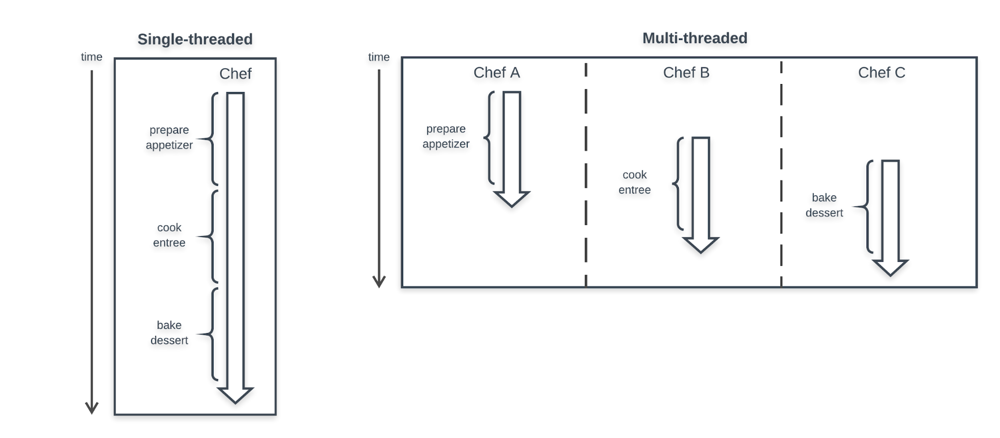
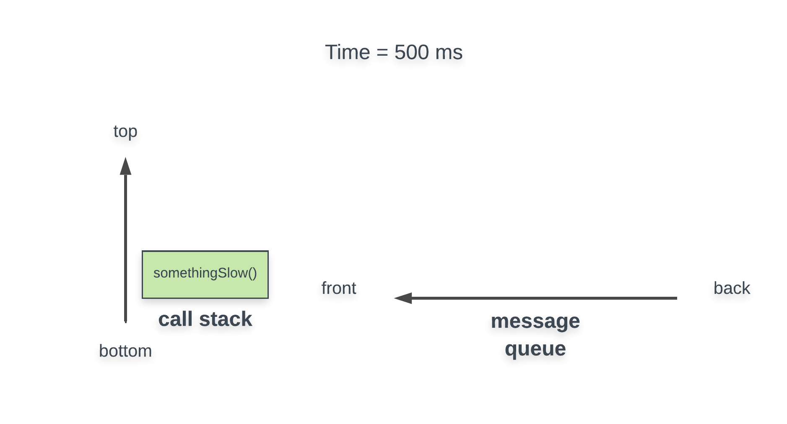
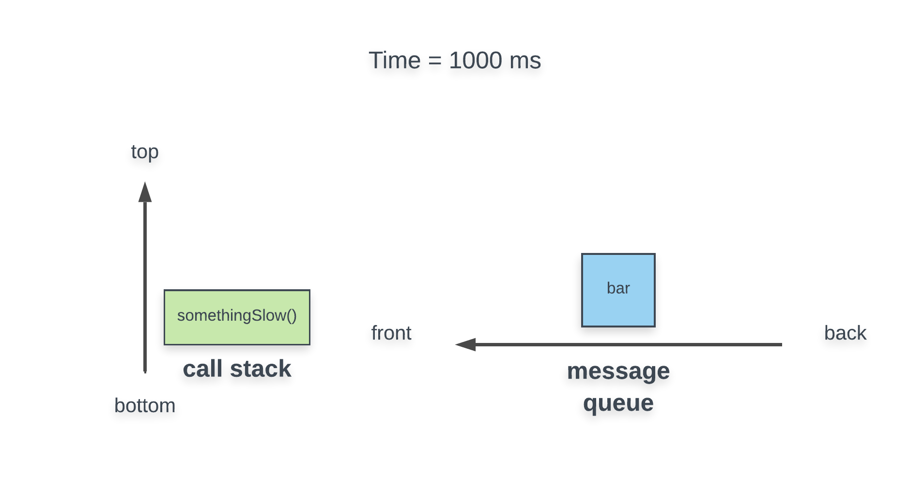
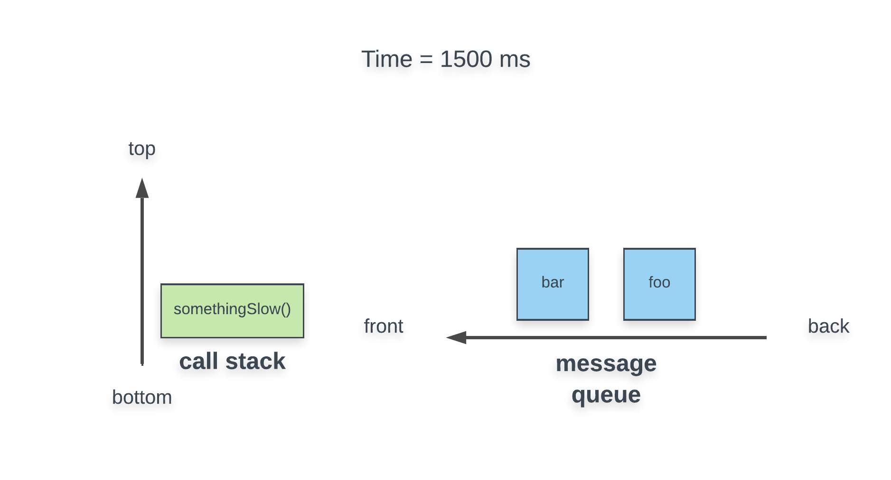
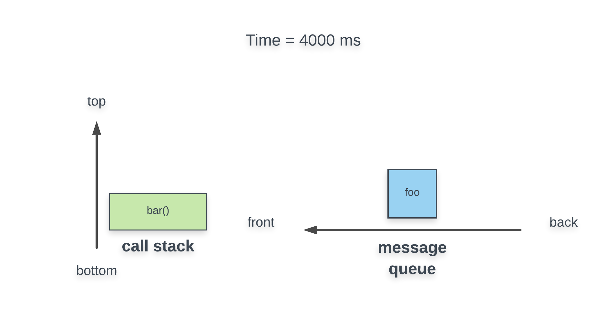
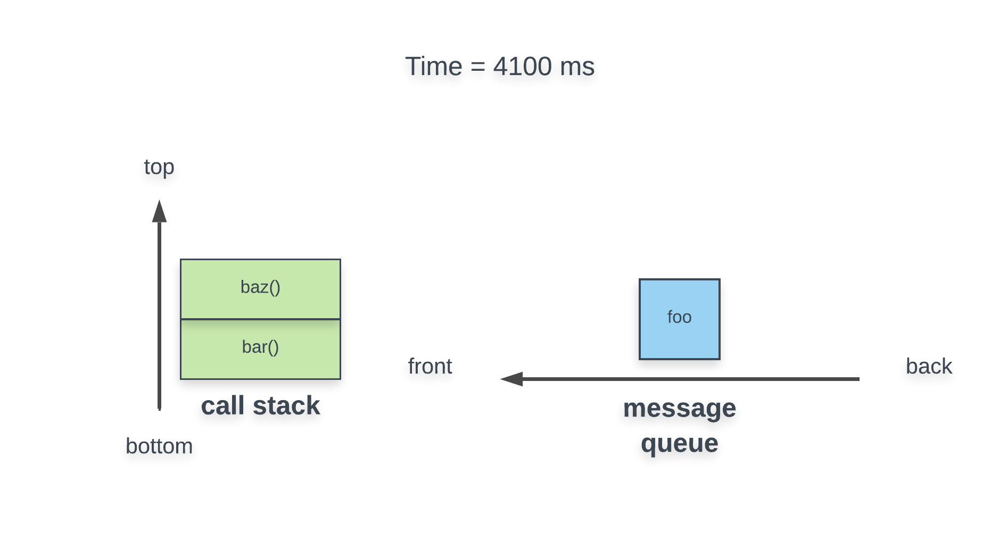
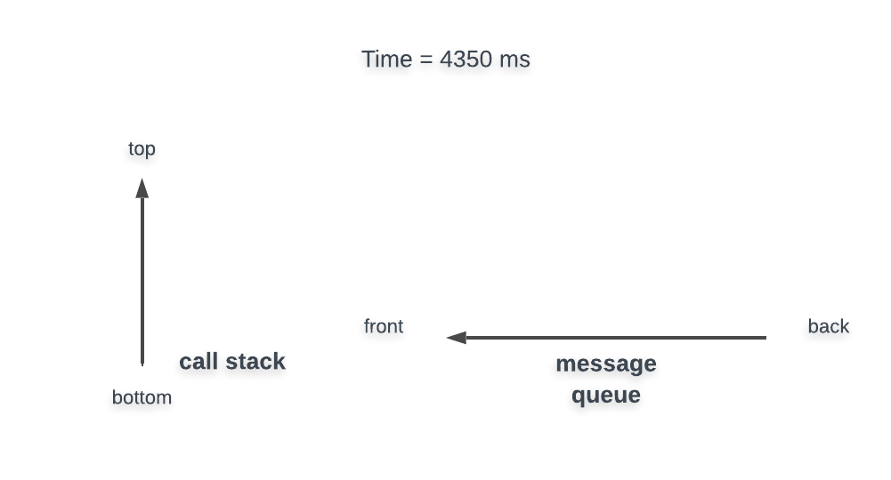

# Hanging by a Single Thread: A Yarn on JavaScript's Execution

The primary job of the programmer is to write code and to that end you have written hundreds, possibly thousands of lines so far. However, it is important for a programmer to understand the bigger picture. After we finish writing the code, what should we do with it? Publish it in a book? Print it to frame on wall? None of these. After we write the code, we run it! If writing code is the birth of a program, then its execution is the lifetime that takes place after. A lifetime full of highs and lows; some expected events and some unexpected. Instead of "lifetime", programmers use the word "runtime" to refer to the execution of a program.

Let's take a peek under the hood of the JavaScript runtime environment to get a glimpse at how the code we write is processed.

When you finish reading this article, you should be able to:

- explain the difference between single-threaded and multi-threaded execution
- identify JavaScript as a single-threaded language

## Single-threaded vs multi-threaded execution

In programming, we use the term thread of execution (thread for short) to describe a sequence of commands. A thread consists of well-ordered commands in the same way that a task may consist of multiple steps. For example, the task (thread) of doing laundry may consist of the following steps (commands):

1. open the washing machine door
2. load the washing machine with clothes
3. add some detergent
4. close the washing machine door
5. turn the washing machine on

For the most part, the relative order of these steps is critical to the task. For example, we can only load the clothes after opening the door and should only turn the machine on after closing the door.

Now that we have an understanding of what a thread is, let's use a similar analogy to explore two different models of threading. Enter Appetite Academy, the restaurant where patrons only have to pay the bill once they are full.

We'll be exploring these two models:



### Single-threaded

In single-threaded execution, only one command can be processed at a time.

Say that a patron at Appetite Academy ordered a three course meal including a salad (appetizer), a burger (main entree), and a pie (dessert). Each dish has its own steps to be made. If the restaurant had a single-threaded kitchen, we might see one chef in the kitchen preparing each dish one after the other. To ensure that the customer receives the dishes in order, the lone chef would likely plate a dish fully before beginning preparation of the next dish. A shortcoming of this single chef kitchen is that the customer may have to wait some time between dishes. On the flip side, only employing one chef is cheap for the restaurant. Having one chef also keeps the kitchen relatively simple; multiple chefs may complicate things. With one chef the restaurant avoids any confusion that can result from "too many cooks in the kitchen."

Similar to having a single chef in the kitchen, JavaScript is a single-threaded language. This means at any instance in time during a program, only one command is being executed.

### Multi-threaded

In multi-threaded execution, multiple commands can be processed at the same time.

If Appetite Academy had a multi-threaded kitchen, it would be quite a different scene. We might find three different chefs, each working on a different dish. This would likely cut down on the amount of time the customer spends waiting for dishes. This seems like a big enough reason to prefer multi-threading, but it's not without tradeoffs. Employing more chefs would increase costs. Furthermore, the amount of time that is saved may not be as large as we think. If the chefs have to share resources like a single sink or single stove, then they would have to wait for those resources to be freed up before continuing preparation of their respective dishes. Finally, having multiple chefs can increase the complexity inside of the kitchen; the chefs will have to painstakingly communicate and coordinate their actions. If we don't orchestrate our chefs,then they might fight over the stove or mistakenly serve the dishes in the wrong order!

A thread (chef) can still only perform one command at a time, but with many threads we could save some time by performing some steps in parallel across many threads.

## Keeping the thread from unraveling

Now that we've identified JavaScript as a single-threaded language, let's introduce a problem that all single-threaded runtimes must face. If we can only execute a single command at a time, what happens if we are in the process of carrying out a command and an "important" event occurs that we want to handle immediately? For example, if the user of our program presses a key, we would want to handle their input as quickly as possible in order to provide a smooth, snappy experience. The JavaScript runtime's solution to this is quite simple: the user will have to wait. If a command is in progress and some event occurs, the current command will run to full completion before the event is handled. If the current command takes a long time, too bad; you'll have to wait longer. Cue the very frustrating "We're sorry, the page has become unresponsive" message you may be familiar with.

Execute the following snippet to illustrate this behavior:

```
setTimeout(function() {
  console.log("times up!");
}, 1000);

let i = 0;
while (true) {
  i++;
}


```

The above program will hang indefinitely, never printing 'times up!' (press ctrl/cmd + c in your terminal to kill the program). Let's break this down. When the program begins, we set a timeout for one second, then enter an infinite loop. While the loop is running, the timer expires, triggering a timeout event. However, JavaScript's policy for handling new events is to only handle the next event after the current command is complete. Since the current command is an infinite loop, the current command will never complete, so the timeout event will never be handled.

Although this example seems contrived, it highlights one of the primary causes of slow, unresponsive pages. Up next, we'll take a closer look at this issue and how we can mitigate it.

## What you've learned

In this reading we were able to:

- compare and contrast single-threaded and multi-threaded execution through the analogy of a single-chef and multi-chef kitchen
- identify JavaScript as a single-threaded language and;
- bring awareness to how its single-threaded nature can cause unresponsive programs if left unchecked

# Better Late Than Never: An Intro to Asynchronous JavaScript

Every programming language has features that distinguish it from the rest of the pack. The heavy usage of callbacks is one such pattern that characterizes JavaScript. We pass callbacks as arguments as a way to execute a series of commands at a later time. However, what happens if there is no guarantee exactly when that callback is executed? We've explored callbacks extensively thus far in the course, but it's time to add another wrinkle - how can we utilize callbacks asynchronously?

When you finish this article, you should be able to:

- Describe the difference between synchronous and asynchronous code
- Give one example illustrating why we would need to deal with asynchronous code

## Synchronous vs asynchronous code

Let's begin by exploring the difference between synchronous and asynchronous code. Luckily, you are already familiar with the former. In fact, all of the code you have written thus far in the course has been synchronous.

### Synchronous

If code is synchronous, that means that there is an inherent order among the commands and this order of execution is guaranteed.

Here is a simple example of synchronous code:

```
console.log("one");
console.log("two");
console.log("three");


```

This seems trivial, but it is important to recognize. It is guaranteed that 'one' will be printed before 'two' and 'two' will be printed before 'three'. Taking this a step further, you also know that the order of execution may not always simply be the positional order of the lines in the code:

```
let foo = function() {
  console.log("two");
};

console.log("one");
foo();
console.log("three");


```

Although the command console.log("two") appears before console.log("one") in terms of the line numbers of the script, we know that this code will still print 'one', 'two', 'three' because we understand the rules of JavaScript evaluation. Although the execution may jump around to different line numbers as we call and return from functions, the above code is still synchronous. The above code is synchronous because we can predict with total certainty the relative order of the print statements.

### Asynchronous

If code is asynchronous, that means that there is no guarantee in the total order that commands are executed. Asynchronous is the opposite of synchronous.

Since this is our first encounter with asynchronicity, we'll need to introduce a new function to illustrate this behavior. The setTimeout method will execute a callback after a given amount of time. We can pass a callback and an amount of time in milliseconds as arguments to the method:

```
setTimeout(function() {
  console.log("time is up!");
}, 1500);


```

If we execute the above code, 'time is up!' will print after about one and a half seconds. Paste the above code to a .js file and execute it to see this behavior for yourself!

Let's add some other print statements into the mix:

```
console.log("start");

setTimeout(function() {
  console.log("time is up!");
}, 1500);

console.log("end");


```

If we execute the above snippet, we will see the output in this order inside of our terminal:

```
start
end
time is up!


```

Surprised? Although we call the function setTimeout, it does not block execution of the lines after it (like console.log("end")). That is, while the timer ticks down for the setTimeout we will continue to execute other code. This is because setTimeout is asynchronous!

#### Can't believe it's async?

The healthy skeptic may notice that we defined the term asynchronous code as code where there is no guaranteed order among its commands - but, couldn't we just specify timeout periods such that we could orchestrate some order to the code? The skeptic may write the following code arguing that we can predict a print order of 'first' then 'last':

```
setTimeout(function() {
  console.log("last");
}, 3000);

setTimeout(function() {
  console.log("first");
}, 1000);


```

Surely if we wait 3 seconds for 'last' and only 1 second for 'first', then we'll see 'first' then 'last', right? By providing sufficiently large timeout periods, hasn't the skeptic proven setTimeout to be synchronous?

The answer is a resounding no; we cannot treat setTimeout as synchronous under any circumstance. The reason is that the time period specified to setTimeout is not exact, rather it is the minimum amount of time that will elapse before executing the callback (cue the title of this article). If we set a timeout with 3 seconds, then we could wait 3 seconds, or 3.5 seconds, or even 10 seconds before the callback is invoked. If there is no guaranteed timing, then it is asynchronous. The following snippet illustrates this concept succinctly:

```
console.log("first");

setTimeout(function() {
  console.log("second");
}, 0);

console.log("third");


```

This would print the following order:

```
first
third
second


```

Although we specify a delay of 0 milliseconds, the callback is not invoked immediately, because the actual delay may be more than 0. This unintuitive behavior is well known, in fact there is a full section in the docs for setTimeout devoted to this nuance. The reasons for this discrepancy are not important for now. However, do take away the fact that setTimeout is indeed asynchronous, no matter how hard we try to fight it.

setTimeout is just one example of asynchronous behavior. Another asynchronous function is setInterval, which will continually execute a callback after a number of milliseconds, repeatedly.

## Why do we need asynchronous code?

We know how you are feeling. Asynchronous code seems intimidating. Before this article, you've written exclusively synchronous code and have gotten quite far using just that - so why do we need asynchronous code? The truth of the matter is that the environment in which we run our applications is full of uncertainty; there is seldom a guarantee of when actions occur, how long they will take, or even if they will happen at all. A software engineer can write the code, but they can't write the circumstances in which their code will run (we can dream). Here are a few practical scenarios where asynchronous code is a necessity:

- When we request data from an external server over a network, we cannot predict when we will get receive a response back. The timing is susceptible to latency due to the amount of traffic on the network, the server being busy handling other requests, and much more.
- When we expect a user to interact with our programs by hitting a key, clicking a button, or scrolling down the page, we can never be certain when they will perform those actions.

These are a few problems that we will encounter in upcoming lessons and we'll turn to asynchronous JavaScript for the solution!

## What you've learned

In this reading, we've introduced asynchronous code. In particular we have:

- explored the difference between synchronous and asynchronous with setTimeout as our asynchronous candidate
- identified asynchronous code as a solution to handle timing circumstances during our programs' runtime that we cannot predict with total certainty

# All in Good Time: Setting Timeouts and Intervals

During our introduction to asynchronicity, we used setTimeout as a prime example of a function that exhibits asynchronous behavior. We'll turn time and time again to setTimeout in order to illustrate asynchronous concepts. Because of this, let's familiarize ourselves with all the ways we can use the function!

When you finish this article, you should be able to:

- name the arguments that can be passed to setTimeout and setInterval
- predict the asynchronous nature of code snippets that utilize setTimeout and setInterval

## Time-out! What are the arguments?

In it's most basic usage, the setTimeout function accepts a callback and an amount of time in milliseconds. Open a new .js file and execute the following code:

```
function foo() {
  console.log("food");
}

setTimeout(foo, 2000);


```

The code above will print out 'food' after waiting about two seconds. We previously explored this behavior, but it's worth reemphasizing. setTimeout is asynchronous, so any commands that come after the setTimeout may be executed before the callback is called:

```
function foo() {
  console.log("food");
}

setTimeout(foo, 2000);
console.log("drink");


```

The code above will print out 'drink' first and then 'food'. You may hear asynchronous functions like setTimeout referred to as "non-blocking" because they don't prevent the code that follows their invocation from running. It's also worth mentioning that the time amount argument for setTimeout is optional. If no amount is specified, then the amount will default to zero (setTimeout(foo) is equivalent to setTimeout(foo, 0). Embellishing on this thought for a moment, a common JavaScript developer interview question asks candidates to predict the print order of the following code:

```
function foo() {
  console.log("food");
}

setTimeout(foo, 0);
console.log("drink");


```

The code above will will print out 'drink' first and then 'food'. This is because setTimeout is asynchronous so it will not block execution of further lines. We have also previously mentioned that the amount specified is the minimum amount of time that will be waited, sometimes the delay will be longer.

In addition to the callback and delay amount, an unlimited number of additional arguments may be provided. After the delay, the callback will be called with those provided arguments:

```
function foo(food1, food2) {
  console.log(food1 + " for breakfast");
  console.log(food2 + " for lunch");
}

setTimeout(foo, 2000, "pancakes", "couscous");


```

The code above will print the following after about two seconds:

```
pancakes for breakfast
couscous for lunch


```

## Cancelling timeouts

You now have complete knowledge of all possible arguments we can use for setTimeout, but what does it return? If we executing the following snippet in node:

```
function foo() {
  console.log("food");
}

const val = setTimeout(foo, 2000);
console.log(val);


```

We'll see that the return value of setTimeout is some special Timeout object:

```
Timeout {
  _called: false,
  _idleTimeout: 2000,
  _idlePrev: [TimersList],
  _idleNext: [TimersList],
  _idleStart: 75,
  _onTimeout: [Function: foo],
  _timerArgs: undefined,
  _repeat: null,
  _destroyed: false,
  [Symbol(unrefed)]: false,
  [Symbol(asyncId)]: 5,
  [Symbol(triggerId)]: 1
}


```

You won't be finding this object too useful except for one thing, cancelling an timeout that has yet to expire! We can pass this object into the clearTimeout function:

```
function foo() {
  console.log("food");
}

const val = setTimeout(foo, 2000);
clearTimeout(val);


```

The code above will not print out anything because the setTimeout is cleared before the timer expires.

You may notice that the MDN documentation for setTimeout and clearTimeout show that setTimeout returns a simple id number that can be used to cancel a pending timeout and not a fancy Timeout object as we have described. This variation is due to the fact that we are executing our code with NodeJS and not in the browser (MDN is specific to the browser environment). Rest assured, in either environment, if you pass the data that is returned from setTimeout to clearTimeout, the timeout will be cancelled!

## Running Intervals

Similar to setTimeout, there also exists a setInterval that function that executes a callback repeatedly at the specified delay. setInterval accepts the same arguments as setTimeout:

```
function foo(food1, food2) {
  console.log(food1 + " and " + food2 + "!");
}

setInterval(foo, 1000, "pancakes", "couscous");


```

The code above will print out 'pancakes and couscous!' every second. Someone's hungry! Like you would expect, there is also a clearInterval that we can use to cancel an interval!

## What you've learned

In this reading we covered:

- what arguments setTimeout and setInterval can accept: callback, delay in ms, and any number of arguments to be passed to the callback
- how to cancel a timeout or interval with clearTimeout and clearInterval

# Reading Between the Lines: Getting User Input and Callback Chaining

Up until this point, our programs have been deterministic in that they exhibit the same behavior whenever we execute them. In order to change the behavior, we have had to change the code. The human element has been missing! It would be great if a user of our program could interact with it during runtime, possibly influencing the thread of execution. Gathering input from the user during runtime is an operation that is typically handled asynchronously with events. Why asynchronously? Well, we can't be certain when the user will decide to interact and we don't want our program to wait around idly for their input. Don't forget that JavaScript is single-threaded; waiting for user input synchronously would block the thread!

When you finish reading this article, you should be able to:

- write a program that accepts user input using Node's readline module
- utilize callback chaining to guarantee relative order of execution among multiple asynchronous functions

## Node's readline module

To take user input, we'll need to get acquainted with the readline module. Recall that a module is just a package of JavaScript code that provides some useful functionality (for example, mocha is a module that we have been using frequently to test our code). Luckily, the readline module already comes bundled with Node. No additional installations are needed, we just need to "import" the module into our program. Let's begin with a fresh .js file:

```
// import the readline module into our file
const readline = require("readline");


```

The readline variable is an object that contains all of the methods we can use from the module. Following the quick-start instructions in the docs, we'll also need to do some initial setup:

```
const readline = require("readline");

// create an interface where we can talk to the user
const rl = readline.createInterface({
  input: process.stdin,
  output: process.stdout
});


```

The details of what createInterface does aren't super-duper important, but here is the short story: it allows us to read and print information from the terminal.

A large part of using modules like readline is sifting through the documentation for what you need. You'll have to become comfortable with utilizing methods without understanding exactly how they work. Abstraction is the name of the game here! We don't know exactly how the createInterface method works under the hood, but we can still use it effectively because the docs offer examples and guidance!

Now that we have the setup out of the way, let's ask the user something! Referencing the docs, we can use the question method on our interface:

```
const readline = require("readline");

const rl = readline.createInterface({
  input: process.stdin,
  output: process.stdout
});

// ask the user a question
rl.question("What's up, doc? ", answer => {
  // print their response
  console.log("you responded: " + answer);
  // close the interface
  rl.close();
});


```

Execute the code above and enter something when prompted! If we respond 'nothing much', the total output would be:

```
What's up, doc? nothing much
you responded: nothing much


```

Pretty cool, huh? Notice that the question method accepts two arguments: a question message to display and a callback. When the user types a response and hits enter, the callback will be executed with their response as the argument.

rl.close() is invoked after the question is answered to close the interface. If we don't close the interface, then the program will hang and not exit. In general, you'll want to close the interface after you are done asking all of your questions. Like usual, all of this info is provided in the docs.

Let's emphasize a critical point: the question method is asynchronous! Similar to how we illustrated the asynchronous nature of setTimeout, let's add a print statement after we call rl.question:

```
const readline = require("readline");

const rl = readline.createInterface({
  input: process.stdin,
  output: process.stdout
});

rl.question("What's up, doc? ", answer => {
  console.log("you responded: " + answer);
  rl.close();
});

// try to print 'DONE!' after the question
console.log("DONE!");


```

If we respond 'nothing much', the total output would be:

```
What's up, doc? DONE!
nothing much
you responded: nothing much


```

Oops. It looks like the 'DONE!' message was printed out before the user finished entering their response because the question method is asynchronous. We'll introduce a pattern for overcoming this issue next.

## Callback chaining

In our last example, we saw how the asynchronous behavior of the question method can lead to issues if we want to perform a command directly after the user enters their response. The fix for this is trivial (some would even say "low-tech"). Simply put the command you want to follow at the end of the callback. In other words, the following code guarantees that we print 'DONE!' after the user enters their response:

```
// this code is a partial snippet from previous examples

rl.question("What's up, doc? ", answer => {
  console.log("you responded: " + answer);
  rl.close();
  console.log("DONE!");
});


```

The change above would yield a total output of:

```
What's up, doc? nothing much
you responded: nothing much
DONE!


```

In general, when we want a command to occur directly "after" a callback is invoked asynchronously, we'll really have to place that command inside of the callback. This is a simple pattern, but one that we'll turn to often.

Imagine that we want to ask the user two questions in succession. That is, we want to ask question one, get their response to question one, then ask question two, and finally get their response to question two. The following code will not meet this requirement:

```
const readline = require("readline");

const rl = readline.createInterface({
  input: process.stdin,
  output: process.stdout
});

// ask question one
rl.question("What's up, doc? ", firstAnswer => {
  console.log(firstAnswer + " is up.");
});

// ask question two
rl.question("What's down, clown? ", secondAnswer => {
  console.log(secondAnswer + " is down.");
  rl.close();
});


```

The code above is broken and will never ask the second question. Like you can probably guess, this is because the question method is asynchronous. Specifically, the first call to question will occur and before the user can enter their response, the second call to question also occurs. This is bad because our program is still trying to finish the first question. Since we want to ask question two only after the user responds to question one, we'll have to use the pattern from before. That is, we should ask question two within the response callback for question one:

```
const readline = require("readline");

const rl = readline.createInterface({
  input: process.stdin,
  output: process.stdout
});

// ask question one
rl.question("What's up, doc? ", firstAnswer => {
  console.log(firstAnswer + " is up.");

  // only after the user responds to question one, then ask question two
  rl.question("What's down, clown? ", secondAnswer => {
    console.log(secondAnswer + " is down.");
    rl.close();
  });
});


```

If we respond to the questions with 'the sky' and 'the ground', the total output is:

```
What's up, doc? the sky
the sky is up.
What's down, clown? the ground
the ground is down.


```

Nice! The program works as intended. The pattern we utilized is known as callback chaining. While callback chaining allows us to perform a series of asynchronous functions one after the other, if we don't manage our code neatly, we can end up with a mess. Extending this pattern to three questions, we can begin to see the awkward, nested structure:

```
// this code is a partial snippet from previous examples

rl.question("What's up, doc? ", firstAnswer => {
  console.log(firstAnswer + " is up.");

  rl.question("What's down, clown? ", secondAnswer => {
    console.log(secondAnswer + " is down.");

    rl.question("What's left, Jeff? ", thirdAnswer => {
      console.log(thirdAnswer + " is left.");
      rl.close();
    });
  });
});


```

This overly nested structure is known colloquially in the JavaScript community as "callback hell". Don't worry! A way to refactor this type of code for more readability is to use named functions instead of passing anonymous functions. Here is an example of such a refactor:

```
const readline = require("readline");

const rl = readline.createInterface({
  input: process.stdin,
  output: process.stdout
});

rl.question("What's up, doc? ", handleResponseOne);

function handleResponseOne(firstAnswer) {
  console.log(firstAnswer + " is up.");
  rl.question("What's down, clown? ", handleResponseTwo);
}

function handleResponseTwo(secondAnswer) {
  console.log(secondAnswer + " is down.");
  rl.question("What's left, Jeff? ", handleResponseThree);
}

function handleResponseThree(thirdAnswer) {
  console.log(thirdAnswer + " is left.");
  rl.close();
}


```

Run the code above to check out our final product! Ah, much better. By using named functions to handle the responses, our code structure appears flatter and easier to read.

Callback chaining is a very common pattern in JavaScript, so get used to it! As a rule of thumb, prefer to use named functions when creating a callback chain longer than two. Later in the course, we'll learn about recent additions to JavaScript that help reduce "callback hell" even further, so stay tuned!

## What you've learned

In this reading, we:

- learned how to use the readline module to gather user input asynchronously
- utilized callback chaining to serialize multiple asynchronous functions
- refactored a callback chain to keep our code readable and avoid "callback hell"

# Reading Between the Lines: Getting User Input and Callback Chaining

Up until this point, our programs have been deterministic in that they exhibit the same behavior whenever we execute them. In order to change the behavior, we have had to change the code. The human element has been missing! It would be great if a user of our program could interact with it during runtime, possibly influencing the thread of execution. Gathering input from the user during runtime is an operation that is typically handled asynchronously with events. Why asynchronously? Well, we can't be certain when the user will decide to interact and we don't want our program to wait around idly for their input. Don't forget that JavaScript is single-threaded; waiting for user input synchronously would block the thread!

When you finish reading this article, you should be able to:

- write a program that accepts user input using Node's readline module
- utilize callback chaining to guarantee relative order of execution among multiple asynchronous functions

## Node's readline module

To take user input, we'll need to get acquainted with the readline module. Recall that a module is just a package of JavaScript code that provides some useful functionality (for example, mocha is a module that we have been using frequently to test our code). Luckily, the readline module already comes bundled with Node. No additional installations are needed, we just need to "import" the module into our program. Let's begin with a fresh .js file:

```
// import the readline module into our file
const readline = require("readline");


```

The readline variable is an object that contains all of the methods we can use from the module. Following the quick-start instructions in the docs, we'll also need to do some initial setup:

```
const readline = require("readline");

// create an interface where we can talk to the user
const rl = readline.createInterface({
  input: process.stdin,
  output: process.stdout
});


```

The details of what createInterface does aren't super-duper important, but here is the short story: it allows us to read and print information from the terminal.

A large part of using modules like readline is sifting through the documentation for what you need. You'll have to become comfortable with utilizing methods without understanding exactly how they work. Abstraction is the name of the game here! We don't know exactly how the createInterface method works under the hood, but we can still use it effectively because the docs offer examples and guidance!

Now that we have the setup out of the way, let's ask the user something! Referencing the docs, we can use the question method on our interface:

```
const readline = require("readline");

const rl = readline.createInterface({
  input: process.stdin,
  output: process.stdout
});

// ask the user a question
rl.question("What's up, doc? ", answer => {
  // print their response
  console.log("you responded: " + answer);
  // close the interface
  rl.close();
});


```

Execute the code above and enter something when prompted! If we respond 'nothing much', the total output would be:

```
What's up, doc? nothing much
you responded: nothing much


```

Pretty cool, huh? Notice that the question method accepts two arguments: a question message to display and a callback. When the user types a response and hits enter, the callback will be executed with their response as the argument.

rl.close() is invoked after the question is answered to close the interface. If we don't close the interface, then the program will hang and not exit. In general, you'll want to close the interface after you are done asking all of your questions. Like usual, all of this info is provided in the docs.

Let's emphasize a critical point: the question method is asynchronous! Similar to how we illustrated the asynchronous nature of setTimeout, let's add a print statement after we call rl.question:

```
const readline = require("readline");

const rl = readline.createInterface({
  input: process.stdin,
  output: process.stdout
});

rl.question("What's up, doc? ", answer => {
  console.log("you responded: " + answer);
  rl.close();
});

// try to print 'DONE!' after the question
console.log("DONE!");


```

If we respond 'nothing much', the total output would be:

```
What's up, doc? DONE!
nothing much
you responded: nothing much


```

Oops. It looks like the 'DONE!' message was printed out before the user finished entering their response because the question method is asynchronous. We'll introduce a pattern for overcoming this issue next.

## Callback chaining

In our last example, we saw how the asynchronous behavior of the question method can lead to issues if we want to perform a command directly after the user enters their response. The fix for this is trivial (some would even say "low-tech"). Simply put the command you want to follow at the end of the callback. In other words, the following code guarantees that we print 'DONE!' after the user enters their response:

```
// this code is a partial snippet from previous examples

rl.question("What's up, doc? ", answer => {
  console.log("you responded: " + answer);
  rl.close();
  console.log("DONE!");
});


```

The change above would yield a total output of:

```
What's up, doc? nothing much
you responded: nothing much
DONE!


```

In general, when we want a command to occur directly "after" a callback is invoked asynchronously, we'll really have to place that command inside of the callback. This is a simple pattern, but one that we'll turn to often.

Imagine that we want to ask the user two questions in succession. That is, we want to ask question one, get their response to question one, then ask question two, and finally get their response to question two. The following code will not meet this requirement:

```
const readline = require("readline");

const rl = readline.createInterface({
  input: process.stdin,
  output: process.stdout
});

// ask question one
rl.question("What's up, doc? ", firstAnswer => {
  console.log(firstAnswer + " is up.");
});

// ask question two
rl.question("What's down, clown? ", secondAnswer => {
  console.log(secondAnswer + " is down.");
  rl.close();
});


```

The code above is broken and will never ask the second question. Like you can probably guess, this is because the question method is asynchronous. Specifically, the first call to question will occur and before the user can enter their response, the second call to question also occurs. This is bad because our program is still trying to finish the first question. Since we want to ask question two only after the user responds to question one, we'll have to use the pattern from before. That is, we should ask question two within the response callback for question one:

```
const readline = require("readline");

const rl = readline.createInterface({
  input: process.stdin,
  output: process.stdout
});

// ask question one
rl.question("What's up, doc? ", firstAnswer => {
  console.log(firstAnswer + " is up.");

  // only after the user responds to question one, then ask question two
  rl.question("What's down, clown? ", secondAnswer => {
    console.log(secondAnswer + " is down.");
    rl.close();
  });
});


```

If we respond to the questions with 'the sky' and 'the ground', the total output is:

```
What's up, doc? the sky
the sky is up.
What's down, clown? the ground
the ground is down.


```

Nice! The program works as intended. The pattern we utilized is known as callback chaining. While callback chaining allows us to perform a series of asynchronous functions one after the other, if we don't manage our code neatly, we can end up with a mess. Extending this pattern to three questions, we can begin to see the awkward, nested structure:

```
// this code is a partial snippet from previous examples

rl.question("What's up, doc? ", firstAnswer => {
  console.log(firstAnswer + " is up.");

  rl.question("What's down, clown? ", secondAnswer => {
    console.log(secondAnswer + " is down.");

    rl.question("What's left, Jeff? ", thirdAnswer => {
      console.log(thirdAnswer + " is left.");
      rl.close();
    });
  });
});


```

This overly nested structure is known colloquially in the JavaScript community as "callback hell". Don't worry! A way to refactor this type of code for more readability is to use named functions instead of passing anonymous functions. Here is an example of such a refactor:

```
const readline = require("readline");

const rl = readline.createInterface({
  input: process.stdin,
  output: process.stdout
});

rl.question("What's up, doc? ", handleResponseOne);

function handleResponseOne(firstAnswer) {
  console.log(firstAnswer + " is up.");
  rl.question("What's down, clown? ", handleResponseTwo);
}

function handleResponseTwo(secondAnswer) {
  console.log(secondAnswer + " is down.");
  rl.question("What's left, Jeff? ", handleResponseThree);
}

function handleResponseThree(thirdAnswer) {
  console.log(thirdAnswer + " is left.");
  rl.close();
}


```

Run the code above to check out our final product! Ah, much better. By using named functions to handle the responses, our code structure appears flatter and easier to read.

Callback chaining is a very common pattern in JavaScript, so get used to it! As a rule of thumb, prefer to use named functions when creating a callback chain longer than two. Later in the course, we'll learn about recent additions to JavaScript that help reduce "callback hell" even further, so stay tuned!

## What you've learned

In this reading, we:

- learned how to use the readline module to gather user input asynchronously
- utilized callback chaining to serialize multiple asynchronous functions
- refactored a callback chain to keep our code readable and avoid "callback hell"

# An Unexpected Turn of Events: the event loop and Message Queue

As of late, we've begun to uncover the asynchronous potential of JavaScript and how we can harness that potential to handle unpredictable events that occur during our application's runtime. JavaScript is the tool that enables web pages to be interactive and dynamic. For example, if we head to a site like appacademy.io and click a button in the header, the page changes due to that click event. We can click on that button whenever we want and somehow JavaScript is able to handle it asynchronously. How exactly does JavaScript handle these events?

When you finish reading this article, you should be able to:

- explain how the JavaScript runtime uses the call stack and message queue in its event loop
- identify the two operations that characterize a queue data structure

## The event loop

JavaScript uses an event loop model of execution. We've previously been introduced to one component of the event loop, the call stack. We identified the call stack as the structure used to keep track of the execution of function calls. Think of the call stack as keeping track of the current "task" in progress. To clarify, a single task may consist of multiple function calls. For example if a function foo calls function bar and bar calls function baz, then we consider all three functions as making progress toward the same task.

Along with the call stack, the event loop also consists of a message queue. While the call stack tracks the task that is currently in progress, the message queue keeps track of tasks that cannot be executed at this moment, but will be executed once the current task is finished (recall that tasks can only be performed one at a time because JavaScript is single-threaded). Because of this, you may hear JavaScript's execution pattern referred to as "run to completion". That is, the execution of an ongoing task will never be interrupted by another task.

In some other programming languages, it is possible for an ongoing task to be preempted or interrupted by another task, but this is not the case in JavaScript

### The message queue

The message queue is a structure used to track the handling of events. It uses the queue data structure. A "queue" is a general pattern of organizing a collection of things. A real world example of a queue is the line that you wait on for checkout at a grocery store. A queue has a front and back, and obeys the following pattern:

- new items are added to the back of queue - we refer to this as enqueueing an item
- items can only leave through the front of the queue - we refer to this as dequeueing an item

Events in JavaScript are handled asynchronously with callbacks. Like always, the events can be things such as a setTimeout expiring or the user clicking a button. The items stored on the message queue correspond to events that have occurred but have not yet been processed. The items stored on the queue are referred to as "messages".

To illustrate how the message queue and call stack interact, we'll trace the runtime of the following program:

```
function somethingSlow() {
  // some terribly slow implementation
  // assume that this function takes 4000 milliseconds to return
}

function foo() {
  console.log("food");
}

function bar() {
  console.log("bark");
  baz();
}

function baz() {
  console.log("bazaar");
}

setTimeout(foo, 1500);
setTimeout(bar, 1000);
somethingSlow();


```

The message queue only grows substantially when the current task takes a nontrivial amount of time to complete. If the runtime isn't already busy tending to a task, then new messages can be processed immediately because they wait little to no time on the queue. For our illustration, we'll take creative liberty and assume that some messages do have to wait on the queue because the somethingSlow function takes 4000 milliseconds to complete! We'll use absolute time in milliseconds to tell our story in the following diagrams, but the reality is that we can't be certain of the actual timing. The absolute time in milliseconds is not important, instead focus your attention to the relative order of the stack and queue manipulations that take place.

We begin by setting a timeout for both foo and bar with 1500 and 1000 ms respectively. Apart from the stack frames for the calls to the setTimeout function itself (which we'll ignore for simplicity), no items are added to the stack or queue. We don't manipulate the queue because a new message is only enqueued when an event occurs and our timeout events have not yet triggered. We don't add foo() or bar() to the stack because they are only called after their timeout events have triggered. However, we do add somethingSlow() to the stack because it is called synchronously. Imagine we are at about the 500 ms mark, somethingSlow() is being processed on the stack, while our two timeout events have not yet triggered:



At the 1000 ms mark, somethingSlow() is still being processed on the stack because it needs a total of 4000 ms to return. However, at this moment, the timeout event for bar will trigger. Because there is something still on the stack, bar cannot be executed yet. Instead, it must wait on the queue:



At the 1500 ms mark, a similar timeout event will occur for foo. Since new messages are enqueued at the back of the queue, the message for the foo event will wait behind our existing bar message. This is great because once the call stack becomes available to execute the next message, we ought to execute the message for the event that happened first! It's first come, first serve:



Jumping to the 4000 ms mark, somethingSlow() finally returns and is popped from the call stack. The stack is now available to process the next message. The message at the front of the queue, bar, is placed on the stack for evaluation:



At the 4100 ms mark, bar() execution is in full swing. We have just printed "bark" to the console and baz() is called. This new call for baz() is pushed to the stack.



You may have noticed that baz never had to wait on the queue; it went directly to the stack. This is because baz is called synchronously during the execution of bar.

At the 4200 ms mark, baz() has printed "bazaar" to the console and returns. This means that the baz() stack frame is popped:


At the 4250 ms mark, execution resumes inside of bar() but there is no other code to evaluate inside. The function returns and bar() is popped. Now that the stack is free, the next message is taken from the queue to evaluate:


Finally, "food" is printed and the stack is popped. Leaving us with an empty call stack and message queue:



That's all there is to it! Tracing the call stack and message queue for more complex programs is very tedious, but the underlying mechanics are the same. To summarize, synchronous tasks are performed on the stack. While the current task is being processed on the stack, incoming asynchronous events wait on the queue. The queue ensures that events which occurred first will be handled before those that occurred later. Once the stack is empty, that means the current task is complete, so the next task can be moved from the queue to the stack for execution. This cycle repeats again and again, hence the loop!

If you are interested in reading more about the event loop check out the MDN documentation

## What you've learned

In this article we:

- introduced the queue data structure
- explored how the call stack and message queue interact to form JavaScript's event loop
