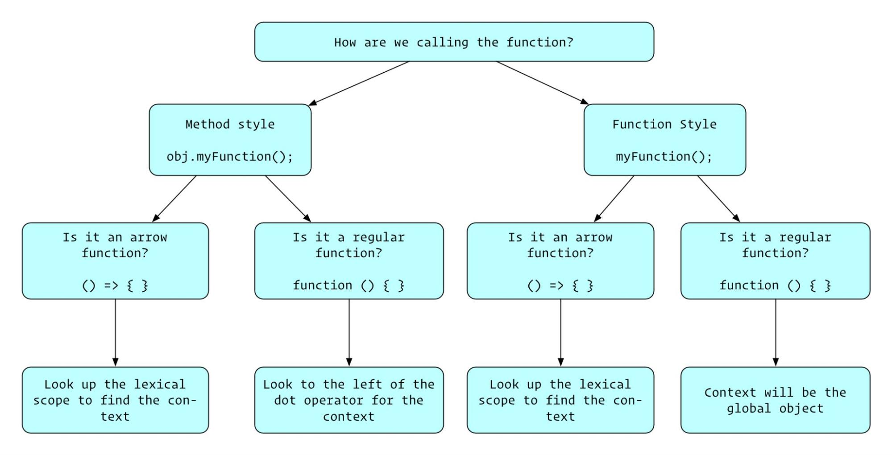

# Context in JavaScript

It's now time to dive into one of the most interesting concepts in JavaScript: the idea of context.

Programmers from the junior to senior level often confuse scope and context as the same thing - but that is not the case! Every function that is invoked has both a scope and a context associated with that function. Scope refers to the visibility and availability of variables, whereas context refers to the value of the this keyword when code is executed.

When you finish this reading you should be able to:

- Define a method that references this on an object
- Identify what this refers to in a code snippet

## What about this?

When learning about objects you previously came across the idea of a method. A method is a function that belongs to an object.

There will be times when you will have to know which object a method belongs to. The keyword this exists in every function and it evaluates to the object that is currently invoking that function. So the value of this relies entirely on where a function is invoked.

That may sound abstract, so let's jump into an example:

```
class Dog {
  constructor(name, isSitting) {
    this.name = name;
    this.isSitting = isSitting;
  }

  stand() {
    this.isSitting = false;
    return this.isSitting;
  }
}

let dog = new Dog("Bowser", true);

// Bowser starts out sitting
console.log(dog.isSitting); // prints `true`

// Let's make him stand
console.log(dog.stand()); // prints `false`

// He's actually standing now!
console.log(dog.isSitting); // prints `false`


```

Inside of a method, you can use the keyword this to refer to the object that is calling that method. So when calling dog.stand() and you invoke the code of the stand method, this will refer to the dog object.

Still skeptical? Why don't you check this (heh) out:

```
class Dog {
  test() {
    return this === dog;
  }
}
let dog = new Dog();

console.log(dog.test()); // prints `true`


```

In short, by using the this keyword inside a method, you can refer to values within that object.

Let's look at another example of this:

```
class Cat {
  purr() {
    console.log("meow");
  }

  purrMore() {
    this.purr();
  }
}
let cat = new Cat();

cat.purrMore();


```

Through the this variable, the purrMore method can access the object it was called on. In purrMore, you use this to access the cat object that has a purr method. In other words, inside of the purrMore function if you had tried to use purr() instead of this.purr() it would not work.

When you invoked the purrMore function using cat.purrMore you used a method-style invocation.

Method style invocations follow the format: object.method(args). You've already been doing this using built in data type methods. (i.e. Array.push, String.toUpperCase, etc.)

Using method-style invocation (note the dot notation) ensures the method will be invoked and that the this within the method will be the object that method was called upon.

Now that you know what this refers to - you can have a full understanding of the definition of context. Context refers to the value of this within a function and this refers to where a function is invoked.

## Issues with scope and context

In the case of context, the value of this is determined by how a function is invoked. In the above section you saw briefly method-style invocation, where this is set to the object the method was called upon.

Let's now talk about what this is when using normal function style invocation.

Try running the following in Node:

```
function testMe() {
  console.log(this); //
}

testMe(); // Object [global] {global: [Circular], etc.}


```

When you run the above testMe function in Node you'll see that this is set to the global object. To reiterate: each function you invoke will have both a context and a scope. So even functions in Node that are not defined on an object have the global object as their this and therefore their context.

### When methods have an unexpected context

So let's now look at what happens when you try to invoke a method using an unintended context.

Say you have a function that will change the name of a dog object:

```
class Dog {
  constructor(name) {
    this.name = name;
  }

  changeName() {
    this.name = "Layla";
  }
}


```

Now say you wanted to take the changeName function above and call it somewhere else. Maybe you have a callback you'd like to pass it to another object.

Let's take a look at what happens when you try to isolate and invoke just the changeName function:

```
class Dog {
  constructor(name) {
    this.name = name;
  }

  changeName() {
    this.name = "Layla";
  }
}

let dog = new Dog("Bowser");

// Note this is **not invoked** - you are assigning the function itself
let change = dog.changeName;
console.log(change()); // TypeError, due to not recognizing a valid context

// Your dog still has the same name!
console.log(dog); // { name: 'Bowser', changeName: [Function: changeName] }


```

So in the above code notice how you stored the dog.changeName function without invoking it to the variable change. On the next line when you did invoke the change function you can see that you did not actually change the dog object as intended.

Let's look at one more example of confusing this when using a callback. Incorrectly passing context is an inherent problem with callbacks. The global.setTimeout() method on the global object is a popular way of setting a function to run on a timer. The global.setTimeout() method accepts a callback and a number of milliseconds to wait before invoking the callback.

Let's look at an example:

```
let hello = function () {
  console.log("hello!");
};

// global. is a method of the global object!
global.setTimeout(hello, 5000); // waits 5 seconds then prints "hello!"


```

Let's say you wanted your cat to "meow" in 5 seconds instead of right now:

```
class Cat {
  purr() {
    console.log("meow");
  }

  purrMore() {
    this.purr();
  }
}
let cat = new Cat();

global.setTimeout(cat.purrMore, 5000);  // 5 sec later: TypeError: this.purr
                                        // is not a function


```

So what happened there? You called cat.purrMore so it should have the right context right? Noooooope. This is because cat.purrMore is a callback in the above code! When global.setTimeout is invoked, it creates an instance of a Timeout object. After the delay, the Timeout object attempts to call the purrMore function and that Timeout object is the new context for the purrMore function. Since there is not a purr function defined on that Timeout object it is undefined. When cat.purrMore attempts to invoke this.purr this causes the TypeError!

When setTimeout invokes cat.purrMore it changes the context from the Cat class to the context belonging to the object created by setTimeout. You can observe this yourself by adding console.log(this) to the purrMore method. Notice how the value of this changes depending on what is invoking the method?

#### Strictly protecting the global object

The accidental mutation of the global object when invoking functions in unintended contexts is one of the reasons JavaScript released "strict" mode in ECMAScript version 5. You won't dive too much into JavaScript's strict mode now, but it's important to know how strict mode can be used to protect the global object.

Writing and running code in strict mode is easy and much like writing code in "sloppy mode" (jargon for the normal JavaScript environment). You can run JavaScript in strict mode simply by adding the string "use strict" at the top of your file:

```
"use strict";

function hello() {
  return "Hello!";
}

console.log(hello); // prints "Hello!"


```

One of the differences of strict mode becomes apparent when trying to access the global object. As mentioned previously, the global object is the context of invoked functions in Node that are not defined explicitly on declared objects.

So referencing this within a function using the global object as its context will give us access to the global object:

```
function hello() {
  console.log(this);
}

hello(); // Object [global] {etc, etc, etc }


```

However, strict mode will no longer allow you access to the global object in functions via the this keyword and will instead return undefined:

```
"use strict";

function hello() {
  console.log(this);
}

hello(); // undefined


```

This is useful for helping to avoid scenarios where you accidentally could have mutated the global object.

If you'd like to learn more about strict mode, check out the documentation.

## What you learned

- How to define a method that references this on an object
- Identify what this refers to in a code snippet

# Changing Context using bind

So how would you go about making sure the context for a function is correct when called where context gets lost?

Luckily, JavaScript has something that solves this problem: what is known as the binding of a context to a function.

When you finish this reading you should be able to:

- Bind the context of a method to an object
- Understand what the bind function returns and how the result functions

From the Function.prototype.bind(), "The simplest use of bind() is to make a function that, no matter how it is called, is called with a particular this value".

Here is a preview of the syntax used to bind:

```
let boundFunc = func.bind(context);


```

When bind is called it returns what is called an exotic function. This essentially means a function with its this bound no matter where that function is invoked.

Let's take a look at example at bind in action:

```
class Cat {
  purr() {
    console.log("meow");
  }

  purrMore() {
    this.purr();
  }
}
let cat = new Cat();

let sayMeow = cat.purrMore;
sayMeow(); // TypeError: this.purr is not a function

// You can now use the built in Function.bind to ensure your context, `this`,
// is the cat object
let boundCat = sayMeow.bind(cat);

// You still *need* to invoke the function
boundCat(); // prints "meow"


```

That is the magic of bind! It allows you choose the context for your function. You don't need to restrict the context you'd like to bind to either - you can bind functions to any context.

Let's look at another example:

```
class Cat {
  constructor(name) {
    this.name = name;
  }
  sayName() {
      console.log(this.name);
  }
}

let cat = new Cat("Meowser");

class Dog {
  constructor(name) {
    this.name = name;
  }
}

let dog = new Dog("Fido");

let sayNameFunc = cat.sayName;

let sayHelloCat = sayNameFunc.bind(cat);
sayHelloCat(); // prints Meowser

let sayHelloDog = sayNameFunc.bind(dog);
sayHelloDog(); // prints Fido


```

Let's now revisit the above example of losing context in a callback and fix the context! Using the global.setTimeout function you want to call the cat.purrMore function with the context bound to the cat object.

```
class Cat {
  purr() {
    console.log("meow");
  }

  purrMore() {
    this.purr();
  }
}

let cat = new Cat();

// Bind the cat.purrMore function to the context of the cat object
const boundPurr = cat.purrMore.bind(cat);

global.setTimeout(boundPurr, 5000); // prints 5 seconds later: meow


```

## What you learned

- How to bind the context of a method to an object
- That the bind function returns a function with a set this object, or in other words, context.

# Other Ways to Bind Context

After completing this reading, you should be able to:

- Use call and apply to directly attach a context to a function call.
- Differentiate between call and apply

Depending on your use case, JavaScript also has two alternative function methods that allow you to bind context. These are Function.prototype.call and Function.prototype.apply.

While bind returns a function that can be called multiple times with the given context, call and apply will invoke the bound function immediately, returning the return value from that function.

Here's an example of how they're used:

```
// assigning return of func.call() to a variable
let callReturn = func.call(context, ...args); 

// assigning return of func.apply() to a variable
let applyReturn = func.apply(context, [...args]);


```

The first argument for both is the this that you want to bind the function's context to. The only difference between the two comes in the remaining arguments:

Apply takes in an array of arguments while call spreads them out in comma-separated values. You can remember this by thinking: a is for array and c is for comma.

So to bring back the Cat and Dog example, here's how you could make Fido meow:

```
class Dog {
  constructor(name) {
    this.name = name;
  }
}

class Cat {
  constructor(name) {
      this.name
  }
  purrNTimes(n) {
      for(let i = 0; i < n; i++) {
          console.log(`${this.name} says: meow`);
      }
  }
}

let dog = new Dog('Fido');
let cat = new Cat('Meowser');

// make Fido meow 5 times using `call`
cat.purrNTimes.call(dog, 5);

// make Fido meow 5 times using `apply`
cat.purrNTimes.apply(dog, [5]);


```

Notice that call and apply are essentially interchangeable and follow the same rules as bind with the main difference being that call and apply invoke the function they're being called on, whereas bind returns the function with its context set.

## What you learned

- How to use call and apply to invoke functions with a specified context
- The difference between the method definitions of call and apply

# Arrow Functions and Context

Arrow functions are not just a different way of defining functions. Arrow functions also apply context differently.

## The context of an arrow function is as where it was defined

Since arrow functions are also anonymous, this also makes them compatible for use as callbacks! So are arrow functions just syntactic sugar? Far from it! Here's what sets arrow functions apart from normal anonymous functions:

Arrow functions do not have inherent bindings to a this object based on context; instead, their this is lexically bound.

This just means that an arrow function's this refers to whatever code contains it, not calls it. This makes them much more flexible for use in method callbacks than normal anonymous functions.

Here's why:

Say you want to create a method on Dog that has the dog bark its name:

```
class Dog {
  constructor(name) {
    this.name = name;
  }

  bark() {
    console.log(this.name);
  }
}

let dog = new Dog("Fido");
dog.bark()                  // "Fido"


```

This should go about without a hitch, but say you want to add a delay to the bark. You would use a setTimeout like so:

```
class Dog {
  // ...constructor same as before
  delayedBark() {
    setTimeout(function() {
      console.log(this.name);
    }, 1000);
  }
}

let dog = new Dog("Fido");
dog.delayedBark()           // undefined


```

this.name is undefined because this now refers to the Timeout object and the Timeout object does not have a name property! The solution in ES5 would then be to use bind to bind the Dog object to the setTimeout function:

```
class Dog {
  // ...constructor same as before
  delayedBoundBark() {
    setTimeout(function() {
      console.log(this.name);
    }.bind(this), 1000);
  }
}

let dog = new Dog("Fido");
dog.delayedBoundBark();     // "Fido" (after 1 second)


```

This is starting to look pretty cumbersome just to write a properly functioning callback. Time to give the arrow function a shot:

```
class Dog {
  // ...constructor same as before
  arrowBoundBark() {
    setTimeout(() => {
      console.log(this.name);
    }, 1000);
  }
}

let dog = new Dog("Fido");
dog.arrowBoundBark();     // "Fido" (after 1 second)


```

This works without having to bind the Dog object to the callback because the this in the arrow function refers to the code block it was written inside, which is the Dog class object! The resulting code is cleaner and much easier to read and behaves as you would expect.

## Defining a class method as an arrow function

You can also define methods of a class as arrow functions instead of regular functions. This will automatically bind the context of the class method to be either the class or the class instance.

Consider the bark() method defined as a regular function in the following Dog class.

```
class Dog {
  constructor(name) {
    this.name = name;
  }

  bark() {
    console.log(`${this.name} barked at you`);
  }
}

const fido = new Dog("Fido");
fido.bark(); // Fido barked at you
const fidoBark = fido.bark;
fidoBark();  // undefined barked at you


```

If you want fido.bark() to always use fido as its context, then you should convert the bark() method to an arrow function.

```
class Dog {
  constructor(name) {
    this.name = name;
  }

  bark = () => {
    console.log(`${this.name} barked at you`);
  }
}

const fido = new Dog("Fido");
fido.bark(); // Fido barked at you
const fidoBark = fido.bark;    
fidoBark();  // Fido barked at you


```

Now, fido will always be the context of fido.bark() even if it is invoked function-style.

How does JavaScript do this? It creates a new instance of the bark() method for every instance of the Dog class. If you define the bark() method as a regular function, there will only be one instance of the bark() method created for all instances of the Dog class.

Here's what JavaScript is basically doing under the hood.

```
class Dog {
  constructor(name) {
    this.name = name;
    this.bark = this.barkPrototype.bind(this);
  }

  barkPrototype() {
    console.log(`${this.name} barked at you`);
  }
}

const fido = new Dog("Fido");
fido.bark(); // Fido barked at you
const fidoBark = fido.bark;
fidoBark();  // Fido barked at you


```

Can you think of why this is a scenario that you would want to avoid? If you create a new arrow function for every Dog instance, and if you have 1000 Dog instances, you would create 1000 Dog functions. For every instance you create, you are creating another function that adds to your application's memory.

You should only define a class method as an arrow function if you will be binding the class method when using it more times than you are creating new instances of that class. Or you can use it if you don't care about application memory and you won't be creating too many instances of the class.

## What you learned

- What the context of an arrow function is
- How to define a class method using an arrow function
- When to use arrow functions to define a class method

## Awesome Context Flow Chart



# A Comedy of Errors in JavaScript

You know that feeling when you've just finished your perfect function then you go to run your code and BAM! An error is thrown? We all have felt that pain from the starting student to the experienced engineer. Runtime errors are a part of daily life when writing code. In this reading, we will dive into what each type of error you encounter means in order to more quickly and efficiently identify and fix the problem that created that error.

When you finish this reading you should be able to:

- Identify the difference between SyntaxError, ReferenceError, and TypeErrors
- Read and look up unfamiliar errors

## Types of JavaScript errors

There are seven core errors you'll encounter in JavaScript and each type of error will try to communicate why that error occurred:

1. SyntaxError - represents an error in the syntax of the code.
2. ReferenceError - represents an error thrown when an invalid reference is made.
3. TypeError - represents an error when a variable or parameter is not of a valid type.
4. RangeError - representing an error for when a numeric variable or parameter is outside of its valid range.
5. InternalError - represents an error in the internal JavaScript engine.
6. EvalError - represents an error with the global eval function.
7. URIError - represents an error that occurs when encodeURI() or decodeURI() are passed invalid parameters.

For this reading we'll be going in depth of the three most common errors you have encountered so far: SyntaxError, ReferenceError, and TypeError.

### SyntaxError

A SyntaxError is thrown when the JavaScript engine attempts to parse code that does not conform to the syntax of the JavaScript language. When learning the JavaScript language this error is a constant companion for any missing } or misspelled function keywords.

Let's look at a piece of code that would throw a syntax error:

```
funtion broken () { // Uncaught SyntaxError: Unexpected identifier
  console.log("I'm broke");
}


```

Another example with an extra curly brace }:

```
function broken () { // Uncaught SyntaxError: Unexpected identifier
  console.log("I'm broke");
}} // Uncaught SyntaxError: Unexpected token '}'


```

The examples go on and on - you can count on a SyntaxError to be thrown whenever you attempt to run code that is not syntactically correct JavaScript.

### ReferenceError

Straight from the MDN docs: "The ReferenceError object represents an error when a non-existent variable is referenced." This is the error that you'll encounter when attempting to reference a variable that does not exist (either within your current scope or at all).

Let's take a look at some examples for the causes of this error. One common cause for this error is misspelling a variable name:

```
function callPuppy() {
  const puppy = "puppy";
  console.log(pupy);
}

callPuppy(); // ReferenceError: pupy is not defined


```

Another common cause for a thrown ReferenceError is attempting to access a variable that is not in scope:

```
function callPuppy() {
  const puppy = "puppy";
}

console.log(puppy); // ReferenceError: puppy is not defined


```

The aptly named ReferenceError will be thrown whenever you attempt to reference a variable that doesn't exist.

### TypeError

A TypeError is commonly thrown for a couple of reasons:

1. When an operation cannot be performed because the operand is a value of the wrong type.
2. When you are attempting to modify a value that cannot be changed.

Let's look at a couple of examples that will each throw a TypeError for a different reason. Below we are attempting an operation (in this case a function call) on a value of the wrong type:

```
let dog; // Remember unassigned variables are undefined!

dog(); // TypeError: dog is not a function


```

In the above example we attempt to invoke a declared but not assigned variable (which will evaluate to undefined). This will cause a TypeError because undefined cannot be invoked - it is the wrong type.

Next let's look at a example of attempting to change a value that cannot be changed:

```
const puppy = "puppy";

puppy = "apple"; // TypeError: Assignment to constant variable.


```

Attempting to reassign a const declared variable will result in a TypeError. You've probably run into many other examples of TypeError yourself but, the most important thing to know is that a TypeError is thrown when you attempt to perform an operation on the wrong type of value.

### Looking up errors

Try running the following code in a JavaScript terminal.

```
let x = 123;
let y = 123;
x.toExponential(y);


```

You should get an error. What does the error mean? How do you fix it? The answer may not be immediately obvious but the error message will point you in the right direction.

Start by looking up the toExponential function in MDN to confirm the expected behavior, then look up the named error message. You should be able to determine the cause of the error.

This technique will work for any type of error in any programming language. For example, without knowing Python, can you determine the problem with the following code from reading the error message?

```
arr = [1,2,3]
arr[3]
# Traceback (most recent call last):
#   File "<stdin>", line 1, in <module>
# IndexError: list index out of range


```

## What you learned

If you read an error and know why that error is being thrown it'll be much easier to find the cause of the problem! In this reading you learned about the most common types of JavaScript errors: SyntaxError, ReferenceError, and TypeErrors. You also learned what to do when you come across an unfamiliar error.

# Throwing and Catching Errors

JavaScript comes with built-in errors that are thrown whenever your code violates certain conditions. You can throw these errors in your own functions, or even create your own to alert users when they are using your code incorrectly. You can also "catch" errors that you expect to be handled gracefully without a system crash.

In this reading, you will learn to create, throw, and catch errors in JavaScript.

## JavaScript Errors

In JavaScript the Error constructor function is responsible for creating different instances of Error objects. The Error object is how JavaScript deals with runtime errors and the type of error created and thrown will attempt to communicate why that error occurred.

### Creating your own errors

Since the Error constructor is just a constructor function we can use it to create new Error object instances with the following syntax:

```
new Error([message[, fileName[, lineNumber]]])


```

As seen above you can optionally supply a message, fileName and lineNumber where the error occurred. The Error constructor is also somewhat unique in that you can call it with or without the new keyword and it will return a new Error object:

```
const first = Error("I am Error");
const second = new Error("I, too, am Error");

console.log(first); // Error: I am Error
console.log(second); // Error: I, too, am Error


```

Let's take a look at what we can do with our newly created Error objects.

### Throwing your own errors

Tired of JavaScript being the only one to throw errors? Well you can too! Using the keyword throw you can throw your own runtime errors that will stop program execution.

Let's take a look at the syntax for throw:

```
function giveMeNumber(num) {
  if (typeof num !== "number") {
    throw new Error("Give me a number!");
  } else {
    return "yay number!";
  }
}

console.log(giveMeNumber(1)); // prints "yay number!";
console.log(giveMeNumber("apple")); // Uncaught Error: Give me a number!
console.log(giveMeNumber(1)); // doesn't get run


```

Now as we can see in the above example throwing an error is a powerful tool that stops program execution. If we wanted to throw an error without stopping program execution we can use a try...catch block.

Let's look at the syntax for using the try...catch block syntax:

```
try {
  // statements that will be attempted to here
} catch (error) {
  // if an error is thrown it will be "caught"
  // allowing the program to continue execution
  // these statements will be run and the program will continue!
}


```

We normally use try...catch blocks with functions that might throw an error. Let's look at an example where an error will not be thrown:

```
function safeDivide(a, b) {
  if (b === 0) {
    throw new Error("cannot divide by zero");
  } else {
    return a / b;
  }
}

try {
  console.log(safeDivide(30, 5)); // prints 6
} catch (error) {
  console.error(error.name + ": " + error.message);
}

console.log("hello"); // prints hello


```

Note: We can use console.error instead of console.log to make logged errors more noticeable.

Above you can see our safeDivide function ran as expected. Now let's see what happens when an error will be thrown and caught inside a try...catch block:

```
function safeDivide(a, b) {
  if (b === 0) {
    throw new Error("cannot divide by zero");
  } else {
    return a / b;
  }
}

try {
  console.log(safeDivide(30, 0));
} catch (error) {
  console.error(error.name + ": " + error.message); // Error: cannot divide by zero
}
// the above error will be caught allowing our program to continue!
console.log("hello"); // prints  "hello"


```

Those are the basics of creating and throwing your own errors. You can throw your newly created Error to stop program execution or use a try...catch block to catch your error and continue running your code. Now that we've learned how to create new errors let's go over the core errors built into JavaScript and what they signify.

### Catching known errors

You can combine try...catch with JavaScript's built-in errors to catch specific types of errors using instanceof:

```
function callThatArg(arg) {
  arg(); // this will cause a TypeError because callThatArg is being passed a number
}

try {
  callThatArg(42);
  console.log("call successful"); // this line never executes
} catch (error) {
  if (error instanceof TypeError) {
    console.error(`Wrong Type: ${error.message}`); // prints: Wrong Type: arg is not a function
  } else {
    console.error(error.message); // prints out any errors that aren't TypeErrors;
  }
}

console.log("done"); // prints: done


```

Important! One thing to note about Syntax Errors is that many of them can't be caught using try catch blocks.

For instance, the following code will throw a SyntaxError and no matter how hard you try, you can't catch it.

```
try {
    if (true { // throws "SyntaxError: Unexpected token '{'"
        console.log("SyntaxErrors are the worst!");
    }
} catch (e) {
    console.log(e);
}


```

The missing parenthesis after true will throw a SyntaxError but can't be caught by the catch block.

This is because this kind of SyntaxError happens at compile time not run time. Any errors that happen at compile time can't be caught using try catch blocks.

## ...finally

It turns out that you can have one more block on the try-catch block. It is the finally block. The finally block runs whether or not an error occurs. It always runs.

```
function trySafeDivide(n) {
    try {
        console.log(safeDivide(30, n));
    } catch (error) {
        console.error(error.name + ": " + error.message); // Error: cannot divide by zero
        return;
    } finally {
        console.log("This will always run");
    }
}


```

Try running trySafeDivide with 1 and 0. The code in the finally block will run no matter what, even though the function returns in the catch block.

## How do I best use this?

At this point, you may be asking yourself, "Self, since errors can occur everywhere, shouldn't I just wrap all of my code in these try-catch blocks?"

No. No, you shouldn't.

Every try-catch block introduces another slow-down in your code. If you're writing code that you want to run as fast as possible, then you write as few try-catch blocks as possible. Also, it makes the code pretty cluttered with all of the indentation and curly braces. When at all possible, you should write defensive code which checks for bad values before errors get thrown in your code.

Error messages are not your enemy! Like a good editor, error messages tell you exactly where the flaws in your code are and in many cases, how to fix them. Code that fails silently is likely to sneak into production and cause hidden problems that are hard to find.

Learning to read error messages will help you write better code and debug much faster.

## What you learned

In this reading, you learned to create, throw, and catch errors in JavaScript.
