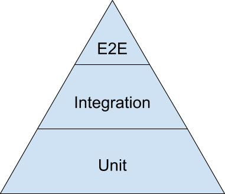

# All About Testing!

In your daily life you have encountered tests before - in school, work, or even in trivia. A test is a way to ensure something is correct. In your programming careers so far you've tested most of your work by hand. Testing one function at a time can be tedious, repetitive, and (worst of all) vulnerable to false positives or negatives.

Let's talk about automated testing - the how, the what, and most importantly the why. The general idea across all testing frameworks is to allow developers to write code that would specify the behavior of a function or module or class. We've reached a point in software development where developers can now run test code against their application code and have confidence that their code will work as intended.

When you finish this reading you should be able to paraphrase the how and why we test as well as how to read automated tests without necessarily knowing the syntax.

## Why do we test?

Yes, making sure the dang thing actually works is important. But beyond the obvious, why take the time to write tests?

- To make sure the dang thing worksYes, that's obvious, but dagnabit, it's important!
- Increase flexibility & reduce fear (of code)You've written a whole bunch of functionality, multiple other developers have worked on the code, you're deep into the project... And then you realize you have to refactor big chunks of it. Without automated tests, you'll be walking on eggshells, frightened of the codebase and the various landmines that are surely lying in wait.With tests, you can aggressively refactor with confidence. If anything breaks, you'll know. You'll know exactly what the expectations are for the module you're refactoring, so as long as it meets the specs, you're good.Testing critical parts of your code will also make sure that anyone who modifies your code in the future does not break anything important.

When you are writing automated tests for an application you are writing the specifications of how that application should behave. In the software industry automated tests are often called "specs", which is short for the word "specification".

- Make collaboration easierComplex applications are built by teams of developers. It may be that not all those developers will actually get the chance to talk to one another (they're busy, they may live in different places, some of them may have left the company, new people just joined, it's a huge project, etc.).Specs allow teams to have confidence that each module performs a specific task and reduces the need for expensive coordination. The specs themselves become an effective form of communication.
- Produce documentationIf the tests are written well, the tests can serve as documentation for the codebase. Need to know what such and such module does? Check out the specs. This is related to easing collaboration.

## What do we test?

Now that you know why tests are important, what things should you test for?

### Test the public interface

When you're trying to figure out what you should be testing, ask yourself, "What is (or will be) the public interface of the module or class I'm writing?" That is, what are the functions that the outside world will have access to and rely on?

Ideally, you'd have thorough test coverage on the entire public interface. When that's not possible, ensure that your tests cover the most important and/or complex parts of that interface - that is, the pieces that you need to make sure work as intended (and expected).

Kent Dodds has a great article on how to identify what you should be testing.

### The testing pyramid

A common metaphor used to group software tests into separate levels of testing is the testing pyramid.



Let's quickly go over each level before talking about the pyramid as a whole:

- Unit Tests: The smallest unit of testing - used to test the smallest pieces of your application in isolation to ensure each piece works before you attempt to put those pieces together. Each unit test should focus on testing one thing. These are generally the fastest tests to write and run.
- Integration Tests: Once you have your unit tests in place you know each piece works in isolation - but what about when those pieces interact with each other? Integration tests are the next level up, they will test the interactions between two pieces of your application. Integration tests will ensure the units you've written work coherently together.
- End-to-End (E2E) Tests: End-to-end tests are the highest level of testing - these will test the whole of your application. End-to-end tests are the closest automated tests come to testing the actual user experience of your application. These are generally the slowest tests to write and run.

For a real life example of how you'd utilize each of these tests imagine coding a Chess game and wanting to test it. Unit tests would be best for testing each class you wrote in isolation - like ensuring each piece's instance methods work as you expect them to before involving them with any other pieces. Next you'd write integration tests - so you'd want to ensure that each piece instance interacted correctly with the Board class. The final level would be End-to-End tests which would be like testing a round of chess - testing the Board, Game, and Piece classes all working together.

According to the testing pyramid - you want to have a solid base of a lot of Unit tests, then a medium amount of integration tests built upon that base, then finally a smaller amount of End-to-End tests. Writing tests in this way is practical for a couple of reasons. As we said before, unit tests ensure each piece of your application works in isolation - if you know each piece works then you can more easily find errors. Unit tests are also fast. The bigger your application gets the longer your testing suite will take to run - if all your tests are end-to-end tests your tests could be running for hours.

Here is a great blog from Google about why they use the testing pyramid.

## What you learned

In this reading, you learned the why, what and the how of testing as well as the basics of how to read a test regardless of the syntax used in writing that test.

# Test-Driven Development

As you know, the first step to solving any problem is to understand the problem. Most of the problems you have seen describe the problem requirements with a short, written description and a set of test specs. The descriptions tell you what your code should do while the tests let you know when your code is working as intended.

It turns out, this is common practice in real world development too: in place of long, detailed descriptions of how your code should work, instead your project specifications are provided as a set of tests. Just like at App Academy, once your tests are passing you know your job is done.

This practice of writing tests before writing code is called Test-driven development or TDD.

In this reading, you will learn to identify the three steps of Test Driven Development as well as identify the advantages of using TDD to write code.

## Motivations for TDD

Imagine you are tasked with upgrading the mailer service in a large codebase. This mailer is used in dozens of places in the code: from sending confirmation emails on account creation, password resets when a user forgets their password, marketing material on new product deals, weekly content digests, and more.

How can you be sure that your upgrade does not break any of the dozens of services that rely on the mailer? Check every single feature individually? If the team uses TDD, you don't need to: the specs will take care of it for you.

Or, say you are building an eCommerce site. Your task is to build the Customer class while other developers build the Store, StoreItem and Checkout classes. The way you implement the Customer depends on how the other classes are implemented and your co-workers have a tendency to get "creative" with their code.

How can you be sure that the Store, StoreItem and Checkout objects that your code relies on will work as you expect them to? Wait until they are finished before starting your own work? Again, if your team uses TDD, you don't need to: the specs will describe all you need to know.

Here are some of the biggest motivations for why developers use test-driven development:

1. Writing tests before code ensures that the code written works.

- Code written to pass specs is guaranteed to be testable.
- Code with pre-written tests easily allows other developers to add and test new code while ensuring nothing else breaks along the way.

1. Only required code is written.

- In the face of having to write tests for every piece of added functionality TDD can help reduce bloated un-needed functionality.
- TDD and YAGNI ("you ain't gonna need it") go hand in hand!

1. TDD helps enforce code modularity.

- A TDD developer is forced to think about their application in small, testable chunks - this ensures the developer will write each chunk to be modular and capable of individual testing.

1. Better understanding of what the code should be doing.

- Writing tests for a piece of code ensures that the developer writing that code knows what the piece of code is trying to achieve.

Now that we've covered why developers would want to use TDD let's go into how to do TDD.

## The three steps of TDD: red, green, refactor!


The Test-driven development workflow can be broken down into three simple steps. Red, Green, Refactor:

1. Red: Write the tests and watch them fail (a failing test is red). It's important to ensure the tests initially fail so that you don't have false positives.
2. Green: Write the minimum amount of code to ensure the tests pass (a passing test will be green).
3. Refactor: Refactor the code you just wrote. Your job is not over when the tests pass! One of the most important things you do as a software developer is to ensure the code you write is easy to maintain and read.

Generally, the TDD workflow loop of Red, Green, Refactor is quick. TDD developers will write small tests ensuring each individual part of their application works properly and their code looks good before moving on - making for a short development cycle.

You may recognize these as a form of Polya's Problem Solving framework. First you understand the problem and plan out a set of specs to solve it (Red). Next, you execute the plan in code to pass specs (Green). Finally, you go back to improve and optimize your code, confident that any changes you make do not break the working functionality (Refactor).

## What you learned

TDD stands for test-driven development. TDD is a repetitive process that revolves around three steps: Red, Green, Refactor.

# Unit Testing with Mocha and Chai

You have already been using one of JavaScript's most popular test frameworks, Mocha, to run tests that ensure a function you've written works as expected. It's time to dive deeper into how to write our own tests using Mocha as the test framework coupled with Assertion libraries such as the Chai library.

In this reading we'll be covering:

- the file structure of testing with Mocha
- testing with Mocha and Chai's expect module
- recognize and utilize the Mocha hooks: before, beforeEach, after, and afterEach

## Part One: Setting up your test environment

Start by creating a new directory called testing-demo. Navigate there in a new terminal.

To install the Mocha and Chai packages, start by a new environment by typing npm init in your terminal. Name the package testing-demo and set the test command to mocha and put whatever you want for the rest. If your package.json looks like this, you should be good to move on to the next step.

```
{
  "name": "testing-demo",
  "version": "1.0.0",
  "description": "",
  "main": "index.js",
  "directories": {
    "test": "test"
  },
  "scripts": {
    "test": "mocha"
  },
  "author": "",
  "license": "ISC"
}


```

Next, run npm install mocha and npm install chai.

This will create a directory called node_modules, download the latest versions of the Mocha and Chai packages into it, then mark the versions in package.json and all dependencies in package-lock.json.

```
// package.json
{
  "name": "testing-demo",
  "version": "1.0.0",
  "description": "",
  "main": "index.js",
  "directories": {
    "test": "test"
  },
  "scripts": {
    "test": "mocha"
  },
  "author": "",
  "license": "ISC",
  "dependencies": {
    "chai": "^4.3.0",
    "mocha": "^8.3.0"
  }
}


```

If everything runs without error and your package.json looks like this, you should be good to go.

## Part Two: Setting up the test files

Say you are creating unit tests for a new User class. Start by creating a file for the User class and a test file called user-spec in a directory called test. Your file structure should look like this:

```
package.json
package-lock.json
node_modules
class
  └── user.js
test
  └── user-spec.js


```

You can put user.js wherever you want but Mocha expects all specs to be in a directory called test. Create and export an empty User class in user.js.

```
// File: class/user.js

class User {

}

module.exports = User;


```

In user-spec.js, load Chai and the User class being tested. Note the relative loading path in require. It expects to find the user.js file to be one level up, then in a folder called class.

```
// File: test/user-spec.js

const { expect } = require('chai');

const User = require("../class/user.js");


```

If you type mocha in your terminal, you should see a 0 passing (1ms) message. If you are getting errors, make sure your file structure is set up correctly and you are running mocha from the testing-demo directory.

## Part Three: Writing tests with Mocha and Chai

Here's an important distinction to remember:

Mocha is a test framework that specializes in running tests and presenting them in an organized user friendly way.

Chai is an assertion library that performs the actual test comparisons.

First, we will set up a test for basic functionality of the User class. In user-spec.js, below the Chai and User imports, type:

```

describe ('User class', function () {

  it('should create successfully', function () {

    let user = new User();

    expect(user).to.exist;

  });

});


```

Without knowing any Mocha syntax, you should be able to deduce what this test does. describe is a group of tests for the User class. it tests a single spec and checks if a User can be created successfully and does this by creating a new user, then expect is an assertion that checks to see if the new user exists.

describe and it come from the testing framework, Mocha, while expect comes from the assertion library, Chai. Note that the Mocha functions literally frame the test assertions.

Check out the Chai docs for a list of all the ways to test code assertions with expect.

Run mocha and you should see:

```
 User class
    ✓ should create successfully


  1 passing (4ms)


```

Great! This tells you that the most basic operation of the user class, being able to be created, is working. It may sound trivial, especially since the class is empty, but if this ever does break, you want to know immediately.

Take notice of how Mocha structures its response in exactly the way you nested your test. The outer describe function's message is on the upper level and the inner it function's message is nested within. This helps to identify exactly what needs to be done when tests are failing.

## Part Four: Specifying functionality with tests

According to the project, all users should require a username upon creation. You can specify this in the test specs with a new test.

```
describe ('User class', function () {

  it('should create successfully', function () {
    let user = new User();

    expect(user).to.exist;
  });

  it('should set username on creation', function () {

    let user = new User("john_doe");

    expect(user.username).to.equal("john_doe");
  });

});


```

Since this functionality has not been implemented, the test will fail when running mocha.

```
 User class
    ✓ should create successfully
    1) should set username on creation


  1 passing (5ms)
  1 failing

  1) User class
       should set username on creation:
     AssertionError: expected undefined to equal 'John Doe'
      at Context.<anonymous> (test/user-spec.js:21:26)
      at processImmediate (internal/timers.js:456:21)


```

The test is "red" in the red-green-refactor TDD cycle. At this point, you could implement the user functionality or hand it off to a teammate to complete. Adding a constructor to the User class will do the trick.

```
// user.js
class User {

  constructor(username) {
    this.username = username;
  }

}


```

Now running mocha should show you passing tests.

```
 User class
    ✓ should create successfully
    ✓ should set username on creation


  2 passing (3ms)


```

## Part Five: DRYing your tests with Mocha Hooks

When creating a suite of tests for a user class, you will likely need to create a new user before each test runs. You can clean up the repetition using the Mocha Hooks, before or beforeEach.

```
describe ('User class', function () {

  let user;

  beforeEach(() => {
    user = new User("john_doe");
  });

  it('should create successfully', function () {
    expect(user).to.exist;
  });

  it('should set username on creation', function () {
    expect(user.username).to.equal("john_doe");
  });

});


```

The beforeEach hook will set up code that runs before each test in the describe block while before runs once at the beginning of the block.

Similarly, there are afterEach and after hooks which can be used to clean up after each test, or after the test block runs.

## What you learned

In this reading, you learned how to use the Mocha testing framework and the Chai assertion library to write unit tests for a class.

# Determining common test cases

Knowing how much to test can be challenging. Too many and you may slow down development with tests that don't do anything but too few and you risk missing key errors or edge cases. In this reading, you will learn how to approach writing specs for common use cases, unintuitive cases and edge cases.

## Two cases for tests

There are two main reason for test specs.

The first is to specify what should be built. These tests are created before the code is written and help the developer writing the code know what he or she should be building.

The second is to prevent people from breaking your code in future development when modifying or adding to your code. Fortunately, as long as you have good test specs from before, this should be handled automatically.

## Example: Stickers

Say you are writing a sticker-distribution algorithm for Andrea, a kindergarten teacher. The task is given like this:

```
Andrea is a kindergarten teacher. She wants to give some stickers to the
children in her class. All the children sit in a line and each of them has a
rating score according to his or her performance in the class. Andrea wants to
give at least 1 sticker to each child. If two children sit next to each other,
then the one with the higher rating must get more stickers. Andrea wants to
minimize the total number of stickers she must buy.


```

What test specs should you write? Before you write anything, the first step is always to understand the problem. Start by walking through some examples.

Say Andrea has four students who have ratings of [1, 2, 3, 4]. How many stickers does she need to buy?

The first student can get 1 sticker. The second student has a higher rating and should get 2 stickers. The third is higher than that student so should get 3, and the fourth is higher than the third and should get 4 stickers. Adding them up results in 10 stickers.

This is a solid test case and should be added as a spec.

```
describe ('Stickers', function () {

  it('should give 10 stickers to students ranked [1, 2, 3, 4]', function () {

    const stickers = countStickers([1, 2, 3, 4]);
    expect(stickers).to.equal(10);

  });

});


```

What's next? You could continue this pattern and add more similar tests. For example, adding a fifth student with a ranking of 5 would require 5 more stickers: countStickers([1, 2, 3, 4, 5]) should return 15.

Before adding this test, ask yourself, "Does this spec test anything new?" In this case, not really. Both are testing ascending ratings so this spec doesn't add anything.

Instead, what if you add a smaller number to the end? How many stickers would [1, 2, 3, 4, 3] require?

Since Andrea is trying to minimize the number of stickers purchased, and since the requirement is that students with a higher rating have a higher sticker count than their neighbors, giving the last student 1 sticker works. Thus, the total should be 11.

```
 it('should give a lower-ranked neighbor 1 sticker', function () {

    const stickers = countStickers([1, 2, 3, 4, 3]);
    expect(stickers).to.equal(11);

  });


```

Note that the description of the spec tries to explain the reasoning behind the spec. It should be clear from the naming what is being tested.

Are you done? Before moving on, try to think of some other unique test cases that might arise.

## Testing unintuitive cases

What if there is another student at the end with a ranking of 1? How many stickers would each get?

Previously you only had to calculate based on the previous neighbor. When the array looked like [1, 2, 3, 4, 3], the last student was happy with just 1 sticker. Now adding a lower-ranked student changes that. How many stickers are needed for [1, 2, 3, 4, 3, 1]?

Since the second-to-last student now is ranked higher than the last student, he or she would expect to get at least 2 stickers, with the last student getting 1 sticker, for a total of 13.

```
 it('should raise the sticker count if lower than its neighbor', function () {

    const stickers = countStickers([1, 2, 3, 4, 3, 1]);
    expect(stickers).to.equal(13);

  });


```

Now you can see the problem might get tricky. Can you think of some other examples?

You might expect students ranked [1, 3, 5] to get 1+2+3 stickers (6) but what about [1, 3, 5, 4, 3, 2, 1]?

Take some time to think about this and you'll realize that this requires 1+2+5+4+3+2+1 stickers, for a total of 18.

```
 it('should increase the sticker count far backwards if needed', function () {

    const stickers = countStickers([1, 3, 5, 4, 3, 2, 1]);
    expect(stickers).to.equal(18);

  });


```

Notice that coming up with test cases forces you to understand the problem without writing code. This is a key skill to solving problems, and you will discover that solving problems becomes much easier with a comprehensive suite of test specs.

## Testing edge cases

This may vary by problem but can be especially important when you are building a function that accepts user input. Just because your function requires a list of integers doesn't mean that the user will always use it that way. Because of that, you sometimes need to test edge cases.

```
 it('should return `undefined` with improper inputs', function () {

    const stickers = countStickers(['one', 'two', 'three']);
    expect(stickers).to.equal(undefined);

  });


```

With no students, the function should return no stickers.

```
 it('should return 0 with an empty array', function () {

    const stickers = countStickers([]);
    expect(stickers).to.equal(0);

  });


```

What about for very large inputs? Does the function still work?

```
 it('should work with 10000 students', function () {

    let largeRankings = [];
    total = 0;
    for (let i = 1 ; i <= 10000 ; i++) {
      largeRankings.push(i);
      total += i;
    }

    const stickers = countStickers(largeRankings);
    expect(stickers).to.equal(total);

  });


```

This can be useful if there are performance constraints for the problem in question but be careful with these type of tests. These tests will be executed EVERY time someone pushes new code to the code base or deploys to production. They should be lightweight and fast, otherwise you risk bogging down development.

Again, this comes back to understanding the problem. What is the max class-size that Andrea can expect? Probably less than 100, so this test case can be left out.

For the remaining tests, think of all the possible unique data patterns that might break the system or be overlooked in development. Writing tests is a fantastic way to improve at problem solving and a great way to build trust when starting a job with a new team.

## What you learned

In this reading, you learned how to approach writing tests, considering common use cases, unintuitive cases and edge cases.

# Custom Error in JavaScript

Sometimes there is a built-in error that exactly works with the error you are trying to detect. However, sometimes none of the built-in options are quite right. Many times, this is because additional data would be useful for debugging error cases.

It is very easy in JavaScript - as in many other languages - to start from an existing class as a foundation (called a "parent" or "super" class) and inherit its features to a new class then extend those features to the functionality you want or need. Using class inheritance in this way saves time because you only need to write the code for the differences. Using unique errors for different situations makes your code easier to understand and debug when something doesn't go quite right.

When you complete this article, you'll be able to

- Write a custom error class in JavaScript

## Walk-though

Begin by creating a custom class in JavaScript with the class keyword, and specify what it will inherit from using the extends keyword.

Generically: class ErrorClassName extends Error

Specifically: class MissingRequiredFieldError extends Error or class SearchSyntaxError extends SyntaxError.

Then define the constructor to take in any custom values that make sense for your custom error, if any. Using the ... syntax you can easily reference all other properties and pass them along to the parent or super class's constructor (a.k.a. the super function).

```
   constructor(...params) {
        // Pass all arguments to parent constructor
        super(...params);


```

or

```
constructor(fieldName = 'field', ...params) {
    // Pass remaining arguments to parent constructor
    super(...params);


```

You'll want to ensure the stack trace is set properly.

```
if (Error.captureStackTrace) {
    Error.captureStackTrace(this, ClassNameHere);
}


```

Setting the name is very useful as well: this.name = 'ClassNameHere'

Finally, you can add any custom properties to the class (after all it is just like any other class) and, if you choose, you may customize the message.

```
this.message = `Some message which may include properties like ${name}`;


```

## Example 1 - Minimum

The least you need to do is give your custom error class a name and ensure that shows up in the stack trace as well.

```
class SearchSyntaxError extends SyntaxError {
    constructor(...params) {
        // Pass all arguments to parent constructor
        super(...params);

        // Maintains proper stack trace for where error was thrown (available on V8)
        if (Error.captureStackTrace) {
            Error.captureStackTrace(this, SearchSyntaxError);
        }

        // The name property should match the class's name
        this.name = 'SearchSyntaxError';
    }
}


```

## Example 2 - Additional information and custom message

This custom error could be used to show a nice error message to developers when a required field is missing in a function or class. Each section has been labeled with comments. You can follow along by typing this (or something similar) in to a file and running it (suggested file name and run command may be found below).

```
class MissingRequiredFieldError extends Error {
    constructor(fieldName = 'field', ...params) {
        // Pass remaining arguments to parent constructor
        super(...params);

        // Maintains proper stack trace for where error was thrown (available on V8)
        if (Error.captureStackTrace) {
            Error.captureStackTrace(this, MissingRequiredFieldError);
        }

        // The name property should match the class's name
        this.name = 'MissingRequiredFieldError';

        // Custom debugging information
        this.fieldName = fieldName;
        this.message = `Missing required field "${fieldName}".`;
        this.date = new Date();
    }
}


```

Here is some code that throws the error and displays what happened with it.

```
try {
    throw new MissingRequiredFieldError('email')
} catch(e) {
    console.error(e.name);        //MissingRequiredFieldError
    console.error(e.fieldName);   //email
    console.error(e.message);     //Missing required field "email"
    console.error(e.stack);       //stacktrace
}


```

You can put these together into a single file named MissingRequiredFieldError.js.

Then run it using the command line: node MissingRequiredFieldError.js

Don't be concerned when you see an error. You are supposed to!

```
MissingRequiredFieldError
name
Missing required field "name".
MissingRequiredFieldError: Missing required field "name".
    at Object.<anonymous> (/Users/crbmac/projects/explore-custom-error/MissingRequiredFieldError.js:20:11)
    at Module._compile (internal/modules/cjs/loader.js:1200:30)
    at Object.Module._extensions..js (internal/modules/cjs/loader.js:1220:10)
    at Module.load (internal/modules/cjs/loader.js:1049:32)
    at Function.Module._load (internal/modules/cjs/loader.js:937:14)
    at Function.executeUserEntryPoint [as runMain] (internal/modules/run_main.js:71:12)
    at internal/main/run_main_module.js:17:47


```

## What you have learned

In JavaScript, you can create a new error class by extending an existing, similar one. This is a practical use for class inheritance and makes it easy to have clean and consistent error handling code.
