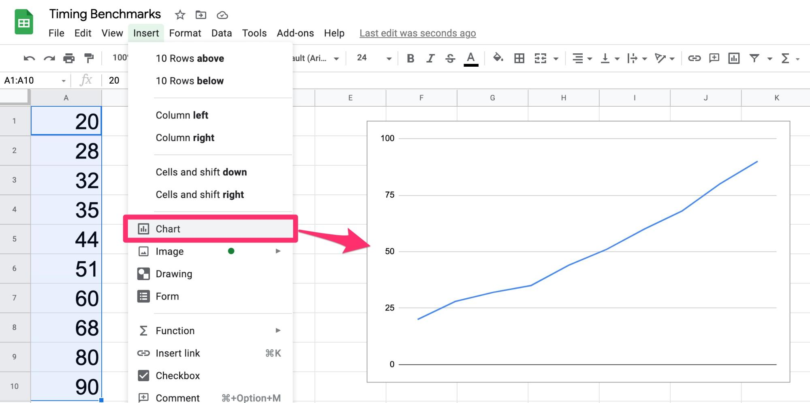
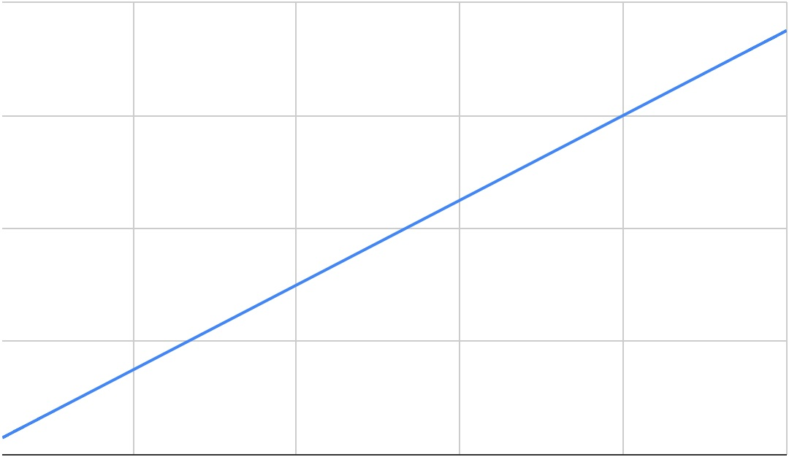
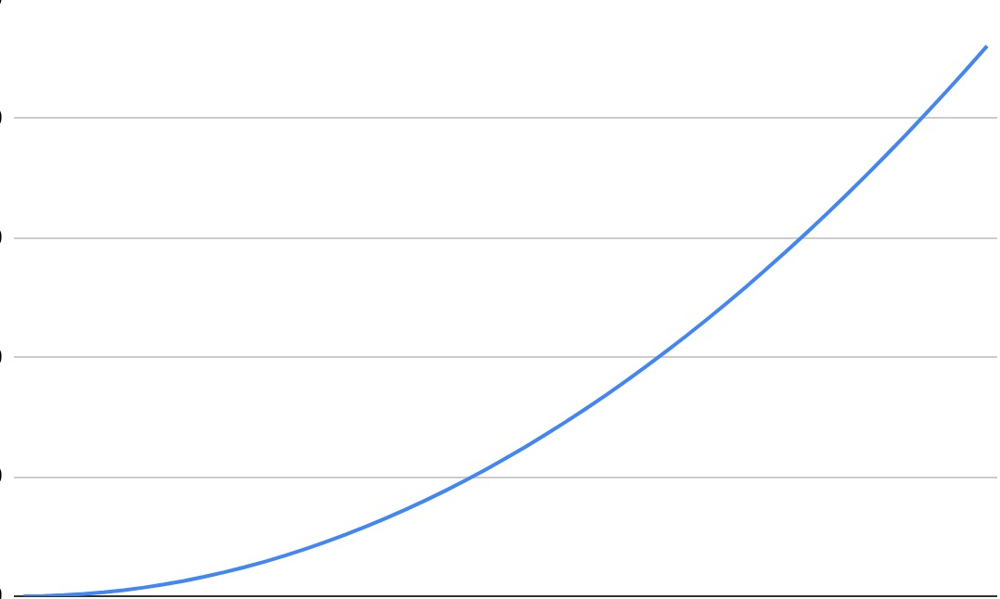
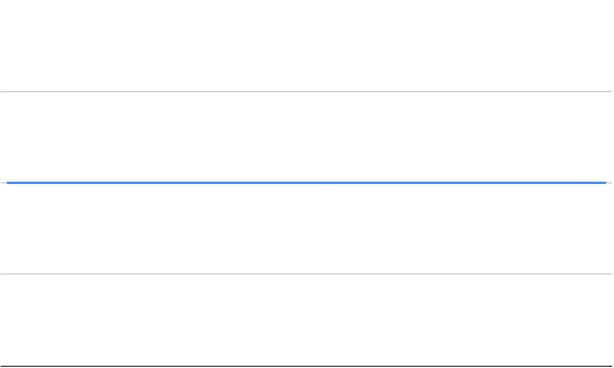
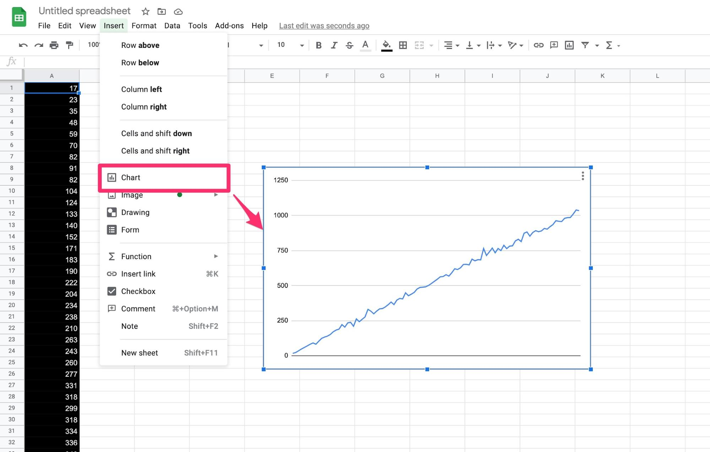
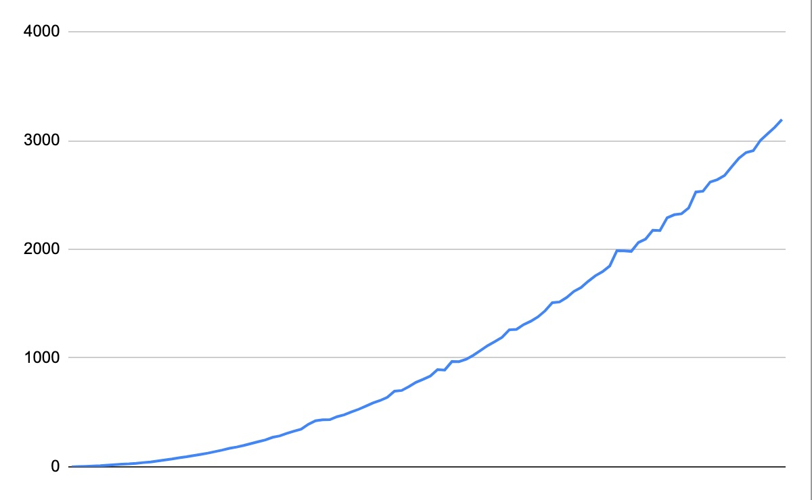

# Code Performance: Timing Benchmarks

One way of measuring your code's efficiency is to run a function and time how long it takes to complete. You can use these results to benchmark the relative performance of your function with various inputs.

## Computer Safety

In this section, you will be exploring the power and limitations of JavaScript and your computer's ability to execute it. Like any good scientist, you do this by running experiments, collecting data and building your knowledge.

As a result of pushing your computer's limits, you should run into situations where you cross past those limits. Don't worry! JavaScript is pretty safe. You won't do any damage to your computer by playing with code.

### ctrl + c: Halt code execution

What do you do if your code is running way too long? Maybe you have an infinite loop, or your numbers are just way too big. At any time, you can halt code execution by typing ctrl + c.

Start by opening a Node console by typing node into your terminal. Try writing some code that will take a long time to run. For example, try running a for-loop from 0 to 1 trillion.

```
for (let n = 0 ; n <= 1000000000000 ; n++) {
  // Do nothing
}


```

As this runs, your terminal will halt, preventing new commands from being issued. This can be a problem. Fortunately, you can hit ctrl + c at any time to exit out of any program currently executing in the terminal. This works in almost any command-line program. ctrl + c is your safety net.

In case ctrl + c does not work, you should also be able to force quit out of the terminal.

### Memory crashes

Modern computers are pretty good at isolating processes so it's rare to crash your computer from writing code. For example, try opening Node and adding 1 trillion integers to an array and see what happens.

```
let arr = [];
for (let n = 0 ; n <= 1000000000000 ; n++) {
  arr.push(n);
}


```

You should see an error like FATAL ERROR: invalid array length Allocation failed - JavaScript heap out of memory. FATAL ERROR sounds bad but all it means is that the program ran out of memory so it killed the process. There is no harm to your actual computer.

### Danger: Modifying your filesystem

One area where you can actually do serious damage to your computer is by modifying your filesystem. This includes creating or deleting important files on your hard drive, or downloading malicious software from the internet.

Be aware of what download, don't blindly copy/paste from Stack Overflow without understanding what you are doing and be EXTRA careful when deleting system files, particularly from the command line.

## Timing your code

Say you have written a function, addNums(n) that adds up every positive integer from 1 to n.

```
function addNums(n) {
  total = 0;

  for (let i = 1 ; i <= n ; i++) {
    total += i;
  }

  return total;
}


```

How long does this function take to run? It depends on the value of n. You will learn two JavaScript methods, console.time() and Date.now() to find out.

### console.time()

console.time() is a built-in function for measuring how long an operation takes. You can try this out by opening up a node terminal and typing console.time("Timer1") to start a timer. Optionally, we can use console.timeLog("Timer1") to see how many seconds have elapsed on that timer. We can even timeLog the same timer in multiple places. Finally, use console.timeEnd("Timer 1") to stop your timer.

```
console.time("Timer 1");

// wait a few seconds

console.timeLog("Timer 1");  // Timer 1: 5.446s

// Wait a bit more

console.timeEnd("Timer 1");  // Timer 1: 10.069s


```

This is a very clean way to get timing benchmarks. You can use this to calculate the runtime of your code. Let's see how long it takes to add up all numbers from one to one million.

```
console.time("addNums");
addNums(1000000);
console.timeEnd("addNums");


```

Try this in your console to see how long it takes on your computer. On mine, it runs between 12 and 16 milliseconds (1/1000th of a second).

While console.time is convenient for quick tests, the label and the time unit at the end make the data difficult to chart on a graph. Next, you will learn another way to track timing data, which can be easily charted in Google Sheets.

### Date.now()

Type Date.now() into a Node terminal and you will receive a large integer. This number represents the number of milliseconds (1/1000th of a second) since the morning of January 1st, 1970, a time also known as the Unix Epoch.

```
Date.now();  // 1608078354483


```

You can use this function to calculate the runtime of your code by storing the start time, running your code, then taking the difference of the end and start times. Let's see how many milliseconds it takes to add up all numbers from one to one million:

```
startTime = Date.now();
addNums(1000000);
endTime = Date.now();

console.log(startTime);  // 1608078573750
console.log(endTime);    // 1608078573765


```

Taking the difference between the end and start times will tell you how long the code took to run.

```
console.log(`Runtime: ${endTime - startTime}ms`);  // Runtime: 15ms


```

At 15 milliseconds, this function will appear to return instantly. For comparison, movie frames update every 42ms (24 frames per second) while high-end video games update every 17ms (60 frames per second). In that brief moment, the computer was able to perform one million addition operations. Not bad!

## Visualizing performance

It can help to visualize your code's performance on a graph. You can do this using Google Sheets.

```
let increment = 1000000
for (let n = increment ; n <= 10 * increment ; n += increment) {
  startTime = Date.now();
  addNums(n);
  endTime = Date.now();

  console.log(`${endTime - startTime}`);
}


```

This code will run addNums 10 times, in increments of 1 million. Running this code will print out the time, in milliseconds, it takes to add nums 1 through 1 million, 2 million, 3 million, etc.

```
20
28
32
35
44
51
60
68
80
90


```

Copy/paste these values into a Google Sheet, highlight them, then click the Insert menu and select Chart to display a graph of the runtimes.



This is a great way to visualize your code performance.

## What you learned

In this reading, you learned to measure your code's performance using console.log() and Date.now(). You also learned to chart that performance in Google sheets.

# Time Complexity: Big-O

You can measure the speed of code using timing benchmarks but there's a faster, more descriptive way of evaluating code performance at scale. Instead of running the code under various conditions and recording the results, you will instead learn to read code and determine the rate of growth through analysis. This is called complexity analysis and expressed using big-O notation.

In this reading, you will learn about three types of growth: linear, constant and quadratic.

## Big-O

The "O" in big-O stands for "order" which means that it is not concerned with exact values: instead, it is used to describe the general shape of the growth curve.

That growth can be linear.



It can be quadratic.



Or, it can be constant.



There are other variations but these are the three main growth curves that you should be concerned with for now. This reading will go through examples of each.

## Large ns

A key concept in big-O notation is that it is only concerned with very large values. Computers are so fast that even inefficient code usually returns almost instantly. Look at this function that adds two numbers together:

```
function addTwoNums(num1, num2) {

  let total = 0;

  for (let i = 0 ; i < num1 ; i++) {
    total += 1;
  }

  for (let i = 0 ; i < num2 ; i++) {
    total += 1;
  }

  return total;
}


```

This is definitely not the most efficient way to add two numbers together in JavaScript, but see what the timing tests reveal.

```
startTime = Date.now();
addTwoNums(1234, 5678);
endTime = Date.now();

console.log(`Runtime: ${endTime - startTime}ms`);  // Runtime: 2ms


```

Adding these numbers requires over 6000 operations, yet it returns in under 2 milliseconds. You can increase to tens of thousands, or even hundreds of thousands and it will return faster than you can blink. As you approach billions, you will notice more significant runtimes.

```
startTime = Date.now();
addTwoNums(1234567890, 1234567890);
endTime = Date.now();

console.log(`Runtime: ${endTime - startTime}ms`);  // Runtime: 2246ms


```

This is true of most code. As long as your ns are small, efficiency is usually a non-factor. However, as your ns grow, those inefficiencies are magnified. The steeper the curve, the faster the performance will degrade.

Notably, big tech companies like Facebook, Google, and Amazon place a lot of emphasis on big-O analysis in technical interviews because those companies have bigger ns than anyone else.

## Ignoring coefficients, insignificant factors

Back in algebra, you might have learned the formula y = mx + b to represent a line. The m coefficient is the slope of the line and b represents the y-intercept. With big-O analysis, you can ignore these details. All you care about is the most significant factor: the x.

This is because for very large values of x, the y-intercept is insignificant. Even if that constant factor is very large, it doesn't affect the shape of the curve. The slope is ignored too, since it is a constant factor with that does not affect the curve shape. In fact, all constant coefficients are treated as 1 in big-O notation.

This goes for polynomials as well. The equation for a quadratic curve is y = ax2 + bx + c. Setting the constant coefficients to 1 reduces the equation to y = x2 + x + 1. For very large values of x, the x2 factor is the overwhelming contributor to runtime so the x + 1 is simply ignored.

Big-O uses n instead of x but the idea is the same. Linear complexity ignores constant factors and quadratic complexity ignores linear factors. This means you only need to worry about three possibilities: O(1) (constant), O(n) (linear) and O(n2) (quadratic).

## Best case, worst case, average case

One final note on big-O analysis: Strictly speaking, it's possible that the performance of an algorithm depends on some amount of luck. For example, consider this function which searches an array for a target value.

```
function arraySearch(arr, target) {

  for (let i = 0 ; i < arr.length ; i++) {
    if (arr[i] === target) return true;
  }

  return false;
}


```

This works by iterating through each element of the array, front to back, and checks if the element matches the target. Once it finds a match, it instantly returns true and exits. If it gets to the end without finding a match, it returns false.

This algorithm will perform differently depending where the target resides in the array, or if it exists at all. In the best case, the target is the first element in the array and the function will return after only one comparison. In the worst case, the array doesn't contain the element at all and the function will iterate through the entire array before returning false.

The average case is a bit trickier to determine, but if the target value exists somewhere in the array, the function will visit half of the array on average to find it.

Technically, there are separate notations for best, average and worst case: Big-Ω (omega) for best case, big-Θ (theta) for average case and big-O for worst case. In practice, best-case analysis is mostly useless, and many use big-O to refer to the most common case, which usually refers to the average.

It may help to think of big-O analysis as linguistic tool for describing code performance to other humans, rather than a precise mathematical answer.

## Linear growth: O(n)

Take a look at this function which takes in a number n and returns the sum of all the positive integers less than it.

```
function addNums(n) {
  total = 0;

  for (let i = 1 ; i <= n ; i++) {
    total += i;
  }

  return total;
}


```

To determine how long this code takes to run, you can run it for different values of n and plot the results on a graph. That graph might look something like this:



These values aren't precise, though. Running the same code on a faster or slower computer will affect the results. The weather can affect performance too: computers perform best in cold, dry environments. Even running the same code on the same computer in the same environment will produce varied results. Running tests on slower functions may take an extreme amount of time to complete. For these reasons, timing benchmarks are not an ideal measure of general code performance.

Instead, you can use complexity analysis to determine the number of operations that are performed relative to the input size and describe the shape of the resulting growth curve.

In the case of addNums(), the critical operation here is the line, total += i;. Each individual addition operation may be fast but the amount of times it is executed is equal to the value of n. Doubling the value of n doubles the amount of add operations that are executed, thus doubling the runtime. This function has linear growth, or O(n) time complexity.

Generally speaking, anytime you have a for-loop that iterates through n elements, that block of code will be O(n).

## Constant growth: O(1)

For functions with constant growth, the runtime remains constant whether the input is large or small. Consider this function which adds together the first and last elements in an integer array.

```
function addFirstAndLast(nums) {

  const firstNum = nums[0];
  const lastNum = nums[nums.length - 1];

  return firstNum + lastNum;
}


```

It doesn't matter if the nums array contains 2 numbers or 2 million numbers, or if the numbers are large or small: addFirstAndLast will take the same amount of time to run no matter what the input size.

```
const twoNums = [999999999999, 999999999999];
const millionNums = [];
const twoMillionNums = [];

for (let i = 0 ; i < 1000000 ; i++) {
  millionNums.push(999999999999);
}

for (let i = 0 ; i < 2000000 ; i++) {
  twoMillionNums.push(999999999999);
}

startTime2 = Date.now();
addFirstAndLast(twoNums);
endTime2 = Date.now();

startTime1m = Date.now();
addFirstAndLast(millionNums);
endTime1m = Date.now();

startTime2m = Date.now();
addFirstAndLast(twoMillionNums);
endTime2m = Date.now();

console.log(`${endTime2  - startTime2 }`);   // 2ms
console.log(`${endTime1m - startTime1m}`);   // 1ms
console.log(`${endTime2m - startTime2m}`);   // 2ms


```

Your numbers may vary slightly but even though the last array contains 1 million times more elements than the first, it takes the same amount of time to grab the first and last elements from each. Adding large numbers takes roughly the same amount of time as adding small numbers. Finding the length of a large array takes the same time as finding the length of a small array.

Wait, doesn't counting 2 million elements take longer than counting 2 elements? Shouldn't the time complexity of array.length be linear? That would be true if the array elements were counted each time array.length is called. However, length is stored in the array object as meta-data and updated each time an element is added or removed. This allows array.length to return in constant time, regardless of the size of the array.

Most arithmetic and logic operations run in constant time. Creating and assigning variables too.

```
function printLetters() {
  const letters = "abcdefghijklmnopqrstuvwxyz";

  for (let i = 0 ; i < letters.length ; i++) {
    console.log(letters[i]);
  }
}


```

This printLetters function could be described as O(n), where n is the number of letters but since the number of letters is constant, it would more accurately be described as O(1).

## Quadratic growth: O(n2)

Consider the addManyNums function which takes a number, n and adds the result of addNums to the total instead.

```
function addManyNums(n) {

  let total = 0;

  for (let i = 0 ; i < n ; i++) {
    total += addNums(i);
  }

  return total;
}


```

This calls the addNums() function n times. Since addNums is O(n), this results in a function that does n things n times, for an overall time complexity of n * n, or O(n2). This is known as quadratic growth.

You may recall timing and plotting the performance of this function for values 1k to 100k which produces a curve that looks like this:



The shape of the curve matches a quadratic shape, which confirms the big-O analysis.

## Nested loops vs. constant loops vs. adjacent loops

Nested for-loops are a good way to identify a function that is O(n2). Be sure to look at the range of each loop though, because this can be misleading.

```
function printPairSums(n) {

  for (let i = 0 ; i < n ; i++) {

    for (let j = 0 ; j < n ; j++) {
      console.log(`${i} + ${j} = ${i + j}`);
    }

  }
}


```

printPairSums contains two nested loops, each of which run n times. This results in O(n2) time complexity.

```
function printTripleSums(n) {

  for (let i = 0 ; i < n ; i++) {

    for (let j = 0 ; j < n ; j++) {

      for (let k = 0 ; k < n ; k++) {
        console.log(`${i} + ${j} + ${k} = ${i + j + k}`);
      }
    }
  }
}


```

printTripleSums has three nested loops, each of which runs n times. This has a time complexity of O(n3), otherwise known as cubic growth. This is much less common than quadratic growth but still worth recognizing. This can be generalized as polynomial growth.

```
function printLettersNTimes(n) {

  const letters = "abcdefghijklmnopqrstuvwxyz";

  for (let i = 0 ; i < letters.length ; i++) {

    for (let j = 0 ; j < n ; j++) {
      console.log(letters[i]);
    }
  }
}


```

printLettersNTimes has two nested loops which might lead you to mistakenly identify this algorithm as having quadratic growth. The trick is that while the inner loop runs n times, the outer loop only runs 26 times. For n = 10, the function calls 26 * n = 260 prints. Since constant coefficients are ignored, this results in a time complexity of O(26n) which reduces to O(n).

```
function printNumbersTwice(n) {

  for (let i = 0 ; i < n ; i++) {
    console.log(i);
  }

  for (let j = 0 ; j < n ; j++) {
    console.log(j);
  }
}


```

printNumbersTwice has two adjacent loops. Since they are not nested, each loop is only executed once. Compare the number of outputs for printPairSums and printNumbersTwice for n = 10: printPairSums will print 100 lines while printNumbersTwice will print 20 lines. The former is O(n2) while the latter is O(2n), which reduces to O(n).

```
function printPairSumsThenPrintNums(n) {

  for (let i = 0 ; i < n ; i++) {

    for (let j = 0 ; j < n ; j++) {
      console.log(`${i} + ${j} = ${i + j}`);
    }
  }

  for (let k = 0 ; k < n ; k++) {
    console.log(k);
  }
}


```

This final example, printPairSumsThenPrintNums has two nested for-loops followed by a lone for-loop. All three loop n times. What is the time complexity of this function?

The nested loops have a time complexity of O(n2) while the lone loop is O(n). Adding these together results in a composite time complexity of O(n2 + n) but since we only care about the most significant factor, the n is ignored and the time complexity reduces to O(n2).

## What you've learned

In this reading, you learned all about time complexity, including how to express it using big-O notation, how to identify constant, linear and quadratic growth, how to reduce insignificant factors, and how to evaluate the overall complexity of composite functions. Whew!

# Space Complexity

Space complexity is closely related to time complexity. Both describe the performance of code in relation to the input size and both are expressed using big-O notation. The difference is that space complexity describes how much memory the function requires. In this reading, you will learn to identify the space complexity of various algorithms and see examples of constant, linear and quadratic space complexities.

## Constant space complexity: O(1)

Take a look at this addNums function. How much memory does it use?

```
function addNums(n) {
    let total = 0;

    for (let i = 1 ; i <= n ; i++) {
        total += i;
    }

    return total;
}


```

In order to figure this out, you could identify all the variables and add them up. In addition to the n integer argument, there is also an integer, total that stores the return value. There is also a variable, i, which stores the index used in the for-loop. It doesn't matter if n is large or small, or if the total is large or small, each integer occupies a constant amount of memory, meaning this function occupies a constant amount of memory too. This may change for extremely large values of n, like an integer with one million zeroes, but for reasonable numbers like n = one million (which only has six zeroes), the space remains constant.

Like with time complexity, the space complexity can be expressed using big-O notation which ignores constant coefficients. Thus, the memory required to store three variables reduces to a space complexity of O(1).

## Linear space complexity: O(n)

Take a look at this function, getNumList which returns an array containing every number from 0 to n-1.

```
function getNumList(n) {
    let nums = [];

    for (let i = 0 ; i < n ; i++) {
        nums.push(i);
    }

    return nums;
}


```

There are three variables here too: an array contains a total of n integers, and the single integers n and i. Unlike the single integers which require constant space, the array requires n slots to store n integers. This function requires enough memory to store n+2 integers, which reduces to a space complexity of O(n).

## Quadratic space complexity: O(n2)

```
function getNumPairsList(n) {
    let pairs = [];

    for (let i = 0 ; i < n ; i++) {
        for (let j = 0 ; j < n ; j++) {
            pairs.push([i, j]);
        }
    }

    return pairs;
}


```

This function takes a number, n and returns an array containing all possible number pairs from 0 to n-1. You might guess that this function has a time complexity of O(n2) from the nested for-loops, and you would be correct. From this, you can also deduce that n2 pairs are pushed into the pairs array. This results in a total of 2 * n2 + 2 integers stored, which reduces to a space complexity of O(n2).

You can verify this by running getNumPairsList(8).length, which should return 82 = 64.

## Modifying arrays in-place

In JavaScript, arrays and objects are passed to functions by reference. This means you can modify the array you are passed instead of creating a new one to optimize space. For example, take the following function, increaseByOne which takes an array of numbers as an argument and returns an array with each number increased by one.

```
function increaseByOne(nums) {

    const increased = [];

    for (let i = 0 ; i < nums.length ; i++) {
        increased.push(nums[i] + 1);
    }

    return increased;
}


```

Sure enough, testing it with an array of numbers returns an array with each value one greater. Since this function creates a new array, increased, which contains n elements, this function has a space complexity of O(n).

```
nums = [0, 1, 2, 3, 4, 5, 6, 7, 8, 9];

console.log(increaseByOne(nums));
// [1, 2, 3, 4, 5, 6, 7, 8, 9, 10]

console.log(nums);
// [0, 1, 2, 3, 4, 5, 6, 7, 8, 9]


```

Notice that the nums array still exists in its original form. Compare that to the following function which runs the same algorithm in-place.

```
function increaseByOneInPlace(nums) {

    for (let i = 0 ; i < nums.length ; i++) {
        nums[i]++;
    }

    return nums;
}

nums = [0, 1, 2, 3, 4, 5, 6, 7, 8, 9];

console.log(increaseByOneInPlace(nums));
// [1, 2, 3, 4, 5, 6, 7, 8, 9, 10]

console.log(nums);
// [1, 2, 3, 4, 5, 6, 7, 8, 9, 10]


```

The function returns the exact same array with each value incremented by one but accomplishes this without creating a new array. This gives increaseByOneInPlace a space complexity of O(1). Notice that the original nums array has been mutated as well.

While in-place algorithms are generally more space efficient, they may not be desired if you want to keep a clean copy of the original array. Before implementing the code, make sure you understand the problem, including the requirements and time/space constraints.

## What you learned

In this reading, you learned how to identify space complexity and to describe it using big-O notation. You saw examples of functions with constant, linear and quadratic space complexity and learned what it means to solve an array algorithm in-place.

# Truth and Logic

Computers are simple automata that run logical commands.

More specifically, computers are automata-wiki that automatically run commands based on their state. That state is stored in memory (i.e. random access memory, or RAM) and the commands are executed by a processor (i.e. central processing unit, or CPU). Modern computers also come with input and output devices (i.e. keyboard, mouse, screen, speakers, internet) that allow users to read and update that state.

When you write code, it is first translated into simplified machine instructions, loaded into memory, then executed by the processor. Those machine instructions can be categorized as either arithmetic and logic operations, or control flow. In this reading, you will be learning how basic arithmetic and logic operations can combine to create complex expressions. Finally, you will learn to simplify logic in a function.

## Logic and Truth Tables

The field of syllogistic logic dates back to the Greek philosopher, Aristotle. What truths can be inferred from two or more premises?

All humans are mortal. Socrates is a human. Therefore, Socrates is mortal.

Each of these statements can be expressed by a boolean: either true or false. Based on those boolean values, the syllogistic conclusions can be expressed with one or more logical operators: AND (&&), OR (||), and NOT (!). The conclusions can be represented with a truth table:

```
A       B        A && B
------------------------
false   false    false
false   true     false
true    false    false
true    true     true


```

This truth table shows the four possible combinations of A and B and the logical result of A && B. Since the && operator only returns true when both inputs are true, the results column only displays true when A and B are both true.

True and false can also be expressed with binary values 1 and 0.

```
A    B    A && B
----------------
0    0      0
0    1      0
1    0      0
1    1      1


```

You should also be familiar with the OR || truth table, which is true if either A or B is true.

```
A    B    A || B
----------------
0    0      0
0    1      1
1    0      1
1    1      1


```

Not ! flips the boolean, so true becomes false and false becomes true.

```
A   !A
---------
0    1
1    0


```

Multiple expressions can be combined to create compound logic. For example, here is an expression for NAND, or not+and. NAND is the opposite of AND, returning false only when A and B are both true.

```
A    B    A && B    !(A && B)
-----------------------------
0    0      0           1
0    1      0           1
1    0      0           1
1    1      1           0


```

To solve compound logical expressions, you can break them down to individual expressions and solve from there. For example, to compute the truth table for !A || !B, first generate the truth table for !A and !B, then compare those columns with an ||.

```
A    B   !A   !B    !A || !B
-----------------------------
0    0    1    1       1
0    1    1    0       1
1    0    0    1       1
1    1    0    0       0


```

Since || only returns false when both inputs are false and ! flips every true to false, !A || !B returns true unless A and B are both true.

Notice that !(A && B) and !A || !B result in identical truth tables which means these statements are logically equivalent. You have just proven De Morgan's Law!

## XOR

The logical OR || doesn't quite work like you might expect. In English, a statement like, "I am either happy or hungry," implies that if you are happy, you are not hungry and if you are hungry, you are not happy. Unfortunately, the logical OR returns true if either statement is true which implies you can be happy and hungry at the same time: a logical fallacy.

The way to express this formally is to use the XOR operator, otherwise known as exclusive-or. Not to be confused with exponents, XOR is represented with the ^ symbol in many programming languages like JavaScript.

```
A    B    A ^ B
----------------
0    0      0
0    1      1
1    0      1
1    1      0


```

This XOR truth table better expresses the happy/hungry dichotomy. The statement is true if and only if you are happy and not hungry, or hungry and not happy. Note that you could also represent this statement with the expression (A && !B) || (!A && B) but simple logic is always preferable.

## What you learned

In this reading, you learned how to display the comprehensive results of a logical expression using truth tables and how to determine logical equivalence.

# Simplifying Logic

Logical equivalence can be used to simplify and condense your code to make fewer, more readable lines of code. This reading will show you an example of how to use logical equivalence to make your code simpler.

## Counting to Zero

Say you wanted to write a function that takes in a number and counts from that number to zero. The number can be positive or negative, integer or non-integer. If it's not an integer, the first count removes the decimal.

```
countToZero(5);
5
4
3
2
1
0


countToZero(-5);
-5
-4
-3
-2
-1
0


countToZero(5.5);
5.5
5
4
3
2
1
0


```

To write this function, you need to consider a few different cases.

If the number is a positive non-integer, print the number then subtract the non-integer part and continue the countdown.

If the number is a negative non-integer, print the number then add the negative non-integer part and continue the countdown.

If the number is a positive integer, print the number and subtract 1, then continue the countdown.

If the number is a negative integer, print the number and add 1, then continue the countdown.

If the number is 0, print 0 and you're done.

In order to test these conditions, you need to determine whether the number is an integer or not. You can test this using the modulo operator. Any integer modulo 1 will return 0.

```
function isInt(n) {
    if (n % 1 === 0) return true;

    if (n % 1 !== 0) return false;
}


```

Using isInt, you can express the previously described logic in code.

```
function countToZero(n) {

    // If the number is a positive non-integer
    if (n > 0 && !isInt(n)) {
        // print the number
        console.log(n);
        // then subtract the non-integer part
        let nextN = n - n % 1
        // and continue the countdown.
        countToZero(nextN);
    }

    // If the number is a negative non-integer
    if (n < 0 && !isInt(n)) {
        // print the number
        console.log(n);
        // then add the negative non-integer part
        let nextN = n + -(n % 1)
        // and continue the countdown.
        countToZero(nextN);
    }

    // If the number is a positive integer
    if (n > 0 && isInt(n)) {
        // print the number
        console.log(n);
        // and subtract 1
        let nextN = n - 1;
        // then continue the countdown.
        countToZero(nextN);
    }

    // If the number is a negative integer
    if (n < 0 && isInt(n)) {
        // print the number
        console.log(n);
        // and add 1
        let nextN = n + 1;
        // then continue the countdown.
        countToZero(nextN);
    }

    // If the number is 0
    if (n === 0) {
        // print 0
        console.log(0);
        // and you're done.
    }
}


```

This solution works as expected but is rather verbose. Using logic, the code can be simplified. Take a moment to try simplifying the code yourself before moving on to the solution.

First, you might notice that each conditional block starts with console.log(n) except the last, which prints console.log(0). However, the last block occurs when n === 0, so this can be simplified by putting console.log(n) at the very top of the function.

Next, you might realize that modulo returns a negative value for negative numbers and 0 for integers. Whether the number is negative or positive, the amount to decrement for a non-integer will always be n % 1.

Finally, if the modulo is exactly zero, you know that n is an integer which means the decrement should be 1 for a positive number or -1 for a negative number. You can find that by dividing the number by its absolute value.

```
function countToZero(n) {

    // Print the number
    console.log(n);

    // Base case: end on zero
    if (n === 0) return;

    // Decrement the non-integer part for non-integers
    let decrement = n % 1;

    // If the number is an integer, decrement by 1 * the sign of n
    if (decrement === 0) {
        decrement = n / Math.abs(n);
    }

    // Recurse
    countToZero(n - decrement);
}


```

Much simpler!

## What you learned

In this reading, you learned how to simplify logic in your code.

# Intro To Number Bases: Binary, Decimal, and Hexadecimal

There are 10 types of people in this world: those who can read binary and those who can't. After this reading, you will be able to:

- Understand core concepts of binary
- Explore conversion of decimal, binary, hexadecimal, and ASCII values
- Use built-in JavaScript conversion methods

## Base-10: Decimal

You already know this one. Everyone learns to count in base-10 from an early age. The "base" refers to how many digits there are in the counting system: 0-9 in this case. Once you get to the last digit, you simply increment the next digit to the left by one and start the first digit from 0.

```
00
01
02
03
04
05
06
07
08
09
10
11
12


```

This pattern continues for each digit in the number. So, when you count up one from 99, the right-most digit returns to 0, and the next, a 9, increases by 1, which returns it to 0 and the next digit increments from 0 to 1, resulting in the number 100. Easy, right? Keep this pattern in mind because it's the same for every number base.

## Base-2: Binary

Binary is another word for base-2. In this base, there are only two digits: 0 and 1. You may have heard the phrase, "computers are all 1s and 0s," which is relevant because all values on a computer are stored in base-2.

You may be familiar with the word bits which is short for "binary digits". A group of 8 bits is also known as a byte. (More on this later.)

So how does counting in binary work? Turns out, exactly the same as counting in decimal. Let's count to five in binary:

```
0000 (0)
0001 (1)
0010 (2)
0011 (3)
0100 (4)
0101 (5)
0110 (6)
0111 (7)
1000 (8)


```

0 and 1 are the same in base-2 as base-10 but then it runs out of digits. So, the right-most digit returns to 0 and the digit to the left increments by 1, the right-most digit returns to 0, and the digit to the left increments by 1, which is why the number 2 in binary is 10. (Now you can understand the joke at the start of this reading!) This pattern continues as you count upward.

To avoid confusion, binary numbers are often represented with 0b at the beginning: So the number 8 in binary would be written as 0b1000 to differentiate from the decimal value 1000 which is one thousand.

## Translating from binary to decimal

It's possible to translate from binary to a decimal using a simple formula.

Take the base-10 number, 1234. How do you know what amount this represents? You can use this formula:

Multiply each digit by the number base raised to the nth power, where n is its position starting from the right. Then, add all of the results together

The right-most digit is position 0, base 10 and value 4, or 100 * 4. 10 to the power of 0 is 1, so this equals 4 * 1 or just 4.

The next digit is position 1, base 10 and value 3, 101 * 3, which equals 10 * 3 or 30. The last two are 102 * 2 = 100 * 2 = 200 and 103 * 1 = 1000 * 1 = 1000. Adding all of these up gives 4 + 30 + 200 + 1000 = 1234.

Once again, this exact formula works for binary. Consider the binary number, 0b11001010. The base is 2, so plugging in values gives:

```
2
```

Adding these up gives 2 + 8 + 64 + 128 = 202. So, 0b11001010 in binary is equal to 202 in decimal. You can verify this by typing 0b11001010 into your JavaScript console, which will return the decimal value.

To convert 202 to binary, you can use the following formula:

Divide by the base and keep track of the remainder. The invidiual remainder values will correspond with the position with each digit value.

```
// r is our remainder

202/2 = 101 r0 <-- right most binary digit (Least Significant Bit)
101/2 = 50 r1
50/2 = 25 r0
25/2 = 12 r1
12/2 = 6 r0
6/2 = 3 r0
3/2 = 1 r1
1/2 = 0 r1 <-- left most binary digit (Most Significant Bit)

202 = 0b11001010


```

You will see these forumlas also work with the next base number explored below.

## Base-16: Hexadecimal

The third common number base in computer science is base-16, or hexadecimal (hex is 6, dec is 10). The digits are 0-9 with A, B, C, D, E, and F representing 10, 11, 12, 13, 14, and 15, respectively. Hexadecimal numbers (sometimes called 'hex' for short) are prepended with an 0x to differentiate them as base-16.

Hexadecimal is often used as shorthand for representing binary values: one hex digit can represent four bits.

```
0 = 0b0000 = 0x0
 1 = 0b0001 = 0x1
 2 = 0b0010 = 0x2
 3 = 0b0011 = 0x3
 4 = 0b0100 = 0x4
 5 = 0b0101 = 0x5
 6 = 0b0110 = 0x6
 7 = 0b0111 = 0x7
 8 = 0b1000 = 0x8
 9 = 0b1001 = 0x9
10 = 0b1010 = 0xA
11 = 0b1011 = 0xB
12 = 0b1100 = 0xC
13 = 0b1101 = 0xD
14 = 0b1110 = 0xE
15 = 0b1111 = 0xF


```

You can use the same formula to translate from hexadecimal to decimal as from binary. Take the hex number 0xF23C. What is the decimal value?

```
16
```

Adding these values up 61440 + 512 + 48 + 12 returns 62012 which you can verify in the JavaScript console.

To convert decimal to hexadecimal, you can use the same formula described above with converting decimal to binary. Divide by the base, 16, keeping track of the remainder.

```
r = remainder

62012/16 = 3875 r12 = C <-- right most digit
3875/16 = 242 r3 = 3
242/16 = 15 r2 = 2
15/16 = 0 r15 = F <-- left most digit

62012 = 0xF23C


```

## Bytes, kilobytes, megabytes, gigabytes, terabytes

Binary digits are called bits. If you recall, one byte is equivalent to eight bits. A kilobyte is equivalent to one thousand bytes, a megabyte is one million bytes, a gigabyte is one billion bytes, and so on.

```
kilo - thousand
mega - million
giga - billion
tera - trillion
peta - quadrillion
exa - quintillion
zetta - sextillion
yotta - septillion


```

## Representing letters in binary

So far you've seen how to represent any type of integer in binary. Since computers are all 1s and 0s, this is important. What about other data types, like letters/characters?

To represent characters, each byte value is matched up with a character according to a standard encoding. The most common English standard is ASCII, which stands for "American Standard Code for Information Interchange".

Here, you can see the mapping between characters and byte values. So, the string "ABC" would be stored in memory as 0100 0001 0100 0010 0100 0011, requiring three bytes of memory.

Using more bytes, even more characters can be represented: The Unicode standard includes over 100 thousand characters, including those in different languages and even emoji.

## Built-in JavaScript conversion methods

There are several built-in JavaScript conversion methods can be used for converting binary. Each one has its specific use cases.

### String.fromCharCode()

You can return a string from the specified sequence of UTF-16 code units by using the String.fromCharCode() method.

```
String.fromCharCode(65); // A;
String.fromCharCode(66); // B;
String.fromCharCode(67); // C;


```

### String.protoype.charCodeAt()

You can also return an integer between 0 and 65536 representing the UTF-16 code unit at a given index with the String.prototype.charCodeAt() method.

```
const str = 'ABC';
const str = 'ABC';
str.charCodeAt(0); // 65
str.charCodeAt(1); // 66
str.charCodeAt(2); // 67


```

### Convert binary and hexadecimal to base 10 and back

The parseInt() function parses a string argument and returns an Base-10 integer.

```
parseInt('a1', 16);  // 161
parseInt(`1011`, 2); // 11


```

The toString() method can be used to convert the Base-10 number to its respective binary and hexadecimal values.

```
const decimal = parseInt('a1', 16); // 161
const hexadecimal = decimal.toString(16); // 'a1'
const binary = decimal.toString(2) // '10100001'


```

## What you've learned

In this reading, you've learned how numbers can be represented in different bases, including base-10 (decimal), base-2 (binary) and base-16 (hexadecimal). You've also learned how different values like letters can be represented in binary, and how to use built-in JavaScript conversion methods to manipulate those binary values.

# Memory

Memory is a key component in all computers. It stores the state of every program along with the code itself. Every variable, every array, every line of code is stored in memory. So, what is memory?

## RAM

Memory generally refers to RAM, or "random access memory". RAM is a hardware component in every computer that stores data for programs currently in use, including the operating system and background processes. It does not refer to hard drives or solid state drives which are for long term, persistent data storage.

A few key differences between RAM and drive storage is that RAM is much faster, but also more expensive per bit. RAM also requires an active power source while a hard drive can persist data without any power. Many hard drives store data on a physical disc with a tracking head to read and write data, which is both slow and prone to mechanical failure. These are slowly being phased out for more reliable and faster SSDs (solid state drives).

Other than price, performance and power requirements, a hard drive is functionally identical to RAM: Both store data as a long series of bits (1s and 0s) that can be read and written. In fact, if your computer runs out of RAM it will use the hard drive instead, which is why your computer may run slowly with too many programs open.

## Turing Machines

Modern computers are a form of Turing machine.

Invented by Alan Turing in 1936, Turing machines consist of an infinitely long strip of memory tape divided into cells and a mechanical processor that moves along the tape. The processor can run a specific set of operations: reading and writing values from the tape, basic arithmetic and logic, conditional branching (if/else), and conditional iteration (for/while loops).

While simple in concept and definition, Turing machines are extremely powerful. With just these simple operations and plenty of time, a Turing machine can compute anything a modern computer can. In fact, modern computers still follow this same computation model. Modern programming languages are considered Turing Complete if they can simulate all functionality of a Turing machine.

In particular, the Central Processing Unit (CPU) in your computer can run these same basic commands (plus a few more), reading and writing from RAM. In a physical computer, RAM is not infinite, but with billions of memory cells (1gb of RAM is 1 billion bytes) it's usually more than enough to simulate a Turing machine.

When high-level code in languages like JavaScript and Python are executed, they are first translated to binary machine code instructions that can be executed by the processor. Each CPU chip has its own set of instructions which is why there are separate executables and compilers for different processors.

Remember this as you learn new languages: No matter what language you use, your code gets translated to machine instructions before execution. Notably, anything you can compute in JavaScript can also be computed in Python, Ruby, C, Fortran, Assembly or any other Turing Complete language.

## Memory addresses, pointers, references

Following the Turing machine model, you can think of memory as a long strip of cells. Each cell either contains some electric charge (1) or no charge (0). Each cell is divided into chunks called words which are the default data size of the processor: an 8-bit architecture will have 8-bit words, a 64-bit architecture will have 64-bit words, etc. Each word is indexed by a memory address, also known as a memory pointer or memory reference.

Let's take a look at a hypothetical slice of memory in an 8-bit processor.

```
104      105      106      107
00000000 00000000 00000000 00000000

108      109      110      111
00000000 00000000 00000000 00000000

112      113      114      115
00000000 00000000 00000000 00000000

116      117      118      119
00000000 00000000 00000000 00000000


```

Say you want a variable stored in the memory address 104 that points to a string, "ABC". The string itself is stored in memory address 112. To write this into memory, first you must translate 112 and "ABC" to binary.

64 + 32 + 16 = 112, so the binary representation of 112 would be 0b01110000. Looking up the letters, A, B and C in ASCII gives you 0b10000001, 0b10000010 and 0b10000011. Once those values are written into memory, it now looks like this:

```
104      105      106      107
01110000 00000000 00000000 00000000

108      109      110      111
00000000 00000000 00000000 00000000

112      113      114      115
10000001 10000010 10000011 00000000

116      117      118      119
00000000 00000000 00000000 00000000


```

In hardware, the second, third and fourth cell in the 104th chunk of memory are holding an electrical charge. Interpreting those values as a memory address will take you to chunk 112, which is interpreted as the string of characters, "ABC".

It's important to remember that each memory cell has no idea what "type" of data it represents. That data is stored elsewhere in the program. If you were to interpret the memory address in 104 as an integer they would read 112, or as a character would be "p".

## Speed of memory access

One major difference between a modern computer and a Turing machine is that moving between memory cells takes no time at all. It takes the same amount of time to visit the 0th block as it does the 1 billionth block and no time at all to jump between them.

This may seem like magic but is actually accomplished by a binary tree routing system. (You'll learn more about binary trees soon!) Essentially, a 0 means traveling down the left branch while a 1 means traveling down the right branch. Take a look at this diagram:

```
        __ Start __
       /             \
      0               1
   /     \         /     \
  0       1       0       1
 / \     / \     / \     / \
0   1   0   1   0   1   0   1
|   |   |   |   |   |   |   |
0   1   2   3   4   5   6   7


```

In this 3-bit memory block, visiting cell 0 (0b000) requires traveling down the left path three times. Visiting 5 (0b101) requires a right, a left, then another right. 7 (0b111) is three rights. For large numbers or small, the same amount of travel is required. In a 32-bit architecture, memory block 0 requires 32 lefts and block 4294967295 requires 32-rights.

Even though this may seem like a lot of branches, the charged bits act as switches which automatically route the electrical current. Electricity travels close to the speed of light and the distance is very small so this occurs almost instantaneously.

## What you've learned

In this reading, you've learned how memory works at theoretical, conceptual and practical levels. You've also learned how a memory address is represented in memory and how the computer routes to that location in constant time.
