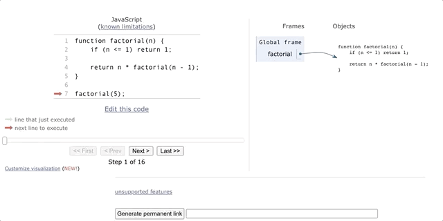

# Arrays: Under the hood

By now, you are familiar with the array data structure. You have used arrays to store and access lists of data, used functions like push() and unshift() to add values, square bracket notation to read and write values by index, for-loops to iterate through each value, and much more.

Arrays are the most fundamental of all data structures. They are ubiquitous in all fields of computing due to their absolute elegance and efficiency. They even show up in places you might not expect: A string, for example, is an array of characters in memory.

Arrays are the most time and space efficient way to store data and should be thoroughly understood. In this reading, you will learn how they work.

## What is an Array?

Start by reading this definition:

An array is a sequence of elements of the same type stored in a contiguous block of memory.

Now, read it again.

An array is a sequence of elements of the same type stored in a contiguous block of memory.

Pause and think about this definition for a moment. What does each part mean? Let's break it down.

## Array representation in memory

Say you create an array containing four 32-bit integers.

```
arr = [255, 256, 43690, 1431655765]


```

How is this represented in memory?

32-bits tells us that each of the integers, large or small, requires four bytes of storage space. 255 takes up the same amount of space as 1431655765. Therefore, you know that storing these four integers would require 16 bytes of memory. An array containing [0, 0, 0, 0] would require 16 bytes too.

When this line of code runs, it requests 16 bytes of memory from the operating system. If the OS approves the request, it returns a memory address and read/write access to the 16 bytes starting from that address.

```
104      105      106      107
00000000 00000000 00000000 00000000

108      109      110      111
00000000 00000000 00000000 00000000

112      113      114      115
00000000 00000000 00000000 00000000

116      117      118      119
00000000 00000000 00000000 00000000


```

In this diagram, the numbers are the memory address (starting from the 104th byte of memory) and the 0s are the bits in each memory cell. Here, the memory is given as all zeroes but you might actually receive memory with values leftover from the previous occupants. This is fine since you will be overwriting those values anyway.

Since memory is a binary sequence, the values must be translated from base-10 to base-2 before they can be stored.

```
      255 ---> 00000000 00000000 00000000 11111111
       256 ---> 00000000 00000000 00000001 00000000
     43690 ---> 00000000 00000000 10101010 10101010
1431655765 ---> 01010101 01010101 01010101 01010101


```

Notice that all 32 bits are represented, even for smaller numbers.

After translation, the values can finally be written into the memory allocated to the array.

```
104      105      106      107
00000000 00000000 00000000 11111111

108      109      110      111
00000000 00000000 00000001 00000000

112      113      114      115
00000000 00000000 10101010 10101010

116      117      118      119
01010101 01010101 01010101 01010101


```

Recall this definition of an array:

An array is a sequence of elements of the same type stored in a contiguous block of memory.

From this diagram and definition, you can see that arrays are an optimally space-efficient way to store data, packed side-to-side with no wasted memory.

## Array indexing

Not only are arrays the most space efficient method of data storage, they also allow the fastest method of access via indexing.

```
arr = [255, 256, 43690, 1431655765]


```

Say you want to access the third item in this array. You know that indexing starts counting from 0, so you call arr[2] which returns 43690. How does this work underneath the hood?

When you access an array value at an index, the code runs this equation:

valueAddress = startAddress + index * sizeof(dataType)

In our example, the array starts at memory address 104, the index is 2 and the size of the data is 32-bits, or 4 bytes. Plugging this into the equation places the value at 104 + 2 * 4, or memory address 112. Examining the memory diagram confirms that the four bytes starting from address 112 are 00000000 00000000 10101010 10101010, which is 43690 in base-10.

Note that this indexing equation takes the same amount of operations regardless of the array size: one multiplication, one addition, and memory access. All are extremely fast and run in constant time. This is why array indexing is an O(1) operation, and the fastest way to access data in a collection. Incidentally, this is also why array indices start from 0 instead of 1.

Think back to the array definition:

An array is a sequence of elements of the same type stored in a contiguous block of memory.

All three parts of this definition are required for the O(1) indexing equation. Since indices are found by the offset, the entire array must occupy a contiguous block of memory. Since the offset is calculated by multiplying the data size, all items in the array must be of the same data type. Since the indices are numerical, the array must be stored in an ordered sequence.

## Arrays in different programming languages

By now, you might have noticed some contradictions between this array defintion and the JavaScript arrays you are familiar with. After all, JavaScript allows you to store multiple data types in a single array, like [1, 2.0, "3", true, undefined]. Are JavaScript arrays different from the arrays described in this reading?

Well, yes and no. Every programming language has its own unique array implementation which builds on top of this basic functionality. The way JavaScript and other dynamically-typed languages like Python and Ruby achieve mixed array types is because each value is stored as a generic data object whose type and value is interpreted at runtime. The array itself actually contains a sequence of pointers (i.e. memory addresses) which all have the same data size. This allows more flexibility at the expense of some extra memory, which is used to store the pointers and object metadata.

JavaScript arrays are particularly wonky as they use yet another layer of abstraction: they are actually hash tables underneath the hood. You know these as key-value objects {} which you will learn about soon. In the meantime, it will benefit you to treat JavaScript arrays as if they are normal arrays in code.

## What you learned

In this reading, you learned the definition of an array, how they are represented in memory, and how they perform access and indexing in constant time. You have also gained some insight into the limitations of arrays including how features like multi-type arrays are implemented in various programming languages.

# Dynamic Arrays

An array is a sequence of elements of the same type stored in a contiguous block of memory.

Previously, you have learned this definition of an array and how it is represented in memory. However, due to how memory is allocated by the operating system, this only works for arrays of fixed size. High-level languages like Python, JavaScript and Ruby come with built-in functions to add and remove array values automatically. Though, just because it happens automatically, it doesn't mean there aren't costs. In this reading, you will learn about the functionality of dynamic arrays and the costs of each method.

## Array resizing

Let's start with this previous array example: arr = [255, 256, 43690, 1431655765] and say we want to push another value to the end of the array using arr.push(1). How does this work?

If you recall the previous memory example, the process was to request 16 bytes of memory from the operating system and fill in the four array values:

```
104      105      106      107
00000000 00000000 00000000 11111111

108      109      110      111
00000000 00000000 00000001 00000000

112      113      114      115
00000000 00000000 10101010 10101010

116      117      118      119
01010101 01010101 01010101 01010101


```

The OS has granted the program permission to read and write 16 bytes: 104-119. Trying to write the new value into the next four bytes of memory (120-123) will violate memory permissions and throw a segmentation fault error. You might be able to request access to those bytes of memory but unfortunately, there is no way to guarantee that they will be free. The OS might have assigned that memory to another function. Instead, the array needs to resize.

To do this, the program requests 20 new bytes of memory, copies the old values into the new slots, writes the new value into the last slot, then frees the old memory back to the OS, ready to be reassigned at a later time. So, the new memory would look something like this:

```
200      201      202      203
00000000 00000000 00000000 11111111

204      205      206      207
00000000 00000000 00000001 00000000

208      209      212      211
00000000 00000000 10101010 10101010

212      213      214      215
01010101 01010101 01010101 01010101

216      217      218      219
00000000 00000000 00000000 00000001


```

Each value must be copied from the old memory to the new allocation one at a time which makes resizing an O(n) operation, where n is the length of the array. As you might imagine, if the array is very large, this is a fairly slow process.

## Overallocation to speed up resizing

Pushing to an array is very common and should be as efficient as possible. Turns out, it is possible to trade space (memory) for time (speed) by overallocating memory when creating arrays.

In the previous example, the array grew from length 4 to 5 so the program requested a memory block that could fit 5 integers. The next time a value is pushed to the array, it would need to request 6 slots and copy each value to the new memory, then 7 for the next, and so on. Instead, when a resize occurs, the program will generally request more memory than is needed. Instead of 5, it will resize to 8.

Now with 8 slots, the array will look like this from the programmer's perspective:

```
[ 255, 256, 43690, 1431655765, 1 ]


```

but it will actually hold this in memory:

```
[ 255, 256, 43690, 1431655765, 1, <empty>, <empty>, <empty> ]


```

Now, pushing three more values is just a matter of writing over the empty slots, which is O(1). Pushing a 9th value will require another resizing operation but now the program will request 16 slots and the next 7 pushes will all be O(1).

Due to overallocation, the larger the array grows, the less frequently resizing occurs. Because of this, and since big-O only matters for large values of n, push() is considered an O(1) operation.

## Testing overallocation

It's possible to verify the cost of resizing using timing benchmarks. Consider these two functions:

```
function addToBack(n) {
    const arr = [];
    for (let i = 0 ; i < n ; i++) {
        arr.push(i+1);
    }
    return arr;
}

function addToFrontPreallocated(n) {
    // Preallocate n slots of memory in an array
    const arr = new Array(n);
    for (let i = 0 ; i < n ; i++) {
        arr[i] = i + 1;
    }
    return arr;
}


```

Both of these functions do the same thing: Given a number n, fill an array with integers 1 through n. addToBack() does this with push() while addToFrontPreallocated() preallocates the memory and fills it in using indexing. Let's compare the performance:

```
n = 10000000;

startTimeBack = Date.now();
arr = addToBack(n);
endTimeBack = Date.now();

startTimePre = Date.now();
arr = addToFrontPreallocated(n);
endTimePre = Date.now();

console.log("addToBack(" + n + ") = " + (endTimeBack - startTimeBack) + "ms");

console.log("addToFrontPreallocated(" + n + ") = " + (endTimePre - startTimePre) + "ms");

// addToBack(10000000) = 292ms
// addToFrontPreallocated(10000000) = 82ms


```

The runtimes may vary on your computer but preallocating memory is consistently faster. Note that this for n = 10 million: For smaller values of n, the difference is hardly noticable.

## push() vs unshift() vs splice()

You've seen that adding to the back of an array via push() is O(1). How about adding to the front of an array using unshift()? Let's take the original array of arr = [255, 256, 43690, 1431655765, 1] and add a 0 to the front. Assume we have 8 blocks of allocated memory starting from byte 200 to 231.

Just like you cannot add to the end of an array without free memory, you also cannot occupy the previous memory block without permission. We have free space at the end of the array but that doesn't help you add to the front. First, you need to shift all of the array values to the right by 1, then add the new value to the front. arr.unshift(0) would look something like this underneath the hood:

```
[255, 256, 43690, 1431655765, 1, <empty>, <empty>, <empty>]    // Start
[255, 256, 43690, 1431655765, 1, 1, <empty>, <empty>]          // Shift 1
[255, 256, 43690, 1431655765, 1431655765, 1, <empty>, <empty>] // Shift 1431655765
[255, 256, 43690, 43690, 1431655765, 1, <empty>, <empty>]      // Shift 43690
[255, 256, 256, 43690, 1431655765, 1, <empty>, <empty>]        // Shift 256
[255, 255, 256, 43690, 1431655765, 1, <empty>, <empty>]        // Shift 255
[0, 255, 256, 43690, 1431655765, 1, <empty>, <empty>]          // Overwrite first element to 0


```

This requires 5 shifting steps for the array of length 5, or n steps for an array of length n. Therefore, unshift() is an O(n) operation. The same applies for shift(), which removes the first value and moves each other value to the left by one for O(n).

How about adding or removing values from the middle of an array using splice()? Splicing a value at the end is the same as push() and at the beginning is the same as unshift(). Splicing exactly in the middle requires shifting every element after the midpoint for n/2 steps. Since big-O ignores constant coefficients like 1/2, splice() is considered O(n) as well.

## Testing push() vs unshift()

According to this theoretical analysis, push() is O(1) and unshift() is O(n). Let's verify this with another timing test.

```
function addToBack(n) {
    const arr = [];
    for (let i = 0 ; i < n ; i++) {
        arr.push(i+1);
    }
    return arr;
}

function addToFront(n) {
    const arr = [];
    for (let i = 0 ; i < n ; i++) {
        arr.unshift(n - i);
    }
    return arr;
}


```

Both of these functions do the exact same thing: Filling an array with integers 1 through n. Take a moment to evaluate the time complexities of these functions.

Done? addToBack() calls the O(1) push() function inside a for-loop which makes the function O(n). addToFront() calls the O(n) unshift() inside a for-loop, which makes it O(n2). Take a moment and ask a question if you are not sure why this is.

Now run a test to see if the actual runtime matches your expectations.

```
n = 50000;

startTimeBack = Date.now();
arr = addToBack(n);
endTimeBack = Date.now();

startTimeFront = Date.now();
arr = addToFront(n);
endTimeFront = Date.now();

console.log("addToBack(" + n + ") = " + (endTimeBack - startTimeBack) + "ms");

console.log("addToFront(" + n + ") = " + (endTimeFront - startTimeFront) + "ms");

// addToBack(50000) = 4ms
// addToFront(50000) = 194ms


```

For a mere n = 50k, addToFront() is almost 50x slower than addToBack()! Now try n = 100k.

```
n = 100000;

startTimeBack = Date.now();
arr = addToBack(n);
endTimeBack = Date.now();

startTimeFront = Date.now();
arr = addToFront(n);
endTimeFront = Date.now();

console.log("addToBack(" + n + ") = " + (endTimeBack - startTimeBack) + "ms");

console.log("addToFront(" + n + ") = " + (endTimeFront - startTimeFront) + "ms");

// addToBack(100000) = 5ms
// addToFront(100000) = 895ms


```

Doubling the input size, addToBack() hardly increased at all but addToFront() runtime increased by over 4x! This correlates with the expected n2 growth rate. Try this out yourself with different values of n.

## What you've learned

In this reading, you've learned how dynamic arrays work to overcome the contiguous memory limitation of standard arrays with dynamic resizing. You have also learned how the array functions, shift and unshift perform compared to push and pop.

# Stacks

Abstraction is everywhere in computer science. Array functions like shift() and splice() abstract away details like allocating memory, resizing and rearranging elements to a single line of JavaScript code. This allows programmers to ignore underlying complexity and approach code from a higher level.

In this reading, you will learn about stacks. Stacks are an abstract data type (ADT) that store a collection of data with one simple rule: Last in, first out. Unlike data structures, ADTs have no specific implementation requirements. All that matters in a stack are the order of input and output.

## LIFO: Last in, first out

Imagine you have a stack of plates in a restaurant. Whenever a plate is cleaned and dried, it is placed on top of the stack. Whenever a new plate is needed, the chef will grab the first plate from the top of the stack. The first plate grabbed will always be the last one added to the stack.

Written into code, an implementation of the stack of plates might look something like this:

```
stackOfPlates.addPlate('plate 1')
stackOfPlates.addPlate('plate 2')
stackOfPlates.addPlate('plate 3')

stackOfPlates.getPlate()  // 'plate 3'
stackOfPlates.getPlate()  // 'plate 2'

stackOfPlates.addPlate('plate 4')

stackOfPlates.getPlate()  // 'plate 4'
stackOfPlates.getPlate()  // 'plate 1'

stackOfPlates.getPlate()  // undefined


```

First, three plates are added to the stack: plates 1, 2 and 3. Next two plates are grabbed from the stack. The two last plates added were 2 and 3, so plate 3 and plate 2 are the first two returned. Next, with plate 1 still in the stack another plate, 4, is added. Since plate 4 was last to be added, it's the first returned on the next getPlate() call. Finally, the first plate is returned with the last getPlate() call. With no more plates on the stack, the final call returns undefined.

Not only are the last plates on the stack the first to be returned, the first plate to be added (plate 1) is the last to be returned. You can think of this as either LIFO (last in, first out) or FILO (first in, last out). Both are identical.

## Push and Pop

Computer scientists have adopted the naming convention of push and pop for adding and retrieving items from a stack. You push data onto the top of a stack and pop off the most recently added value. This may give you a hint about the underlying data structure that is usually used to implement this abstract data type.

## Stack Implementation

As you might have guessed from the naming, the stack ADT is usually implemented with an array data structure underneath the hood.

```
class Stack {
    constructor() {
        this.data = [];
    }

    push(value) {
        this.data.push(value);
    }

    pop() {
        return this.data.pop();
    }

    size() {
        return this.data.length;
    }
}


```

Here is a simple JavaScript Stack class implementation. Let's try this with the plate example.

```
const stackOfPlates = new Stack();

stackOfPlates.push('plate 1');
stackOfPlates.push('plate 2');
stackOfPlates.push('plate 3');

stackOfPlates.pop();  // 'plate 3'
stackOfPlates.pop();  // 'plate 2'

stackOfPlates.push('plate 4');

stackOfPlates.pop();  // 'plate 4'
stackOfPlates.pop();  // 'plate 1'

stackOfPlates.pop();  // undefined


```

This stack implementation matches the expected behavior defined in the stack ADT specification. In practice, you often don't need to implement a new Stack class. It's fine to declare const stackOfPlates = []; then push and pop elements on that array. The code runs fine either way.

## Stack Applications

Stacks can be used to implement features like the back button on a webpage. You may encounter code like this in the upcoming Express module.

```
function clickLink(newURL) {
    // Store the current URL, then load the new URL
    browserHistory.push(currentURL);
    currentURL = newURL;
    load(currentURL);
}

function clickBack() {
    // Retrieve the most recently visited page and load it
    currentURL = browserHistory.pop();
    load(currentURL);
}


```

## Performance

The performance of a stack depends on the implementation. For a stack implemented with a dynamic array, the performance will be exactly the same as that of a regular dynamic array: push, pop and size all have an average time complexity of O(1). Using a dynamic array implementation, push has a worst-case time complexity of O(n) due to resizing but this happens relatively infrequently and can be avoided altogether by pre-allocating memory and limiting the size of the stack.

Stacks use n array slots to store n values, so the space complexity of a stack is O(n). Not only that, but it's an extremely efficient O(n) due to the contiguous nature of arrays.

## Call Stack

Stacks can be also found in code execution.

Code can be thought of as a list of instructions which execute one at a time. As the code runs, the state of each function is stored in a stack frame which contains the function's local variables and the state of execution. These frames are stored in LIFO order in a portion of memory called the call stack. When a function is executed, its stack frame gets pushed to the top of the call stack and is popped off when it returns. For an example, consider this recursive factorial function:

```
function factorial(n) {
    if (n <= 1) return 1;

    return n * factorial(n - 1);
}


```

Calling factorial(5) will return 5 * factorial(4), but the function cannot complete until factorial(4) is computed.

So, the function pauses and pushes factorial(4) to the top of the call stack to be computed next.

factorial(4) runs and returns 4 * factorial(3), which cannot complete until factorial(3) returns.

factorial(3) relies on factorial(2), which relies on factorial(1), all of which are pushed on the call stack.

factorial(1) hits the recursive base case, and can finally return a value. It returns 1 to factorial(2) then pops off the call stack.

The next function on top of the stack is now factorial(2) which runs and returns the value 2 to factorial(3).

factorial(3) can finally return 6 using the return value of 2 from the factorial(2) stack. factorial(3) is popped off the stack.

Now the return to factorial(4) can be calculated based on the factorial(3) return value, 24. factorial(4) is popped off the stack, and returns to factorial(5).

Finally factorial(5) can return and pop off, after which the call stack is empty and the work is done.

Here's a visual representation of the stack frames being added and removed from the call stack when calling factorial(5):



The call stack occupies memory, just like any other data structure. This means that the recursive factorial() function has a space complexity of O(n). In fact, all recursive functions have a minimum space complexity of O(n) where n is the depth of calls. If the call stack grows too deep, you will encounter a stack overflow error. This is easy to test in JavaScript:

```
factorial(100000);  // Uncaught RangeError: Maximum call stack size exceeded


```

If your n is large and space is an issue, it's usually better to use an iterative solution rather than recursion.

```
function factorialIterative(n) {
    let total = 1;

    for (let i = n ; i > 0 ; i--) {
        total *= n;
    }

    return total;
}


```

This factorialIterative() contains three constant variables (n, total and i) and occupies a single stack frame. This remains constant for any value of n which gives it a space complexity of O(1) unlike the recursive factorial() which has a space complexity of O(n).

## What you learned

In this reading, you learned all about stacks, including the input/output specification, the standard way of implementing them using arrays, and practical applications including the call stack.

# Linked Lists

The linked list is a classic data structure, studied by every computer science student. Much like arrays, linked lists are used to store an ordered sequence of values. Yet, they take up much more space and are slower than arrays in almost every way. They hardly show up in day-to-day coding so why learn them at all?

The answer is pointers.

Pointers allow you to store complex, multi-dimensional data in a linear memory bank. They unlock features like multi-type arrays, pass-by-reference methods, graph traversal and many more. Pointers are everywhere but hidden from sight in high level languages like JavaScript and Python. Understanding them is the key to understanding many of the trickier concepts in computer science.

In this reading, you will be exploring the pointer-based linked list in detail.

## What is a linked list?

Let's start with the definition of a linked list:

A linked list is an ordered sequence of nodes. Each node consists of a data value and a pointer to the next node.

This is often represented as an image like this:

Each node in a linked list chain consists of two values: a data value and a pointer. In code, the node looks like this:

```
class LinkedListNode {
  constructor(value, next) {
    this.value = value;
    this.next = next;
  }
}


```

The linked list itself is just a pointer to the first node which is called the head node. The list continues until it reaches a null node pointer. If the head pointer itself is null, that means the LinkedList is empty.

```
class LinkedList {
  constructor() {
    // Default to empty
    this.head = null;
  }
}


```

A linked list storing the values 12, 99, and 37 would look something like this:

```
head
 |
 v
 12 -> 99 -> 37 -> NULL


```

In code, that could be implemented like this:

```
node3 = new LinkedListNode(37, null);
node2 = new LinkedListNode(99, node3);
node1 = new LinkedListNode(12, node2);

ll = new LinkedList();
ll.head = node1;


```

## Adding to the head of a Linked List

The creation of nodes should be completely abstracted away by the linked list data structure. You want to be able to build the linked list just by calling addToHead and addToTail, just like you would call unshift or push in an array.

```
ll = new LinkedList();
ll.addToHead(37);
ll.addToHead(99);
ll.addToHead(12);
ll.print();  // 12 -> 99 -> 37 -> NULL


```

How would you write an algorithm to accomplish this? Take a moment to understand the problem and come up with a plan. Write out your steps before moving on for comparison.

Got a solution? Here are steps that will add a node to the head of a linked list:

1. Create a new node with the given value
2. Set the node's next pointer to the list's current head pointer
3. Set the list head to point to the new link

In code, that might look like this:

```
 addToHead(value) {

    // Create a new node with the given value
    const newNode = new LinkedListNode(value, null);

    // Set the node's `next` pointer to the list's current head pointer
    newNode.next = this.head;

    // Set the list head to point to the new link
    this.head = newNode;
  }


```

You can refactor this to a single line of code! Can you figure out how?

## Time complexity of addToHead

What is the time complexity of addToHead? To determine this, find the time complexity of each step.

1. Creating a new node is O(1)
2. Setting a the next pointer is O(1)
3. Setting the head pointer is O(1)

Since each of these steps are O(1), the overall time complexity of addToHead is also O(1). Compare this to adding to the head of an array (unshift) which is O(n). Unlike an array, this requires no shifting of elements and no iteration, resulting in a constant runtime regardless of the number of elements contained.

## Traversing a linked list

Say you wanted to write a function to print the values in your linked list. This would require you to traverse the linked list, which means visiting each node in order. The print loop will visit each node, printing each value and moving to the next, until it reaches a null pointer. Since null evaluates to false in a conditional expression, this will exit the loop and terminate.

```
 print() {
    let current = this.head;

    while (current) {
      process.stdout.write(`${current.value} -> `);
      current = current.next;
    }

    console.log("NULL");
  }


```

Note: process.stdout.write is used instead of console.log to keep all values on the same line

Traversal is also used to search a linked list. Like iterating through an array, to search for a value in a linked list you must visit each node in order and check the value. If you find the value, return true. If you reach the end without finding the target value, return false.

Since you must visit every node in a traversal, this has a time complexity of O(n).

## Linked Lists in memory

If you were to examine the LinkedListNodes in memory, they might look something like this:

```
192: ...
196: 220   // Linked List `head` pointer
200: 1     // First node added, last in the list
204: null
208: 2     // Second node added, second in the list
216: 200
220: 3     // Third node added, first in the list
224: 208
230: ...


```

The first node created has a value of 1 and points to null. The next node has a value of 2 and points to the address of the first node: 200. The third node has a value of 3 and points to the second link's memory address: 208. The head of the linked list at memory address 196 would update each time a new node is added, ending with the third node at 220. As you can see, these are totally out of order in memory but can be traversed in order by following the pointers.

From this, you can see that unlike arrays, nodes aren't required to be in contiguous blocks of memory. They can be completely spread out:

```
200: 2     // Second node
204: 612

// ...

400: 848   // Linked List head

// ...

612: 3     // Third node
616: null

// ...

848: 1     // First node
852: 200


```

Here, the linked list is at address 400, with the head pointing to the first node at address 848. The second is at 200 and third at 612. By following the chain of pointers, you can traverse the list in order.

Compared to an array, the linked list occupies a lot more memory. Storing these same three values in an array only takes three slots of memory.

```
196: 1
200: 2
204: 3


```

The contiguous structure of arrays also lets you visit the third value in O(1) time by calculating the memory offset. Because linked list nodes can exist anywhere in memory, to visit the third node you must first visit the first and second nodes. To visit the nth node in a linked list, you must traverse through all prior nodes. This is an O(n) operation.

## Questions

Those are the basics of linked lists! Before you move on, try to answer the following questions:

- What is the space complexity of a linked list?
- How would you add a value to the end of a linked list? What is the time complexity of that operation?
- Can you refactor LinkedList.print() to a recursive solution? How would that affect the time and space complexity?

## What you've learned

In this reading, you learned all about linked lists, including the definition, implementation, memory structure and time complexity.

# Linked list Analysis and Optimization

Previously you learned a new way to store sequential data: linked lists. In this reading, you will analyze the structure and performance of a basic linked list, make optimizations and learn to evaluate the tradeoffs.

## Linked list performance review

Recall the definition of a linked list: a data structure that stores values in a chain of nodes, each consisting of a value and a pointer to the next node. Each pointer is the node's memory address.

Since a linked list requires n nodes to store n values, that gives it a space complexity of O(n).

The time complexity of addToHead() is O(1) since each of its steps operate in constant time, regardless of the size of the list. Therefore, adding n items to the head of the LinkedList would take O(n) time.

The time complexity of any operation requiring a traversal, like print or search requires visiting n nodes, for a time complexity of O(n).

## addToTail()

Like arrays, linked lists store data in an ordered sequence. Through big-O analysis you can confirm that adding a value to the head of a linked list runs in O(1) time, out-performing the array equivalent of unshift() which runs in O(n) time.

What about adding to the end of a linked list?

In order to answer that, first you must devise an algorithm to add a value to the end of a linked list. Before you move on, try to come up with your own method. The function should should work like this:

```
const ll = new LinkedList();

ll.print();        // NULL
ll.addToTail(0);
ll.print();        // 0 -> NULL
ll.addToTail(1);
ll.print();        // 0 -> 1 -> NULL
ll.addToTail(2);
ll.print();        // 0 -> 1 -> 2 -> NULL
ll.addToTail(3);
ll.print();        // 0 -> 1 -> 2 -> 3 -> NULL


```

As always, start by understanding the problem. Ask yourself these questions:

- What is the difference between adding to the head of a linked list versus adding to the tail?
- How do you find the end of the list when you're only given the head?
- How do you know which node is the last in the list?
- What should happen if the list is empty?

Don't move on until you thoroughly understand the problem.

Once you do, come up with a plan and write it out in steps. Your plan might look something like this:

1. Create a new node with the given value.
2. If the head is null, set it to the new node and return.
3. Iterate through the linked list until you reach the last node.
4. Point the last node's pointer to the new node.

Pay particular attention to step 3. In order to get to the last node in the linked list, you need to visit each other node in order, following the chain of next pointers.

So, to add 4 to the tail of 0 -> 1 -> 2 -> 3 -> NULL, you would start from the head node, which is 0.

```
head
 |
 v
 0 -> 1 -> 2 -> 3 -> NULL


```

Then you would move down next nodes, starting from 1, then 2, until you reach the last node with a next value of null. Once you find it, you can create the new node and add it to the end.

```
head           last new
 |              |    |
 v              v    v
 0 -> 1 -> 2 -> 3 -> 4 -> NULL


```

For a linked list containing n items, this is an O(n) operation.

## Optimizing addToTail

With this implementation, addToTail() is O(n). In order to reach the tail of the linked list, you must first walk through each prior node. Adding to the end of an array with push() is O(1). Is there any way to improve the time complexity for this linked list?

The answer is yes, but it comes at a cost. To be more specific, you can improve the speed of addToTail() by adding a tail pointer to the linked list, essentially trading space for time.

Is it worth the cost? Let's see.

```
class LinkedList {
  constructor() {
    this.head = null;
    this.tail = null;
  }
}


```

Like the head pointer, tail points to the last node in the list. Now instead of visiting each node to get to the end, you can get there directly.

```
head          tail
|              |
v              v
1 -> 2 -> 3 -> 4 -> null


```

Before coming up with a plan, take some time to understand the problem of adding to the end of a linked list given a tail pointer.

- Where does the tail pointer set?
- How can you tell if the list is empty?*
- What happens if tail is null and head isn't, or vice-versa?
- What happens to the old tail when the new one is set?

Once you are satisfied with your answers to these questions, write out your plan in steps. It might look something like this:

1. Create the new node
2. If the list is empty, point head and tail to new node and return
3. Point the current tail's next to the new node
4. Point tail to the new end node

This algorithm is similar to the addToHead function in that none of the operations require a traversal. Each step has a constant runtime, regardless of the size of the list, for a time complexity of O(1). This is a nice performance optimization!

You're not done yet, though. Adding a tail pointer means that you need to update addToHead too. Just like adding to the tail of an empty linked list must point both head and tail pointers to the new node, adding to the head of an empty list must do the same.

```
 addToHead(value) {
    this.head = new LinkedListNode(value, this.head);

    // Must account for the tail pointer in an empty list
    if (!this.tail) this.tail = this.head;
  }


```

addToHead is still O(1) but the code changes from an elegant one-liner to a slightly less elegant two-liner.

This isn't a huge cost but it does make the code a bit harder to read and understand. Complex code leads to bugs and slower development time so it's worth keeping code complexity in mind just as much as time and space complexity.

In fact, if your inputs are small enough (n less than 10 thousand), it may be worth having slightly less efficient code to keep your algorithms simple. When in doubt, run a timing benchmark test to determine if the cost is worth it.

## removeFromHead() and removeFromTail()

You've learned how to add nodes to the head and tail of a linked list. How about removing nodes?

Removing from the head is reasonably simple: You just point head to the second node in the list. The old head will now be unassigned and have no references (meaning, no pointers pointing to it) and will get automatically garbage collected from memory.

```
 removeFromHead() {
    if (this.head) this.head = this.head.next;
  }


```

If there is only one node in the list, this works fine because it will set this.head to null. If you are using a tail pointer, you'll also need to set that to null if the resulting list is empty.

```
 removeFromHead() {
    if (this.head) this.head = this.head.next;

    if (this.head === null) this.tail = null;
  }


```

How about removeFromTail()? Take a moment to think this through.

You might think this is similar to removing from the head. Point the tail pointer to the node before the current tail, then set that node's next to null. What's wrong with this plan?

```
HEAD      TAIL
 |         |
 v         v
 1 -> 2 -> 3 -> NULL


```

Unfortunately, there's no reference to find the previous node in a single linked list. Pointers only point in one direction. So how do you remove the tail of a linked list?

You could do something like:

```
let current = this.head

while(current.next.next) {
  current = current.next
}


```

However, we might get an error on a linked list with one node.

We could also create a previous variable.

```
let current = this.head;
let previous;

while(current.next) {
  previous = current;
  current = current.next;
}


```

Again, we have an O(n) time operation...

Having a tail pointer wont help us either because we don't have a way to look at the node right before the tail.

So, is there any way to optimize removeFromTail?

## Doubly Linked List

The way to optimize removeFromTail is to add another pointer, exchanging more space for time. This requires adding a previous pointer to the LinkedListNode class.

```
class DoublyLinkedListNode {
  constructor(value, previous, next) {
    this.value = value;
    this.previous = previous;
    this.next = next;
  }
}


```

With this update, the removeFromTail becomes far cleaner and mirrors removeFromHead's O(1) time complexity. Now you can use this algorithm:

1. If the list is empty, do nothing
2. If there is only 1 node in the list, set head and tail to null
3. Otherwise, set tail to the current tail's previous node point the new tail to null

So to remove the tail from 1 <-> 2 <-> 3 <-> 4 <-> null, start from the current tail:

```
head             tail
|                 |
v                 v
1 <-> 2 <-> 3 <-> 4 <-> null


```

Use the previous node to point tail to the 3 node, then point 3 to null.

```
head       tail
|           |
v           v
1 <-> 2 <-> 3 <-> null


```

Each of these operations is O(1) improving the time complexity of removeFromTail from O(n) to O(1). Fantastic!

## Cost of a Doubly Linked List

Sure, the doubly linked list improves the efficiency of removeFromTail but at what cost?

First, there is the memory cost. While the tail pointer stores one new pointer for each list, the previous pointer stores an additional pointer for each node. This is a space increase of O(n) versus O(1).

There is also the cost of code complexity. All other linked list methods must be updated to work with this new pointer, whether it's needed or not.

Is it worth it?

It depends. Memory is pretty cheap even for large ns (4mb for n=1 million on 32-bit architecture) but the cost in readability may be even more expensive. You will be implementing both single and doubly linked lists. As you work on these tasks, keep in mind tradeoffs in both performance and readability.

This is the crux of computer science. Before optimizing, you must understand the problem constraints. (Understand the problem!) If you need to optimize, use big-O analysis or timing benchmarks to identify performance bottlenecks and improve using your knowledge of data structures and fundamental coding techniques. Make sure you understand the tradeoffs and make decisions accordingly.

## What you've learned

In this reading, you've learned how to evaluate the benefits and tradeoffs of different linked lists features, including a tail pointer and a doubly linked list's previous pointer. These techniques can be used to weigh costs and benefits of an algorithm by evaluating the constraints and use cases.

# Queues

A queue is an abstract data type (ADT) that returns values in the same order they are added. That means that, like the definition of a stack, the definition of a queue has nothing to do with its implementation. In this reading, you will learn how a queue works and examine the tradeoffs of two different implementations.

## FIFO: First in, first out

You are probably familiar with how waiting in line works. At the grocery store, the first person in line is the first person checked out. A queue works the same way: First in, first out.

Compare this to a stack which works like a stack of plates: last in, first out.

Queues serve many purposes in computing. A customer service app might use a queue to serve customers in the order of entry. A printer might use a queue to store print jobs. Any time you are modeling first-come, first-served behavior, you can use a queue.

There are two important functions that define a queue: enqueue() and dequeue(). They work like this:

```
const queue = new Queue();
queue.enqueue(1);
queue.enqueue(2);
queue.enqueue(3);

queue.dequeue(); // 1
queue.dequeue(); // 2

queue.enqueue(4);

queue.dequeue(); // 3
queue.dequeue(); // 4


```

The 1 is the first value into the queue and it's the first out when dequeue is called. 2 is the second in, and the second to come out. The 4 is enqueued after 2 is dequeued, but since 3 was added before 4, 3 is dequeued first.

## Implementing a queue with an array

Since the queue is a linear data structure, it can be implemented using an array. That implementation would look something like this:

```
class Queue {
  constructor() {
    this.data = [];
  }

  enqueue(value) {
    this.data.push(value);
  }

  dequeue() {
    return this.data.shift();
  }
}


```

This is virtually identical to the stack definition in the previous reading, except using shift() to return values from the front of the array instead of pop() from the back. There is, however, a major performance inefficiency in this implementation. Can you spot it?

Arrays are defined by a pointer to the start of a contiguous block of memory that is divided up into even-sized chunks. Calling shift(), which removes the first item from the array, requires moving over every other element to the left by one, one chunk at a time. This makes dequeue() an O(n) operation and very inefficient for large values of n.

If only there were a linear data structure that could remove from the head and add to the tail in O(1) time... Oh wait, there is!

## Implementing a queue with a linked list

```
const LinkedList = require('./linked-list.js');

class Queue {
  constructor() {
    this.linkedList = new LinkedList();
  }

  enqueue(value) {
    this.linkedList.addToTail(value);
  }

  dequeue() {
    const value = this.linkedList.head.value;
    this.linkedList.removeFromHead();

    return value;
  }
}


```

Using an optimized linked list implementation, addToTail and removeFromHead will both have time complexities of O(1).

According to big-O analysis, this linked list implementation of dequeue() is O(1), which is far superior to the array implementation's O(n). Is it really more efficient though?

## Performance testing

In your practices, you will be implementing a linked list. You can use this to run the following test to verify the timing.

```
q = new Queue();
n = 100000;

enqueueStartTime = Date.now();
for (let i = 0; i < n; i++) {
  q.enqueue(i);
}
enqueueEndTime = Date.now();

dequeueStartTime = Date.now();
for (let i = 0; i < n; i++) {
  q.dequeue();
}
dequeueEndTime = Date.now();

console.log(`Enqueue time: ${enqueueEndTime - enqueueStartTime}ms`);
console.log(`Dequeue time: ${dequeueEndTime - dequeueStartTime}ms`);


```

Using the Linked List Queue implementation, you should have runtimes similar to 20ms to enqueue and 5ms to dequeue one hundred thousand integers. Using the array implementation required 7ms to enqueue but a whopping 877ms for the same number of ns. Increase n to two hundred thousand and you'll see even more of a difference.

```
// 100k enqueues and dequeues with Linked List Queue
Enqueue time: 20ms
Dequeue time: 6ms

// 100k enqueues and dequeues with Array Queue
Enqueue time: 7ms
Dequeue time: 877ms


```

The linked list implementation is clearly far superior, right? Not necessarily.

## Tradeoffs

Try running the timing tests again, but this time set n to 1000. Your results might look more like this:

```
// 1k enqueues and dequeues with Linked List Queue
Enqueue time: 4ms
Dequeue time: 6ms

// 1k enqueues and dequeues with Array Queue
Enqueue time: 5ms
Dequeue time: 4ms


```

One thousand may seem like a big n to you but to a computer, it's tiny! Arrays are so fast that even an O(n2) operation like 1000 dequeues returns almost immediately. Also, think about your use cases. How often are you going to have a printer queue with 1000 jobs waiting to execute? Or 1000 people waiting for your customer service hotline? Even if you do reach those numbers, each entry is dequeued one at a time (O(n)), instead of all at once (O(n2)).

Instead of evaluating the efficiency costs, you can evaluate the readability, maintainability and simplicity costs. The linked list implementation is far more complex which makes it harder to read and understand which makes it harder to maintain. Remember, code is written for humans too. Clean, concise, readable code leads to faster development times and less bugs. In terms of development time, a simple array may be much faster than a linked list.

Of course, there are circumstances where you will need a queue that handles large ns and fast runtimes. When those situations arise, you can evaluate the requirements and make an appropriate decision, fully aware of the costs and benefits. This is the mark of a computer scientist: making good decisions based on a set of requirements.

## What you have learned

In this reading, you have learned the input/output behavior that defines a queue along with implementations using both arrays and linked lists. You have also learned to compare the performance of each and how to determine which implementation is most appropriate for your use case.

# Hash Functions

Hashing has many practical applications in computing. In addition to security and cryptographic applications, hash functions are key to efficient data indexing. There are many different types of hash functions but they all share some common traits. Understanding the properties of hash functions are crucial to web development and computer science.

## What is a hash function?

Here is the definition of a hash function:

A hash function maps arbitrary data to a deterministic, fixed-size output.

Wow, that's an intimidating defintion! Don't worry, it's not as bad as it looks. Let's try a simpler definition.

A hash function takes in an input, runs it through a set of deterministic steps, and returns a scrambled output. Given the same input, it will ALWAYS return the same output.

The key word in both definitions is deterministic. This means no matter what the input is, the hashing process will always go through the exact same steps resulting in the exact same output.

Hashing, unlike encryption, only works in one direction. There is no way to "decrypt" a hash output to find the input. This is a critical component that makes hash functions particularly useful for security.

## A simple hash function

Here is a simple JavaScript hash function that takes in a string and returns an integer:

```
function simpleHash(str) {
  let hashValue = 0;

  for (let i = 0 ; i < str.length ; i++) {
    hashValue += str.charCodeAt(i);
  }

  return hashValue;
}


```

This function uses charCodeAt() to retrieve the integer ASCII value of each character in the string, adds them all up and returns the total.

```
// Same input, same output
simpleHash("Hello, world!");  // 1161
simpleHash("Hello, world!");  // 1161

// Different input, different output
simpleHash("ABC");            // 198
simpleHash("abc");            // 294

// Some different inputs can lead to the same outputs
simpleHash("ABCDEF");         // 405
simpleHash("ABBEEF");         // 405
simpleHash("zbeT");           // 405


```

No matter how many times you run this function, under any condition, it will always return the same output given the same input. There is also no way to determine the input if all you have is the output. A hash of 405 might represent an input of "ABCDEF", "ABBEEF", "AAAFFF", "zbeT", "!($@^#& !", or any other string whose character values add up to 405.

## SHA256 hashing

The simpleHash() is a bit too simple for any cryptographic purposes. For general purpose hashing, the SHA algorithm is commonly used.

SHA stands for secure hashing algorithm and is both blazing fast and cryptographically secure. Given an input of any number of bits, SHA returns an output of 256 bits. There are variations of the algorithm with different sized outputs but the most common is SHA256. With 256 bits, there are 2256 possiblities, which is roughly equal to the number of atoms in the universe. You won't be able to brute-force a SHA256 decryption.

The SHA algorithm is open source and has implementations in most programming languages, including JavaScript. Running SHA256 on the previous strings gives a more varied output:

```
const sha256 = require('js-sha256');

sha256("Hello, world!");
// '315f5bdb76d078c43b8ac0064e4a0164612b1fce77c869345bfc94c75894edd3'

sha256("ABC");
// 'b5d4045c3f466fa91fe2cc6abe79232a1a57cdf104f7a26e716e0a1e2789df78'

sha256("ABCDEF");
// 'e9c0f8b575cbfcb42ab3b78ecc87efa3b011d9a5d10b09fa4e96f240bf6a82f5'

sha256("ABBEEF");
// 'cafd8090e01c3d9c886428dec6128a19416675d615a26211caf1c5721641bc1f'

sha256("Hello, world!");
// '315f5bdb76d078c43b8ac0064e4a0164612b1fce77c869345bfc94c75894edd3'


```

Notice that each output is exactly 64 characters long. Each of these characters is a hexadecimal digit which represents 4 bits in memory, for a total of 256 bits.

Unlike the simpleHash() function, sha256() returns a completely different output for similar inputs. This is a trait of secure hash functions: The outputs should be evenly distributed across the entire range of possibilities even with similar inputs.

## What you've learned

In this reading, you've learned the properties of a hash function and how they can be used to generate deterministic outputs from a given input. In the next reading, you will learn how hash functions enable the extremely powerful, efficient and flexible data structure known as the hash table.

# Hash Tables

Hash tables, sometimes known as hash maps, are arguably the most important data structure you will ever learn. Used to implement everything from JavaScript objects and sets to performance-boosting caches, hash tables are beloved by programmers for providing key/value storage with constant big-O time complexity for insertion, deletion, access and search.

In this reading, you will learn how hash tables use hash functions and an underlying array structure to achieve flexible data storage with nearly all the efficiency of an array.

## What is a hash table?

You have been using hash tables for a while already, in the form of JavaScript objects. They are used for key/value storage and represented with curly-braces.

```
const hashtable = {};
hashtable["key"] = "value";
hashtable["key"];  // returns "value"


```

Underneath the hood, a hash table is simply an array with its elements indexed by a hashed key. The key hash is then run through a modulo function which converts it to an array index.

## Hash table data storage

The first step to implement a hash table is initializing an array of fixed size for data storage. Each slot in the array is called a "bucket" and is initialized to null.

```
data = [null, null, null, null, null, null, null, null]


```

Next, you need a hash function which converts keys to integers. Let's use the simpleHash from the previous reading.

```
function hash(str) {
  let hashValue = 0;

  for (let i = 0 ; i < str.length ; i++) {
    hashValue += str.charCodeAt(i);
  }

  return hashValue;
}


```

Finally, you will need a function to convert the key hash into a valid array index. Since the hash function returns an integer, you can use the modulo operator for this purpose.

```
function hashMod(key) {
  return hash(key) % data.length;
}


```

hashMod() will be used to generate a valid integer index for the data array. Try it out with a few different keys:

```
hash("key");            // 329
hashMod("key");         // 1

hash("new key");        // 691
hashMod("new key");     // 3

hash("App Academy");    // 1013
hashMod("App Academy"); // 5

hash("She sells seashells by the seashore...");     // 3495
hashMod("She sells seashells by the seashore...");  // 7


```

As long as the key is a valid string, hashMod() is guaranteed to return a valid index for the storage array. Once you have this index, you can store, read and delete key/value pairs just like you would in a regular array.

## Inserting into a hash table

Say you wanted to insert the key/value pair of "key" and "value" into the hash table. First, you would hash and modulo the key to find the correct bucket index, create a key/value pair, then store that in the correct data bucket.

Just like LinkedList nodes, you can create a new class for KeyValue data.

```
class KeyValuePair {
  constructor(key, value) {
    this.key = key;
    this.value = value;
  }
}


```

hashMod("key") returns 1, so the key/value pair will reside in bucket 1.

```
HashTable {
  data: [
    null,
    KeyValuePair { key: 'key', value: 'value' },
    null,
    null,
    null,
    null,
    null,
    null
  ]
}


```

## Retrieving values from a hash table

Now that the key/value pair is stored, you can retrieve the value using the same method. To retrieve the value stored with the key, "key", start by running hashMod("key").

Since hashing will always return the same output, hashMod("key") will still return 1. Now you can look in your data buckets and find your key/value pair at index 1.

Inserting a few more values will fill up the data buckets:

```
insert("new key", "new value");
insert("App Academy", "Computer Science");
insert("She sells seashells by the seashore...", "Sally Seashell");


```

hashMod("new key") returns 3, hashMod("App Academy") returns 5, and hashMod("She sells seashells by the seashore...") returns 7 so the resulting data buckets would look like this:

```
HashTable {
  data: [
    null,
    KeyValuePair { key: 'key', value: 'value' },
    null,
    KeyValuePair { key: 'new key', value: 'new value' },
    null,
    KeyValuePair { key: 'App Academy', value: 'Computer Science' },
    null,
    KeyValuePair {
      key: 'She sells seashells by the seashore...',
      value: 'Sally Seashell'
    }
  ]
}


```

These can be retrieved accordingly.

## Hash collisions

What happens if two keys hash to the same bucket? If this happens, you get a hash collision. Stay tuned for the next reading to see how these are resolved.

## Performance analysis

Hash tables maintain much of the performance efficiency of their underlying arrays. Hashing is technically O(n) where n is the length of the key but as long as that length is reasonably sized (less than a thousand), it's fast enough to be considered O(1). Modulo operations also run in constant time. Aside from the minor hashMod() overhead, inserting and reading from a hash table has the same time complexity as an array: O(1).

Searching for keys in a hash table is even faster than searching through an array. While an array search requires you to visit each index in order to check for the target (O(n)), hash tables can accomplish this in O(1) time using the hashMod() to skip straight to the bucket that should contain the target. Note that this only works to search for keys; searching for values in a hash table still requires a O(n) linear search.

Like arrays, hash tables have a space complexity of O(n), meaning the amount of memory required to store n values increases linearly as n grows.

Space complexity is a bit more complex. There is a lot of wasted space in a hash table compared to an array, including empty buckets and requiring both keys and values to be stored instead of just values. Still, the wasted space is directly proportional to the amount of values stored. So while a hash table may require anywhere from 2x to 10x more memory to store n values, big-O ignores the constant coefficient, meaning the space complexity of a hash table is identical to that of an array: O(n)

## What you've learned

In this reading, you have learned how a hash table works, combining a fast hash function with an underlying array structure to provide flexible and efficient key/value data storage. You have also learned how to implement a hash table in JavaScript and performed big-O analysis to verify the time and space complexity of key functions.

# Hash Tables

In the previous reading, you learned how hash tables combine hash functions, modulo and an underlying array structure to achieve fast, flexible key/value data storage. However, this model only works as long as each hash/modulo returns a unique value, otherwise it causes a hash collision. In this reading, you will learn what a hash collision is, how to resolve them using linked lists, how to minimize collisions with resizing and the performance implications of doing so.

## What is a hash collision?

Recall the hashMod function from the previous reading:

```
function hash(str) {
  let hashValue = 0;

  for (let i = 0 ; i < str.length ; i++) {
    hashValue += str.charCodeAt(i);
  }

  return hashValue;
}

function hashMod(key) {
  return hash(key) % data.length;
}


```

Running hashMod on "key1" will return a bucket index of 2, which will be used by the hash table to store the data in an array at that index.

```
const ht = new HashTable();

ht.hashMod("key1"); // 2
ht.insert("key1", "value1");
/*
HashTable {
  data: [
    null,
    null,
    KeyValuePair { key: 'key1', value: 'value1' },
    null,
    null,
    null,
    null,
    null
  ]
}
*/


```

If you try hashMod() on the string, "key9", you will find this also returns a bucket index of 2. Arrays can only store one value per index, so inserting the new pair will overwrite the previous key/value pair.

```
const ht = new HashTable();

ht.hashMod("key9"); // 2
ht.insert("key9", "value9");
/*
HashTable {
  data: [
    null,
    null,
    KeyValuePair { key: 'key9', value: 'value9' },
    null,
    null,
    null,
    null,
    null
  ]
}
*/


```

"key1" and "key9" have a hash collision. You can resolve the collision with "key1" and "key9" by increasing the underlying array size to 16...

```
ht.hash("key1") % 16;  // 10
ht.hash("key9") % 16;  // 2


```

...but now you have a collision with "key10".

```
ht.hash("key1") % 16;  // 10
ht.hash("key9") % 16;  // 2
ht.hash("key10") % 16; // 10


```

You can reduce the probability of hash collisions by increasing the underlying array size (probability of a collision is 1 / buckets.length) but you can never completely avoid them.

## Resolving hash collisions with Linked List chaining

Since completely avoiding hash collisions is impossible, you must be able to resolve them gracefully. Unfortunately, there are no elegant solutions to this problem. Instead computer scientists have come up with a variety of clever solutions.

One such solution is to allow multiple key/value pairs to reside in the same bucket. Arrays are restricted to one value per bucket due to their contiguous memory structure so the extra values are connected via pointers. This is the concept behind linked list chaining.

Essentially, this requires adding a next pointer to each KeyValuePair and treating them as nodes in a linked list. Consider this hash table:

```
const ht = new HashTable();

ht.hashMod("a");          // 1
ht.insert("a", "apple");

ht.hashMod("b");          // 2
ht.insert("b", "banana");

ht.hashMod("c");          // 3
ht.insert("c", "candy");

ht.hashMod("d");          // 4
ht.insert("d", "durian");

ht.hashMod("e");          // 5
ht.insert("e", "egg");

ht.hashMod("f");          // 6
ht.insert("f", "fish");

ht.hashMod("g");          // 7
ht.insert("g", "garlic");

ht.hashMod("h");          // 0
ht.insert("h", "hamburger");

ht.hashMod("i");          // 1
ht.insert("i", "ice cream");


```

There is a hash collision on "i" and "a", both resolving to bucket 1. Using linked list chaining, the hash table would look something like this:

```
0 = <"h", "hamburger">  ->  null

1 = <"a", "apple">  ->  <"i", "ice cream">  ->  null

2 = <"b", "banana">  ->  null

3 = <"c", "candy">  ->  null

4 = <"d", "durian">  ->  null

5 = <"e", "egg">  ->  null

6 = <"f", "fish">  ->  null

7 = <"g", "garlic">  ->  null


```

Index 1 contains both <"a", "apple"> and <"i", "ice cream">. To read the value stored with the key of "i", first hashMod() the key to get the bucket (1), and check to see if the item in the bucket matches your key. If not, walk down the linked list until you either find a matching key, or if you hit null which means the key does not exist in the hash table.

This same linked list traversal must be done for key deletion as well. Even inserting a new value requires walking through the entire linked list to verify that the key does not already exist in the assigned bucket.

## Performance of linked list chaining

Linked list chaining requires a linked list traversal, which is an O(n) operation. This may seem to diminish the performance of the hash table significantly, as the main selling point of a hash tables is O(1) insertion, deletion and search with flexible indexing. Fortunately, the n in the linked list does not refer to the number of values in the hash table: it refers to the number of collisions for a given bucket. Since the probability of a hash collision for an evenly distributed hash function is 1 / buckets.length, with an appropriately sized array, the number of collisions will remain fairly low in proportion to the number of items stored in the hash table.

Still, it is possible, though unlikely, that all of the keys hash to the same bucket, turning your hash table into a linked list. You can describe this performance as having a worst-case time complexity of O(n) but an average time complexity of O(1).

## Avoiding collisions through array resizing

Using the equation for collision probability of 1 / buckets.length, you can reduce the probability of collisions by increasing the number of buckets. The process is very similar to the dynamic array resizing algorithm: Create a new storage array with doubled size, then copy each key/value pair from the old array to the new. Since the length of the array has changed, each key will need to be rehashed to determine its new bucket.

```
ht.hash("a");       // 97
ht.hash("a") % 8    // 1
ht.hash("a") % 16   // 1

ht.hash("i");       // 105
ht.hash("i") % 8    // 1
ht.hash("a") % 16   // 9


```

Increasing the bucket count from 8 to 16 would eliminate the collision between "a" and "i". It does not, however, eliminate the collision between "a" and "q".

```
ht.hash("q");       // 113
ht.hash("i") % 8    // 1
ht.hash("a") % 16   // 1


```

Still, this reduces the number of linked list nodes in the 1 bucket, making the O(n) traversal more efficient.

## Load factor

Like dynamic arrays, resizing a hash table is an O(n) operation, where n is the number of pairs in all buckets. This is fairly inefficient and should be done sparingly. The way this is determined is using load factor.

The load factor is the number of key/value pairs divided by the number of buckets. Different languages may resize at different load factors but will generally trigger a resize at a load of around 0.7. This will reduce the probability of collisions while minimizing wasted space.

Although this means that a hash table will always waste between 35-70% of allocated memory, it still has a space complexity of O(n).

## Other methods of resolving hash collisions.

There are many other methods of resolving hash collisions, including double-hashing and open addressing. Each of these methods have their own tradeoffs but all come with the same unavoidable cost of O(n) time complexity, where n is the number of collisions for the given index.

Open addressing in particular is common in programming langauges and is worth studying and implementing for practice. This involves placing collided elements in neighboring buckets, then visiting each neighbor in order when searching for a key. This is more memory efficient than linked list chaining since each element is stored in the underlying array but is more complicated to implement, especially when nodes are deleted.

## What you've learned

In this reading, you have learned what hash collisions are, how to resolve them using linked lists and the performance implications of collisions. You have also learned to reduce the probability of collisions by resizing the underlying array based on a load factor.

# Hash Table Optimization

You previously explored that hash tables can be highly performant, but hash collisions can slow them down. Recall the best-case scenario time complexity for different operations in a hash table:

- Reading/Getting is constant
- Inserting/Setting is constant
- Deleting/Removing is constant

This reading explores how important it is for a hash table to resize. It is with resizing that hash tables can maintain these time complexities, even as collisions occur.

## Resize

Recall, the hashMod() process scales according to the hash table's capacity. The index it outputs has a wider range if there are more buckets. The more capacity, the more buckets, and the lower chance of future hash table collisions. Fewer collisions lead to less potential time iterating over linked lists which brings us closer to those constant time complexity performances.

```
class HashTable {
  constructor(numBuckets) {
    this.count = 0;
    this.capacity = numBuckets;
    this.data = new Array(this.capacity).fill(null);
  }

  hash(key) {
    // Code for a deterministic hashing algorithm goes here
    return hashValue;
  }
  hashMod(key) {
    // Code below will always return an index from 0 through to data.length - 1
    return this.hash(key) % this.capacity;
  }
}


```

To resize the hash table, you want to double the capacity, which in turn increases the number of buckets in the data. However, you cannot simply use Array methods, like spread() and concat(), to redistribute the old elements into the new data array. The indexes will not match up! Remember, the read method uses the same hash and hashMod process to access the same way the insert method uses them to find indexes to set new values in the hash table.

The question remains, how do you re-set the previous elements back into the larger data?

The insert method! You can reuse the insert method to redistribute your copy of old data into the data with more buckets. Each call of insert will re-calculate an index (sometimes being a new one) for each element. Thus preserving the functionality of the other methods.

However, some of the buckets in the hash table may contain linked list chaining due to previous collisions. So when calling insert to redistribute elements there must be checks for any nodes nested in linked lists in that bucket.

Taking all of the above into consideration, the pseudocode for a hash table resize method may look like this:

```
class HashTable {
  // properties and methods in the rest of the class...

  resize() {
    // hash table property changes should occur first:
      // copy data to preserve old elements
      // reassign capacity to double its previous value
      // re-instantiate data to an array with its new size filled with null
      // reset count (calling insert will re-increment count)

    // iterate over old data
      // iterate over each element in old data, looking for nested nodes
        // insert every node back into our new data buckets
  }
}


```

## Calling resize() to improve HashTable performance

Calling resize() will successfully increase the capacity and redistribute the elements in the now larger table of data. However, the HashTable still requires refactoring to utilize its ability to dynamically resize.

When would you want to call resize()?

This depends on the load factor. The load factor is a ratio of the hash table's total bucket space to the number of items currently in the hash table (i.e., count / size ). If there are a lot of elements in the hash table relative to the size of the hash table, the load factor will be higher, and vice versa.

Where would you want to call resize()?

The best place to check the load factor would be right before inserting new elements. So every time the hash table performs a setting action, check if the load factor passes the threshold for warranting a resize.

Notice, the goal is not to call resize() every single time you add more inputs to the HashTable. If you did, you would not have the constant time complexity for "setting". The resize() method is expensive and should only be called when needed.

These steps will not only increase the size of the hash table, they will decrease the chance of future collisions, and also (possibly) redistribute old collisions as well. This will increase the performance of future calls of the read() and insert() methods!

## What you've learned

In this reading, you have learned how to implement a hash table resize() method and how to dynamically call it by considering the hash table's load factor. You have also learned how the ability for a hash table to resize is critical to maintaining its constant time complexity performances for certain functionalities that enable hash tables to be so powerful.
