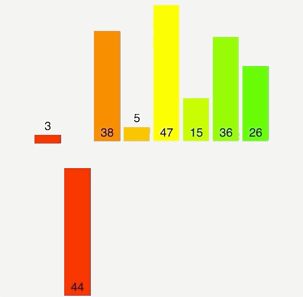
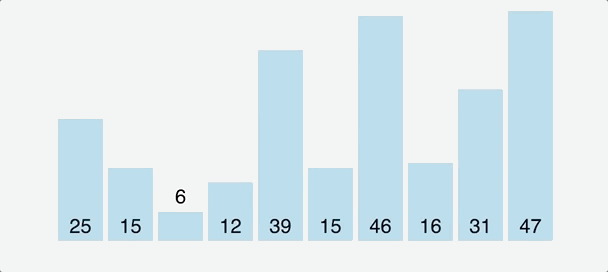

# Intro to Sorting

Sorting does not have one single elegant algorithm. Instead, there are a large number of clever algorithms, each with its strengths and weaknesses. One classic example is the divide-and-conquer approach. In this portion of your computer science journey, you will be learning many clever solutions to the sorting problem.

- Bubble sort
- Insertion sort
- Selection sort
- Merge sort
- Quick sort

## Doesn't JavaScript have a built in sort function? Why do I need to know this stuff?

You are absolutely correct: JavaScript has a built-in sort function which is pretty darn efficient. It will probably work for around 99.99% of all your practical sorting needs as a web developer and you could easily go your entire career without writing a single custom sorting algorithm. So why learn them at all?

Almost every coding problem, both in technical interviews and on the job, come down to data manipulation. Some variation of read data from a data structure, process the data, move it around, then report to the user. Sorting algorithms will teach you clever techniques for moving data around in a logical fashion.

These techniques include: in-place array swaps, sliding windows, divide-and-conquer, and more.

Study these techniques well, specially if you struggle to come up with coding plans (step 2 of Polya's problem solving framework). For any coding problem, there are always multiple ways to solve it.

If you struggle to execute your technical plans (step 3 of Polya), working through these algorithms will improve your coding fluency. Like any new language, it takes practice and repetition to build fluency. You will be given the plans for each sorting algorithm so you can practice step 3 in isolation.

Finally evaluating the performance tradeoffs of each of these algorithms will help you determine which solution is truly optimal for your use case. In doing so, you may discover that determining the optimal solution actually requires a more nuanced understanding of the problem itself (steps 1 & 4 of Polya).

## How should I approach these sorting problems?

For each problem, you will be given the sorting algorithm described in code comments, along with an example of the algorithm in action. Your task is to understand the algorithm and translate from the plan to working JavaScript code.

DO NOT LOOK UP SOLUTIONS ONLINE

You won't learn anything from looking up solutions. If you are stuck, talk it out with a peer and come up with a clear, concise question to ask your instructor. During interviews and on the job, you will be tested on your ability to problem solve, not to recite algorithms from memory.

## Review: swaps and shifts

In the following algorithms, you will be making use of array swaps and shifts.

### Swapping

You can swap two values in an array using a temporary variable, or destructuring assignment.

```
const arr = [0, 1, 2, 3, 4, 5, 6];

// Swap two values with a temporary variable
let tmp = arr[1];
arr[1] = arr[2];
arr[2] = tmp;

console.log(arr); // [0, 2, 1, 3, 4, 5, 6]

// Swap two values with destructured array assignment
[arr[4], arr[6]] = [arr[6], arr[4]];

console.log(arr); // [0, 2, 1, 3, 6, 5, 4]


```

### Shifting

Think to the shifting in dynamic arrays and remember that when shifting to the right, you must shift back to front to avoid overwriting your values.

```
const arr1 = [0, 1, 2, 3, 4, 5];
const arr2 = [0, 1, 2, 3, 4, 5];

// If you want to shift the array to the right by 1...

// Shifting from front to back will overwrite all values
for (let i = 1 ; i < arr1.length ; i++) {
    arr1[i] = arr1[i-1];
}

console.log(arr1); // [ 0, 0, 0, 0, 0, 0 ]


// Instead, start from the back and shift backwards
for (let i = arr2.length - 1 ; i > 0 ; i--) {
    arr2[i] = arr2[i-1];
}

console.log(arr2); // [ 0, 0, 1, 2, 3, 4 ]


```

Now, onto sorting!

## What you learned

In this reading, you learned how to approach learning sorting algorithms. You also reviewed some coding techniques that will help you execute these algorithms in code.

# Bubble Sort

Bubble sort is a simple sorting algorithm. Walk through the entire array, comparing each adjacent pair. If they are out of order, swap their positions. Keep doing this until the entire array is sorted. Each pass will sort the array a bit more, with the larger values "bubbling up" to the top.

Here's the pseudocode. Spend some time studying this algorithm until you understand how it works. Try some examples, draw it out with pencil and paper, whatever you need to understand the algorithm.

1. Iterate through the array
2. If the current value is greater than its neighbor to the right,

swap those values 3. If you get to the end of the array and no swaps have occurred, return 4. Otherwise, repeat from the beginning

## Bubble sort example

Say you want to bubble sort this unsorted array:

```
[3, 2, 0, 4, 1]


```

Starting from the beginning, check that each pair of adjacent values are in the correct order: small to large. The first pair of numbers, 3 and 2, are out of order so swap them.

```
[3, 2, 0, 4, 1]
 v  v
[2, 3, 0, 4, 1]


```

Next is 3 and 0. These are also out of order, so they are also swapped.

```
[2, 3, 0, 4, 1]
    v  v
[2, 0, 3, 4, 1]


```

Next is 3 and 4 are in the correct order, so nothing changes here.

```
[2, 0, 3, 4, 1]
       |  |
[2, 0, 3, 4, 1]


```

The last pair, 4 and 1 are out of order so these are swapped too.

```
[2, 0, 3, 4, 1]
          v  v
[2, 0, 3, 1, 4]


```

Now that the loop has finished, if no swaps have taken place then all elements are in order and the array is sorted. Since we have made swaps this pass, we start all over again from the first pair of values.

```
[2, 0, 3, 1, 4]
 v  v
[0, 2, 3, 1, 4]
    |  |
[0, 2, 3, 1, 4]
       v  v
[0, 2, 1, 3, 4]
          |  |
[0, 2, 1, 3, 4]


```

2 and 0 are swapped, but 2 and 3 are fine. 3 and 1 are swapped but 3 and 4 are correct. Since this pass still contained swaps, the loop repeats again from the first pair.

```
[0, 2, 1, 3, 4]
 |  |
[0, 2, 1, 3, 4]
    v  v
[0, 1, 2, 3, 4]
       |  |
[0, 1, 2, 3, 4]
          |  |
[0, 1, 2, 3, 4]


```

Only one swap this time, the 2 and 1, but the algorithm requires zero swaps to finish. So, one more loop.

```
[0, 1, 2, 3, 4]
 |  |
[0, 1, 2, 3, 4]
    |  |
[0, 1, 2, 3, 4]
       |  |
[0, 1, 2, 3, 4]
          |  |
[0, 1, 2, 3, 4]


```

Each pair is in the correct order and the full loop ran without any swaps, so the function can return.

## Pseudocode

```
function bubbleSort(arr) {

  // Iterate through the array

    // If the current value is greater than its neighbor to the right
      // Swap those values

    // If you get to the end of the array and no swaps have occurred, return

    // Otherwise, repeat from the beginning

}


```

## What you learned

In this reading, you learned the algorithm behind bubble sort.

# Insertion Sort

You've probably used insertion sort before. Say you are dealt a hand of playing cards and wish to organize them from least to greatest. You might pick cards from the right side of your hand and move them to the left one-by-one, inserting each card in the correct location on the left.

Here are the steps to sort an array with insertion sort:

1. Divide the array into sorted and unsorted
2. Pick and remove a value from the unsorted
3. Insert it into the correct place in the sorted
4. Repeat this until unsorted is empty and sorted is full

There's two ways you can go about this, out-of-place or in-place.

## Out-of-place insertion sort (easy)

Let's say you want to sort the array [3, 2, 0, 4, 1] using out-of-place insertion sort. Start by creating an empty array called sorted.

```
arr = [3, 2, 0, 4, 1]
sorted = []


```

Start by removing a value from the input array and "inserting" it in the correct position of the sorted array. We'll use the first value in the array, the 3 and put it right in the empty sorted array. We will continue this process until arr is empty.

```
arr = [2, 0, 4, 1]
sorted = [3]


```

The next value in the array is 2, so remove that and insert it in the correct position. Since 2 is less than 3, it is inserted in the front.

```
arr = [0, 4, 1]
sorted = [2, 3]


```

The next value out of the input array is 0, which is less than 2 so goes at the front of sorted.

```
arr = [4, 1]
sorted = [0, 2, 3]


```

Next comes 4, which goes at the end.

```
arr = [1]
sorted = [0, 2, 3, 4]


```

The final value is 1, which is inserted between the 0 and 2. Think carefully about this step. How would you implement this in code? Put another way, how would you determine the correct position in the array to insert the value, and how would you perform the insertion?

```
arr = []
sorted = [0, 1, 2, 3, 4]


```

Now that the input array is empty, the sorted array is complete and can be returned.

## In-place insertion sort (medium)

Because the out-of-place insertion sort creates a new array, the space complexity is O(n). It's possible to perform this algorithm in-place, meaning in O(1) space using no extra memory. How is this possible? The answer involves mutating the input array.

Starting with the same input array, [3, 2, 0, 4, 1], create a variable marking the divide between the sorted and unsorted halves of the original array. At each step, the rule (sometimes called an invariant) is that everything to the left of the divider is sorted. Since the sorted half starts empty, the divider will start at 0.

```
arr = [3, 2, 0, 4, 1]
divider = 0


```

Take the first value from the unsorted half and save it in a temporary variable.

```
arr = [3, 2, 0, 4, 1]
divider = 0
temp = 3


```

In the sorted half, shift every sorted number larger than the temp variable value to the right by 1, then insert the temp variable value when it reaches a smaller value, or the end of the array. Since this new inserted value is now sorted, move the divider to the right by 1 as well.

On this initial pass, the sorted half is "empty" so the temp variable value 3 is inserted at index 0. Then the divider is moved to index 1, indicating that the value has been sorted.

```
arr = [3, 2, 0, 4, 1]
divider = 1
temp = 3


```

Everything to the left of the divider is now sorted! We now repeat this process until the entire array is sorted.

```
arr = [3, 2, 0, 4, 1]
divider = 1
temp = 2


```

Grab the 2, shift over the larger sorted values, then insert the 2 and increment the divider.

```
arr = [2, 3, 0, 4, 1]
divider = 2
temp = 2


```

Once again, everything to the left of the divider is sorted. The algorithm works just like the out-of-place insertion sort, except all in the same array. Next, grab the first value in the unsorted half and set it to the temp variable.

```
arr = [2, 3, 0, 4, 1]
divider = 2
temp = 0


```

Note that to insert the 0, you need to shift each larger value (the 2 and 3) to the right by one. This has intermediate states of [2, 3, 3, 4, 1] and [2, 2, 3, 4, 1] before inserting the temp value at the correct point, [0, 2, 3, 4, 1]. Remember that shifting is an O(n) operation and should be run from right to left.

```
arr = [0, 2, 3, 4, 1]
divider = 3
temp = 0


```

After running the shift and incrementing the divider, grab the next unsorted value and insert it at the correct place.

```
arr = [0, 2, 3, 4, 1]
divider = 3
temp = 4


```

Following same logic of shifting each larger sorted value to the right by one before inserting the 4, there are no larger values so nothing shifts and the 4 is put right back in its original location. Increment the divider and repeat.

```
arr = [0, 2, 3, 4, 1]
divider = 4
temp = 1


```

With the 1 stored, the algorithm begins to check each sorted value from right to left, shifting each larger value by 1. First goes the 4, making the array [0, 2, 3, 4, 4]. Next is the 3: [0, 2, 3, 3, 4], then the 2: [0, 2, 2, 3, 4]. The 0 is smaller so the loop can stop and the temp value can be inserted: [0, 1, 2, 3, 4]. Now the divider increments to the end of the array and the insertion sort can exit and return.

Note that both out-of-place and in-place insertion sorts have time complexities of O(n2). Can you figure out why?

## Your task

Your task is to implement insertionSort. Try the out-of-place insertion sort first, then try to solve it in-place. Here is the pseudocode for the in-place version. Good luck!

```
function insertionSort(arr) {

    // Set a pointer dividing the array into sorted and unsorted halves

    // Repeat while the unsorted half is not empty:

    // Grab the first value from the unsorted half

    // For each sorted value in the array starting from the divider,
      // Check if the value to the left is smaller than the unsorted value
        // If so, you've reached the insertion point so exit the loop
        // If not shift the value to the right by 1 and continue

    // Insert the unsorted value at the insertion point

    // Increment the dividing pointer and repeat
}

```

# Selection Sort

Selection sort is a very intuitive algorithm. Divide the array into sorted and unsorted halves, then one-by-one select the smallest value from the unsorted portion and move it to the end of the sorted portion.

Here are the steps to sort an array with selection sort:

1. Divide the array into sorted and unsorted
2. Find and remove the smallest value from the unsorted
3. Add this value to the end of the sorted array
4. Repeat this until unsorted is empty and sorted is full

There's two ways you can go about this, out-of-place or in-place.

## Out-of-place selection sort (easy)

Let's say you want to sort the array [3, 2, 0, 4, 1] using out-of-place selection sort. Start by creating an empty array called sorted.

```
arr = [3, 2, 0, 4, 1]
sorted = []


```

Search through the unsorted array to find the minimum value: 0. Remove it from the unsorted array and add it to the end of the sorted array.

```
arr = [3, 2, 4, 1]
sorted = [0]


```

Repeat this process grabbing the next smallest value from the array, 1, and move it to the end of the sorted array.

```
arr = [3, 2, 4]
sorted = [0, 1]


```

The next smallest is 2, which moves to sorted.

```
arr = [3, 4]
sorted = [0, 1, 2]


```

Then comes 3.

```
arr = [4]
sorted = [0, 1, 2, 3]


```

Finally, the last character is moved and the sorted array can be returned.

```
arr = []
sorted = [0, 1, 2, 3, 4]


```

## In-place selection sort (medium)

Because the out-of-place selection sort creates a new array, the space complexity is O(n). It's possible to perform this algorithm in-place, meaning in O(1) space using no extra memory. How is this possible? The answer involves mutating the input array.

Starting with the same input array, [3, 2, 0, 4, 1], create a variable marking the divide between the sorted and unsorted halves of the original array. At each step, the rule (sometimes called an invariant) is that everything to the left of the divider is sorted. Since the sorted half starts empty, the divider will start at 0.

```
arr = [3, 2, 0, 4, 1]
divider = 0


```

Select the smallest value from the unsorted half, which is 0, and move it to the end of the sorted half, and increment the divider by 1.

```
arr = [0, 3, 2, 4, 1]
divider = 1


```

Note that this requires shifting the 3 and 2 to the right by one position. This requires storing the 0 in a temp variable, moving the 2: [3, 2, 2, 4, 1], then moving the 3: [3, 3, 2, 4, 1], and finally placing the 0 in the correct place: [0, 3, 2, 4, 1].

```
arr = [0, 1, 3, 2, 4]
divider = 2


```

The next step repeats by finding the smallest unsorted value, 1, shifting every unsorted value to the right by 1, then placing the 1 at the divider then incrementing the divider by 1.

```
arr = [0, 1, 2, 3, 4]
divider = 3


```

Next comes the 2 which shifts the 3 to the right by 1 and increments the divider again.

```
arr = [0, 1, 2, 3, 4]
divider = 4


```

The smallest unsorted value is now 3 which happens to be in the right place already so no shifting is needed. Same with the 4. After verifying that both are in the right place, the divider increments again.

```
arr = [0, 1, 2, 3, 4]
divider = 5


```

Now that the divider is at the end of the array (divider === arr.length), the unsorted half of the array is empty and the sorted half is full. At this point, the array can be returned but since this algorithm mutates the original array (it was passed by reference) you don't actually need to return the array at all.

Note that both out-of-place and in-place selection sorts have time complexities of O(n2). Can you figure out why?

## Your task

Your task is to implement selectionSort. Try the out-of-place selection sort first, then try to solve it in-place. Here is the pseudocode for the in-place version. Good luck!

```
function selectionSort(arr) {

  // Set a pointer at zero dividing the array into sorted and unsorted halves

  // Repeat while the unsorted half is not empty:

    // Find the index of the minimum value in the unsorted half

    // Save the min value

    // Shift every unsorted value to the left of the min value to the right by 1

    // Put the min value at the divider

    // Increment the divider and repeat

}

```

# Recursive Sorting

## Recursion review

There are three traits that define a valid recursive function:

1. The function calls itself recursively
2. There is a base case where the recursion ends
3. The state moves towards the base case with each recursive call

Here is a classic recursive factorial function:

```
function factorial(n) {

    if (n <= 1) return 1;

    return n * factorial(n - 1);
}


```

The recursive call is factorial(n - 1) and the base case is if (n <= 1) return 1;. The n - 1 inside the recursive call moves the state closer to the base case with each recursive step, ensuring that your recursion returns without overflowing your stack.

Remember these three steps because they are crucial to understanding recursive sorting algorithms.

## A recursive sorting example

Let's say you have an idea for a new sorting algorithm. Find and remove the largest value from the array, sort the remaining elements, then put the largest value in the back of the array and return. So given the array, [3, 2, 0, 4, 1], first you remove the largest element, 4, sort the rest, which turns [3, 2, 0, 1] into [0, 1, 2, 3], then add the 4 back to the end and return [0, 1, 2, 3, 4]. Will this work?

Although it seems like cheating to call a sorting algorithm within another sorting algorithm, this is actually 100% valid. Since you are creating a function that sorts array values, the function can absolutely call itself recursively, as long as the other two conditions, base case and movement toward the base case, are satisfied.

```
function recursiveSort(arr) {

    // Find and remove the largest value in the array

    // Sort the remaining elements

    // Put the largest value back at the end of the array

}


```

The question remains, what is the base case? How do you know if the state is moving toward that base case with each call? The base case is a hard-coded state that returns a valid function, in this case returning a valid sorted array. Here's the key insight: ANY array of length 1 or 0 is sorted. [1]: sorted. [100000]: sorted. []: sorted. You get the picture.

So we have our base case: If the array's length is 1 or less, return the array. Now all that's left is making sure the state moves toward the base case with each recursive call. Since one value (the largest) is removed with each call, the length of the array will decrease by 1 each time, eventually hitting the base case.

Now that you've satisfied the base case, you can fill in the code.

```
function recursiveSort(arr) {

    // If the array is length 1 or less, return
    if (arr.length <= 1) return arr;

    // Find and remove the largest value in the array
    let maxIndex = 0;
    for (let i = 1 ; i < arr.length ; i++) {
        if (arr[i] > arr[maxIndex]) maxIndex = i;
    }
    const maxValue = arr[maxIndex];
    arr.splice(maxIndex, 1);

    // Sort the remaining elements
    arr = recursiveSort(arr);

    // Put the largest value back at the end of the array
    arr.push(maxValue);

    return arr;
}


```

Testing with recursiveSort([3, 2, 0, 4, 1]) correctly returns [0, 1, 2, 3, 4]. Like magic, this recursive sort just works!

## Time and space complexity analysis

Let's start with the time complexity of recursiveSort. Each recursive call sorts one value, so there will be n total recursive calls to sort an array of length n. Each call iterates through the entire array to find the max value which is O(n), then splices out the max value which is also O(n). These are not nested, so the overall time complexity of each call is O(2n), or just O(n) since coefficients are ignored. Since this is called n times through recursion, the overall time complexity is O(n2).

Since arr.splice and arr.push both mutate the original array and no new arrays are created, this algorithm works in-place with each call using O(1) extra space. However, you may recall that each function is stored in memory on the call stack_ while it waits for later recursive functions to resolve. Since there are n recursive steps, this function will occupy O(n) space on the call stack.

## Divide and Conquer: Improving time complexity

The time complexity of recursiveSort is O(n2). Is there a way to improve that?

Each recursive step needs to visit all values in the array at least once. Whether that's a selection or insertion, that O(n) is unavoidable. Is there a way to reduce the depth of recursive calls? This would improve both the time and space complexity. It turns out there is: divide and conquer.

Similar to a binary search, instead of reducing the array by one each recursive call, you split it in half. This would require log n recursive steps to reach the base case of an array of length 1 or 0. Following this logic, you can write out a rough set of steps like this:

1. Check the base case, return if length 1 or 0
2. Split the array in half
3. Recursively sort the left half and right half
4. Put the left half and right half together and return

You will be learning two algorithms that take two different approaches to this plan: quicksort and mergesort. Both divide and conquer the input arrays to reduce the recursion depth to log n. Each level of recursion involves n comparisons, resulting in a time complexity of O(n log n). While this is slightly less efficient than O(n), it is MUCH more efficient than O(n2).

For comparison, given an n of 1 million, n log n is roughly 50000x faster than n2.

Think about these steps, and try to come up with an algorithm to implement a sorting algorithm with these 4 divide-and-conquer sorting steps.

## What you learned

In this reading, you learned how to implement a recursive sorting algorithm and outlined a plan to optimize the runtime. You were also introduced to O(n log n) complexity as a major upgrade from O(n2).

# Recursive Sorting

## Recursion review

There are three traits that define a valid recursive function:

1. The function calls itself recursively
2. There is a base case where the recursion ends
3. The state moves towards the base case with each recursive call

Here is a classic recursive factorial function:

```
function factorial(n) {

    if (n <= 1) return 1;

    return n * factorial(n - 1);
}


```

The recursive call is factorial(n - 1) and the base case is if (n <= 1) return 1;. The n - 1 inside the recursive call moves the state closer to the base case with each recursive step, ensuring that your recursion returns without overflowing your stack.

Remember these three steps because they are crucial to understanding recursive sorting algorithms.

## A recursive sorting example

Let's say you have an idea for a new sorting algorithm. Find and remove the largest value from the array, sort the remaining elements, then put the largest value in the back of the array and return. So given the array, [3, 2, 0, 4, 1], first you remove the largest element, 4, sort the rest, which turns [3, 2, 0, 1] into [0, 1, 2, 3], then add the 4 back to the end and return [0, 1, 2, 3, 4]. Will this work?

Although it seems like cheating to call a sorting algorithm within another sorting algorithm, this is actually 100% valid. Since you are creating a function that sorts array values, the function can absolutely call itself recursively, as long as the other two conditions, base case and movement toward the base case, are satisfied.

```
function recursiveSort(arr) {

    // Find and remove the largest value in the array

    // Sort the remaining elements

    // Put the largest value back at the end of the array

}


```

The question remains, what is the base case? How do you know if the state is moving toward that base case with each call? The base case is a hard-coded state that returns a valid function, in this case returning a valid sorted array. Here's the key insight: ANY array of length 1 or 0 is sorted. [1]: sorted. [100000]: sorted. []: sorted. You get the picture.

So we have our base case: If the array's length is 1 or less, return the array. Now all that's left is making sure the state moves toward the base case with each recursive call. Since one value (the largest) is removed with each call, the length of the array will decrease by 1 each time, eventually hitting the base case.

Now that you've satisfied the base case, you can fill in the code.

```
function recursiveSort(arr) {

    // If the array is length 1 or less, return
    if (arr.length <= 1) return arr;

    // Find and remove the largest value in the array
    let maxIndex = 0;
    for (let i = 1 ; i < arr.length ; i++) {
        if (arr[i] > arr[maxIndex]) maxIndex = i;
    }
    const maxValue = arr[maxIndex];
    arr.splice(maxIndex, 1);

    // Sort the remaining elements
    arr = recursiveSort(arr);

    // Put the largest value back at the end of the array
    arr.push(maxValue);

    return arr;
}


```

Testing with recursiveSort([3, 2, 0, 4, 1]) correctly returns [0, 1, 2, 3, 4]. Like magic, this recursive sort just works!

## Time and space complexity analysis

Let's start with the time complexity of recursiveSort. Each recursive call sorts one value, so there will be n total recursive calls to sort an array of length n. Each call iterates through the entire array to find the max value which is O(n), then splices out the max value which is also O(n). These are not nested, so the overall time complexity of each call is O(2n), or just O(n) since coefficients are ignored. Since this is called n times through recursion, the overall time complexity is O(n2).

Since arr.splice and arr.push both mutate the original array and no new arrays are created, this algorithm works in-place with each call using O(1) extra space. However, you may recall that each function is stored in memory on the call stack_ while it waits for later recursive functions to resolve. Since there are n recursive steps, this function will occupy O(n) space on the call stack.

## Divide and Conquer: Improving time complexity

The time complexity of recursiveSort is O(n2). Is there a way to improve that?

Each recursive step needs to visit all values in the array at least once. Whether that's a selection or insertion, that O(n) is unavoidable. Is there a way to reduce the depth of recursive calls? This would improve both the time and space complexity. It turns out there is: divide and conquer.

Similar to a binary search, instead of reducing the array by one each recursive call, you split it in half. This would require log n recursive steps to reach the base case of an array of length 1 or 0. Following this logic, you can write out a rough set of steps like this:

1. Check the base case, return if length 1 or 0
2. Split the array in half
3. Recursively sort the left half and right half
4. Put the left half and right half together and return

You will be learning two algorithms that take two different approaches to this plan: quicksort and mergesort. Both divide and conquer the input arrays to reduce the recursion depth to log n. Each level of recursion involves n comparisons, resulting in a time complexity of O(n log n). While this is slightly less efficient than O(n), it is MUCH more efficient than O(n2).

For comparison, given an n of 1 million, n log n is roughly 50000x faster than n2.

Think about these steps, and try to come up with an algorithm to implement a sorting algorithm with these 4 divide-and-conquer sorting steps.

## What you learned

In this reading, you learned how to implement a recursive sorting algorithm and outlined a plan to optimize the runtime. You were also introduced to O(n log n) complexity as a major upgrade from O(n2).

# Merge Sort

So far, you've gone over some fairly inefficient methods of sorting an array. In this reading, you will explore a more time-efficient method of sorting: merge sort.

While there are several different implementations of the merge sort algorithm, this reading will focus on how to implement an out-of-place recursive solution. At the end of the reading, you will be introduced to some of the other common variations, and discuss the time and space complexity differences across these implementations.

## The merge sort algorithm

This algorithm sorts values using the following divide and conquer approach:

1. Split the unsorted array in half (divide)
2. Sort the halves (conquer)
3. Merge the newly sorted halves

Let's walk through an example.

## Merge sort example

Say you want to sort the array, [10, 1, 7, 2]. Start by dividing the array in half.

```
[10, 1, 7, 2] ->

[10, 1]    [7, 2]


```

Next, sort each half.

```
[10, 1] -> [1, 10]
[7, 2]  -> [2, 7]


```

Finally, merge them back together.

```
[1, 10]  [2, 7] -> [1, 2, 7, 10]


```

You might have some questions at this point. For example, isn't it cheating to call a sorting algorithm to implement a sorting algorithm? How does merge work? Let's answer those questions.

### Merge

Merge is a function that takes two sorted arrays and combines them into a single sorted array containing all elements. It does this by comparing the first element of each array and moving the smaller value into the return array.

For the arrays [1, 10] and [2, 7], the first elements are 1 and 2 so you move the 1 into the return array.

```
[10]   [2, 7]

return: [1]


```

Now, the first elements are 2 and 10, so you move the 2 into the return array.

```
[10]    [7]

return: [1, 2]


```

Next goes the 7.

Since array 2 is now empty, you can add the remaining elements in array 1, giving you [1, 2, 7, 10].

### Time complexity of Merge

Take a moment to think: What is the time complexity of merge?

If you guessed O(n2), you are correct! Remember that adding or removing values from the front of an array is an O(n) operation, and you do this for each value in the arrays.

Fortunately, you don't actually need to remove values to perform a merge. Instead, you can set a pointer to the first value, comparing values at that index. When you move a value to the return array, simply increment the pointer.

```
arr1: [1, 10], index1: 0
arr2: [2, 7], index2: 0
return: []

arr1: [1, 10], index1: 1
arr2: [2, 7], index2: 0
return: [1]

arr1: [1, 10], index1: 1
arr2: [2, 7], index2: 1
return: [1, 2]

...


```

This performs the merge without mutating the original arrays and gives merge a time complexity of O(n).

### Calling a sort within a sort

Can you think of a technique you learned that calls a function from within itself?

If you answered recursion, you are right! Recall the steps that define a recursive function:

1. Must call itself recursively
2. Must contain a base case
3. Must move toward the base case with each recursive call

The base case for merge sort is when the array is already sorted. This relies on the fact that an array of length 1 or 0 is considered trivially sorted.

The arrays [1], [1000], and [] are all sorted. Any array of length 1 or less is sorted. As long as our merge sort moves towards this state with each recursive call, it will work.

Since merge sort divides the array in half with each call, it gets smaller every time and will eventually get to length 1. Just like magic!

### Time complexity of merge sort

Now think, what is the time complexity of this implementation of merge sort?

This is a bit tricky to conceptualize but simply speaking, you must merge each time you make a recursive call. Since each merge is O(n), you must determine the amount of times you recurse.

For an array of length 32, how many times must you divide to get to subarrays of length 1? The answer is 32 -> 16 -> 8 -> 4 -> 2 -> 1. This reduces the size by half each time for log n operations.

With one merge for each divide, the time complexity of merge sort is O(n log n). Because of this, the time complexity is the same for the best case, worst case, and average case scenarios.

### Space complexity of merge sort

This out-of-place recursive implementation of merge sort has a space complexity of O(n log n). Three new arrays are created every time you call merge sort. That means two half-arrays and one full-length merged array, for 2n space with each recursive call.

The reason our implementation of the out-of-place recursive merge sort has space complexity of O(n log n) is because we are creating new arrays (n) with each recursive call (log n recursive calls in a stack), without freeing up that space when the recursive call returns.

However, as mentioned at the beginning of the article, there are other common implementations of the merge sort algorithm that can result in different space complexities. For example, you will see some out-of-place recursive implementations that free up that space, resulting in a space complexity of O(n).

The chart below compares some of the common implementations of merge sort, with their corresponding time and space complexities.


Time Complexity

Space Complexity

App Academy Implementation

O(n log n)

O(n log n)

Other Out-of-place Recursive

O(n log n)

O(n)

Out-of-place Iterative

O(n log n)

O(n)

In-place Recursive

O(n log n)

O(log n)

In-place Iterative

O(n log n)

O(1)

As the chart makes clear, in-place implementations require less memory than out-of-place implementations, and recursive implementations require more space than iterative approaches. Learning all of these implementations is outside the scope of this reading and this course, but it is important to be aware that multiple implementations exist.

## Pseudocode for App Academy Implementation

```
function mergesort(arr) {

  // Check if the input is length 1 or less
    // If so, it's already sorted: return

  // Divide the array in half

  // Recursively sort the left half
  // Recursively sort the right half

  // Merge the halves together and return
}

// Takes in two sorted arrays and returns them merged into one
function merge(arrA, arrB) {

  // Create an empty return array

  // Point to the first value of each array

  // While there are still values in each array...
    // Compare the first values of each array
    // Add the smaller value to the return array
    // Move the pointer to the next value in that array

  // Return the merged array
}


```



## What you learned

In this reading, you learned how merge sort uses a recursive divide and conquer approach to sort an array in O(n log n) time. You analyzed the time and space complexity of the out-of-place recursive implementation that App Academy teaches, and were also introduced to other common implementations.

# Quicksort

Quick sort is an algorithm that uses a divide and conquer approach to sort values efficiently. In this reading, you will learn how it works.

## The quicksort algorithm

The quicksort algorithm works as follows:

1. Pick a value in the array to serve as the pivot
2. Partition the array so that values smaller than the pivot are on the left and values larger than the pivot are on the right
3. Sort the left and the right partitions
4. Return an array with left, pivot, and right values

Let's walk through an example.

## Quicksort example

Say you want to sort the array, [5, 4, 10, 1, 8, 3, 6].

Start by picking a pivot. You can pick any value to be the pivot but for simplicity, let's use the first value: 5.

Next create empty arrays called left and right. Walk through the array and copy all smaller values into left and larger values into right.

```
pivot: 5
left: [4, 1, 3]  // values smaller than pivot
right: [10, 8, 6]  // values larger than pivot


```

Next, sort the left and right sides.

```
pivot: 5
left: [1, 3, 4]
right: [6, 8, 10]


```

Finally, return an array combining the left, pivot, and right in that order.

```
[1, 3, 4] + 5 + [6, 8, 10] ->

[1, 3, 4, 5, 6, 8, 10]


```

## Recursive sorting

Similar to merge sort, quicksort calls itself recursively on subarrays that get smaller with each call until it reaches the base case of length 1 or 0.

Since arrays of length 1 or 0 are always sorted, this satisfies the three criteria for recursion:

1. Must call itself recursively
2. Must contain a base case
3. Must move toward the base case with each recursive call

Recursion makes quicksort work like magic!

## Time complexity of quicksort

In the example shown above, the array is chopped in half at each step. This results in O(log n) steps to get down to the base case. Each step requires walking through all n elements to partition values into the left and right halves for a time complexity of O(n log n).

However, it is possible that the pivots are arranged in such a way that the array is very unbalanced. For example, if you quicksort the array [1, 2, 3, 4, 5], you will get values like this:

```
pivot = 1
left = [2, 3, 4, 5]
right = []


```

Then, you recursively call quicksort on the right array which returns immediately and the left array which results in this:

```
pivot = 2
left = [3, 4, 5]
right = []


```

Recursively quicksorting the left again results in this:

```
pivot = 3
left = [4, 5]
right = []


```

...until you finally hit the base case.

```
pivot = 4
left = [5]
right = []


```

In this worst case, you end up making n recursive calls which iterate through the array each time for a worst-case time complexity of O(n2). Yikes!

This is quite rare for an array with randomly distributed values but it's worth noting that the performance of quicksort can vary depending on the input.

On average though quicksort has a time complexity of O(n log n).

### Space complexity of quicksort

Just like merge sort, this out-of-place recursive implementation creates three new arrays with each recursive call: two half arrays and one full-length copy to return. For the average case of log n calls, this results in a space complexity of O(n log n). This is the worst-case space complexity of quicksort.

Also like merge sort, it is possible to perform this in-place for a space complexity of O(1). Once you get an out-of-place solution working, try it out! While the out-of-place version of quicksort is easier to remember and easier to implement, just be aware that a more efficient space complexity quicksort exists.

## Pseudocode

```
function quicksort(arr) {

  // Check if the input is length 1 or less
    // If so, it's already sorted: return

  // Pick a pivot

  // Put all values smaller than the pivot to the `left`
  // Put all values larger than the pivot to the `right`

  // Sort the left half
  // Sort the right half

  // Return the array with the left, pivot, and right values
}


```



## What you learned

In this reading, you learned how quicksort uses a recursive divide and conquer approach to sort an array in O(n log n) time.

# Funky sorts

So far, you've learned a variety of methods for sorting integers from smallest to largest. What about sorting in different ways? What kind of sorting problems should you expect in job interviews? This reading will cover all of that.

## Zeroes to the right

Let's start by revisiting this problem from the Polya reading.

```
Given an array nums, write a function to move all 0's to the end of it while
maintaining the relative order of the non-zero elements.

Input: [0,1,0,4,15] Output: [1,4,15,0,0]

* You must do this in-place without making a copy of the array.
* Minimize the total number of operations.


```

Read it over and think back to your first encounter with this problem. Compare your understanding of the problem then with your understanding now. Now you know what it means to write an in-place algorithm (space complexity of O(1)) and how to minimize the number of operations (optimize the time complexity). You are familiar with in-place sorting techniques like swapping and shifting, and know the costs of each, along with shift, unshift, push, pop and splice.

Using this knowledge, how would you solve this problem? Can you solve it in O(n) time?

## Zeroes to the right revisited

Here's an idea:

1. Create a pointer called firstZero that points to the left-most zero in

the array. 2. Iterate through the array. 3. If firstZero has not been set, continue on until you reach a zero 4. When you reach the first zero, set firstZero to the current index 5. When you reach a non-zero value, swap it's position with firstZero and increment firstZero

Here it is expressed in code:

```
function moveZeroes(nums) {
    // Create a pointer called `firstZero` that points to the left-most
    // zero n the array.
    let firstZero = -1; 
    // Starts as -1 because there are no zeroes encountered yet

    // Iterate through the array.
    for (let i = 0 ; i < nums.length ; i++) {
        // If `firstZero` has not been set, continue on until you reach a zero
        if (firstZero === -1) {

            // When you reach the first zero, set `firstZero` to the current index
            if (nums[i] === 0) firstZero = i;
        }

        // When you reach a non-zero value
        else if (nums[i] !== 0) {
            // swap it's position with `firstZero`
            [nums[i], nums[firstZero]] = [nums[firstZero], nums[i]];
            // and increment `firstZero`
            firstZero++;
        }
    }

    return nums;
}


```

Using the two pointer, array iteration and in-place swaps, this problem can be solved optimally. Remember these techniques and think about how they might be applied when faced with a problem related to arranging data in some particular order.

If you're having trouble envisioning the solution to these type of problems, spend some more time studying and implementing the core sorting algorithms. These are classic exercises that can be revisited many times to practice fundamental coding techniques.

## Even/Odd sort

Let's look at another funky sort: Even/Odd sort. This is a problem you might encounter in a whiteboarding interview.

```
Given an array nums, sort the array in ascending order with all
the even numbers on the left and all the odds on the right.

Input: [9, 8, 7, 6, 5, 4, 3, 2, 1]
Output: [2, 4, 6, 8, 1, 3, 5, 7, 9]


```

There are no time or space requirements so you're free to solve this as you please. Perhaps a 2-array variation of out-of-place selection sort.

1. Create two empty arrays: evens and odds
2. Find the smallest even and odd values in the array
3. Add these to the end of the even and odd arrays
4. Remove the smallest even and odd values from the array
5. Repeat 2 through 4 until the input array is empty
6. Join the even and odd arrays and return

```
function evenOddSort(nums) {
    // Create two empty arrays: evens and odds
    const evens = [];
    const odds = [];

    // Repeat 2 through 4 until the input array is empty
    while (nums.length > 0) {

        // Find the smallest even and odd values in the array
        let smallestEven = Infinity;
        let smallestOdd = Infinity;
        for (let i = 0 ; i < nums.length ; i++) {
            if (nums[i] % 2 === 0) {  // even
                if (nums[i] < smallestEven) {
                    smallestEven = nums[i];
                }
            } else if (nums[i] % 2 === 1) {  // odd
                if (nums[i] < smallestOdd) {
                    smallestOdd = nums[i];
                }
            }
        }

        // Add these to the end of the even and odd arrays
        if (smallestEven !== Infinity) {
            evens.push(smallestEven);

            // Remove the smallest even value from the array
            let smallestEvenIndex = nums.indexOf(smallestEven);
            nums.splice(smallestEvenIndex, 1);
        }

        if (smallestOdd !== Infinity) {
            odds.push(smallestOdd);

            // Remove the smallest odd value from the array
            let smallestOddIndex = nums.indexOf(smallestOdd);
            nums.splice(smallestOddIndex, 1);
        }

    }

    // Join the even and odd arrays and return
    return [...evens, ...odds];
}

evenOddSort([0,1,1,1,1,1,1,2,4,5,6])


```

As an exercise, you can refactor this to run in-place.

## What you learned

In this reading, you learned to integrate the coding techniques you've learned from sorting into various "funky" sorts that commonly show up in coding. Now, all that's standing between you and sorting mastery is practice!

# JavaScript's built-in sort

Now that you've learned how to implement various sorting algorithms, it's finally time to learn how to use JavaScript's built-in sort function.

## What algorithm does JavaScript use to sort?

It depends. Each browser runs their own version of JavaScript, with their own sorting implementation. Chrome's V8 JS engine currently uses mergesort but has used quicksort in the past, with insertion sort for small inputs. Either way, you can be confident that whatever implementation was used, it will be in-place with O(1) space complexity and O(n log n) time complexity.

## How do I use JavaScript's sort?

Start by creating an array and calling nums.sort(). It will return the sorted array, and since it sorts in-place, note that the original copy is mutated.

```
nums = [3, 2, 0, 4, 1];
nums.sort();
console.log(nums);  // [0, 1, 2, 3, 4]


```

Fantastic! Or is it? This example doesn't quite tell the entire story of JavaScript's sort. To demonstrate this, try sorting the array, [2, 4, 8, 16, 32, 64, 128, 256, 512, 1024].

```
nums = [2, 4, 8, 16, 32, 64, 128, 256, 512, 1024];
nums.sort();
console.log(nums);


```

Try running this in a console and the function returns [1024, 128, 16, 2, 256, 32, 4, 512, 64, 8]. What's going on here?

It turns out that JavaScript sorts numbers in alphabetical, not numerical order. This is because JavaScript is optimized for text parsing, so it stores everything, even numbers, as strings. Thus, it sees this array of integers as an array of strings ['2', '4', '8', '16', '32', '64', '128', '256', '512', '1024'] and sorts accordingly.

Fortunately, JavaScript allows you to define a custom sorting predicate, similar to higher-order functions you learned previously like map, filter and reduce.

```
function compareNumbers(a, b) {
  return a - b;
}
nums = [2, 4, 8, 16, 32, 64, 128, 256, 512, 1024];
nums.sort(compareNumbers);


```

This works because if a is larger than b, a - b returns a positive value, and b is sorted ahead of a. Otherwise, a - b is negative and the values of a and b are not swapped, maintaining their order.

## Funky sorting with JavaScript's sort

JavaScript's built-in sort can be very powerful! Recall this problem describing even/odd sort.

```
Given an array nums, sort the array in ascending order with all
the even numbers on the left and all the odds on the right.

Input: [9, 8, 7, 6, 5, 4, 3, 2, 1]
Output: [2, 4, 6, 8, 1, 3, 5, 7, 9]


```

In the prior reading, we came up with a 6-step plan and implemented a 50 line solution. Using the JS sorting predicate, we can create a 3 step plan and a 6 line solution.

1. If a is odd and b is even, return 1
2. If a is even and b is odd, return -1
3. Otherwise, sort normally with a - b

Translated to code, this produces an extremely readable and elegant solution:

```
nums = [9, 8, 7, 6, 5, 4, 3, 2, 1];

function oddEvenCompare(a, b) {
  if (a % 2 === 1 && b % 2 === 0) return 1;
  if (a % 2 === 0 && b % 2 === 1) return -1;
  return a - b;
}
nums.sort(oddEvenCompare);


```

Not only that, but assuming the engine is using an in-place merge or quicksort (not guaranteed, but very likely), this solution has a runtime of O(n log n) and space complexity of O(1). Not bad!

Note that you could also use the built-in sort to solve the zeroes to the right problem, but the runtime would be less efficient than the optimal O(n) solution. Still, if performance isn't a concern, this is a perfectly valid and extremely readable solution.

```
nums = [0, 1, 0, 4, 15];

function moveZeroesCompare(a, b) {
  if (a === 0) return 1;
  if (b === 0) return -1;
  return a - b;
}
nums.sort(moveZeroesCompare);


```

## What you learned

In this reading, you learned to make use of JavaScript's built-in sort to order array values alphabetically. You also learned how to define a custom sorting predicate to produce numerical sorts and various funky sorts.

# Binary Logarithms

In this reading, you will learn how logs work and how to identify the super-efficient, O(log n) in code.

## What is a logarithm?

To understand logarithms, you must first understand exponents. To review, a number raised to the power of n is the same as multiplying the number by itself n times. For example, 2 to the power of 5 (25) is the same as 2 multiplied by itself 5 times (2 * 2 * 2 * 2 * 2) which equals 32. (You may see 25 represented as 2^5 as well).

A logarithm (or log for short) is the inverse of an exponent. The logarithm base-n of a number is how many times it must be divided by n to reach 1. For example, to find the log base-2 of 32 (log2(32) = ?), you divide by the base until you hit 1: once (16), twice (8), three times (4), four times (2), and five (1), so log2(32) = 5.

These statements all express the same relationship between numbers:

- 2 multiplied by itself 5 times equals 32: 2 * 2 * 2 * 2 * 2 = 32
- 32 divided by base-2 5 times equals 1: 32 / 2 / 2 / 2 / 2 / 2 = 1
- 2 to the power of 5 equals 32: 25 = 32
- Log base-2 of 32 equals 5: log2(32) = 5

You can change the base of the logarithm to invert the exponent base:

- 10 multiplied by itself 3 times equals 1000: 10 * 10 * 10 = 1000
- 1000 divided by base-10 3 times equals 1: 1000 / 10 / 10 / 10 = 1
- 10 to the power of 3 equals 1000: 103 = 1000
- Log base-10 of 1000 equals 3: log10(1000) = 3

General logarithms have many advanced math applications, but here we are only concerned with one type: the binary logarithm.

## What is a binary logarithm?

A binary logarithm is a base-2 logarithm. Take a look at the following binary exponent table:

```
2
```

It's not required, but memorizing these powers of 2 up to 1024 will help you understand logarithms and code performance. Here is the equivalent logarithm table:

```
log2( 1 )    = 0
log2( 2 )    = 1
log2( 4 )    = 2
log2( 8 )    = 3
log2( 16 )   = 4
log2( 32 )   = 5
log2( 64 )   = 6
log2( 128 )  = 7
log2( 256 )  = 8
log2( 512 )  = 9
log2( 1024 ) = 10


```

The numbers in each row are the same, just in a different order, so if you know the exponents of 2, you know the binary logarithm. If you have a JavaScript console handy you can calculate binary logarithms with the Math.log2 function.

```
2 ** 0   // 1
2 ** 1   // 2
2 ** 2   // 4
2 ** 3   // 8
2 ** 4   // 16
2 ** 5   // 32
2 ** 6   // 64
2 ** 7   // 128
2 ** 8   // 256
2 ** 9   // 512
2 ** 10  // 1024

Math.log2(1);    // 0
Math.log2(2);    // 1
Math.log2(4);    // 2
Math.log2(8);    // 3
Math.log2(16);   // 4
Math.log2(32);   // 5
Math.log2(64);   // 6
Math.log2(128);  // 7
Math.log2(256);  // 8
Math.log2(512);  // 9
Math.log2(1024); // 10


```

## Why are logarithms important?

You previously learned how to identify and implement algorithms with constant O(1), linear O(n), and quadratic O(n2) complexities. Soon, you will learn to identify and implement algorithms with the extremely efficient logarithmic O(log n) complexity.

Just how efficient is it? Take a look at this big-O growth chart for comparison.

O(n) runs straight down the middle, while O(n2) swerves upward almost immediately. O(1) hovers a few pixels above the horizontal axis with O(log n) not too far above. Logarithmic curves grow so slowly that they are virtually constant.

What this image fails to communicate is just how close to constant a log curve is. Recalling your powers of 2, 210 = 1024. Put another way log2(1000) is roughly equal to 10. This graph would need to be 10x wider for the log curve to even approach the 10 mark on the vertical axis.

In order to reach the 20 mark, n would be roughly 1 million. To reach 30 requires an n of 1 billion. In order for the logarithmic curve to hit the 100 mark, equivalent to the performance of a linear curve with an n of 100, the logarithmic curve would require an n of 1267650600228229401496703205376. For large inputs, logarithmic curves vastly outperform linear curves.

## What you learned

In this reading, you learned what a logarithm is, how to calculate a binary logarithm and why logarithmic growth curves out-perform linear growth curves.

# Binary Search

Previously, you learned how to perform a linear search on an array by visiting each value one at a time until you find your target. This has a runtime of O(n). In this reading, you will learn to search an array in O(log n) time, including the pre-conditions, the algorithm and performance analysis.

## Divide and Conquer

Imagine you held a book containing an alphabetical list of English words and their definitions. Now, say you wanted to look up the word, dictionary in this book. You might start from the beginning, checking each word in order: a, aardvark, aardwolf, Aaron, and so on, until you reach dictionary. You would get there eventually, but with roughly 470 thousand words in the English language, you would need to go through tens of thousands of words first.

Instead, you might open the dictionary from the middle and spot the word microscope. You know that d comes before m, so dictionary must lie in the first half of pages you've opened. Now you open the first pages in half again and open to the new midpoint, which brings you to the word, escalator. Since d comes before e, you know that it's again in the first half, so you repeat the process. Split it again and you find cardiovascular which comes before d, so you instead split the second half bringing you to crankshaft. This brings you to diagnostic (getting close!) then dichotomy and finally, dictionary.

Instead of 100 thousand comparisons, this only required 7 comparisons. This is the power of binary search and logarithmic time complexity.

## Pre-conditions for a binary search

In order to perform a binary search in logarithmic time, your data must satisfy two conditions.

1. Data must be sorted
2. Data can be accessed by index in constant time

First, the data must be sorted. Sorting is a big topic with many challenges and tradeoffs of its own. This is a necessary pre-condition so you can guarantee that any value to the left of a chosen value is less than the current value, and everything to the right is greater.

The second is that any value can be accessed by index in constant time. This means you cannot binary search a linked list (which has no indices) or a hash table (which has no order). Fortunately, arrays satisfy all of these conditions.

## Binary search in code

Here's how a binary search might work in code. Let's take the following array and search for the number 89.

```
arr = [1, 5, 8, 10, 14, 26, 27, 32, 37, 51, 52,
       53, 57, 63, 66, 67, 68, 69, 74, 76, 79,
       82, 83, 84, 86, 88, 89, 92, 94, 95, 99, 100]
target = 89


```

We start by defining the range of possible locations which can be anywhere from the low index of 0, to the high index of 31.

```
lo = 0
hi = 31


```

Now, we find the midpoint, which is the high index plus the low divided by 2, rounded down. (31 + 0) / 2 = 15.5 which rounds down to 15.

```
mid = 15


```

Now, check the value of the array at the midpoint using arr[mid]. If the value is equal to the target, return mid. Otherwise, adjust the boundaries to match the half that might contain the value. Since arr[15] is 67 which is less than the target of 89, you can eliminate all values to the left of the midpoint. The boundaries now look like this:

```
lo = 16
hi = 31


```

Repeat this process until either you find the value and return mid, or the lo and hi markers meet and return -1.

```
lo = 16
hi = 31
mid = 23

arr[mid] = 84


```

The new midpoint value is 84 which is less than the target so bring the lo index up and recalculate the midpoint.

```
lo = 24
hi = 31
mid = 27

arr[mid] = 92


```

Now the midpoint value is 92, which is greater than the target so bring the hi index down.

```
lo = 24
hi = 26
mid = 25

arr[mid] = 88


```

So close! 88 is less than 89 so once again bring up the lo index:

```
lo = 26
hi = 26
mid = 26

arr[mid] = 89


```

You've found the target! This binary search only took 5 comparsions compared to a linear search, which would have taken 27 comparisons.

If your target was 90, which does not exist in the array, the lo pointer would increment to 27 which overlaps with the hi of 26, so you would return -1.

## Binary search pseudocode

Here is some pseudocode to get you started on implementing a binary search. As always, read through the description until you understand the problem (step 1). The plan, or algorithm, is given to you here. Your task is to take this plan and practice step 3, which is to execute the plan in code.

```
function binarySearch(arr, target) {

  // Set integers pointing to the high and low range of possible indices

  // While high and low indices do not overlap...

    // Find the midpoint between high and low indices

    // Compare the target value to the midpoint value

    // If the target equals the midpoint...
      // Return the midpoint index

    // If the target is higher than the midpoint...
      // Move the low pointer to midpoint + 1

    // If the target is less than the midpoint...
      // Move the high pointer to midpoint - 1

  // Return -1 if the loop exits with overlapping pointers

}


```

DO NOT look up solutions for this online! Instead, practice your problem solving skills by translating this algorithm into code. If you are stuck, practice coming up a good question!

## Time and space complexity of binary search

Recall the logarithm table is the inverse of the powers of 2.

```
log2( 1 )    = 0
log2( 2 )    = 1
log2( 4 )    = 2
log2( 8 )    = 3
log2( 16 )   = 4
log2( 32 )   = 5
log2( 64 )   = 6
log2( 128 )  = 7
log2( 256 )  = 8
log2( 512 )  = 9
log2( 1024 ) = 10


```

The binary search of the length 32 array took 5 comparisons, which is equal to log2(32). If the input size doubled to length 64, the binary search would only require one more comparison. Since range of possibility is divided by 2 on each comparison, the time complexity of binary search can be described as O(log n).

To reiterate the point, for large values of n, logarithmic runtime is vastly superior to linear: A database can search through 1 billion users in 30 comparisions, rather than 1 billion comparisons.

Binary search also does not require any extra memory, besides the three high, low and midpoint integers. This gives it a space complexity of O(1).

## Performance testing binary search

Here's an experiment you can run to test the performance of your binary search vs. a linear search. Read through the code to understand how it works, then try running it on your computer and compare the runtimes.

```
// Fill an array with 1 million integers
n = 1000000;
arr = [];
for (let i = 0 ; i < n ; i ++) {
  arr.push(i);
}

// Pick 10 thousand random values to search for, from -n to n
valuesToSearch = [];
for (let i = 0 ; i < 10000 ; i++) {
  valuesToSearch.push(Math.floor(Math.random() * 2 * n) - n);
}

startTime = Date.now();
for (let i = 0 ; i < valuesToSearch.length ; i++) {
  arr.includes(valuesToSearch[i]);
}
endTime = Date.now();

console.log(`Linear Search: ${endTime - startTime}ms`); // Linear Search: 8093ms


startTime = Date.now();
for (let i = 0 ; i < valuesToSearch.length ; i++) {
  binarySearch(arr, valuesToSearch[i]);
}
endTime = Date.now();

console.log(`Binary Search: ${endTime - startTime}ms`);  // Binary Search: 8ms


```

## What you learned

In this reading, you learned how binary search works, the pre-conditions to execute a binary search and the performance of binary search.
