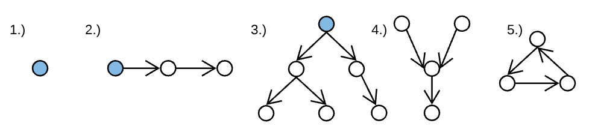
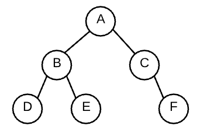

# Introduction to Trees

Trees are a common data structure upon which many other data structures are based. You can think of them as being like a singly-linked list, except that instead of each node having a single next node, it may have more than one child node.

When you finish this article, you should be able to:

- Define a tree as a data structure
- List the characteristics that differentiate a tree from non-tree graphs
- Distinguish between binary trees and other types of trees
- Code a tree using the object-oriented method

## What is a Graph?

You'll learn more about graphs in another lesson, but it's useful to talk about them when talking about trees because a tree is a type of graph! You're learning about trees first because they're simpler and easier to manipulate than some other types of graphs.

A graph is a collection of nodes and any edges between those nodes. You've likely seen depictions of graphs before, and they usually exist as circles (nodes) and arrows (edges) between those circles. Below are few examples of graphs:



Notice how the graphs above vary greatly in their structure? A graph is indeed a very broad, overarching category. Within this category, many data structures can be defined in an overlapping manner.

In the above picture, example 1 is a graph, a tree, and a linked list!

Example 2 is also a graph, a tree, and a linked list.

Example 3 is a graph and a tree, but it's not a linked list because it has nodes with more than one child node.

Example 4 is a graph, but it's not a linked list or a tree because it has a node with more than one parent.

Example 5 is a graph, but it's not a linked list or a tree because it has a cycle.

## What is a Tree?

A tree is a graph that does not contain any cycles. A cycle is defined as a path through edges that begins and ends at the same node.

The blue circles in the graphic are the root of the tree. Confusingly, this is usually shown at the top, with the branches and leaves going downward. As with the head of a linked list, the root node often is the tree. You'll often see functions that operate on a tree via the root node alone being passed in.

You've probably heard the term "root" throughout your software engineering career: root directory, root user, etc... All of these concepts branch* from the humble tree data structure!

* Pun Intended

## What is a Binary Tree?

A binary tree is a tree where nodes have at most 2 children. This means graphs 1, 2, and 3 are all Binary Trees. There exist ternary trees (at most 3 children) and n-ary trees (at most n children), but you'll likely encounter binary trees in your job hunt, so you'll focus on them in this course. Based on the definition for a binary tree, here is some food for thought:

- an empty graph of 0 nodes and 0 edges is a binary tree
- a graph of 1 node and 0 edges is a binary tree
- a linked list is a binary tree

## Representing a Binary Tree with Node Instances

A common way to represent binary trees uses some object-oriented design. A tree is a collection of nodes, so you'll implement a TreeNode class. Traditionally, the properties of left and right to reference the children of a TreeNode. That is, left and right will reference other TreeNodes:

```
class TreeNode {
  constructor(val) {
    this.val = val;
    this.left = null;
    this.right = null;
  }
}


```

Constructing a tree is a matter of creating the nodes and setting left and right however you please. For example:

```
let a = new TreeNode('a');
let b = new TreeNode('b');
let c = new TreeNode('c');
let d = new TreeNode('d');
let e = new TreeNode('e');
let f = new TreeNode('f');

a.left = b;
a.right = c;
b.left = d;
b.right = e;
c.right = f;


```

The visual representation of the tree is:



To simplify the diagrams, the arrowheads are often omitted. The one-way nature of the connection is implied by labeling the diagram a tree. Moving forward, you can expect that the top node is the root and the direction of edges points downward. In other words, node A is the root. Node A can access node B through a.left, but Node B cannot access Node A.

You now have a data structure we can use to explore Binary Tree algorithms! Creating a tree in this way may be tedious and repetitive, however it allows you to decide exactly what nodes are connected and in what direction. This is will be useful as you account for edge cases in your design.

## Basic Tree Terminology Review

- tree - graph with no cycles
- binary tree - tree where nodes have at most 2 nodes
- root - the ultimate parent, the single node of a tree that can access every other node through edges; by definition the root will not have a parent
- internal node - a node that has children
- leaf - a node that does not have any children
- path - a series of nodes that can be traveled through edges - for example A, B, E is a path through the above tree

## What you learned

In this article, you learned the definition of trees, and that they are a sub-class of graphs that follow a few special rules. The nodes are organized with one way connections from parent to child, and there are not any cycles. You also learned that a binary tree is a tree that has a maximum of two children per node. Finally, you learned that the root of the tree is often used to represent or pass the tree itself.

# Binary Tree Traversal

To perform most operations on a tree, you need to either traverse the tree and visit or evaluate every node in the tree, or you need to search the tree, which is simply a traversal that you stop when you find what you are looking for. There are many methods for searching and traversing trees, each of which has pros and cons that might make it more or less appropriate for a given task.

Because many computer science applications of trees (and interview questions!) use a binary tree, this article will focus on them.

After reading this article, you should be able to:

- List the characteristics of several common tree traversal algorithms.
- Recursively traverse or search a binary tree pre-order, in-order, and post-order
- Compare and contrast depth-first traversals and breadth-first traversals
- Code a depth-first search or traversal both recursively and iteratively
- Code a breadth-first search iteratively

## Tree terminology (review)

- Node: A tree component that contains one value and pointers to other nodes
- Edge: Another name for a pointer
- Root node: The top node in a tree
- Parent/child node: A parent node points to child nodes
- Neighbor: Either a parent or child node
- Subtree: A tree whose root is the child of another node in the tree
- Branch node: A node with at least one child node
- Leaf node: A node with no children
- Level: The number of edges between a given node and the root node
- Width: The number of nodes in a given level
- Height: The number of edges between the root node and the bottom-most node

## Searching a binary tree

```
    1
   /   \
  2     3
 / \   / \
4   5 6   7


```

Without the ordering of a BST, how would you search for values in a binary tree? Similar to searching an array or linked list, you do this by traversing the data structure, or visiting each value one-by-one, until you find the target value and return true, or reach the end and return false.

Binary trees are structurally similar to linked lists, so start with a review of a recursive linked list search. Since the next node of a linked list is also a linked list, if your current value doesn't match you can search the next node and return the result.

```
function linkedListSearch(linkedList, target) {

    // Base case: empty list
    if (linkedList.head === null) return false;

    // Check if the current node's value matches the target
    if (linkedList.head.value === target) return true;

    // If not, recursively search the rest of the list
    return linkedListSearch(linkedList.head.next, target);
}


```

Searching for the value 3 in the linked list 1 -> 2 -> 3 -> null will check the head value of 1 (does not match), then recursively search on the tail, 2 -> 3 -> null. Again, the head does not equal the target so it searches the tail, 3 -> null. Now the head value matches the target and returns true, which propogates back up the recursive call stack to return from the original function.

Trees are similar in that each child is also a tree, so if the current value doesn't match the target, you can search each child and return true if the target is in either of them. The algorithm would look like this:

1. Base case: If the tree is null, return false
2. If the current node's value equals the target, return true
3. Otherwise, search the left subtree for the target
4. If the value isn't in the left subtree, try the right subtree

```
function binaryTreeSearch(root, target) {

    // Base case: If the tree is null, return false
    if (root === null) return false;

    // If the current node's value equals the target, return true
    if (root.value === target) return true;

    // Otherwise, search the left subtree for the target
    if (binaryTreeSearch(root.left, target)) return true;

    // If the value isn't in the left subtree, try the right subtree
    return binaryTreeSearch(root.right, target);
}


```

## Traversing a binary tree

Sometimes you just want to visit each node in the tree without searching for a particular target. To do this, you traverse the tree. Consider this algorithm to sum up the values in a binary tree:

```
function binaryTreeSum(root) {

    // Check the base case
    if (root === null) return 0;

    // Recursively sum up the left and right trees
    const leftSum = binaryTreeSum(root.left);
    const rightSum = binaryTreeSum(root.right);

    // Return the value plus the left and right totals
    return root.value + leftSum + rightSum;
}


```

Trees are fantastic for recursion because of their recursively defined structure.

### Pre-order traversal

Say you want to print all the values in a binary tree. Just like an array or linked list, you could traverse the tree and print each value as you go along. That algorithm might look something like this:

1. Print the current node value
2. Recursively call the left subtree
3. Recursively call the right subtree

Given the following binary tree, what order would the nodes print?

```
    4
   /   \
  2     6
 / \   / \
1   3 5   7


```

Walking through the algorithm step-by-step, the first value printed would be the root: (4), then the left child (2) followed by the left grandchild (1). The left grandchild node will call steps 2 and 3 on its left and right children, both of which are null, so it returns. Now that the 2's left subtree has returned, it calls the function on its right subtree which prints (3) and returns. Now that 2's right subtree has completed, it returns as well. The root's left child has completed so it moves on to the right subtree which prints (6), recursively calls its left child (5) followed by the right (7). Now all trees have completed so the function is done.

The values are printed in the order, 4, 2, 1, 3, 6, 5, 7. This is known as pre-order traversal since the printing comes before the recursive calls.

### In-order traversal

The recursive calls will actually work no matter where you put the print. You could modify the function to print between the left and right recursive calls like so:

1. Recursively call the left subtree
2. Print the current node value
3. Recursively call the right subtree

This would print the values from the prior tree in the order, 1, 2, 3, 4, 5, 6, 7. This is known as in-order traversal.

You might have noticed that the binary tree in the example is a binary search tree, and that the in-order traversal does indeed print the nodes in order. Neat!

### Post-order traversal

Finally, as you might have guessed, you can print after the recursive calls too:

1. Recursively call the left subtree
2. Recursively call the right subtree
3. Print the current node value

This would print the nodes in 1, 3, 2, 5, 7, 6, 4 order for a post-order traversal.

## Depth-first search

Although pre-order, in-order and post-order traversals all print in different orders, the sequence that the nodes are visited doesn't change. Take a look at the following image with pre-order in red, in-order in green and post-order in blue.

- Pre-order: 5–2–1–0–4–3–8–6–7–9–X
- In-order: 0–1–2–3–4–5–6–7–8–9–X
- Post-order: 0–1–3–4–2–7–6–X–9–8–5

Although the nodes are printed in different order, the path each algorithm takes is the same: Starting from the root it walks down the left subtrees (pushing onto the call stack), then back up once the base case is reached (popping off the call stack), then down the right subtrees and back up again. This method of traveling as deep as possible down the tree branches until reaching a dead-end, then backtracking to the next branch is depth-first order.

A note on naming: although this is a traversal algorithm, not a search algorithm, it is often still called depth-first search. You can certainly use it to search (traverse in depth-first order until you find your target) but be careful not to mix up depth-first traversal and search in your implementations.

Pre, in and post-order traversals are all depth-first traversals specific to binary trees.

## Breadth-first traversal

While depth-first traversal will travel as deep as possible down each branch before moving to the next, breadth-first traversal will visit each node in a particular level before moving down to the next level.

```
    4
   /   \
  2     6
 / \   / \
1   3 5   7


```

Traversing this tree in breadth-first order would start from the root, 4, then move to the second level to visit 2 and 6, then finish with the third level, 1, 3, 5 and 7.

Because breadth-first traversals jump between subtrees, it cannot be implemented recursively. Instead, you can solve this using a queue.

1. Put the starting node in a queue
2. While the queue is not empty, repeat steps 3-4
3. Dequeue a node and print it
4. Put all of the node's children in the back of the queue

```
    4
   /   \
  2     6
 / \   / \
1   3 5   7


```

Starting with the root node in a queue, queue = [4], it's dequeued and printed. Then, the children are put into the queue (queue = [2, 6]) and repeated. The first node in line (2) is dequeued and printed, with its neighbors put in the back of the queue (queue = [6, 1, 3]). The next node (6) is dequeued and printed and queues its children (queue = [1, 3, 5, 7]). The remaining nodes (1, 3, 5, 7) are all dequeued and printed one-by-one. Since they have no children, the queue is emptied and the function returns.

The code looks something like this:

```
function breadthFirstTraversal(root) {

    // Put the starting node in a queue
    const queue = new Queue();
    queue.enqueue(root);

    // While the queue is not empty
    while (queue.size > 0) {

        // Dequeue a node and print it
        let node = queue.dequeue();
        console.log(node.value);

        // Put all of the node's children in the back of the queue
        queue.enqueue(node.left);
        queue.enqueue(node.right);
    }
}


```

You can also use an array to mimic a queue. The two methods used to add and remove the nodes would be shift (for dequeuing) and push (for enqueuing). The code would look as follows:

```
function breadthFirstTraversal(root) {

    // Put the starting node in a queue
    const queue = []
    queue.push(root);

    // While the queue is not empty
    while (queue.size > 0) {

        // Dequeue a node and print it
        let node = queue.shift();
        console.log(node.value);

        // Put all of the node's children in the back of the queue
        queue.push(node.left);
        queue.push(node.right);
    }
}


```

## Depth-first traversal with a stack

It turns out, you can perform a depth-first traversal with virtually the same algorithm as breadth-first by switching the queue for a stack.

1. Put the starting node on a STACK
2. While the STACK is not empty, repeat steps 3-4
3. POP a node and print it
4. Put all of the node's children on the TOP of the STACK

Try it out:

```
    4
   /   \
  2     6
 / \   / \
1   3 5   7


```

Starting with the first node, stack = [4], pop and print the first value (4), the put its children on top of the stack stack = [6, 2]. Pop and print the top node (2) and push its children to the top of the stack stack = [6, 3, 1]. Pop and print the next node (1) which has no children to push, followed by the similarly childless (3) leaving stack = [6]. This node is popped and printed (6) with the children pushed to the top stack = [7, 5]. Once these remaining childless nodes are popped and printed (5, 7), the stack is empty and the function returns.

```
function depthFirstTraversal(root) {

    // Put the starting node on a stack
    const stack = [];
    stack.push(root);

    // While the stack is not empty
    while (stack.length > 0) {

        // Pop a node and print it
        let node = stack.pop();
        console.log(node.value);

        // Put all of the node's children on the top of the stack
        stack.push(node.right);
        stack.push(node.left);
    }
}


```

Note that while the children were pushed onto the stack from right-to-left to simulate a pre-order traversal, the ordering of a depth-first traversal does not matter as long as it traverses as deep as possible before backtracking. The following are all valid depth-first traversals:

```
[4, 2, 1, 3, 6, 5, 7]
[4, 6, 7, 5, 2, 3, 1]
[4, 6, 5, 7, 2, 3, 1]
[4, 6, 7, 5, 2, 1, 3]
[4, 6, 5, 7, 2, 1, 3]
[4, 2, 3, 1, 6, 7, 5]
[4, 2, 3, 1, 6, 5, 7]
[4, 2, 1, 3, 6, 7, 5]
[4, 2, 1, 3, 6, 5, 7]


```

The same goes for breadth-first. As long as it visits all of the level 2 nodes before visiting level 3 nodes, the order of nodes within a level does not matter.

## What you learned

In this reading, you learned how to search and traverse binary trees in a variety of orders: pre-order, in-order, post-order, depth-first order and breadth-first order. You also learned to implement depth-first traversal using both recursion and a stack as well as implementing breadth-first traversal using both a Queue class and a queue as an array.

# Binary Search Trees

Binary search is a powerful and elegant algorithm that allows you to search through enormous data sets with just a handful of comparisons. This power comes at a cost though: the data must be sorted before running binary search. In an array, that data can be sorted in O(n log n) time which isn't too bad, just a tiny bit less efficient than O(n). This is an acceptable, one-time cost if the data never changes, but in most real-world circumstances, data updates constantly. Adding, removing, or changing any value in a sorted array would require an O(n) insertion or deletion to maintain that sorted order.

Binary search trees are a node-and-pointer-based data structure, similar to a doubly linked list, that allows for the same O(log n) search as a sorted array, but with O(log n) insertion and deletion as well.

After reading this article, you should be able to:

- Compare and contrast a binary tree with a binary search tree.
- Explain why it is more efficient to search a binary search tree as compared to a regular binary tree.
- Search a binary search tree in O(log n) time.

## Tree terminology review

- Node: A tree component that contains one value and pointers to other nodes
- Edge: Another name for a pointer
- Root node: The top node in a tree
- Parent/child node: A parent node points to child nodes
- Neighbor: Either a parent or child node
- Subtree: A tree whose root is the child of another node in the tree
- Branch node: A node with at least one child node
- Leaf node: A node with no children
- Level: The number of edges between a given node and the root node
- Width: The number of nodes in a given level
- Height: The number of edges between the root node and the bottom-most node

Binary search trees are a specific type of tree with binary search properties, but the same terminology applies to all trees.

## Properties of a binary search tree

As with any other binary tree, a binary search tree (BST for short) consists of nodes which each contain a value and two pointers. In a BST, those pointers are left and right and always point downward.

The key difference that makes it a binary search tree is that every node contained in the left branch of any node will be less than the value of the node itself, and every node in the right branch will be greater than the node value.

There are three possible implementations for handling values that are equal to a value in an existing node:

- Discard the duplicate, similar to a set
- Place equal values to the left
- Place equal values to the right

The last of these options appears to be the most common, but always double-check if you are working with an unfamiliar implementation!

All binary search trees are binary trees, but not all binary trees are binary search trees. The tree below is a binary tree, but NOT a binary search tree. Can you see why?

```
    1
   /   \
  2     3
 / \   / \
4   5 6   7


```

In order to be a valid binary search tree, every node in the left subtree must be less than the node's value. Since 2, 4 and 5 are greater than 1, this is not a valid binary search tree.

In this diagram, the root node has a value of 8. All nodes to the left (1, 3, 6, 4, 7) have values less than 8 while all nodes to the right (10, 14, 13) are greater. Note that each node can be considered the root of its own subtree and each follows the same rules. All nodes to the left of the 3 node (1) are less while all nodes to the right (6, 4, 7) are greater.

## Searching a binary search tree

Binary search trees can be searched by calling the following recursive function on the root node:

1. If the root node is null, return false
2. If the root node's value equals the target, return true.
3. If the target is less than the root value, recursively search the left child
4. If the target is greater than the root value, recursively search the right child

Say you are searching this BST for the value, 4. Start by calling search on the root of the tree. Since 4 is less than 8, it hits condition #3 and recursively calls the same search function on the left child: 3. 4 is greater than 3, so it recursively calls search on the right child: 6. 4 is less than 6, so call search on the left child: 4. Finally, the target value is found, and the function returns true, which propagates all the way back up the call stack to return to the original function.

```
function searchBST(root, target) {

    if (root === null) return false;

    if (target === root.value) return true;

    if (target < root.value) return searchBST(root.left, target);

    if (target > root.value) return searchBST(root.right, target);
}


```

This can be performed iteratively as well.

```
function searchBST(root, target) {

    let currentNode = root;

    while (currentNode !== null) {

        if (target === currentNode.value) return true

        else if (target < currentNode.value) currentNode = currentNode.left

        else currentNode = currentNode.right;
    }

    return false;

}


```

Both alorithms are simple, elegant and efficient!

## Time complexity of searching a binary search tree

Each comparison in a binary search tree moves down by one level, so the worst-case number of calls is equal to the height of the tree. In a perfectly balanced binary search tree, the height is equal to log n.

How can you prove/remember this? Since each node creates two children, you can think of each level as having twice the number of nodes as the level above it.

```
Level 0: 1 node
Level 1: 2 nodes
Level 2: 4 nodes
Level 3: 8 nodes
Level 4: 16 nodes
Level 5: 32 nodes
Level 6: 64 nodes
Level 7: 128 nodes
Level 8: 256 nodes


```

This should look familiar! The maximum capacity of each level is equal to 2 to the power of the level. You may also notice that each level's capacity is equal to the sum of all previous levels plus 1.

```
2 = 1 + 1
4 = 2 + 1 + 1
8 = 4 + 2 + 1 + 1
16 = 8 + 4 + 2 + 1 + 1
32 = 16 + 8 + 4 + 2 + 1 + 1
64 = 32 + 16 + 8 + 4 + 2 + 1 + 1
128 = 64 + 32 + 16 + 8 + 4 + 2 + 1 + 1
256 = 128 + 64 + 32 + 16 + 8 + 4 + 2 + 1 + 1


```

Since adding a level doubles the capacity, moving down a level reduces the number of values to search by half. Just like binary search, this divide-and-conquer approach results in a time complexity of O(log n).

## Adding and removing values in BST

Adding nodes to a BST requires searching for an empty spot to put it. Say you want to add a 3 to the following BST.

```
    4
   /   \
  2     6
 /     / \
1     5   7


```

You would start from the root, and determine that it should go to the left. Since there is already a left child, you can call insert on the left subtree with the root of 2. Since 3 is greater than 2 and there is a right branch open, you create a new node and insert the 3.

```
    4
   /   \
  2     6
 / \   / \
1   3 5   7


```

Removal is a bit trickier. There are three cases to consider. The easiest is removing a node with no children: simply delete the node. For example, to remove the 5, simply remove the 5, by setting the left property of the parent to null.

```
    4
   /   \
  2     6
 / \     \
1   3     7


```

To remove a node with one child, just replace that node with its child. So to remove the 6, replace it with the 7.

```
    4
   /   \
  2     7
 / \
1   3


```

Removing a node with two children gets tricky. Instead of removing the node itself, you must search for either the right-most node in the left branch, or the left-most node in the right branch, then delete THAT node and replace the current node with its value. So, to delete 4 from the original tree...

```
    4
   /   \
  2     6
 / \   / \
1   3 5   7


```

...you would replace the 4 with the right-most value on the left (3)...

```
    3
   /   \
  2     6
 /     / \
1     5   7


```

...or the left-most value on the right (5).

```
    5
   /   \
  2     6
 / \     \
1   3     7


```

You can find the left-most value on the right subtree by moving right once, then picking left until you reach a node with no more lefts. Removing 5 from the tree above would move the 6, which has just one child, so is replaced by the 7.

```
    6
   /   \
  2     7
 / \
1   3


```

Despite their complexity, all of these operations require one comparison per level for an optimal runtime of O(log n).

## Unbalanced binary search trees

Say you wanted to store the values, 1, 2 and 3 in a BST. You start with a root value of 1, then add 2:

```
1
 \
  2


```

Next, you add the 3. Your resulting BST would look like this:

```
1
 \
  2
   \
    3


```

Adding a 4, 5, 6 and 7 in order would give you a tree that looks like this:

```
1
 \
  2
   \
    3
     \
      4
       \
        5
         \
          6
           \
            7


```

While this is a valid BST, with each smaller value to the left and each larger value to the right, this is not ideal for search. Because the tree is completely unbalanced, it has a height equal to the number of nodes. Essentially, this binary search tree is just a linked list with a search time complexity of O(n).

It's much more efficient for the tree to have a balanced structure like this:

```
    4
   /   \
  2     6
 / \   / \
1   3 5   7


```

Balancing binary search trees is a big topic that will not be covered in this course. What you need to know is that a balanced BST, meaning a tree with height roughly equal to log n, has a search time of O(log n) but an unbalanced BST can have a worst-case search time of O(n).

If you are interested in the algorithms behind self-balancing BSTs, check out red-black trees and AVL trees. You can also take a look at B-trees, which are used to index database entries for efficient search. Notably, these algorithms maintain the insertion, deletion and modification time of O(log n) with a guaranteed search time of O(log n).

## What you learned

In this reading, you learned all about binary search trees, including tree terminology and how to search, add and remove values from a binary search tree in O(log n) time. You also learned the worst-case performance of an unbalanced tree, which results in O(n) runtimes for these same operations.
