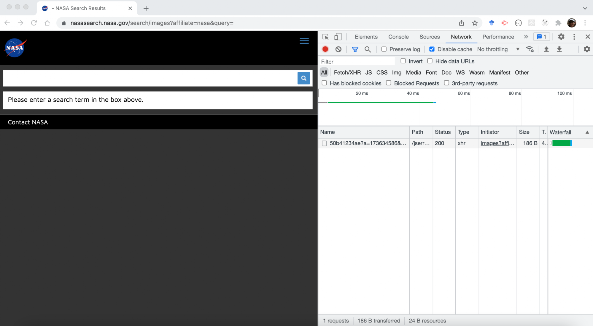
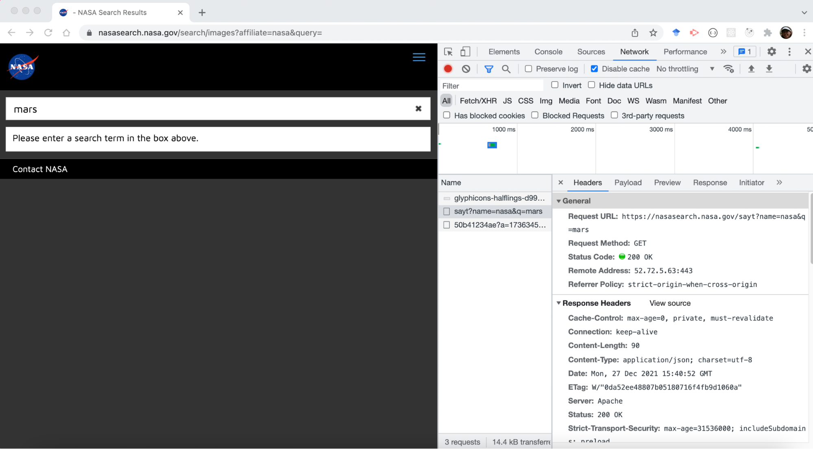
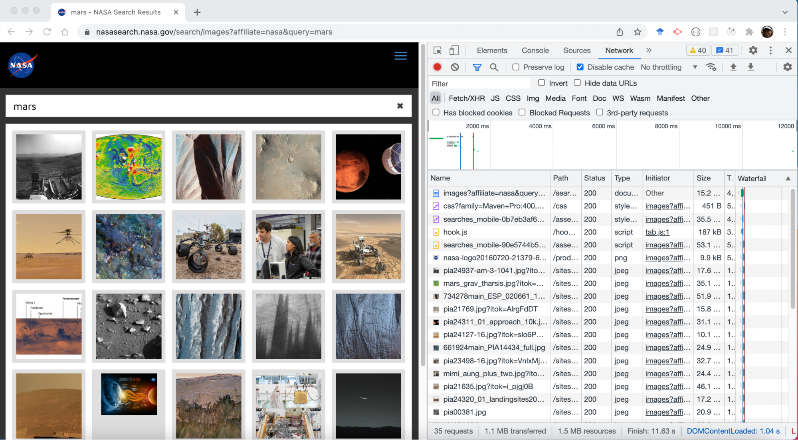
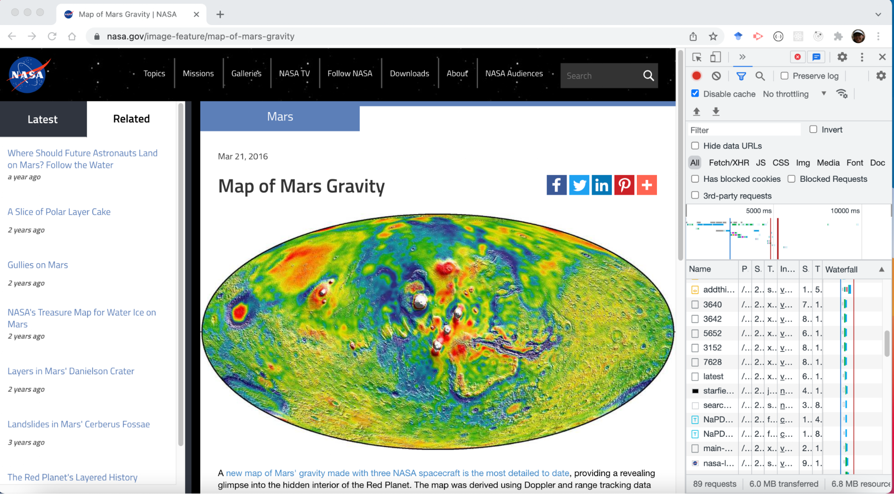

# Framing HTTP, REST, APIs, Servers, Promises - I

Imagine you are doing some research on the web. You click on hyperlinks and navigation buttons, you type information into a form and click submit. As a result, you get information back, rendered on the screen through HTML and CSS.

What exactly is happening between you clicking on something, and getting the information you're searching for? What are all of the steps in the cause-and-effect chain triggered by that mouse click?

## Explore

Let's start by exploring a site with search functionality, to preview some of the content you'll be learning throughout this section.

### Setup

1. Navigate to the NASA Image Search page.
2. Right-click on the page and open the Chrome Developer Tools by choosing "Inspect". Then click on the "Network" tab in the Dev Tools menu.
3. Click on the "Clear" icon (⦸) to clear the page. Your page should look something like this:



### Search Terms and Auto-Completion

1. Clear the network tab, and then type "mars" into the search bar on the NASA search page. Do not click submit and do not press enter.

Notice the auto-completion options that came up. Where do you think those came from?

1. In the network tab, click on the first item in the "Name" column that starts with sayt?name=nasa?q=ma.



1. You will see new tabs appear including "Headers", "Payload". "Preview", "Response", and others. Click through each of the tabs and look at the information in each.

What do you notice in the Headers? What information seems to show up in this section? What do you see in the Payload? Where did this come from? What is in the Preview and Response? How is this information rendered on the NASA page?

### Submit the Search Terms

1. Clear the network tab, and then press enter to submit your search for "mars". You should see a page of images come up for your search results.



1. Look at the url in the address bar of your browser.

How has the url changed?

1. Click on the first item in the "Name" column that starts with images?, and then poke around in the Headers, Payload, Preview, and Response.

What information do you see in each section? How does the information you are seeing in each section relate to what you see in the browser on the NASA page?

1. Click on a few more items in the "Name" column, and explore the information in the Headers, Payload, Preview, and Response sections.

What are some of the different types of data in the list under the "Name" column? What patterns do you notice as you explore different pieces of data? What questions do you have about information contained in the network tab?

### Click on a Search Result

1. Clear the network tab, and then click on any image from the search results. As you do this, watch what happens in the network tab. When the page is finished loading, you should see a page that looks similar in structure to this one:



What seems to be happening in the network tab as the page loads?

1. Continue clicking on links and exploring the network tab. Feel free to try out different searches, or explore different areas of the Chrome Developer Tools as you click around the NASA site.

## Try to Explain

From what you've explored, try your best to explain what might be happening between typing in a search term, and getting a page of images rendered on the page. Don't worry about how accurate your explanation might be at this point - just use what you noticed to take a guess at what is happening under the hood, and be ready to share what you noticed and bring questions to the discussion.

## Looking Ahead

Throughout this section, you will be learning a lot of the key elements that are happening behind the scenes between submitting that search term and getting your results. Throughout the section, try to keep coming back to the NASA website, and use what you learn each day to revise your explanation of what is happening. By the end of this section, you should be able to have a pretty detailed explanation of what's going on!

# HTTP Request Components

Without a query, there wouldn't be a need for a response! A server expects to receive requests in a specific format with specific kinds of information. The client needs to know how to make those requests to initiate an HTTP exchange with the server.

This article will cover:

- what an HTTP request looks like,
- fields that make up a request,
- and how to send a request of your own!

## Retrieving hypertext

Years ago, daily shopping looked very different. Instead of walking the aisles and picking up what they wanted, customers would approach a counter and ask a clerk to retrieve the items on their list. The clerk was responsible for knowing where those items were located and how best to get them to the customer.

While the retail industry has changed dramatically since that time, the Web follows that old tried-and-true pattern. You tell your browser which website you would like to access, and your browser hands that request off to a server that can get you what you've asked for. At the simplest level, the Web is just made up of computers asking each other for things!

Your browser's part in this transaction is called the request. Since the browser is acting on your behalf, the browser is sometimes referred to as the user-agent (you being the user). You might also hear this referred to more generically as the client in the exchange.

## Components of an HTTP request

Your browser is designed to be compliant with the HTTP specification, so it knows how to translate your instructions into a well-formatted HTTP request. An important part of the HTTP spec is that it's simple to read.

Here's what the HTTP request looks like for visiting appacademy.io:

```
POST / HTTP/1.0
Host: appacademy.io
Content-Length: 31
Content-Type: application/x-www-form-urlencoded
Host: appacademy.io
Connection: keep-alive
Upgrade-Insecure-Requests: 1
User-Agent: Mozilla/5.0 (Macintosh; Intel Mac OS X 10_14_5) AppleWebKit/537.36 (KHTML, like Gecko) Chrome/76.0.3809.132 Safari/537.36
Accept: text/html,application/xhtml+xml,application/xml;q=0.9,image/webp,image/apng,*/*;q=0.8,application/signed-exchange;v=b3
Accept-Encoding: gzip, deflate
Accept-Language: en-US,en;q=0.9

username=azure&password=hunter2


```

### Breaking down the request

Time to break down the request into its components!

#### Request-line

The first line of an HTTP request is called the request-line, and it sets the stage for everything to come. It's made up of three parts, separated by spaces:

- the method, indicated by an HTTP verb,
- the URI (Uniform Resource Indicator) that identifies what you've requested,
- and the HTTP version you expect to use (usually HTTP/1.1 or HTTP/2).

The URI identifies the requested resource. A resource can be anything from physical objects to statuses to a kind of information. Some typical resources for a web application include users, posts, and likes. A common term you will see is the root resource or the root of the application which is used when the URI of the request looks like /.

In the appacademy.io example, the version matches the most common HTTP version (1.1) and the URI is /, or the root resource of the target. That first word, POST is the HTTP verb used for this request. HTTP versions will not be covered in this article.

#### Headers

The request-line sets the table, but it's the headers that describe the menu! Headers are key/value pairs that come after the request-line. They each appear on separate lines and define metadata needed to process the request. The header key or name is case-insensitive, so Accept-Encoding, ACCEPT-ENCODING, AcCePt-EnCoDiNg, or accept-encoding are all processed the same by the server.

In the appacademy.io example, every line after the first line is a key-value pair separated by a colon. The left-side of the colon is the key or header name, and the right-side is the value of the header. These headers define how the server might process the request.

#### Body

When sending data that doesn't fit in a header and is too complex for the URI, the data can be placed in the body of our HTTP request. Examples include form data or a file. The body comes right after the headers and can be formatted a few different ways.

The most common way form data is formatted is URL encoding. This is the default for data from web forms and looks a little like this:

```
name=claire&age=29&iceCream=vanilla


```

To tell the server how to interpret your body, it's important to set the Content-Type header. The Content-Type header value for URL encoding is application/x-www-form-urlencoded. Other common Content-Type header values will be listed further down the article.

#### 5 Common HTTP Verbs

HTTP verbs are a simple way of declaring the intention of the request to the server. They're just like English verbs used when asking for help: "Can you get me that?", "Should I remove this?", etc. The HTTP verbs determine the CRUD operation of the request. CRUD stands for Create, Read, Update and Delete.

HTTP has five commonly used verbs: GET, POST, PUT, PATCH, and DELETE.

- GET is used for retrieving resources from the server. A GET request is generally how websites are retrieved, and they only require that the server return a resource.

- When you go to a link in the browser, the browser makes a GET request to the server.
- These types of requests will never have a body. Any data you need to send in a GET request must be shared via the URI.

- POST is typically used for creating new resources on the server.

- Most of the time, when you submit a form a POST request is generated.
- These types of requests can have a body containing any data the server might need to complete your request, like your username & password or the contents of your shopping cart.

- PUT requests are used to update a resource on the server. These will contain the whole resource you'd like to update.

- They can have a body containing the data needed to update the resource.
- For example: when updating your name on a website, a PUT request will be generated containing not just your new name but also your user ID, email, etc.

- PATCH requests are also used to update a resource on the server. They are very similar to PUT requests, but do not require the whole resource to perform the update.

- They can have a body containing the data needed to update the resource.
- Keeping with our example of updating your name: a PATCH request would only require your new name, not the rest of your account details, to succeed.

- DELETE requests destroy resources on the server.

- These requests can have a body, BUT it's traditionally not recommended to include one.
- These might be saved database records, like removing a product that's sold out, or more ephemeral resources, like logging a user out of their current session.

Ultimately, how these verbs get acted upon is up to the server. You could create a server that totally ignores these rules and uses a DELETE request to create a resource, but that's only going to confuse your teammates and frustrate you in the future! It's best to use them as the spec intends.

#### Content-Type Header

Any header beginning with Content- are headers that define details about the body of the request. Content headers will only show up on requests that support content in the body, so GET requests should never have any content headers!

The most important header that you will learn today is Content-Type which lets the server know the format of the request body data and how to process it.

The values for the Content-Type header follow a standard and are called MIME types or media types. They define how the receiver of the data should format and process the data.

Here are some common MIME types for the Content-Type header of a request:


meaning

application/x-www-form-urlencoded

info submitted directly from an HTML web form

application/json

JSON - data format similar to JavaScript objects

multipart/form-data

info submitted from an HTML web form with multiple media types

See here for MDN docs on MIME types.

#### Other Common Headers

The following headers are other common headers that you will see but usually don't need to define yourself because they are set by the browser. You do need to know what the Content-Type header does and what its value means, but you do not need to readily know these following headers:

- Host: The root path for the URI. This is typically the domain we'd like to request our resource from. As you can see above, the Host header for appacademy.io is, appropriately, appacademy.io!
- User-Agent: This header displays information about which browser the request originated from. It's generally formatted as name/version. You can see in the User-Agent header in the example above is using Chrome/76.0The User-Agent has much more content, including references to Mozilla, makers of the popular Firefox browser, and Safari, Apple's default browser of choice. What gives?There is some user-agent history behind those additional references, and you can use www.useragentstring.com for additional details about your current browser's user-agent.
- Referer: This defines the URL you're coming from. There's none in our example since the example navigated directly to the App Academy website, but if you click any link on the page, the resulting HTTP request will have Referer: https://appacademy.io/ in its headers. Also, you're not reading it wrong - this header is misspelled! It should be "referrer", but it was written incorrectly in the original specification and the typo stuck. Let this be a lesson: your poorly-written code might still be around in 20 years, too!
- Accept: "Accept-" headers indicate what the client can receive. When we go to most websites, our Accept header will be long to ensure we get all the various types of content that site might include. However, we can modify this header in our requests to only get back certain types of data. One common use is setting Accept: application/json to get a response in JSON format instead of HTML. You may see variations of this header like Accept-Language for internationalized websites or Accept-Encoding for sites that support alternative compression formats.

There are LOTS of other header keys! MDN docs on headers has an exhaustive reference list with examples.

## What you've learned

HTTP requests are the first step to getting what you want on the web. Having completed this lesson, you should be able to recount what an HTTP request is and a rough outline of the HTTP request format. You also learned what a URI and resources are. You learned what the common HTTP verbs and what they indicate about the request. And finally, you learned what headers are, particularly the Content-Type header and its MIME type values, and some other common headers.

# HTTP Response Components

A web server delivers content via responses, the second part of the HTTP's request/response cycle. This article will dive into how a response is structured and what your client can expect from the server.

This article will cover:

- HTTP response structure and its components
- Differentiating errors & successful transfers

## Hypertext delivered

An HTTP response contains either the content requested or an explanation of why that content couldn't be delivered. It's just like ordering at a restaurant: you place your order and receive either a plate of delicious food or an apology from the chef. In a good restaurant, the apology will include some extra help: "I'm sorry, we're out of broccoli. Can we get you something else? How can we make this right?".

When designing your own server, remember that restaurant example. It's important to note to the client that there's a problem with their request, but it's equally important to provide reliable, helpful details in the response.

## Components of an HTTP Response

Responses are formatted similarly to requests: there's a status-line (instead of a request-line), headers that provide helpful metadata about the response, and the response body: a representation of the requested resource.

Here's what the HTTP response looks like when visiting appacademy.io:

```
HTTP/1.1 200 OK
Content-Type: text/html; charset=utf-8
Transfer-Encoding: chunked
Connection: close
X-Frame-Options: SAMEORIGIN
X-Xss-Protection: 1; mode=block
X-Content-Type-Options: nosniff
Cache-Control: max-age=0, private, must-revalidate
Set-Cookie: _rails-class-site_session=BAh7CEkiD3Nlc3Npb25faWQGOgZFVEkiJTM5NWM5YTVlNTEyZDFmNTNlN; path=/; secure; HttpOnly
X-Request-Id: cf5f30dd-99d0-46d7-86d7-6fe57753b20d
X-Runtime: 0.006894
Strict-Transport-Security: max-age=31536000
Vary: Origin
Via: 1.1 vegur
Expect-CT: max-age=604800, report-uri="https://report-uri.cloudflare.com/cdn-cgi/beacon/expect-ct"
Server: cloudflare
CF-RAY: 51d641d1ca7d2d45-TXL

<!DOCTYPE html>
<html>
...
...
</html>


```

Oof! That's a lot of unfamiliar stuff. But the rest of this article will walk you through how to identify and understand the important bits.

### Status

Like the request, an HTTP response's first line gives you a high-level overview of the server's intention. The first line is referred to as the status-line.

Here's the status line from the appacademy.io example response:

```
HTTP/1.1 200 OK


```

The HTTP version the server is responding with is specified, then it's followed with a Status-Code and Reason-Phrase. These give a quick way of understanding if the request was successful or not.

HTTP status codes are a numeric way of representing a server's response. Each code is a three-digit number accompanied by a short description. They're grouped by the first digit (so, for example, all "Informational" codes begin with a 1: 100 - 199).

Let's take a look at the most common codes in each group.

#### Status codes 100 - 199: Informational

Informational codes let the client know that a request was received, and provide extra info from the server. There are very few informational codes defined by the HTTP specification and you're unlikely to see them, but it's good to know that they exist!

#### Status codes 200 - 299: Successful

Successful response codes indicate that the request has succeeded and the server is handling it. Here are a couple common examples you will use frequently:

- 200 OK: Request received and fulfilled. These usually come with a body that contains the resource you requested.
- 201 Created: Your request was received and a new record was created as a result. You'll often see this response to POST requests.

#### Status codes 300 - 399: Redirection

These responses let the client know that there has been a change in the URL path and should redirect the user there. There are a few different ways for a server to note a redirect, but the two most common are also the most important:

- 301 Moved Permanently: The resource you requested is in a totally new location. This might be used if a webpage has changed domains, or if resources were reorganized on the server. Most clients will automatically process this redirect and send you to the new location, so you may not notice this response at all.
- 302 Found: Similarly, to 301 Moved Permanently, this indicates that a resource has moved. However, this code is used to indicate a temporary move. It's not often that you see temporary moves online, but this code may be used to indicate a permanent move where the old domain should still be valid too. Clients will usually follow this redirect automatically as well, but you shouldn't necessarily update your links until the server returns a 301.

301 Moved Permanently and 302 Found often get confused. When should you use a 302 Found? The most common use case today is for the transition from HTTP to HTTPS. HTTPS is secure HTTP messaging, where requests & responses are encrypted so they can't be read by prying eyes while en route to their destinations.

This is a much safer way of communicating online, so most websites require access via https:// before the domain. However, you don't want to ignore folks still trying to access our content from the older http:// approach!

In this case, you'll return a 302 Found response to the client, letting them know that it's okay to keep navigating to http://our-website.com, but you're going to redirect them to https://our-website.com for their protection.

These status codes are paired with a Location header that specifies the URL path that the client should redirect to.

#### Status codes 400 - 499: Client Error

The status codes from 400 to 499, inclusive, indicate that there is a problem with the client's request. Maybe there was a typo, or maybe the resource requested is no longer available. You'll see lots of these as you're learning to format HTTP requests. Here are the most common ones:

- 400 Bad Request: Whoops! The server received your request, but couldn't understand it. You might see a 400 Bad Request in response to a typo or accidentally truncated request. This is often referred to as malformed requests.
- 401 Unauthorized: The resource you requested may exist, but you're not allowed to see it without authentication. These types of responses might mean one of two things: either you didn't log in yet, or you tried to log in but your credentials aren't being accepted.
- 403 Forbidden: The resource you requested may exist, but you're not allowed to see it at all. This response code means this resource isn't accessible to you, even if you're logged in. You just don't have the correct permission to see it.
- 404 Not Found: The resource you requested doesn't exist. You may see this response if you have a typo in your request (for example: going to appaccccademy.io), or if you're looking for something that has been removed.

403 Forbidden requests let the client know that a valid resource was requested. This can be a security risk! For example: if I guess that you have passwords.html on your website because you just want to be hacked, a 403 Forbidden response tells me I'm correct. For this reason, some sites will return a 404 Not Found for resources that exist but aren't accessible.

A well-known example is GitHub. If you try to open a repository you don't have permission to access, GitHub will return a 404 Not Found even if your URL is correct! This protects you from random users guessing the names of your projects.

#### Status codes 500 - 599: Server Error

This range of response codes are the Web's way of saying "It's not you, it's me." These indicate that your request was formatted correctly, but that the server couldn't do what you asked due to an internal problem.

There are two common codes in this range you'll see while getting started:

- 500 Internal Server Error: Your request was received, and the server tried to process it, but something went awry! As you're learning to write your own servers, you'll often see a 500 Internal Server Error as your code fails unexpectedly.
- 504 Gateway Timeout: Your request was received but the server didn't respond in a reasonable amount of time. Timeout errors can be tricky: your first instinct may be that your own connection is bad, but this code means the problem is likely on the server's side. You'll often see these when a server is no longer reachable (maybe due to an unexpected outage or power failure).

#### Research task

On your own, research to learn what 500 status code you should return if your API is temporarily down for maintenance.

### Headers

Headers on HTTP responses work identically to those on requests. They establish metadata that the receiving client might need to process the response.

#### Content-Type

Just like the Content-Type header of a request, the Content-Type header of a response lets the client know the format of the response body data and how to process it..

This header can be present on responses and requests. It's a generic header for any HTTP interaction involving content.

The values for the response Content-Type header follow the same standard as those on a request.

Here are some common MIME types for the Content-Type header of a response:


meaning

text/html

HTML document

text/css

CSS styles document

text/javascript

JavaScript script

text/plain

plain text

image/png

PNG Image

application/json

JSON - data format similar to JavaScript object

See here for MDN docs on MIME types.

#### Other Common Headers

You do need to know what the Content-Type header does and what its value means, but you do not need to readily know these following headers.

Here are a few common response headers you'll see:

- Location: Used by the client for redirection responses. This contains the URL the client should redirect to.
- Expires: When the response should be considered stale, or no longer valid. The Expires header lets your client cache responses (that is: save them locally to prevent having to repeatedly re-download them). The client may ignore requests to that same resource until after the date set in the Expires header.
- Content-Disposition: This header lets the client know how to display the response, and is specifically devoted to whether the response should be visible to the client or delivered as a download. Think about your own experience online: sometimes you click a button and get an immediate download, while in other cases you click a button and get to "preview" the content before you download it. This is controlled by the Content-Disposition header.
- Set-Cookie: This header sends data back to the client to set on the cookie, a set of key/value pairs associated with the server's domain. Remember how HTTP is stateless? Cookies are one way to get around that! Set-Cookie may send back information like a unique ID for the user you've logged in as or details about other resources you've requested on this domain.

Remember - this isn't an exhaustive list of headers! Sites and intermediate gateways/proxies can define their own custom headers, so you'll see many more than these. If you're unsure what a header does, the MDN HTTP Header documentation is a great place to start searching.

### Body

Assuming a successful request, the body of the response contains the resource you've requested. For a website, this means the HTML of the page you're accessing.

The format of the body is dictated by the Content-Type header. This is an important detail! If you accidentally configure your server to send Content-Type: text/plain along with a body containing HTML, your HTML won't be rendered properly and your users will see plain text instead of beautifully-rendered elements. Documentation about your server routes should be clearly marked so that other applications know how to manage them.

In the appacademy.io example response above, the body begins with <!DOCTYPE html> and ends with </html>. If you inspect the source of the page in your browser, you'll see that this is exactly what's being rendered. Headers may change how the browser handles the body, but they won't modify the body's content.

## What you've learned

Like HTTP requests, HTTP responses involve lots of new lingo and details. Hang in there - we'll start doing practical work with this new vocabulary in the practices & projects coming up.

After this reading, you should understand the components of an HTTP response. This means you should be able to identify common status codes & their meanings, recognize common response headers, and understand how the body is processed.

At its most basic, a web server is just a tool to generate HTTP responses. Therefore, the best way to practice is to build your own web server, so be prepared to create your own in the next coming days!

# Request and Response

What is the request object? What is the response object? Before diving into these parts individually we must first understand their roles.

```
    _______               ________
    |       |  ===1===>   |        |
    |request|             |response|    1 request = 1 response
    |_______|  <==1===    |________|


```

The request and response cycle is like a ping pong match between client and server. The client side (request object) makes the request by asking the server (response object) for a response. What is this request you ask? Anything! This can be something like "Hey google.com, I request cat information by entering cat in your search input" and google.com says "Sure thing! I know when someone enters anything in that search field I am to look at my servers for information matching said request".

It has to be more complicated than that. Well it is. The good thing is we don't need to know every little detail about how it works. Right now our focus is on understanding the behavior of this request - response dance. A good practice to see this in action utilizing our network tab is by reviewing Monday's Week 8 Framing - I practice. Play around in the dev tools and see how many requests are made from just 1 search query on NASA's website.

## Request Object

The request object stores information about what we need when making particular requests to a server. This is because a server is going to look for those things in order to fulfil the request.

Monday's HTTP Request Components (Reference) reading covers some of the more common properties found in the request object. The URL, Method, Headers, and Body will be the properties you will interact with the most. You may also reference MDN for information covering these properties.

## Response Object

The response object, similar to the request object, contains information about the response we expect to get when making a request.

Monday's HTTP Response Components (Reference) reading covers the properties you will interact with the most. Status, Headers, and Body are the properties we will be looking for when a response has been provided for the server. This helps us display any information needed to the user for them to proceed with their browsing. We can also get information about whether the request was a successful one or not and wether an error occurred from the user or server. The server's role is really to provide back some information.

## RESTful

The first thing to review is the difference between a route and an endpoint. Fortunate for us, there is not much to remember. We can think of a route as a path to a resource. How would we get to your desktop directory from the route directory? cd /Users//home/desktop (something like that). So if we wanted to get a user's comments we would define a path like /users/1/comments. Now, what if we wanted to create a comment vs get all comments? We would need a verb (method) to tell our server what to do once someone makes a request to that route. So when we combine a route and a verb GET /users/1/comments or POST /users/1/comments we have defined an endpoint. An endpoint without the verb is just a route.

Review RESTful Routes Conventions for a more in-depth explanation. This will cover how we take this concept of routes and endpoints, and organize it in a way developers can read and understand. You will find it's best to follow these conventions. It's okay for you to put your desktop in your root directory and all someone would say is "that's unconventional".

# Servers

This section covers lots of material. What's great is that the concepts from today build upon each other so you get to see the same code transform little by little throughout the topics. Most of the concepts today are understood best almost strictly through coding. The more you code this out and work on understanding data flow the better you become at writing server code.

## Creating A Server

Before handling a series of endpoints we must first understand how to create a server. We use Node's built in HTTP package in order to do so. The Formulate a Response in HTTP is a great practice for this. It's also a great place to start noticing what must be done before sending a response. You will find that even though our code may get slightly complicated, the dataflow will be consistent.

## Creating Route Handlers

Once we understand how to formulate a response in HTTP we can then learn how to create route handlers. Route handlers are simply if statements that have been defined to match a particular endpoint.

```
if (req.method === "GET" && req.url === "/comments") {
  // get comments
}

if (req.method === "POST" && req.url === "/comments") {
  // create a comment
}


```

Rather than have our server respond to any request, we create these endpoints to match specific requests and if none of them match we typically return a 404 status code.

## Parsing the Request Body

Parsing data from the request body must be done whenever we expect some information to have been sent from the client to the server. If there is no data being sent over, then there is no need to parse the request body. Parsing the request body is a good practice on how we break down our incoming request data and "clean up" the query string. Special characters ie: (!, ?, " ", etc) are replaced with encoded values that must be decoded. Reference Parse the Request Body short practice for a step by step guide on how to do so.

## Serving Static Assets

Part of sending a response body is being able to read and serve a static asset. These may be html, css, or even image files. When code is designed this way it may also be referred to as server side rendering. Until now we have considered the response body to be some form of text but by utilizing the readFile library we can read files local to our server code and serve them when requested. Reference the Serve Static Assets in http short practice and homework reading.

## Templating

Templating takes serving static assets and adds one more layer of complexity to it. Fortunately as we go through these practices we notice the layers are only a few lines of code. We can also do a quick dataflow check to confirm that regardless of how complex our applications have become, we are still maintaining the initial dataflow mentioned above. Once a user interacts with our page we may want to render the same page once more but replace some place holder, which #{looksLikeThis}, in our html. The replace method is the hero in this section and the best materials to reference to practice this concept are What is HTML Templating and Basic HTML Templating in http.

# Asynchronicity

## Promises

Promises are everywhere in web development. Anytime you are making a request to a server it responds with a promise in the form of a response object. Our main goal with promises is to be able to handle them appropriately by understanding the different states a promise can be in.

The Promises homework reading does a great job going over what the promise object is and what it means to have a promise that is fulfilled, rejected, or pending.

A good follow up practice would be Create and Handle Promises found in the Guided Practice section.

## Async Await

After working through Create and Handle Promises you may notice using .then() chaining helps us handle promises...but there must be a cleaner, more recognizable way of handling promises. async await is not a replacement to .then(), but an alternative. The async await short practice in the guided practice section is perfect for learning how to convert .then() to using async/await.

## Fetch

Fetch is going with you for the rest of your App Academy career and most likely after. It is a function that allows us to communicate to a server from the client through requests. It is important to know how to make GET, POST, PUT/PATCH and DELETE requests to a server using the fetch function.

This is the first time we are sending over a request body through a function and not a form or postman. We are introduced to URLSearchParams and MDN gives us lots of examples on how we can formulate a response body using this class.

Work out the last two fetch practices as they both incorporate fetch fundamentals that will be useful throughout the rest of the course.

# Web API

## JSON

The entire week we were working with traditional servers only capable of handling two methods, GET and POST. We are finally introducing the remaining methods, PUT/PATCH and DELETE as they are useful when working with JSON objects. The great thing about this content is that we are almost revisiting the first day's content content. This is our introduction to Web APIs.

## Testing API Endpoints

The Create API Endpoint documentation short practice is perfect in helping us understand the difference between a Traditional Server and a Web API server. The best way to work out this practice is to pull up Monday's HTML Server RESTful Endpoints short practice while working through Thursday's API documentation. Notice the changes between the two ways of documenting endpoints. This will allow us to practice testing these endpoints through Postman and get closer to mastering data flow. Work through the Test API Endpoints short practice and document what you notice about each request and response. When do we get a 302? What status code do we use when making a POST request?

# TCP/IP and Networking

The absolute best thing to do for this days material is reviewing Caleb Bratten's lecture on networking. He uses drawings and diagrams that simplify a complex concept into a light and fun lecture! You can view the video in the next lesson.

# HTML Form Submission Requests

When you submit a form on the browser, the browser makes a request to the server with the contents of the HTML form inside of the request body.

In this article you will learn about what the request of an HTML form submission by the browser looks like and how the server should respond to the submission request.

## HTML Form Review

When you create a form in HTML, you can specify two HTML attributes that influence the components of the request made when the form is submitted.

- method - method of the request, can only be set to "POST"
- action - URL path of the request

For example, the HTML form to submit a POST /dog request would look like:

```
<form method="post" action="/dog">
  <input type="text" name="name" />
  <select name="color">
    <option value="black">Black</option>
    <option value="brown">Brown</option>
    <option value="yellow">Yellow</option>
    <option value="white">White</option>
  </select>
  <input type="number" name="age" />
  <textarea name="description"></textarea>
  <button type="submit">Create Dog</button>
</form>


```

In this example, when the form is submitted the request body will contain key-value pairs for the form inputs, name, color, age, and description.

The browser will make the request to the server once the user presses the submit button.

The components of the request will be:

- method - defined by the method HTML form attribute
- URL path - defined by the action HTML form attribute
- Content-Type header - application/x-www-form-urlencoded
- body - form input names and values

## Server Response

When a form submission request is made to a server. The server should parse the body of the request, do some CRUD action with the data, then redirect the user to another page.

Recall: a redirection response has a status code of 302 and a Location header with a value as the path to redirect the user to.

The components of the response typically looks like:

- status code - 302
- Location header - path to redirect the user to
- body - none

Here's the flow of how a typical form submission goes:

1. Form is submitted
2. Browser makes request to the server
3. Server parses the request body and does some CRUD action with the data
4. Server sends a redirection response
5. Browser receives response
6. Browser redirects user to the path specified in the Location header of the response

## What you've learned

You learned a typical browser request on an HTML form submission looks like. You also learned how the server typically responds to a form submission. Finally, you learned the steps of the typical form submission flow.

# RESTful Routes

ReST stands for REpresentational State Transfer. The acronym doesn't fit perfectly, but developers can come up with whatever cool acronyms work for us! This may sound like a complex concept, but don't let it scare you too much.

In this reading, you will learn:

- Compare and contrast a route and an endpoint
- The definition of ReST
- To distinguish between a collection of resources vs. a single resource
- How to apply ReST design principles to a web application

## Routes vs. Endpoints

First, what is a route? A route is the URL path for a request. An endpoint is a pattern for a request that has a specific route and HTTP verb combination to define how the server should process the request and what the response is expected to look like. Endpoints are used to distinguish different types of requests from each other. The HTTP verb or method and URL path of a request are both used to identify the endpoint of a request.

Here are some examples of endpoints vs. routes:

- Endpoint: GET /users, Route: /users
- Endpoint: POST /users, Route: /users
- Endpoint: POST /session, Route: /session

REST is a convention for defining endpoints that other developers can easily understand how the server may process requests with those endpoints and what they should expect from their responses.

### Route Parameters

A route parameter is a named segment of the URL path that acts as a placeholder for a changeable part of the path. Route parameters are used to generalize routes to a certain pattern.

Route parameters are indicated in the URL path by a colon, :, followed by the name of the variable part of the path.

For example, a generic URL path for the route /tweets/17 could look like /tweets/:tweetId. The route parameter in this path is :tweetId that acts as a placeholder for the tweet id of 17. The generic URL path of /tweets/:tweetId represents routes starting with /tweets/ and ending in an id (e.g. /tweets/aefe116d-352b-41c2-a5bb-fc74365f2697).

Route parameters are often used in documentation to group and generalize route paths with a variable segment.

## Rules of ReST

ReST (Representational State Transfer) is an architecture style for designing networked applications. To be clear, ReST is not an official standard. Instead, it's a set of rules/constraints.

ReST defines six architectural constraints, and in this reading will focus on three of them:

1. Decoupled client-server: The client and the server should be decoupled so that they can evolve separately without any dependence on one another.
2. Stateless: This means that there is no necessary session between the client and the server. Data received from the server can be used by the client independently. This allows you to have short discrete operations. Luckily, this is a natural fit for HTTP operations in which requests are intended to be independent and short-lived.
3. Uniform interface: RESTful endpoints are meant to be self-describing and uniform in their definition. Each operation is intended to be separated by a separate endpoint or URL. In practical real world terms, most RESTful endpoints implement the classic CRUD (Create, Read, Update, Delete) operations against a resource that could just happen to be in your data model. This uniformity allows developers to easily learn the usage pattern of each endpoint.

## What does a RESTful route look like?

Because RESTful routes are meant to be representational, you can start with the data model that the endpoint is meant to represent. For example, if you're building a Twitter clone application, you will most likely want to define endpoints that manage the operations of your users tweets resource, such as "create a tweet" and "like a tweet."

### Two kinds of URLs: Collection vs. Singular

In RESTful APIs, you generally have two kinds of URLs, ones that point at collections of resources and ones that point at single resources.

The resource in the URL is the data entity or group of data in the server that you want to perform a CRUD action on (read or manipulate the data).

A path that ends in a plural noun represents a collection of resources that your server provides for developers to interact with.

The following examples are just naming schemes that you would decide as the person creating the paths that your server will handle.

- /invoices would represent a collection of invoices that you're allowed to see
- /people would represent the people in the application that you're allowed to see
- /houses would represent a collection of houses

A path that combines a plural noun (the resource name) and a record identifier represents a single resource in your application.

A record is a single set of data under a resource. A record id is the specific identifier for a record in a resource. Often, the identifier is a unique identifier for the record.

- /invoices/PK-200201 would represent the single invoice that has the the invoice number PK-200201 (record id)
- /people/10103 would represent the single person with id 10103 (record id)
- /houses/bdfa5ef9-0c86-4810-bc13-10415250af09 would represent the house with the specific globally unique record identifier bdfa5ef9-0c86-4810-bc13-10415250af09

Using a Twitter application as an example, a path like /my/tweets would point to a collection of tweets made by you. A path like /my/tweets/17 would point to a tweet made by you with the id of 17.

An id is a unique identifier for a specific resource. In this example, the id of 17 is used to uniquely distinguish this specific tweet over all the other tweets.

In another example, consider the path that reads /weather/current. That doesn't point to any static single record in the weather resource. Instead, it would return the most recent record of weather. The id of current would be treated special and initiate a lookup of the most recent record rather than a specific record like /weather/10392.

## How to create RESTful Endpoints

The endpoints that return HTML can follow a RESTful concept. However, you are limited to just using the verbs GET and POST. Hyperlinks, or just links, and URL path changes on the browser perform GET requests.

Submission of an HTML form can perform both GET and POST requests. A GET request can contain form information in the URL and should only be used when the form has no side-effects, meaning the form action does not manipulate anything. A POST request will contain form information in the request body and should be used when manipulations ARE done, namely to the server or the database it's connected to.

Note that HTML-based views can only generate GET and POST requests.

The following tables show the paths and HTTP verbs used to interact with HTML-based versions of a RESTful application:


HTTP Verb

Meaning

/resource-name

GET

Index page: Get an HTML-based list of the resource

/resource-name/new

GET

Create form page: Show a form to create a new record for the resource

/resource-name

POST

Submit create form: Create a new record for the resource

/resource-name/:record-id

GET

Detail page: See the details of the specified record

/resource-name/:record-id/edit

GET

Edit form page: Show the edit form for the specified record

/resource-name/:record-id

POST

Submit edit form: Update the specified record

/resource-name/:record-id/delete

POST

Submit delete form: Delete the specified record

Using a Twitter application as an example, here's how the endpoints would look like for the Twitter app.


HTTP Verb

Meaning

/my/tweets

GET

Index page: Get an HTML-based list of your tweets

/my/tweets/new

GET

Create form page: Show a form to create a new tweet

/my/tweets

POST

Submit create form: Create a new tweet

/my/tweets/17

GET

Detail page: See the details of your tweet with the id of 17

/my/tweets/17/edit

GET

Edit form page: Show the edit form for your tweet with the id of 17

/my/tweets/17

POST

Submit edit form: Update the tweet with the submitted details

/my/tweets/17/delete

POST

Submit delete form: Delete your tweet with the id of 17

All of the GET requests get HTML view pages as responses for the browser to render. All of the POST requests usually end in a redirect to another HTML view page that makes sense.

For example:

- After creating a resource, redirect to its detail page
- After editing a resource, redirect to its detail page
- After deleting a resource, redirect to the list page

Sometimes, different HTML views are combined. For example, instead of the create form page as a separate page from the index page, the index page can include a list of resources AND a create form. In that case, you would have no need for a create form page.

### Nesting Resources

Sometimes a resource is dependent on another resource or requires the information of another resource to perform the request. The route path should include the information about the desired resource and the required resource.

You can add resources to routes to create nested resources. The URL path can consist of multiple collections and singular resources. The desired resource or the resource that you are trying to perform the CRUD operation on should be the last resource in the URL path. Information about the other required resource(s) should be before the desired resource in the URL path.

The following tables show the paths and HTTP verbs used to interact with nested resources for HTML-based versions of a RESTful application:


HTTP Verb

Meaning

/resource-name/:record-id/nested-resource

GET

Index page: Get an HTML-based list of the nested resource related to the specified record

/resource-name/:record-id/nested-resource/new

GET

Create form page: Show a form to create a new record for the nested resource related to the specified record

/resource-name/:record-id/nested-resource

POST

Submit create form: Create a new record for the nested resource related to the specified record

/nested-resource/:nested-record-id

GET

Detail page: See the details of the specified nested resource's record

/nested-resource/:nested-record-id/edit

GET

Edit form page: Show the edit form for the specified nested resource's record

/nested-resource/:nested-record-id

POST

Submit edit form: Update the specified nested resource's record

/nested-resource/:nested-record-id/delete

POST

Submit delete form: Delete the specified nested resource's record

Using a Twitter application as an example, to create a comment resource for a specific tweet resource, the route should have the information about the specific tweet resource and that a comment should be created for it. The endpoint can look like POST /tweets/:tweetId/comments. The endpoint for seeing all the comments for a tweet can look like GET /tweets/:tweetId/comments.

## RESTful vs other conventions

In programming, there is usually more than one valid approach, and making HTTP endpoints is no exception. And while RESTful routes are certainly one of the most popular styles for designing a web application, it is not the only way. As you browse other websites, you may see variations of RESTful routes or endpoints that look nothing like REST.

## What you've learned

In this article, you covered quite a bit. You learned about the difference between routes and endpoints. You also learned that REST is a convention for routes and is not an official standard. You also learned about the different types of resources from a URL path. You learned that endpoints which return HTML can follow RESTful conventions and what the different path and method combinations for an endpoint mean. Finally, you learned about what a nested resource is and how to nest resources in a route.
